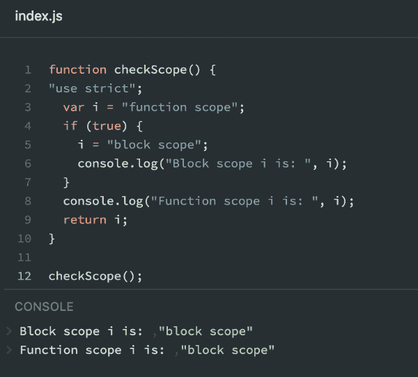
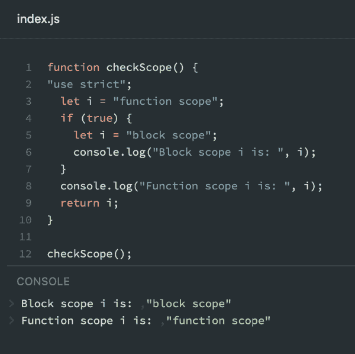

# 学习 ES6 在这个自由的 28 部分 Scrimba 课程

> 原文：<https://www.freecodecamp.org/news/learn-modern-javascript-in-this-free-28-part-course-7ec8d353eb/>


[Click here to get to the course.](https://scrimba.com/g/ges6?utm_source=freecodecamp.org&utm_medium=referral&utm_campaign=ges6_launch_article)

作为我们与 freeCodeCamp 合作的一部分，他们的杰出导师 Beau Carnes 已经将他们的整个 ES6 课程变成了一个互动的 Scrimba 课程[，你今天就可以看到。](https://scrimba.com/g/ges6?utm_source=freecodecamp.org&utm_medium=referral&utm_campaign=ges6_launch_article)

你可能知道，ES6 只是一种描述更新的 JavaScript 功能的方式，这些功能直到 2017 年才被完全和广泛接受。现在，几乎所有的 JavaScript 都是使用 ES6 特性编写的，因此本课程将帮助您成为一名现代 JavaScript 开发人员。

在这篇文章中，我将列出章节，并给你一两句话。这样你应该能很快判断出这门课你看起来是否感兴趣。

如果是这样，一定要去斯克林巴观看！

### 1.介绍

在第一个截屏中，Beau 向您快速介绍了课程和他自己，并简单介绍了 ES6。他还向你展示了如果你想在免费代码营网站上浏览该课程，你可以如何找到它。

### 2.探索 var 和 let 关键字之间的差异

第一个主题是变量。在 ES5 中，我们只能用`var`声明变量，但是从 ES6 开始，我们现在可以使用`let`和`const`。

`let`和`var`有什么不同？`let`不允许你声明一个变量两次。

```
var catName = "Quincy";  
var catName = "Beau";  
// Works fine!

let dogName = "Quincy";  
let dogName = "Beau";  
// Error: TypeError: unknown: Duplicate declaration "dogName" 
```

### 3.比较 var 和 let 关键字的范围

`var`和`let`的另一个主要区别是它们的作用域不同( [freeCodeCamp 关于作用域的指南](https://guide.freecodecamp.org/javascript/scopes/))。

当你用`var`声明一个变量时，如果在一个函数中，它是全局声明还是局部声明。

当用`let`声明时，它将被限制在块语句或表达式范围内。

博给你看了两个例子。



*[*Click* here *to go to the Scrimba cast*](https://scrimba.com/p/p7v3gCd/cLez8TE?utm_source=freecodecamp.org&utm_medium=referral&utm_campaign=ges6_launch_article)*

### 4.用 const 关键字声明一个只读变量

`const`是一种分配不能被重新分配的只读变量的方法。

```
const fcc = "freeCodeCamp";  
const sentence = fcc + " is cool!";  
sentence = fcc + " is amazing!";  
// Error: SyntaxError: unknown: "sentence" is read-only 
```

### 5.对用 const 声明的数组进行变异

您应该小心使用`const`，尽管仍然有可能改变分配给它的数组。

```
const myArray = [5, 7, 2];

myArray[0] = 2;  
myArray[1] = 7;  
myArray[2] = 5;

console.log(myArray);   
// [2, 7, 5] 
```

这同样适用于对象。

### 6.防止对象突变

为了避免对象和数组突变，可以使用`Object.freeze()`:

```
const MATH_CONSTANTS = {  
  PI: 3.14  
};

Object.freeze(MATH_CONSTANTS);  
MATH_CONSTANTS.PI = 99;

// TypeError: Cannot assign to read-only property 'PI' of object '#<Object>' 
```

如果你希望冻结数组，你也可以使用`Object.freeze()`来传递你的数组，但是它可能在一些旧的浏览器上不起作用。

### 7.使用箭头函数编写简洁的匿名函数

ES6 还引入了一种更短的编写匿名函数的方法。

```
// ES5 anonymous function  
var magic = function() {  
  return new Date();  
};

// A shorter ES6 arrow function  
var magic = () => {  
  return new Date();  
};

// And we can shorten it even further  
var magic = () => new Date(); 
```

### 8.编写带参数的箭头函数

向箭头函数传递参数也很容易。

```
var myConcat = (arr1, arr2) => arr1.concat(arr2);

console.log(myConcat([1, 2], [3, 4, 5]));  
// [1, 2, 3, 4, 5] 
```

### 9.编写高阶箭头函数

箭头功能在与更高阶的功能一起使用时会发光，如`map()`、`filter()`、`reduce()`。


[Click here to go to the Scrimba cast](https://scrimba.com/p/p7v3gCd/ck4L6T9?utm_source=freecodecamp.org&utm_medium=referral&utm_campaign=ges6_launch_article)

### 10.为您的函数设置默认参数

如果我们的一些函数参数可以设置为默认值，这就是您在 ES6:

```
// If value parameter is not passed in, it will be assigned to 1\.   
function increment(number, value = 1) {  
  return number + value;  
};

console.log(increment(5, 2)); // 7  
console.log(increment(5)); // 6 
```

### 11.使用带有函数参数的 Rest 运算符

Rest 运算符允许您创建一个接受可变数量参数的函数。

```
function sum(...args) {  
  return args.reduce((a, b) => a + b);  
};

console.log(sum(1, 2, 3)); // 6  
console.log(sum(1, 2, 3, 4)); // 10 
```

### 12.使用 Spread 运算符就地计算数组

*spread* 操作符看起来和 *rest* 操作符完全一样，看起来是这样的:`…`，但是它将一个已经存在的数组扩展成单独的部分。

```
const monthsOriginal = ['JAN', 'FEB', 'MAR'];

let monthsNew = [...monthsOriginal];  
monthsOriginal[0] = 'potato';

console.log(monthsOriginal); // ['potato', 'FEB', 'MAR']  
console.log(monthsNew); // ['JAN', 'FEB', 'MAR'] 
```

### 13.使用析构赋值给对象中的变量赋值

析构是一种特殊的语法，用于灵活地将直接从对象中获取的值赋给新变量。

```
// Object we want to destructure  
var voxel = {x: 3.6, y: 7.4, z: 6.54 };

// This is how we would do it in ES5  
var a = voxel.x; // a = 3.6  
var b = voxel.y; // b = 7.4  
var c = voxel.z; // c = 6.54

// A shorter ES6 way  
const { x : a, y : b, z : c } = voxel;   
// a = 3.6, b = 7.4, c = 6.54 
```

### 14.使用析构赋值对嵌套对象中的变量进行赋值

您可以使用析构从嵌套对象中获取值:

```
const LOCAL_FORECAST = {  
  today: { min: 72, max: 83 },  
  tomorrow: { min: 73.3, max: 84.6 }  
};

function getMaxOfTmrw(forecast) {  
  "use strict";

// we get tomorrow object out of the forecast  
  // and then we create maxOfTomorrow with value from max  
  const { tomorrow : { max : maxOfTomorrow }} = forecast;

return maxOfTomorrow;  
}  
console.log(getMaxOfTmrw(LOCAL_FORECAST));  
// 84.6 
```

### 15.使用析构赋值对数组中的变量进行赋值

你想知道析构是否可以用于数组？绝对的！但是有一个重要的区别。当析构数组时，你不能指定一个你希望进入一个特定变量的值，它们都按顺序排列。

```
const [z, x, , y] = [1, 2, 3, 4, 5, 6];

// z = 1;  
// x = 2;   
// Skip 3  
// y = 4; 
```

### 16.使用带有 Rest 运算符的析构赋值来重新分配数组元素

现在让我们结合 rest 操作符和析构来增强我们的 ES6 技能。

```
const list = [1,2,3,4,5,6,7,8,9,10];

// Create a and b out of first two members  
// Put the rest in a variable called newList  
const [ a, b, ...newList] = list;

// a = 1;  
// b = 2;  
// newList = [3,4,5,6,7,8,9,10]; 
```

### 17.使用析构赋值将对象作为函数的参数传递

我们可以创建更多可读的函数。

```
const stats = {  
  max: 56.78,  
  standard_deviation: 4.34,  
  median: 34.54,  
  mode: 23.87,  
  min: -0.75,  
  average: 35.85  
};

// ES5  
function half(stats) {  
  return (stats.max + stats.min) / 2.0;  
};

// ES6 using destructuring  
function half({max, min}) {  
  return (max + min) / 2.0;  
};

console.log(half(stats));   
// 28.015 
```

### 18.使用模板文字创建字符串

模板文字帮助我们创建复杂的字符串。它们使用一种特殊的语法``` `` ```和`${}`，在这里你可以将模板文本和变量结合在一起。例如``Hello, my name is ${myNameVariable} and I love ES6!``

```
const person = {  
  name: "Zodiac Hasbro",  
  age: 56  
};

// Template literal with multi-line and string interpolation

const greeting = `Hello, my name is ${person.name}!   
I am ${person.age} years old.`;

console.log(greeting); 
```

### 19.使用简单字段编写简洁的对象文字声明

ES6 增加了对轻松定义对象文字的支持。

```
// returns a new object from passed in parameters  
const createPerson = (name, age, gender) => ({  
  name: name,  
  age: age,   
  gender: gender  
});

console.log(createPerson("Zodiac Hasbro", 56, "male"));

// { name: "Zodiac Hasbro", age: 56, gender: "male" } 
```

### 20.用 ES6 编写简洁的声明性函数

JavaScript 中的对象可以包含函数。

```
 const ES5_Bicycle = {  
  gear: 2,  
  setGear: function(newGear) {  
    "use strict";  
    this.gear = newGear;  
  }  
};

const ES6_Bicycle = {  
  gear: 2,  
  setGear(newGear) {  
    "use strict";  
    this.gear = newGear;  
  }  
};

ES6_Bicycle.setGear(3);

console.log(ES6Bicycle.gear); // 3 
```

### 21.使用类语法定义构造函数

ES6 提供了使用`class`关键字创建对象的语法:

```
 var ES5_SpaceShuttle = function(targetPlanet){  
  this.targetPlanet = targetPlanet;  
}

class ES6_SpaceShuttle {  
  constructor(targetPlanet){  
    this.targetPlanet = targetPlanet;  
  }  
}

var zeus = new ES6_SpaceShuttle('Jupiter');

console.log(zeus.targetPlanet); // 'Jupiter' 
```

### 22.使用 getters 和 setters 来控制对对象的访问

对于对象，您通常希望获取属性值并在对象内设置属性值。这些被称为*吸气器*和*设置器。*它们的存在是为了隐藏一些底层代码，因为任何使用该类的人都不必担心。

```
 class Thermostat {  
  // We create Thermostat using temperature in Fahrenheit.  
  constructor(temp) {  
    // _temp is a private variable which is not meant   
    // to be accessed from outside the class.  
    this._temp = 5/9 * (temp - 32);  
  }

// getter for _temp  
  get temperature(){  
    return this._temp;  
  }

// setter for _temp  
  // we can update temperature using Celsius.  
  set temperature(updatedTemp){  
    this._temp = updatedTemp;  
  }  
}

// Create Thermostat using Fahrenheit value  
const thermos = new Thermostat(76);  
let temp = thermos.temperature;

// We can update value using Celsius  
thermos.temperature = 26;  
temp = thermos.temperature;  
console.log(temp) // 26 
```

### 23.理解导入和要求之间的区别

以前我们只能用`require`从其他文件导入函数和代码。在 ES6 中我们可以使用`import`:

```
 // in string_function.js file  
export const capitalizeString = str => str.toUpperCase()

// in index.js file  
import { capitalizeString } from "./string_function"

const cap = capitalizeString("hello!");

console.log(cap); // "HELLO!" 
```

### 24.使用导出来重用代码块

您通常会在某些文件中使用函数和变量，这样您就可以将它们导入到其他文件中——现在我们可以重用代码了！

```
 const capitalizeString = (string) => {  
  return string.charAt(0).toUpperCase() + string.slice(1);  
}

// Named export  
export { capitalizeString };

// Same line named export  
export const foo = "bar";  
export const bar = "foo"; 
```

### 25.使用*从文件中导入所有内容

如果一个文件导出几个不同的东西，你可以分别导入它们，或者使用`*`从一个文件中导入所有东西。

这就是在前面的练习中从文件中导入所有变量的方式。

```
 import * as capitalizeStrings from "capitalize_strings"; 
```

### 26.使用导出默认值创建导出回退

我们在前面的章节中讨论了命名导出，有时我们可能需要从一个文件中导出一个函数或变量— `export default`，通常也用作后备导出。

```
 // In math_functions.js file

export default function subtract(x,y) {  
  return x - y;  
} 
```

### 27.导入默认导出

如果您希望从之前的练习中导入`export default`函数，您可以这样做。

注意在`subtract`函数周围没有`{}`。默认导出不需要它们。

```
 // In index.js file  
import subtract from "math_functions";

subtract(7,4); // returns 3; 
```

### 28.JavaScript 是另外 6 个

如果你已经走到这一步:祝贺你！大多数开始学习课程的人永远也学不完，所以你可以为自己感到骄傲。

如果你正在寻找你的下一个挑战，你应该在这里查看 Beau 的课程！


*[*Click* here *to get to the course.*](https://scrimba.com/g/gregularexpressions?utm_source=freecodecamp.org&utm_medium=referral&utm_campaign=ges6_launch_article)*

祝你好运！:)

* * *

感谢阅读！我的名字叫 Per Borgen，我是最简单的学习编码方法——Scrimba 的联合创始人。如果你想学习建立专业水平的现代网站，你应该看看我们的[响应式网页设计训练营](https://scrimba.com/g/gresponsive?utm_source=freecodecamp.org&utm_medium=referral&utm_campaign=ges6_launch_article)。


[Click here to get to the advanced bootcamp.](https://scrimba.com/g/gresponsive?utm_source=freecodecamp.org&utm_medium=referral&utm_campaign=ges6_launch_article)