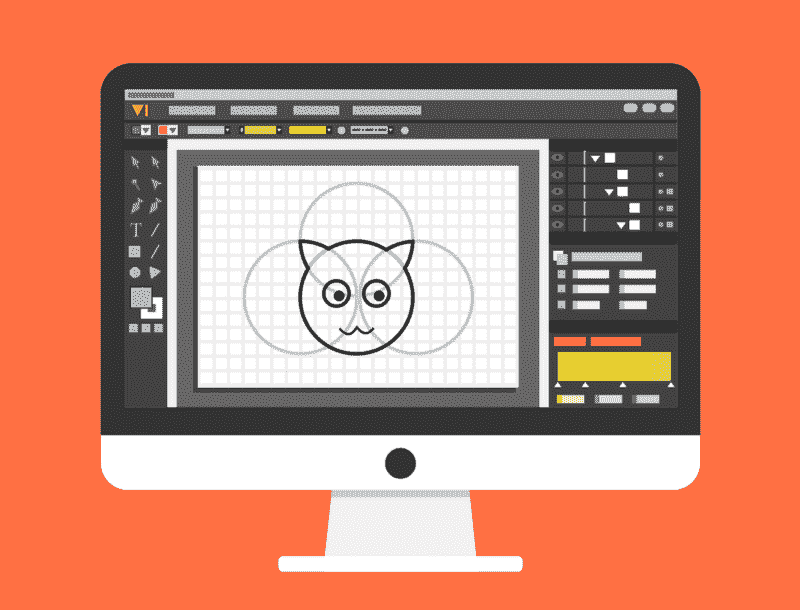

# 最小可行产品，解释。

> 原文：<https://www.freecodecamp.org/news/the-minimum-viable-product-explained-8f1187ca7cec/>

乔治·克拉萨达基斯

# 最低可行产品，解释

#### 什么是 MVP，你如何从中受益

MVP 这个术语是由弗兰克·罗宾逊创造和定义的，并由史蒂夫·布兰克和埃里克·里斯推广开来。一个流行的定义如下:

> *“…最小可行产品(MVP)是一种功能刚刚够满足早期客户，并为未来开发提供反馈的产品…”*

如果你分析这个定义，你会看到三个主要组成部分:

### 1.MVP 提供“足够的功能”

假设你有一个产品待办事项清单——一个你想在你的产品中构建的所有特性的列表——你必须决定*构建它们的顺序*以及*何时发布*你的产品。这个想法是对特性进行优先排序，并发布我的产品*的一个更小的实例**。但是优先顺序的标准是什么呢？有多少优先级最高的特性足以为早期客户带来价值？***

*对你的特性进行排序的标准应该是[a] **对用户的价值**和[b] **可行性**:你需要在你完整的产品待办事项中识别出**特性的最佳子集**，这个子集被期望为你的用户提供最大的价值；并且这也是你的团队*建造、发射和操作*可行的。*

*为了确定“红线”——也就是说，在哪个功能之后发布你的 MVP——你需要**既作为用户*思考，也作为企业家***思考:运用商业和产品意识，找到那些排名靠前的功能的最小集合，为你的客户解决问题。**这是你的 MVP**——这证明了 MVP 中的*最小值*。*

### *2.MVP“满足早期客户”*

*你的产品的第一个实例必须足够好，能够为你的客户解决问题——他们应该从第一天起就从中获得价值。你的 MVP 必须是可用的和有效的，这样用户才会参与进来，并有可能为此付费。*

*你的早期客户应该对你的产品非常满意，愿意充当推广者——向他人推荐，公开分享他们的满意度(如果不是兴奋的话)。*

### *3.MVP“为未来发展提供反馈”*

*作为一个产品经理，深刻理解你的用户想要什么，并潜在地将其反映到你的产品策略中，这是至关重要的。你需要正确的机制和流程来捕捉**用户参与度**并衡量**用户如何与你的产品**互动——跨越平台、渠道和市场。*

*遥测系统和正确的报告和分析工具可以满足这些分析需求，此外还有专门的**产品性能仪表板**，它可以在正确的环境中显示 KPI，从而实现快速比较和决策。*

*在许多情况下，收集额外的定性反馈是一个好主意——例如通过组织焦点小组来评估你的 MVP 的 UX；或者通过主持用户访谈、分析非结构化反馈等。定性数据将帮助您了解*您如何*向用户提供价值，以及哪些方面可以改进。*

*您还可以考虑使用客户满意度机制，例如 NPS — [净推广者分数](https://en.wikipedia.org/wiki/Net_Promoter) —作为一种以标准化方式获取用户满意度的方法。*

*以上所述，定义了**一个产品性能衡量框架**，其中包含做出更好、更明智的决策和探索进一步投资领域所需的洞察力。*

*[**从一个问题到一个定义良好的 MVP 的 8 个步骤**](https://medium.com/@gkrasadakis/from-a-problem-to-a-well-defined-mvp-in-8-steps-88efa12c1345)
[*你需要经历的过程，来恰当地定义你的最小可行产品*medium.com](https://medium.com/@gkrasadakis/from-a-problem-to-a-well-defined-mvp-in-8-steps-88efa12c1345)*

#### *对 MVP 的误解*

*尽管 MVP 的概念是一个相当简单的想法，但它并不总是以正确的方式使用:例如，术语 MVP 经常被用来表示*一个快速的实现、一个草案、一个原型或一些“开始”的东西。**

*与“概念验证”和原型相比，MVP*提高了生产准备度*——因为它暴露在真实的用户/客户面前。*

> *MVP 是真实产品的第一个实例；这是你真正产品生命周期的开始；未来迭代的基础。*

#### *优秀 MVP 的特征*

*好的 MVP 是专注的，以用户为设计的中心；它们反映了经过验证的用户需求，并解决了实际问题；它们提供了出色的无缝机制来衡量用户参与度和获取用户反馈，从而量化整体产品性能。*

#### *定义(或构建)不完善的 MVP 的症状*

*糟糕的 MVP 通常过于复杂，它们并不是真正的“最小化”；它们被过度设计或者根本没有被设计:)在大多数情况下，它们并没有真正反映用户的真实需求，因此，它们与市场脱节。糟糕的用户体验也会破坏定义良好的 MVP。*

### *MVP 方法如何让您的企业受益*

*将 MVP 的概念视为 ***方法或框架的一部分，以帮助您定义和构建更好的产品***——向更快*和更便宜*的伟大产品迈进。当您适应并使用最小可行产品方法时，您将在许多层面上受益——直接或间接。您将能够:***

#### ***1.对你的产品有远大的想法***

***拥有坚实的**产品愿景**非常重要。产品开发中的“敏捷方法”使你能够*想得更大*——创建描述“完整产品”的积压订单，即使是昂贵和“疯狂”的功能——它们都可以在你的产品积压订单中捕获，并等待合适的条件和时机，以便考虑实施。我的建议是 ***抓住一切，明智地优先考虑*** 。***

#### **2.用更少的资源打造您的产品**

**MVP 定义过程，将使您能够用更少的资源来构建您的产品:MVP 是关于识别必须具备的特性，这将使您的早期客户保持参与和快乐；通过这种方式，你将为你的产品 构建一个更小的第一个实例，它仍然服务于它的核心目的:为用户解决主要问题。**

**它还将通过为将来的迭代降低不太重要的特性的优先级来帮助您最小化您的开发和操作成本。一个正确定义和构建的 MVP 将为您节省资金。**

#### **3.联系您的客户**

**足够早地(和频繁地)捕捉用户反馈的能力本身可能就是一个成功的因素。你的 MVP 应该以多种方式提供反馈流——直接的和间接的。**

**例如，一个正确构建的 MVP 应该捕获所有的用户交互，并将数据添加到历史用户交互数据库中(注意这里的 GDPR 和相关法规约束)。适当的报告和数据分析可以帮助你发现真正有趣的用户模式，以及他们如何与你的产品互动。很有可能，这些见解会挑战你最初的产品设想，甚至指出不同的转向路径和机会。**

**您还可以收集和使用定性反馈——利用嵌入式表格、在线问卷、焦点小组和用户访谈。这些，可以提供你可能从未想过的额外的信号或见解和视角。**

#### **4.更快进入市场**

**由于你的 MVP 是关于构建你的产品 的一个更小的实例 ***，你将有机会更快地进入市场；同样，遵循同样的敏捷模式，你将能够 ***频繁发布特性*** 并保持你的灵活性——根据用户反馈和来自市场的信号。*****

#### *5.考虑枢轴，更早*

*随着您与用户的联系越来越紧密，您可以利用洞察力和产品性能数据来调整您的优先事项和产品路线图。或者，你可能会发现那些表明潜在的*支点*——也就是说，*你的产品战略的重大转变*或者你为你的用户解决问题的方式的*。**

**欢迎有想法、建议或问题！**

**[**如何定义一个最小可行产品**](https://medium.freecodecamp.org/is-it-an-mvp-really-6657db743544)
[*从一个概念转移到一个恰当定义的 MVP*medium.freecodecamp.org](https://medium.freecodecamp.org/is-it-an-mvp-really-6657db743544)**

**封面图片: [pixabay](https://pixabay.com/vectors/design-software-drawing-illustrator-2234069/)**