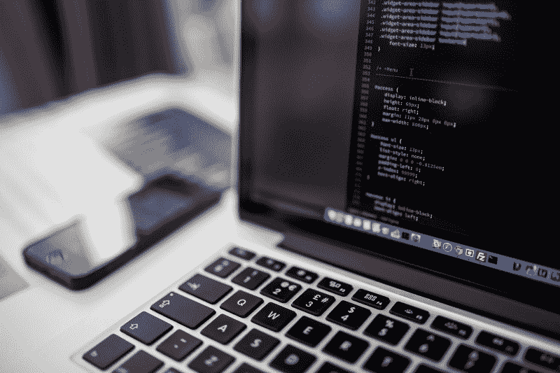

# Laravel 使用 CircleCI 和 Deployer 进行连续部署

> 原文：<https://www.freecodecamp.org/news/laravel-continuous-deployment-with-circleci-and-deployer-c70b27fa70d2/>

布莱恩·李

# Laravel 使用 CircleCI 和 Deployer 进行连续部署



Image from [Maxpixel](https://www.maxpixel.net/)

有许多部署 Laravel 的部署解决方案，从 SSH 到您的机器和`git pull`文件(？)到像 [Envoyer](https://envoyer.io/) 这样的省时者，或者用 Deployer 滚动你自己的。我个人喜欢 Deployer，因为它是免费的，非常灵活，可以支持您的项目，从婴儿期到扩展到多台机器。

Deployer 通过在本地运行您的部署脚本来工作，我们可以通过将 Deployer 集成到您的 CI 管道中来使这变得更加方便。对于最近的一个项目，我使用 CircleCI 来运行我所有的测试并自动部署。

### 本地安装部署器

为了节省时间，我强烈建议您在本地安装 [Deployer](https://deployer.org/) ，并为您的应用程序进行配置和工作。当 CircleCI 构建失败时，这可以节省大量调试部署者配置的时间。

### 拉勒韦尔和切尔莱西

如果您已经为您的 Laravel 项目测试设置了 CircleCI，请跳到下一节。否则，我假设您至少已经有了一个 CircleCI 帐户，并在其中创建了一个基本项目。

创建一个`.circleci/config.yml`并与下面的

```
 version: 2
jobs:
  build:
    docker:
      # Specify the version you desire here
      - image: circleci/php:7.1-browsers
      - image: circleci/mysql:5.7
        environment:
          MYSQL_ALLOW_EMPTY_PASSWORD: yes
          MYSQL_USER: root
          MYSQL_ROOT_PASSWORD: ''
          MYSQL_DATABASE: laravel

    working_directory: ~/laravel

    steps:
      - checkout
      - run:
          name: Install PHP exts
          command: |
            sudo docker-php-ext-install zip
            sudo docker-php-ext-install pdo_mysql
            sudo apt install -y mysql-client
      - run: sudo composer self-update

      # Download and cache dependencies
      - restore_cache:
          keys:
          - v1-dependencies-{{ checksum "composer.json" }}
          # fallback to using the latest cache if no exact match is found
          - v1-dependencies-

      - run: composer install -n --prefer-dist

      - save_cache:
          paths:
            - ./vendor
          key: v1-dependencies-{{ checksum "composer.json" }}

      - run:
          name: Setup Laravel stuffs
          command: |
            php artisan migrate --force
      - run: ./vendor/bin/phpunit

workflows:
  version: 2
  notify_deploy:
    jobs:
      - build
```

这是 Laravel 非常基本的`config.yml`。它将安装 PHP、MySQL 并运行 PHPunit 测试。请随意修改以满足您的需求。

### CircleCI 部署

在我们的测试运行之后，我们希望 CircleCI 自动开始部署到我们的服务器上。记住，部署者使用 SSH，所以在我们的远程服务器中，我们想要创建一个 SSH 密钥对`ssh-keygen -t rsa -b 4096 -C “your@email.com"`。我们希望将我们创建的这个密钥作为[部署密钥](https://circleci.com/docs/2.0/add-ssh-key/)添加到 CircleCI 中。记下指纹，因为我们稍后需要将它添加到配置文件中。

让我们在配置文件中创建新作业:

```
jobs:
  build: ... # from above

  deploy:
    docker:
      - image: circleci/php:7.2-browsers
    working_directory: ~/laravel
    steps:
      - checkout
```

这告诉 CircleCI 我们有了一个名为`deploy`的新任务，并基于 php-7.2-browsers docker 映像来构建它。

还记得我们添加到 CircleCI 时记下的指纹吗？我们需要在配置中引用它，这样 SSH 密钥就会出现在我们的容器中。

```
jobs:
  build: ... # from above

  deploy:
    docker:
      - image: circleci/php:7.2-browsers
    working_directory: ~/laravel
    steps:
      - checkout
      - add_ssh_keys:
          fingerprints:
            - "YOUR_FINGERPRINT"
```

现在，CircleCI 知道通过指纹将这个密钥添加到 docker 容器中，这将允许我们在远程服务器中运行 Deployer 和 SSH 来进行部署。

```
jobs:
  build: ... # from above

  deploy:
    docker:
      - image: circleci/php:7.2-browsers
    working_directory: ~/laravel
    steps:
      - checkout
      - add_ssh_keys:
          fingerprints:
            - "YOUR_FINGERPRINT"
      - run:
          name: Install Deployer
          command: |
            curl -LO https://deployer.org/deployer.phar
            sudo mv deployer.phar /usr/local/bin/dep
            sudo chmod +x /usr/local/bin/dep
      - run:
          name: Deploy
          command: |
            dep deploy www.your_server.com
```

定义好`deploy`任务后，最后一步是告诉 CircleCI 在我们的测试通过后运行它。这很简单，我们已经有了一个名为`notify_deploy`的基本工作流，我们可以在此基础上进行构建。

```
workflows:
  version: 2
  notify_deploy:
    jobs:
      - build
      - deploy:
          requires:
            - build
          filters:
            branches:
              only: master
```

这告诉 CircleCI，在我们的`notify_deploy`工作流中，除了运行`build`，我们还想在`deploy`完成后运行它，并且只在`master`分支上运行它。

完成所有工作后，我们现在可以将配置文件推送到我们的 git 存储库，并观察它自己的测试和部署。你使用不同的方式部署 Laravel 吗？告诉我，我很想听听！