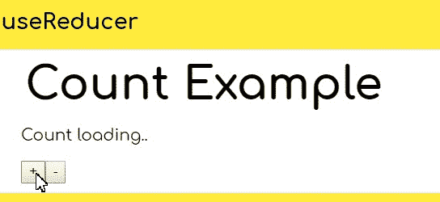

# 被钩子钩住:如何使用 React 的 useReducer()

> 原文：<https://www.freecodecamp.org/news/hooked-on-hooks-how-to-use-reacts-usereducer-2fe8f486b963/>


Photo by [Sebastian Unrau](https://unsplash.com/@sebastian_unrau?utm_source=ghost&utm_medium=referral&utm_campaign=api-credit) / [Unsplash](https://unsplash.com/?utm_source=ghost&utm_medium=referral&utm_campaign=api-credit)

React 大会刚刚召开，一如既往地有新的事情发生。*钩子发生了！*React 团队讲了悬疑、懒加载、并发渲染、 ***钩子*** :D

[https://www.youtube.com/embed/V-QO-KO90iQ?feature=oembed](https://www.youtube.com/embed/V-QO-KO90iQ?feature=oembed)

现在我来说说我最喜欢的钩子`useReducer`以及你如何使用它。

```
import React, { useReducer } from 'react';

const initialState = {
  loading: false,
  count: 0,
};

const reducer = (state, action) => {
  switch (action.type) {
    case 'increment': {
      return { ...state, count: state.count + 1, loading: false };
    }
    case 'decrement': {
      return { ...state, count: state.count - 1, loading: false };
    }
    case 'loading': {
      return { ...state, loading: true };
    }
    default: {
      return state;
    }
  }
};

const delay = (time = 1500) => {
  return new Promise(resolve => {
    setTimeout(() => {
      resolve(true);
    }, time);
  });
};

function PokemonInfo() {
  const [{ count, loading }, dispatch] = useReducer(reducer, initialState);
  const onHandleIncrement = async () => {
    dispatch({ type: 'loading' });
    await delay(500);
    dispatch({ type: 'increment' });
  };
  const onHandleDecrement = async () => {
    dispatch({ type: 'loading' });
    await delay(500);
    dispatch({ type: 'decrement' });
  };
  return (
    <div>
      <p>Count {loading ? 'loading..' : count}</p>
      <button type="button" onClick={onHandleIncrement}>
        +
      </button>
      <button type="button" onClick={onHandleDecrement}>
        -
      </button>
    </div>
  );
}

export default PokemonInfo;
```

[useReducerExample.js](https://gist.github.com/adeelibr/c12942dd4dcd7d2f5557449a0098b91d#file-usereducerexample-js)

在我的`PokemonInfo`组件中，我有:

```
const [{ count, loading }, dispatch] = useReducer(reducer, initialState);
```

这相当于:

```
const [state, dispatch] = useReducer(reducer, initialState);
const { count, loading } = state;
```

那么什么是`const [state, dispatch] = useReducer(param1, param2)`我们先来说说**数组析构** 下面发生的是什么？

```
const [state, dispatch] = useReducer(initialState);
```

下面是一个数组析构的例子:

```
let myHeroes = ['Ant man', 'Batman']; // Mixing DC & Marvel :D
let [marvelHero, dcHero] = myHeroes; // destructuring array
/**
* myHeroes[0] == marvelHero => is 'Ant man'
* myHeroes[1] == dcHero => is 'Batman'
*/
```

因此方法`useReducer`在其数组`state`和`dispatch`中有两项。另外，`useReducer`接受两个参数:一个是`reducer` ，另一个是`initial-state`。

在`useReducer`参数`reducer`中，我传入:

```
const reducer = (state, action) => {
  switch (action.type) {
    case 'increment': {
      return { ...state, count: state.count + 1, loading: false };
    }
    case 'decrement': {
      return { ...state, count: state.count - 1, loading: false };
    }
    case 'loading': {
      return { ...state, loading: true };
    }
    default: {
      return state;
    }
  }
};
```

它接受两个参数。一个是减速器的当前状态，一个是动作。`action.type`决定它将如何更新 reducer 并返回一个新的状态给我们。

所以如果`action.type === increment`

```
case 'increment': {      
  return { ...state, count: state.count + 1, loading: false };    
}
```

…它将返回状态，其计数将更新为 ***+1*** ，加载设置为**假** *。这里的`state`实际上是之前的状态。*

在`useReducer`参数`initialState`中，我传入:

```
const initialState = {  
  loading: false,  
  count: 0
};
```

所以如果这是初始状态，`useReducer`方法从它的数组中返回两个项目，`state`和`dispatch`。`state`方法是一个有两个键`count & loading`的对象，我在我的析构数组中析构了这两个键。

所以我析构了一个数组，在数组内部，我析构了数组第一个索引上的一个对象，如下所示。

```
const [{ count, loading }, dispatch] = useReducer(reducer, initialState);
```

我还有一个方法叫做`delay`

```
// return true after 1500ms in time argument is passed to.
const delay = (time = 1500) => {  
  return new Promise(resolve => {    
      setTimeout(() => {      
         resolve(true);    
      }, time);  
   });
};
```

现在在我的渲染方法中，当我点击`+`按钮时

```
<button type="button" onClick={onHandleIncrement}>+</button>
```

执行`onHandleIncrement`功能，该功能执行以下操作:

```
const onHandleIncrement = async () => {    
   dispatch({ type: 'loading' });    
   await delay(500);    
   dispatch({ type: 'increment' });  
};
```

它最初将`loading`设置为真，增加延迟`500ms`，然后递增计数器。我知道这不是一个真实的例子，但是它解释了减速器是如何工作的。

最后一件事:

```
<p>Count {loading ? 'loading..' : count}</p>
```

如果`loading`为真，我显示`Count loading..`否则我显示`Count {value}`。

这是它在用户界面中的外观:



Count example using useReducer hook

我试图复制丹·阿布拉莫夫在 2018 年 React 大会上展示的代码。这里是 [**代码库**](https://github.com/adeelibr/react-hooks-demo) **的链接。**尽情享受。:)

> 请注意，钩子是 React 的 alpha 版本，不建议在产品中使用。但是它们很有可能在未来成为生态系统的重要组成部分。所以你现在应该开始玩 react 钩子了。