# HTML 表单入门分步指南

> 原文：<https://www.freecodecamp.org/news/a-step-by-step-guide-to-getting-started-with-html-forms-7f77ae4522b5/>

Abhishek Jakhar

# HTML 表单入门分步指南

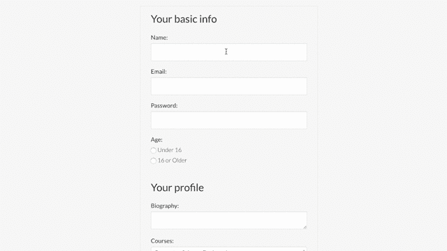

HTML Form

#### 概观

当您想从访问您网站的人那里收集一些数据时，HTML 表单是必需的。例如，当你注册/登录优步、网飞或脸书等应用时，你通过 HTML **表单**输入**姓名**、**电子邮件**、**密码**等信息。

现在我们将学习创建表单所需的所有元素。

> 注意:我已经用 CSS 添加了样式，所以我的元素看起来会有所不同，但它们的工作方式完全相同。
> 如果你想让你的元素看起来像我的元素，你可以在下面的链接中找到我的 CSS 文件:
> 自定义 CSS:[https://gist . github . com/abhishekjakhar/493d 920 a 219 ed 9d 88 f 1846 CD 31 de 7751](https://gist.github.com/abhishekjakhar/493d920a219ed9d88f1846cd31de7751)[规格化 CSS:](https://gist.github.com/abhishekjakhar/3a6c25fa61a293b6a56d28f98497808b) [https://gist . github . com/abhishekjakhar/3a 6c 25 fa 61 a 293 b 6 a 56d 28](https://gist.github.com/abhishekjakhar/3a6c25fa61a293b6a56d28f98497808b)

#### 形状要素

这是我们将要学习的第一个要素。这个元素包装了表单内部的所有其他元素。这是表单元素。

我们的表单不会向任何地方提交数据，因为它没有连接到服务器。为了将表单连接到服务器并处理数据，我们可以使用任何服务器端语言，比如 Node、Python、Ruby 或 PHP。处理数据的部分涉及到附加到表单元素的两个重要属性。让我们来看看那些属性。

**属性:**

1.  **action:**action 属性是一个程序的网址(URL ),该程序处理我们的表单提交的信息。
2.  **方法:**是浏览器用来提交表单的 [HTTP 方法](https://developer.mozilla.org/en-US/docs/Web/HTTP/Methods)，可能的值是 **POST** 和 **GET。**

*   **POST** —表单主体中的数据被发送到服务器。
*   **GET** —数据在 URL 内部发送，参数用问号分隔。

> **注意:**不能让**表单**嵌套**在另一个表单**中。这意味着不能在另一个<表单>元素中包含一个<表单>元素。

#### 输入元素

input 元素是最常用的表单元素。它用于制作一个**文本字段**，用户可以在其中键入一些**信息**，例如**电子邮件**、**密码**等。

让我们创建一个文本字段，用户可以在其中键入他们的姓名。

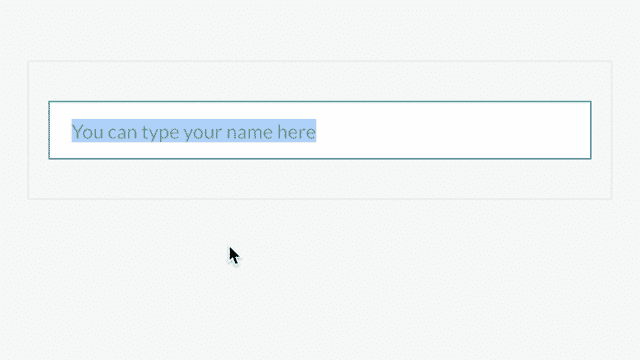

> **注意:**输入元素是一个自结束标记，所以不需要键入结束标记来匹配开始标记。

我在上面的输入标签中添加了三个属性。让我们详细地看一下每一个。

**类型**

类型属性表明我们想要什么样的输入。如果我们给**类型**属性一个**文本**的值，那么我们在这里的意思是我们输入到输入字段的值是文本类型的。这个特定属性有许多可能的值。一些可能的值是电子邮件、电话号码和密码等。

例如:当你登录你的任何账户(亚马逊/网飞)时，你需要输入两件事:**电子邮件**和**密码**。所以在这种特殊情况下，使用了**输入**元件。**类型**属性分别赋予**电子邮件**和**密码**的值。

**id**

ID 属性不是强制的，但是添加一个是个好主意。在某些情况下，这有助于用 CSS/JavaScript 定位元素。添加 ID 属性是为了让我们可以将**标签**关联到**特定的表单控件**。

**名称**

name 属性是必需的。当表单提交给服务器端代码时，服务器可以理解表单数据并适当地处理这些值。

**占位符**

它是一个简短的提示，在用户输入值之前显示在输入字段中。当用户开始在输入字段中键入时，占位符消失。

让我们看看其他一些基本的输入元素是什么样子的。

> **注意:**对**类型属性**使用**不同的值**会产生不同的结果。例如，您可以输入电子邮件、文本或密码等类型。它们都表现出**稍微不同的行为，你将在下面看到**。

多个输入元素(文本、电子邮件、密码)

多输入元素(文本、电子邮件、密码)

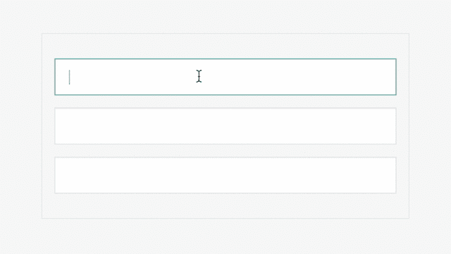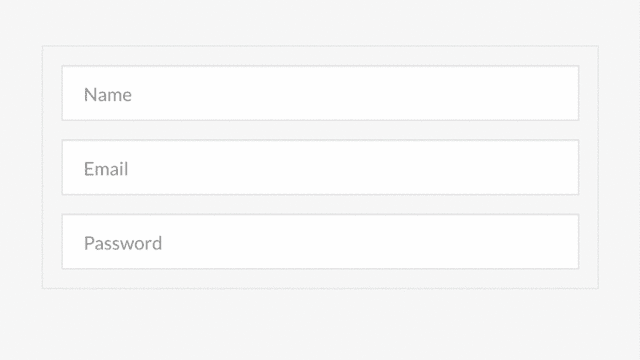

**Input** elements without **placeholder**(Left) & with **placeholder**(Right) attribute

#### Textarea 元素

有时候一行文字是不够的，简单的输入元素也不行。例如，一些网站有一个联系表单，供人们键入他们的问题或消息。在这些情况下，最好使用`textarea`元素。

**< textar** ea >不是一个自结束标签，所以我们需要输入开始和结束标签。(<textarea></textarea>

**属性:**

*   **id:** 同上述<输入/ >元素。
*   **名称:**同上述<输入/ >元素。
*   **cols:** 指定文本区域的可视宽度。
*   **行数:**指定文本区域中可见的行数。

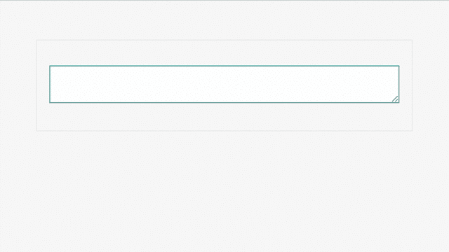

Textarea Element

你可以看到文本区允许我们输入多行。用户可以调整文本区域的大小，你可以在上面的例子中看到我正在调整文本区域的大小。

> **注意:**在大多数浏览器中， **textarea** 元素是可调整大小的。

#### 按钮元素

按钮元素是最重要的表单元素之一。如果没有按钮，您将无法向服务器提交任何表单进行处理。

按钮元素接受名为**类型的属性。**该属性接受三个值**提交**、**复位**和**按钮**。

**属性:**

*   **键入**=“reset”:点击后**会清除** **所有表格数据**。
*   **type**=“button”:它没有任何默认行为，主要是用 JavaScript 为其编写**自定义行为**。
*   **type**= " submit ":**提交类型**的默认行为是，顾名思义，提交表单并将所有数据发送到服务器。

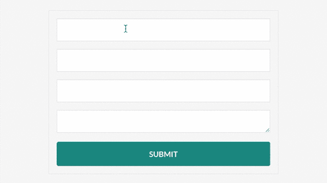

Button of type submit

#### 标签元素

现在用户不可能知道哪个表单控件做什么。没有办法知道你将在哪里输入电子邮件，在哪里输入密码。表格看起来很不完整，很乱。

我们可以使用 label 元素标记每个表单控件。

标签为的**最常用的属性是 for 的**。****

**属性:**

*   **for:**属性的**将标签与特定的表单元素相关联。它**匹配的方式是通过 ID** 。正如您在上面的例子中看到的，赋予 input 元素的 ID** 属性的**值是 **email。**赋予 label 元素的**属性的**值也是 **email，**，所以两者相互关联。**

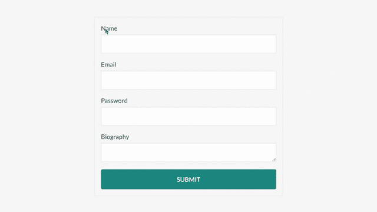

> **注意:**当我们点击标签时，我们自动将焦点转移到与该标签相关联的输入字段。这是默认行为。

现在我们的状态看起来很好？。

#### 选择菜单

有时，当您创建表单时，您不希望用户能够键入文本。相反，你可能希望他们从**中挑选一些你提供给**的预置选项。

任何时候，当你的选项列表超过四五个的时候，最好使用选择菜单，因为这样可以节省空间。

假设我们的表单是针对那些打算申请大学入学的学生的。我们希望允许学生从预先确定的大学课程列表中进行选择。

选择菜单元素是使用打开和关闭 **< sele** ct >标签制作的。

**< sele** ct > —选择元素呈现**一个包含可选选项**的下拉菜单。选择元素本身不会做任何事情。这个表单元素实际上需要内部的附加元素，确切地说是**lik**e<ul>ele**element**s 需要< li >元素。我们放在 select e**element**里面的元素**叫做 option 元素。******

**属性:**

*   **名称:**同上述<输入/ >元素。

**<opti**on>—option 元素表示用户可以在选择菜单**中选择的选项之一。&l**t；选项>元素 **ent 使用**属性**布特 c** 调用值。

**属性:**

*   **value:** 当您向服务器端代码提交表单时，每个表单元素都有一个用于文本输入和文本区域的关联值。该值是用户在字段中键入的任何内容。然而，因为我们正在创建这些预定义的选项，所以我们需要指定值在提交时应该是什么样子。因此，我们使用**值**属性来指定预定义选项的值。

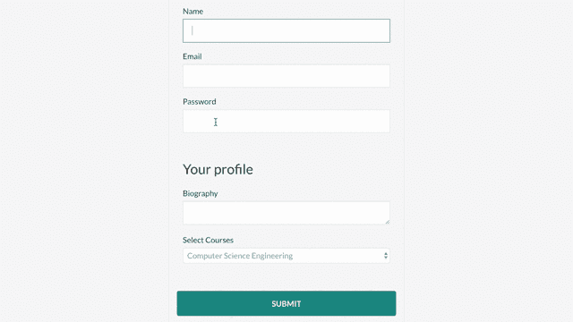

Select Menu

现在，我们有了“选择课程”标签和我们刚刚创建的“选择”菜单。现在，我们还可以用 **< optgro** up >元素将列表组织成逻辑组。

**属性:**

*   **标签:**选项组的名称。在下面给出的例子中，我们的选项列表被分为两组，标签为工程和管理。

在下面给出的例子中

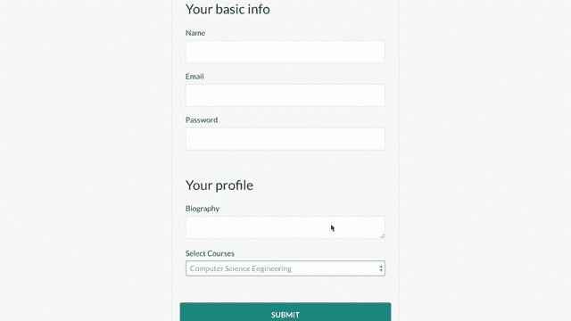

#### 单选按钮

如果你有很多选择，选择菜单是很棒的。如果你有 5 个或更少的选项，最好使用单选按钮。

选择菜单和单选按钮的区别在于单选按钮会一次显示所有选项。像选择菜单一样，用户只能从中选择一个。

**属性:**

*   **名称:**同上述<输入/ >元素。
*   **value:** 因为我们正在创建这些预定义的选项，所以我们需要指定值在提交时应该是什么样子。因此，我们使用**值**属性来指定预定义选项的值。

> ***注意:*** *如果你选择了一个选项，然后你试图选择另一个选项，你会看到它取消选择前一个选项。它知道这样做的方法是因为我们有完全相同的 **name** 属性。因此它知道这两个单选按钮属于同一个组。*

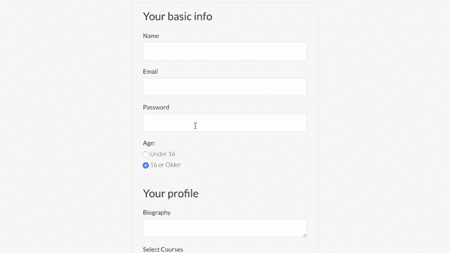

> **注意:**如果我们希望单选按钮属于同一个单选按钮组，名称应该相同。

#### 复选框

有时，您可能有一组预定义的选项。您希望用户能够选择多个选项，而不仅仅是其中一个。这就是复选框有用的地方。

**属性:**

*   **名称:**同上述<输入/ >元素。
*   **value:** 因为我们正在创建这些预定义的选项，所以我们需要指定值在提交时应该是什么样子。因此，我们使用**值**属性来指定预定义选项的值。
*   **勾选:**默认情况下，复选框输入是不勾选的。您可以使用名为 **checked** 的属性将默认状态设置为 checked。记住这是一个布尔属性。

```
<input type="checkbox" checked id="name" value="abhishek" name="user_name" />
```

在下面给出的例子中，我对每个选项都使用了标签。我已经使用**标签**的属性的**和**复选框**的 **id** 属性连接了**复选框**和**标签**。**

> ***注意:*** *可以硬点一个小复选框。建议在复选框周围加上一个<标签>元素。如果我们单击标签，那么我们的复选框也会被选中或取消选中。下面我没有做过，但是你可以做，让 UX b* 更好。

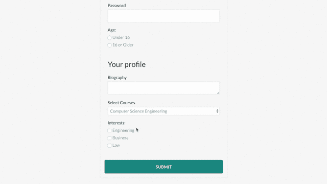

#### 复选框和单选按钮的区别

1.  复选框可以独立于存在**，而单选按钮只能作为**组**出现(至少应有 2 个单选按钮)。**
2.  选择复选框**是可选的**，但选择单选按钮**是强制的**。

#### 完整的形式

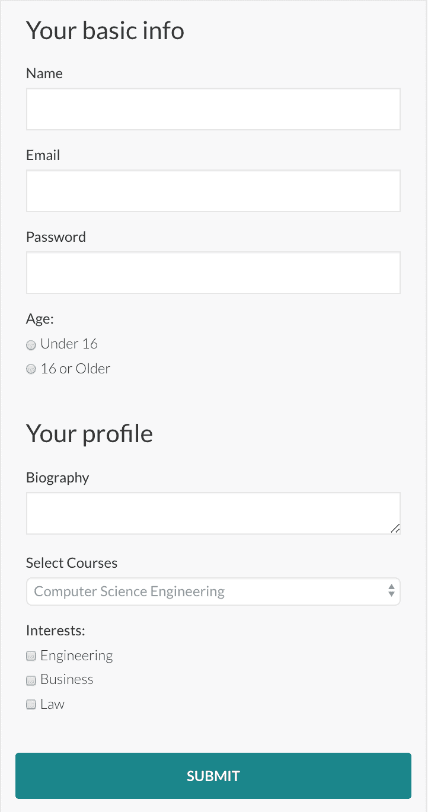

我们已经学习了很多 HTML 表单元素，并且已经涵盖了基本要素。

不要担心什么都记不住。几乎没有专业的 web 开发人员能够说出每个属性或元素的名称。比记忆更重要的是，当你需要的时候，学会如何在文档中查找。

您可以尝试添加自己的 CSS 来使这个表单看起来像您想要的样子。

您可以通过下面的链接了解更多关于表单的信息

[**HTML 表单**](https://developer.mozilla.org/en-US/docs/Learn/HTML/Forms)
[*这个模块提供了一系列的文章，可以帮助你掌握 HTML 表单。HTML 表单是……*developer.mozilla.org](https://developer.mozilla.org/en-US/docs/Learn/HTML/Forms)的一个非常强大的工具

我希望这篇文章对你有所帮助。我希望听到您的反馈！

**感谢您的阅读！**