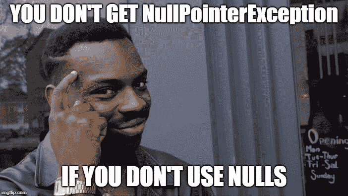

# 如何摆脱 NullPointerException

> 原文：<https://www.freecodecamp.org/news/how-to-get-rid-of-nullpointerexception-3cdf9199f9fb/>

OverOps 是一家以色列公司，它帮助开发人员理解生产中发生的事情，对生产中最常见的 Java 异常进行了研究。想猜猜哪个是第一名吗？`NullPointerException`。

NullPointerException OverOps’s monster

为什么这种异常如此频繁？我争辩道(鲍勃叔叔也是？)是因为开发人员忘记添加空检查。

原因:**开发人员过于频繁地使用空值。**

### 那么所有这些空值是从哪里来的呢？

在 C#和 Java 中，所有引用类型都可以指向`null`。我们可以通过以下方式获得指向`null`的引用:

*   “未初始化的”引用类型变量——用空值初始化的变量，随后被赋予实值。一个 bug 会导致它们永远无法被重新分配。
*   未初始化的引用类型类成员。
*   显式赋值给`null`或从函数返回`null`

以下是我在返回`null`的函数中注意到的一些模式:

#### 错误处理

输入无效时返回`null`。这是返回错误代码的一种方式。我认为这是一种老派的编程风格，起源于异常不存在的时代。

#### 实体缺少可选数据

实体的属性可以是可选的。当可选属性没有数据时，它返回`null`。

#### 分层模型

在层次模型中，我们通常可以上下导航。当我们在顶部时，我们需要一种方式来这样说，通常是通过返回`null`。

#### 查找函数

当我们想要根据集合中的标准查找实体时，我们返回`null`作为一种方式来表示没有找到实体。

### 使用空值有什么问题？

#### 它会爆炸。最终…

引发`NullPointerException`的代码可能离 bug 所在的地方很远。**这使得追踪真正的问题变得更加困难。**特别是如果代码是分支的。

I am happy now but I will blow up eventually.

在下面的代码示例中，在类 A 的某个地方有一个 bug，导致`entity`为 null。但是`NullPointerException`是在 b 类的函数中引发的，真实的代码可能要复杂得多。

#### 隐藏的错误

我遇到了`null`检查，好像开发人员在想:

*   “我知道我应该检查`null`，但是我不知道当函数返回`null`时意味着什么，我也不知道该怎么处理它，”或者
*   “我认为这不能为空，但为了确保万无一失，我不希望它影响生产”

通常看起来是这样的:

那些种类的`null`检查导致一些代码逻辑不触发，**没有能力知道它**。编写这种代码意味着某个流程的某些逻辑失败了，但是整个流程成功了。它还会导致其他一些功能中的错误，这些功能假定其他功能完成了它的工作。

想象你在网上买了一张演出的票。你收到了成功信息！演出的日子终于到了，你早早下班，安排好保姆，去看演出。当你到达时，你发现你没有票！而且没有空座位。你心烦意乱地回到家？。你能看出这种无效支票是如何导致这种情况的吗？

还让代码分支难看？

### C#和 Java 中缺少不可为空的引用类型

在 C#和 Java 中**引用类型总是可以指向`null`** 。这导致了一种情况，我们无法通过查看函数签名来知道`null`是否是它的有效输入或输出。我相信大多数函数都不返回或接受`null`。

因为很难知道一个函数是否返回`null`(除非有文档记录)，开发人员要么在不需要的时候插入`null`检查，要么在需要的时候不检查`nulls`——是的，有时在需要的时候放入空检查？。

这种糟糕的设计选择导致了我之前在“隐藏错误”中描述的问题，当然还有很多`NullPointerException`错误。两败俱伤的局面。？

像 [Kotlin](https://kotlinlang.org/docs/reference/null-safety.html) 这样的语言旨在通过区分可空引用和不可空引用来消除`NullPointerException`错误。这允许捕捉分配给非`null`引用的`null`，并确保开发人员在解引用可空引用之前检查`null`，**都在编译时**。

微软正在采用同样的方法，在 C#8 中引入了[可空引用类型](https://msdn.microsoft.com/en-us/magazine/mt829270.aspx)。

### 那么我们该怎么办呢？

#### 听鲍勃叔叔的话

[罗伯特·c·马丁](https://en.wikipedia.org/wiki/Robert_C._Martin)，他以“鲍勃大叔”而闻名，写了一本关于干净代码的最著名的书，叫做(令人惊讶)[【干净代码】](https://www.amazon.com/Clean-Code-Handbook-Software-Craftsmanship/dp/0132350882)。在本书中，Bob 叔叔声称，**我们不应该返回`nulls`，也不应该将`null`传递给一个函数。**

#### 但是怎么做呢？

我想提出一些消除空用法的技术模式。**我并不是说这是所有情况下的最佳解决方案——只是选项**。

**使用选项类型**

[选项类型](https://en.m.wikipedia.org/wiki/Option_type?wprov=sfla1&fbclid=IwAR3Y-vZX-mrpINhipnr_tjyZ4P8KZH0yLCtvcJqbtaMxry2DO6HJWdSP3XA)是表示可选值的不同方式。此类型询问值是否存在，如果存在，则访问该值。**当试图访问不存在的值时，它引发一个异常**。这解决了在远离 bug 的代码区域引发的`NullPointerException`问题。Java 里有[可选<T>；班级。在 C#中(直到 C# 7 ),有一个只用于值类型的 Nullabl 类型，但是你可以创建你自己的或者使用 l 库。](https://docs.oracle.com/javase/8/docs/api/java/util/Optional.html)

一个简单的方法是用这种类型替换可以`null`(通过逻辑)的引用:

**将功能一分为二**

每个返回`null`的函数都会被转换成两个函数。一个具有相同签名的函数抛出异常，而不是返回`null`。第二个函数返回一个布尔值，表示调用第一个函数是否有效。让我们看一个例子:

如果持有`IEmployee`实例的代码假设这个雇员有一个经理，那么代码应该调用`Manager`。但是如果这个假设不存在，代码应该调用`HasManager`并处理两个可能的输出。

让我们看另一个例子:

`ContainsEmployeById`的逻辑与`FindEmployeById` 基本相同但不返回员工。现在让我们假设这些函数到达数据库，我们在这里有一个性能问题。让我们介绍一个类似但不同的模式:返回`true`时的`boolean`函数也将返回我们搜索的数据。看起来是这样的:

这种模式的常见用法是 [`int.Parse`](https://docs.microsoft.com/en-us/dotnet/api/system.int32.parse?view=netframework-4.7.2#System_Int32_Parse_System_String_) 和`[int.TryParse](https://docs.microsoft.com/en-us/dotnet/api/system.int32.tryparse?view=netframework-4.7.2#System_Int32_TryParse_System_String_System_Int32__)`。

我能把一个函数分成两个函数，每个函数都有自己的用法，这表明返回`null`是违反单一责任原则的**代码味道。**

### 分割接口

我们可以从[利斯科夫原则](https://en.wikipedia.org/wiki/Liskov_substitution_principle)中得到一个实用的指导方针，即一个类**必须实现它所实现的接口的所有功能**。返回`null`或抛出异常是不实现函数的方法。所以返回`null`是违反利斯科夫原理的**码气味。**

如果一个类不能实现一个特定接口的功能**，我们可以将该功能转移到另一个接口**，每个类将只实现它能实现的接口。

现在，我们不是问`employee.HasManager`——如果我们使用第一种方法“将功能一分为二”，我们会这样做——而是问雇员是`IManagedEmployee`。

### 我不是一个人在工作，也不是在做一个新项目。现在怎么办？

在现有的代码库中，有许多代码返回引用类型。我们无法知道`null`是否是有效输出。

我希望你能有的第一个速效方法是**改变你的编码约定**，这样`null`就不是一个函数的有效输入或输出**T5。或者，至少在决定`null`为有效输出时，使用**选项类型。****

有一些工具可以帮助执行这个约定，比如 [ReSharper](https://www.jetbrains.com/help/resharper/Code_Analysis__Value_Analysis.html) 和 [NullGuard](https://github.com/Fody/NullGuard) 。我猜，虽然我还没有尝试过这个，但是你可以给 sonar cube 添加一个[自定义规则，它会在单词`null`出现时发出警报。](https://docs.sonarqube.org/display/DEV/Adding+Coding+Rules)

我很想知道你的想法。你会接受这个惯例吗？如果不是，为什么？是什么阻碍了你？

如果您遇到这样的场景，您认为返回`null`是正确的设计选择，或者我建议的模式不好，我很想知道。

感谢[马克·kazakov‏](https://www.linkedin.com/in/mark-kazakov-98994197/)带来有趣的 meme，感谢[来自 OverOps 的阿历克斯·日特尼茨基](https://www.linkedin.com/in/alex-zhitnitsky-86567238/)回答我的问题，感谢[鲍特](https://www.facebook.com/baot.tech/)为新博主组织了一次伟大的写作活动，感谢[伊齐克·萨班](https://www.linkedin.com/in/itzik-saban-54b93829/)、阿米泰·霍维茨和[马克斯·奥菲乌斯](https://www.facebook.com/max.ophius)给我的反馈。