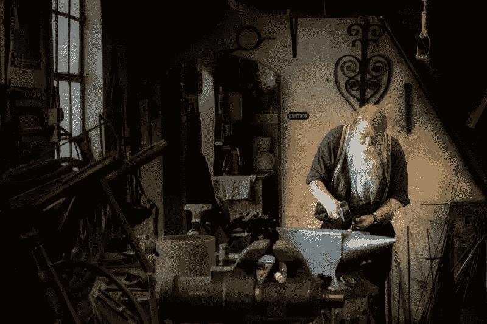

# 深耕细作:在新经济中茁壮成长的两大核心能力

> 原文：<https://www.freecodecamp.org/news/going-deeper-on-deep-work-two-core-abilities-for-thriving-in-the-new-economy-6c7667b4eed6/>

巴尔·弗兰克

# 深耕细作:在新经济中茁壮成长的两大核心能力

“Respect your craftsmanship” by [Nicolas Hoizey](https://unsplash.com/@nhoizey?utm_source=medium&utm_medium=referral) on [Unsplash](https://unsplash.com?utm_source=medium&utm_medium=referral)

#### **更多热爱深度工作的理由**

我没想到我的第一篇关于深度加工和 T2 番茄工作法的文章会引起人们如此大的共鸣。我不知道 Medium 认为什么是病毒式传播，但 10 天内超过 50，000 的浏览量一定意味着你对这个话题感兴趣。

如果你不熟悉深度工作，我怎么推荐 Cal Newport 的书[深度工作](https://amzn.to/2NXMePw)都不为过。

论题很简单。作为人类，我们会分心。比以往任何时候都更重要，因为技术是为了吸引我们的注意力和吸引我们。

所以我们要负起责任，反击。我们必须关闭和阻挡那些会让我们分心的事情。

不是永远，但肯定是在我们学习或从事艰苦工作的时候。

困难的事情是需要数周、数月或数年深入实践的学科。编程是一件很难的事情。创造力是一件困难的事情。写作是一件很难的事情。(努力写这篇文章而不重复我自己是一件非常困难的事情。)

消除分心是深层工作的一个很小但非常重要的方面。

在当今的经济形势下，要想最大限度地发挥你的天赋和技能，你需要在两件事上做得更好。

### 在新经济中茁壮成长的两大核心能力

> 1.快速**掌握硬东西的能力**

> 2.就质量和速度而言，以精英水平生产的能力。

> — [深度工作](https://amzn.to/2NXMePw)第 29 页

让我们把这两种能力分解一下。

#### 1.快速掌握困难事物的能力

到底，*应该*你**掌握**什么？

对于**程序员**，这取决于这个人和你在职业生涯中的位置。对每个人来说都会有所不同，但我想再次强调**聚焦**。

你不需要学习每一种新的语言和框架，后端和前端。这是一个对很多事情都有浅薄知识的秘诀。俗话说，“万事通，无所不能”？

掌握基础。掌握基本面。掌握最佳实践。掌握沟通之类的软技能。

掌握深度工作的技巧。它是一种工具，让你有能力在合理的时间内学会一些困难的东西。

然后，掌握一个方面。它可以是前端、后端、数据库、数据可视化、构建过程、测试等等。如果你从事用户体验，精通原型制作或进行用户访谈。如果你对写作感兴趣，请掌握文案或小说。

对程序员来说，是的，技术发展很快，需要组织内部的变革。但是你的大部分时间花在开发过程的一个方面。当需求改变时，你需要知道如何学习和掌握新的需求。

随着你某一方面知识的增长，你的领域知识也在增长。这让你更像一个专家，让你更容易掌握下一件具体的事情。

对于**自由职业者**来说，专业化更重要。

你喜欢花时间申请大量的工作，却永远得不到，因为总有比你更好的专家？当你最终得到一份工作时，你喜欢用不计费的时间来“加速”一些软件或工具吗？如果你知道自己在做什么，你愿意花一个月的时间去完成一件需要一周的事情吗？你喜欢永远不能提高利率吗？

还是宁愿做一个“90 美元/小时的 Laravel 专家”或者“125 美元/小时的专攻医学领域的文案”？

对于兼职项目和单身创始人来说，你可能最终会对很多事情有一个大概的了解。

但实际上你正在掌握解决问题和运输的艺术。这意味着把你的东西拿出来展示给人们，获得反馈，解决问题。然后迭代和改进，在*更多的*人面前得到你的东西的*更好的*版本。

#### 2.就质量和速度而言，以精英水平生产的能力

初学者会花大部分时间学习，但最终会成为专业人士。

互联网上有这么多学习的好网站，让人应接不暇。 [freeCodeCamp](http://freecodecamp.org) 是*的一个*资源，教你非常有价值的编程主题，对于*免费*。多年来，数百个免费和付费网站如雨后春笋般涌现。

你可以永远学习下去，因为这种东西产生的速度比你吸收的速度快。

在某种程度上，这是我们必须训练自己管理或避免的另一种分心。

没有实践的知识是无用的。如果你不是基于你所学的去创造和生产，那么你是因为恐惧而拖延。

你害怕展示你的作品。你害怕自己不够好或者没有人会喜欢你所做的，或者更糟，没有人会在乎。

坚持学习，永远不出成绩，才安全。

但是你有 T1 要生产。

“以精英水平生产”这个词似乎令人生畏。如果你不是世界上最好的，你还不够好吗？绝对不行。

至少，让我们从你受雇做的工作开始。

对于大多数公司来说，按时交付好的工作就算不是很好，也是很好的。按时或提前交付优秀的工作被认为是精英。即使是初学者，深入的工作也能让你做到这一点。

当你在深度工作中变得更好，当你的技能或领域随着时间的推移变得更好，那就是你产出的质量和数量呈指数增长的时候。

想到一个[飞轮](https://en.wikipedia.org/wiki/Flywheel)。首先，你施加很大的力来旋转它。但是你消耗的能量还在，储存在**动量**中。当你停止施加能量时，它开始变慢。当你施加更多的能量，它移动得越来越快。继续向动量施加能量，在某一点上，它运动得如此之快，以至于无法停止。(如果我破坏了这个类比，物理学家不会生气)

将深入工作的力量与努力学习的力量相乘，以更快的速度产生更高的质量。

#### 反馈对质量至关重要

关于反馈的一个简短说明。你必须得到反馈来衡量和提高你的质量。

质量意味着很多事情。例如，代码质量:

> “漂亮的代码简洁明了，所以如果你把这些代码交给另一个程序员，他们会说，‘哦，这是写得很好的代码。’这很像你在写一首诗”——深度作品第 89 页

然而，质量的含义远不止于此。质量是外界对你的产出的看法和反应。你可能有一个高质量的产品，但如果没有人想要它，那就是质量差(就你的银行账户而言。)

如果你在一个团队中工作，你应该经常检查你的代码，并与你的同事、经理和产品人员交流，以确保你走在正确的方向上。你写代码有多快并不重要。如果代码导致的问题比它解决的问题多，你不会坚持太久。

如果你是一个创始人或从事副业项目，你必须把你的产品展示在公众面前，开始获得反馈。反馈会告诉你人们是否喜欢你的产品。就产品与市场的契合度而言，这就是质量。

你不能躲在地下室里六个月，去制造下一个每个人都想要的酷东西。那是**而不是**深度工作。

那是你的自我在鼓励你，欺骗你认为你在做正确的事情。但当你最终出现，而世界告诉你走开时，你就是这样让自己失望的。

利用深度工作快速学习难的东西，高水平生产，对你的职业生涯大有裨益。但是你知道这对你的心理健康和幸福也有好处吗？

### 深度工作让你热爱你所做的事情

> “因此，在自己的职业生涯中拥抱深度工作，并引导它培养你的技能，这是一种努力，可以将一份令人分心、令人疲惫的知识工作转变为令人满意的事情——一个通往充满闪亮、奇妙事物的世界的大门。”— [深度工作](https://amzn.to/2NXMePw)第 91 页

处理工作的更好方法是什么？盯着时钟等着下午 5 点，这样你就可以回家去痛饮网飞了？

还是真的擅长某件事，并因为你多年积累的技能和能力而得到认可？

这应该是一个容易的决定。

有一种流行的说法是，你应该“追随你的激情，这样你就不会在生活中多工作一天。”

对大多数人来说，这是不正确的。

首先，很多人没有激情。也许我们有，但是很难定义。我就是那些人中的一个。我喜欢很多东西，但我无法告诉你我真正“热爱”的一件事。

接下来，将你的激情货币化是开始憎恨你的激情的好方法。经营企业有很多不好玩的事情。当事情进展不顺利时，你开始怨恨当初让你陷入困境的激情。

当激情不真实时，追随激情是一个冒险的赌注。将你的激情过度商业化也是一个冒险的赌注(比如当艺术家“出卖”自己，开始讨厌自己的工作时。)

相反，当你做得很好的时候，你会变得对某事充满热情。

你最终会爱上工作带来的挑战和成就感(见下一节“心流”)。

我对编程没有热情。我永远不会写一本关于算法或编码模式的书。

但我热爱我的工作，因为我擅长这个。每天，我都比昨天拓展我的技能和理解力。有时候我会集中精力学习一些新东西(比如最终弄清楚如何配置 Webpack)。有时候，我会重温一年前写的一些粗制滥造的代码，试图让它变得更好。

是的，有些人确实有激情，而 T2 也凭借激情过得很好。像歌手和运动员这样有天赋的人就属于这一类。但是天赋很早就被发现了，所以挑战和奖励的反馈循环发展得更快。

对于我们其余的人来说，告诉人们他们在生活中快乐的唯一方式是“追随你的激情”，这是不真诚的。

### 深度工作创造流动

“little girl discovers flow before it was cool” by [Tong Nguyen van](https://unsplash.com/@duytanphoto?utm_source=medium&utm_medium=referral) on [Unsplash](https://unsplash.com?utm_source=medium&utm_medium=referral)

在你听到“心流”或“深度工作”这个词之前，在你的早期生活中，一定有一段时间你迷失在工作或爱好中。时光飞逝。也许你正在学习一种乐器或者开始画画。或者你刚刚发现了 freeCodecamp.org，一天之内复习了 10 节课。

出于某种无法解释的原因，你感到快乐。你为自己最终创造的东西感到自豪，这也让你感到快乐。

米哈里·契克森米哈早在 80 年代和 90 年代就研究并推广了“心流”这个术语。如果你想了解更多关于“心流”的内容，他已经写了几本关于这个主题的书。

> “‘最好的时刻通常发生在一个人的身体或思想被拉伸到极限，自愿努力去完成一些困难而有价值的事情的时候。’

> [……]研究证实，一周内这样的心流体验越多，受试者的生活满意度越高。看起来，当人类深深沉浸在具有挑战性的事物中时，他们处于最佳状态。”— [深度工作](https://amzn.to/2NXMePw)第 84 页

寻找心流是非常困难的。这很难量化，它肯定是那种“当你看到它时你就会知道”的东西。

> “在工作中(尤其是知识工作)，增加你在深度状态中花费的时间就是利用人类大脑的复杂机制，因为几种不同的神经原因，最大化你与工作生活相关的意义和满意度。”— [深度工作](https://amzn.to/2NXMePw)第 82 页

你肯定会在做深度工作时找到更多的心流，比你过着分心的生活时要多得多。

### 深度工作能让你更好地避免分心

当你训练深层工作肌肉时，它会溢出到你生活的其他方面。

你能更好地避免那些让我们感觉像废物一样的琐事。有什么比因为在 Instagram 上浏览了某人的度假帖子而觉得自己不够好更糟糕的吗？害怕错过是真的。

脸书、Instagram 和所有其他的都是精彩片段。我们过滤掉生活中所有的垃圾，只把最美好的时刻发布到这些平台上。所以你把你生命中的这一秒钟与某人过去几个月中最美好的一天中最美好的时刻相比较？除了痛苦你还能得到什么？

相反，要学会利用闲暇时间更深入。看小说，园艺，家务，什么都行。关掉你的手机，只做你应该做的事情，直到它完成并且做得很好。

### 深度工作为重要的事情创造了更多的时间

专注，深度工作就是集中时间。当你做得对的时候，你就为你的家人、朋友和休闲创造了更多的时间。

相比之下，生活充满了分心，以至于你*寻找*分心来感觉良好。或者是一种不与忙碌隔绝的生活。当你不停地查看电子邮件、接收通知、处理非紧急事件时，从你醒来到入睡，你会看起来很“忙”。*“对不起，我没时间陪你，我很忙。”*

如果不是为了享受生活和周围的人，我们做这些是为了什么？

你不仅可以腾出更多的时间，还可以加深你的人际关系。

我(大多数开发人员)无法忍受 90%的招聘人员发送千篇一律的职位描述。他们把同样的信息发送给许多其他的开发者，只改变第一行。【嗨，名字！]这种关系毫无质量可言，因为他们只关注数量。

但是我绝对会和一个了解我背景的招聘人员一起工作，他知道我适合什么样的工作。优秀的招聘人员会带你出去吃午餐，进行一次深思熟虑的谈话。

它是如此稀有却又如此珍贵。它的价值在于它的价格。学会倾听并为一段关系付出努力并不容易。在某种程度上，这是一项深入的工作。

任何自由职业者都可以做简单的工作，用一封复制粘贴的冷冰冰的电子邮件给 100 家企业发电子邮件。“嗨，这是我做的所有工作*和我有多棒*。你应该雇用我！”**

*仔细审查 10 个商业网站需要花费很多精力，这样你就可以给每个网站提供免费的建议，告诉他们如何改进*他们的*业务。*

*或者花很大力气为你所在地区的开发人员组织一次会议，这样每个人都可以互相学习。*

*关键是为他人创造价值并不容易。学会对话和有意义的关系并不容易。但是做这些事情远比过浅薄的生活有成就感和效果。*

### *在你走之前*

*如果你喜欢这篇文章，给我一个关于 Medium ( [Bar Franek](https://www.freecodecamp.org/news/going-deeper-on-deep-work-two-core-abilities-for-thriving-in-the-new-economy-6c7667b4eed6/undefined) )的关注。它让我知道你们这些好人喜欢我的作品，我应该多写一些。我还有一篇关于深度工作类型的文章，还有一些更可行的技术。*

*我在这篇文章中谈到的书*

*   *[深度工作](https://amzn.to/2NXMePw)由加州纽波特。我怎么推荐这本书都不为过。*
*   *奥斯汀·克里昂的作品。非常适合创意人员和程序员阅读。*
*   *《心流:最佳体验心理学》作者米哈里·契克森米哈。很久以前读过他的一本书，不记得是不是这本了。*