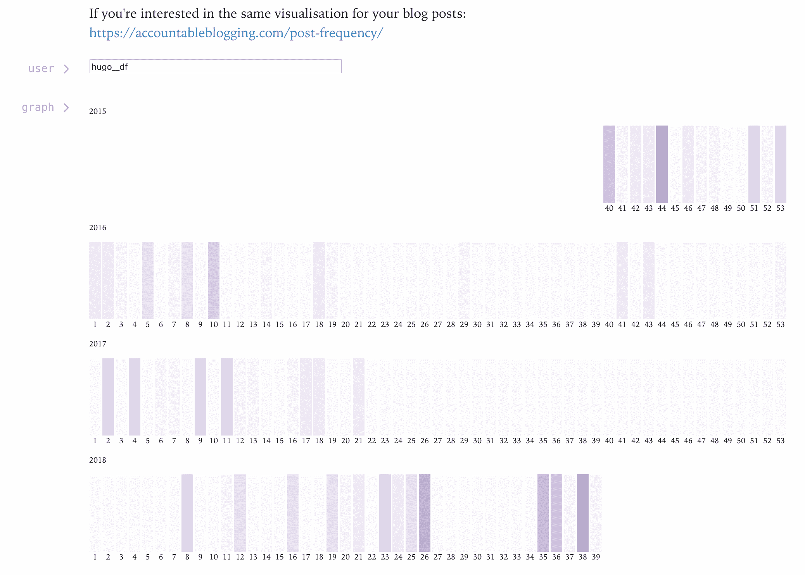

# 如何在具有 ES6 特性的 JavaScript 中使用递归来打动面试官

> 原文：<https://www.freecodecamp.org/news/how-to-impress-interviewers-by-using-recursion-in-javascript-with-es6-features-a14c763110d7/>

对于 JavaScript 面试来说，没有什么比递归更炫更有用的了。

如果你只是想对 JavaScript 中的递归印象深刻，这里有一些半真实世界(技术测试类型)的例子。

递归解决问题的简短定义(在计算机科学中)是:不要使用迭代。这通常意味着一个函数必须用同一问题的一个更小的实例来调用自己。它这样做，直到遇到一个微不足道的情况(通常在问题中定义)。

因此，递归由几个步骤组成。

在本帖中，我们将讨论:

*   ？包装顺序 HTTP 请求的递归
*   ？计算字符数

这篇文章的例子也在 [ObervableHQ](http://beta.observablehq.com/) 上，这是一个超级酷的工具，允许你构建 JavaScript 笔记本:

*   [递归包装顺序 HTTP 请求](https://beta.observablehq.com/@hugodf/recursion-to-wrap-http-requests)
*   [计算字符数](https://beta.observablehq.com/@hugodf/count-something-in-something-else)

# ？包装顺序 HTTP 请求的递归

假设您需要从一个 REST API 中获取多个页面，并且您被迫使用原生 HTTPS 模块(这里的例子是)。在这种情况下，我们将从 Reddit API 获取注释。

使用此 API:

*   如果评论多于一个响应，它将在数据中返回一个`after`字段。这可以在获取下一个注释块的请求中用作查询参数
*   如果没有更多的评论，`after`将是假的

它定义了我们的终止和递归情况。我们从 Reddit API 获取数据，然后:

*   `after`是 falsy → ****心狠手辣案**** ，返回数据
*   `after`被定义→ ****递归事例**** ，通过它获取下一页以及当前调用返回的数据

这里使用的技巧之一是从第一次传递开始将一个空的`data`数组传递给`recursiveCommentFetch`函数。这允许我们在每次递归调用时不断注入越来越多的值。我们能够在终止的情况下解析出完整的集合。

```
const fetch = require('node-fetch');
const user = 'hugo__df';
function makeRedditCommentUrl(user, queryParams) {
  return `https://www.reddit.com/user/${user}/comments.json?${
    Object.entries(queryParams)
      .filter(([k, v]) => Boolean(v))
      .map(
        ([k, v]) => `${k}=${v}`
      ).join('&')
  }`;
}
function recursiveCommentFetch(user, data = [], { after, limit = 100 } = {}) {
  const url = makeRedditCommentUrl(user, { after, limit });
  return fetch(url)
    .then(res => res.json())
    .then(res => {
      const { after, children } = res.data;
      const newData = [...data, ...children];
      if (after) {
        // recursive case, there's a way to fetch more comments
        return recurseCommentFetch(user, newData, { after });
      }
      // base or terminating case
      return newData;
    });
}
recursiveCommentFetch(user)
  .then(comments => console.log(comments));
```

我通过为 Reddit 贡献创建以下可视化(以 GitHub 的贡献图风格)来熟悉这个 API。[看到这里](https://beta.observablehq.com/@hugodf/reddit-contributions-per-week-graph)。[的博客版本也在直播](https://accountableblogging.com/post-frequency)。



# ？计算字符数

当问题是这样的:“给定一个输入，返回一个包含每个字符在输入中出现多少次的对象”时，您将使用这个方法。

这里有一个[现场演示](https://beta.observablehq.com/@hugodf/count-something-in-something-else)。

终止和递归的情况并不明显，所以这里有一些跳跃:

1.  理解一个输入可以被转换成一个字符串，这个字符串可以被`.split`成一个数组(即。大多数任意输入都可以转换成数组)。
2.  知道如何递归数组。这可能是最容易/最常见的递归方式之一。但是需要多看几次才会觉得舒服。

对于递归函数，这给了我们以下情况:

*   列表/字符数组为空→ ****终止案例**** ，返回`characterToCount`地图
*   字符列表/数组不为空→ ****递归情况**** ，通过增加/初始化当前字符的条目来更新`characterToCountMap`。用更新的映射和列表/数组的剩余部分调用递归函数。

我写了一篇更完整的帖子: [****用 ES6 在 JavaScript 中递归，析构和 rest/spread****](https://codewithhugo.com/recursion-in-javascript-with-es6-destructuring-and-rest/spread/) ，它更详细地(举例和技巧)讲述了我们如何在 ES6 JavaScript 中递归遍历列表(数组)。它解释了像`[firstCharacter, ...rest]`符号这样的东西。

```
function recurseCountCharacters(
  [firstCharacter, ...rest],
  characterToCountMap = {}
) {
  const currentCharacterCount = characterToCountMap[firstCharacter] || 0;
  const newCharacterToCountMap = {
    ...characterToCountMap,
    [firstCharacter]: currentCharacterCount + 1
  };

  if (rest.length === 0) {
    // base/terminating case
    // -> nothing characters left in the string
    return newCharacterToCountMap;
  }
  // recursive case
  return recurseCountCharacters(rest, newCharacterToCountMap);
}
function countCharacters(input) {
  return recurseCountCharacters(String(input).split(''));  
}
console.log(countCharacters(1000000));
// { "0":6, "1": 1 }
console.log(countCharacters('some sentence'));
// { "s":2,"o":1,"m":1,"e":4," ":1,"n":2,"t":1,"c":1}
```

你就是这样用递归轻松通过面试的？，绕着那些玩具问题跑圈。

面试问题的递归解决方案看起来比迭代解决方案更酷、更简洁。他们是采访者的眼中钉。

如有任何问题，可通过 Twitter [@hugo__df](https://twitter.com/hugo__df) 联系我。

在其他人之前收到本周的所有帖子:[用 Hugo 时事通讯](https://buttondown.email/hugo)编码。