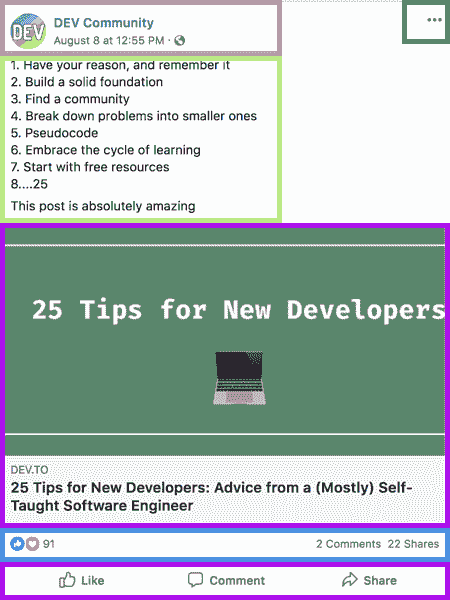
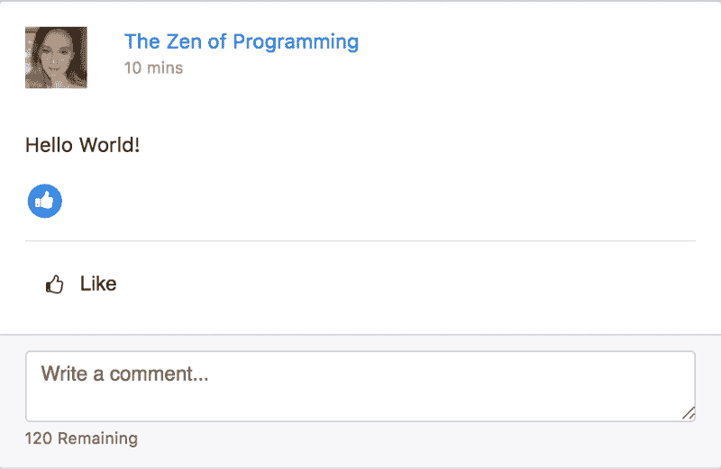
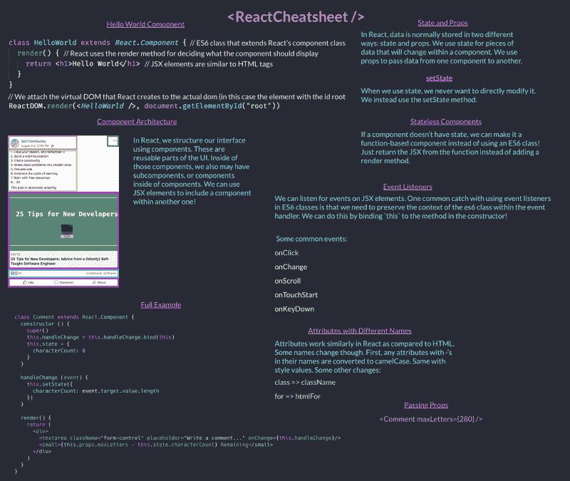

# 反应完全初学者指南

> 原文：<https://www.freecodecamp.org/news/a-complete-beginners-guide-to-react-4d490abc349c/>

作者:阿里·斯皮特尔

# 反应完全初学者指南


Photo by [Alexander Andrews](https://unsplash.com/photos/4JdvOwrVzfY?utm_source=unsplash&utm_medium=referral&utm_content=creditCopyText) on [Unsplash](https://unsplash.com/search/photos/guide?utm_source=unsplash&utm_medium=referral&utm_content=creditCopyText)

我想回去写更多的技术内容。React 是我最喜欢的技术之一，所以我想我应该创建一个 React 简介！这篇文章需要 HTML 和 JavaScript 的知识。我坚定地认为，在进入像 React 这样的库之前，您应该了解这些。

### 什么是反应

React 是脸书开发团队在 2013 年构建的 JavaScript 库。React 希望使用户界面更加模块化(或可重用)，更易于维护。根据 React 网站的说法，它被用来“构建管理自身状态的封装组件，然后将它们组合起来，制作复杂的 ui。”

我将在这篇文章中使用很多脸书的例子，因为他们首先写了 React！

还记得脸书从喜欢转向反应的时候吗？你现在可以用一颗心、一个笑脸或对任何帖子的喜欢来代替喜欢帖子。如果这些反应主要是在 HTML 中进行的，那么将所有这些喜欢的东西都变成反应并确保它们有效将是一项巨大的工作。

这就是 React 的用武之地。我们在 React 中使用了不同的架构，而不是实现“关注点分离”。这种架构基于组件的结构增加了模块性。

> 今天，我们将把 CSS 分开，但是如果你愿意，你甚至可以把那个组件具体化！

### React 与普通 JavaScript

当我们谈论“普通”JavaScript 时，我们通常是在谈论编写不使用 JQuery、React、Angular 或 Vue 等附加库的 JavaScript 代码。如果你想阅读更多关于这些和什么是框架的内容，我有一篇关于 web 框架的文章。

### 在我们开始之前，先做几个简短的说明

*   为了使本教程更加简洁，一些代码示例的前面或后面都有`...`。这意味着我们省略了一些代码。
*   我在某些地方使用 Git diffs 来显示将要更改的代码行。如果复制并粘贴，需要删除行首的`+`。
*   我有完整的代码笔，上面有每个部分的完整版本——所以你可以用它们来赶上进度！
*   对本教程不重要的更高级的概念在引号中。这些都是有趣的事实！

### 建立

如果您正在创建一个生产 React 应用程序，您将需要使用一个像 Webpack 这样的构建工具。Webpack 将捆绑您的代码，因为 React 利用了一些在浏览器中默认不工作的模式。 [Create React App](https://github.com/facebook/create-react-app) 对这些目的非常有帮助，因为它为您完成了大部分配置工作！

现在，我们将使用 React CDN，它仅用于开发目的！我们还将使用 Babel CDN，这样我们就可以使用一些非标准的 JavaScript 特性(我们将在后面详细讨论！).

```
<script crossorigin src="https://unpkg.com/react@16/umd/react.development.js"></script>
```

```
<script crossorigin src="https://unpkg.com/react-dom@16/umd/react-dom.development.js"></script>
```

```
<script src="https://cdnjs.cloudflare.com/ajax/libs/babel-core/6.1.19/browser.js">
```

我还做了一个 [Codepen 模板](https://codepen.io/aspittel/pen/gdrexE)你可以用！

在一个完整的 React 项目中，我会将组件分成不同的文件。出于学习目的，我们现在将把 JavaScript 合并到一个文件中。

### 成分

对于本教程，我们将建立一个脸书状态部件，因为脸书写了反应摆在首位！

想想这个`like`小工具在脸书出现了多少次。你可以喜欢一个状态，或者一个链接帖子，或者一个视频帖子，或者一张图片！甚至一页纸！每次脸书对类似的功能进行调整时，他们都不想在所有这些地方都这样做。所以，这就是组件的用武之地！网页的所有可重用部分都被抽象成一个组件。那个组件可以反复使用。Ee 将只需要在一个地方改变代码来更新它。

让我们看一张脸书状态的图片，并分解其中的不同组件。


状态本身将是一个组成部分。脸书时间线中有许多状态。我们肯定希望能够重用状态组件。

在该组件中，我们将拥有*子组件*或父组件中的组件。这些也将是可重复使用的。我们可以让 like 按钮组件成为`PhotoStatus`组件和`LinkStatus`组件的子组件。

也许我们的子组件看起来像这样:



我们甚至可以在子组件中包含子组件！因此，喜欢、评论和分享的群组可以是它自己的`ActionBar`组件。它会有喜欢评论和分享的组件！


根据在应用程序中重用功能的位置，有许多方法可以分解这些组件和子组件。

### 入门指南

我想以一句“Hello World”开始这个教程——毕竟这是传统！然后，我们将转向稍微复杂一点的状态示例。

在我们的 HTML 文件中，让我们只添加一个元素——一个带有 id 的`div`。按照惯例，您通常会看到 div 上有一个 id“root ”,因为它将是 React 应用程序的根！

如果你在 [CodePen 模板](https://codepen.io/aspittel/pen/gdrexE?editors=0010)中编写代码，你可以直接在`js`部分编写这个 JavaScript。如果你在你的计算机上写这个，你将不得不添加一个类型为`text/jsx`的脚本标签，所以:

```
<script type="text/jsx"><;/script>
```

现在，让我们来看看我们的反应代码！

```
class HelloWorld extends React.Component {
```

```
 render() {
```

```
 // Tells React what HTML code to render
```

```
 return <h1>Hello World</h1>
```

```
 }}
```

```
// Tells React to attach the HelloWorld component to the 'root' HTML div
```

```
ReactDOM.render(&lt;HelloWorld />, document.getElementById("root"))
```

所发生的只是“Hello World”在页面上显示为 H1！

让我们来看看这里发生了什么。

首先，我们使用从`React.Component`类继承的 ES6 类。这是我们将用于大多数 React 组件的模式。

接下来，我们的类中有一个方法——一个叫做`render`的特殊方法。React 寻找`render`方法来决定在页面上呈现什么！名字有道理。无论从那个`render`方法返回什么，都将由那个组件呈现。

在这种情况下，我们返回一个文本为“Hello World”的 H1，这正是 HTML 文件中通常会出现的内容。

最后，我们有:

```
ReactDOM.render(<HelloWorld />, document.getElementById("root"))
```

我们使用 ReactDOM 功能将 react 组件附加到 DOM。

> *React 利用了一种叫做虚拟 DOM 的东西，它是通常在普通 JavaScript 或 JQuery 中与之交互的 DOM 的虚拟表示。这个`reactDOM.render`将这个虚拟 DOM 渲染成实际的 DOM。在幕后，React 做了大量工作，以便在界面上的某些内容需要更改时有效地编辑和重新呈现 DOM。*

我们的组件，`<HelloWorld` / >，看起来像一个 HTML 标签！这个语法是 JSX 的 pa *rt* 是 JavaScript 的扩展。您不能在浏览器中直接使用它。还记得我们如何在 JavaScript 中使用 Babel 吗？Babel 会将我们的 JSX 转换成普通的 JavaScript，这样浏览器就能理解了。

> JSX 在 React 中实际上是可选的，但你会看到它在绝大多数情况下都被使用！

然后，我们使用 JavaScript 的内置`document.getElementById`来获取我们在 HTML 中创建的根元素。

总而言之，在这个`ReactDOM.render`语句中，我们将把我们的`HelloWorld`组件附加到我们在 HTML 文件中创建的`div`上。

### 起始代码

好了，现在我们已经完成了“Hello World”，我们可以开始我们的脸书组件了。

首先，我想让你玩一下这个演示。我们将在本教程的剩余部分中处理这个问题。你也可以随意看代码，但是不要担心看不懂！这就是本教程其余部分的目的！

让我们从为小部件“硬编码”HTML 开始:

添加了一些 CSS，如下所示:



这里有一个密码笔，上面有完整的启动密码。

出于本教程的目的，我们将创建四个组件:一个是父组件的`Status`组件，一个包含喜欢逻辑的`Like`组件，以及一个包含输入评论的逻辑的`Comment`组件。`Like`组件也将有一个子组件`LikeIcon`，当你切换 like 按钮时，它将显示或隐藏。

### 组件架构

让我们继续将我们编写的 HTML 代码分成这些组件。

我们将从一个组件的外壳开始，我们也将渲染它，以确保它正常工作！

> 关于上述内容，一个有趣的注意事项是，我们必须将“类”属性改为“类名”。类在 JavaScript 中已经有了意义——它是针对 ES6 类的！有些属性在 JSX 和 HTML 中的命名不同。

我们还可以删除 HTML 的内容，只留下一个 ID 为 root 的元素——父“content”div 只是用来设计样式的！

```
<body>   <div class="content">     <div id="root"></div>   </div> </body>
```

这是将要放入状态组件的 HTML。注意，一些原始的 HTML 还没有出现——它将进入我们的子组件！

让我们创建第二个组件，然后将它包含在我们的`Status`组件中。

```
class Comment extends React.Component {   render() {     return (       <div>         <textarea className="form-control" placeholder="Write a comment..." />          <small>140 Remaining</small>       </div>       )    } }
```

这是我们评论的组成部分。它有我们要输入的`textarea`,以及还有多少字符的文本。注意，两者都被包裹在一个`div`中。这是因为 React 要求我们将组件的所有内容包装在一个 HTML 标签中。如果我们没有父标签`div`，我们将返回一个`textarea`和一个`small`标签。

因此，现在我们需要将这个组件包含在我们的`Status`组件中，因为它将是我们的子组件。我们可以使用与呈现状态组件相同的 JSX 语法来做到这一点！

好了，现在我们只需要为我们喜欢的人做同样的事情:

然后我们需要将它包含在我们最初的`Status`组件中:

酷，现在我们已经反应了我们原来的 HTML，但它仍然没有做任何事情。让我们开始修复它吧！

总而言之，这一部分的代码看起来会像 [this CodePen](https://codepen.io/aspittel/pen/yxOQMe?editors=0010) 。

### 状态和道具

我们希望实现两种不同的用户交互:

*   我们希望 like 图标只在 like 按钮被按下时才显示
*   我们希望剩余的字符数随着人物的变化而减少

让我们开始研究这些吧！

### 小道具

想象一下，我们希望我们的评论框允许在不同的地方有不同数量的字母。例如，在一个状态中，我们希望允许用户写一个 200 个字母长的回复。然而，在图片上，我们只希望他们能够写出 100 个字符的回复。

React 允许我们从`PictureStatus`组件和`Status`组件传递 props(属性的缩写)来指定我们希望在响应中允许多少个字母，而不是有两个不同的注释组件。

props 的语法如下所示:

```
<Comment maxLetters={20} /> <Comment text='hello world' /> <Comment show={false} /> 
```

```
let test = 'hello world' <Comment text={test} />
```

道具看起来像 HTML 属性。如果你通过道具传递一个字符串，你不需要括号。任何其他数据类型或变量都需要放在括号内。

然后，在我们的组件中，我们可以使用我们的道具:

```
console.log(this.props.maxLetters)
```

它们被捆绑在实例的`props`属性中，因此可以用`this.props.myPropName`访问它们。

所以，让我们把硬编码的 140 个字符改成在组件外可更改！

首先，我们将改变在状态组件中实例化注释组件的位置(注意省略了一些代码):

```
class Status extends React.Component {   ...       <div className="card-footer text-muted">         <Comment maxLetters={280} />       </div>      </div>;    </div>   )  } }
```

然后，我们将在注释组件中更改硬编码的 140 个字符的限制。

```
class Comment extends React.Component {   ...     <div>      <textarea className="form-control" placeholder="Write a comment..." />     <small>{this.props.maxLetters} Remaining</small>;     </div>    ... }
```

### 状态

我们从一个组件传递到另一个组件的道具在子组件中*永远不会*改变。它们可以在父代中改变，但不能在子代中改变。但是——很多时候，在组件的生命周期中，我们会想要改变一些属性。

例如，我们希望记录用户在文本区域中输入了多少字符，并且希望跟踪状态是否是“喜欢”。我们将在组件的*状态*中存储那些我们想要改变的属性。

> 你会注意到 React 中有很多不变性——它受函数范式的影响很大，所以副作用也是不鼓励的。

每当我们创建一个组件的新实例时，我们都希望创建这个状态，所以我们将使用 ES6 类构造函数来创建它。如果你想快速更新 ES6 课程 [MDN](https://developer.mozilla.org/en-US/docs/Web/JavaScript/Reference/Classes) 是一个很好的资源！

State 将是一个对象，包含我们想要包含的任何键值对。在这种情况下，我们需要用户输入了多少字符的字符数。我们现在将它设置为零:

```
class Comment extends React.Component {     constructor () {       super()       this.state = { characterCount: 0 }     } ...
```

现在让我们从`maxLetters`道具中减去它，这样我们总是知道我们还有多少字符:

```
<small>{this.props.maxLetters - this.state.characterCount} Remaining&lt;/small>
```

如果增加`characterCount`，剩余显示的字符会减少。

但是——当你打字的时候什么也没发生！我们永远不会改变`characterCount`的值。我们需要给`textarea`添加一个事件处理程序，这样当用户输入时我们就可以改变`characterCount`。

### 事件处理程序

当您过去编写 JavaScript 时，您可能已经编写了事件处理程序来与用户输入进行交互。我们将在 React 中做同样的事情，语法会有一点不同。

我们将向我们的`textarea`添加一个`onChange`处理程序。在它的内部，我们将放置一个对事件处理方法的引用，该方法将在每次用户在`textarea`中键入内容时运行。

```
<textarea className="form-control" placeholder="Write a comment..." onChange={this.handleChange}/>
```

现在我们需要创建一个`handleChange`方法！

```
class Comment extends React.Component {     constructor () {      super()      this.state = { characterCount: 0 }     }         handleChange (event) {       console.log(event.target.value)     } ...
```

现在，我们只是在做第一步。这和 React-less JavaScript 的工作方式是一样的(尽管如果你深入一点，事件对象会有一点不同)。如果你看那个控制台，我们正在打印出我们在文本框中输入的内容。

现在我们需要更新 state 中的`characterCount`属性。在 React 中，我们*从不直接修改状态*，所以我们不能做这样的事情:`this.state.characterCount = event.target.value.length`。我们需要使用`this.setState`方法。

```
handleChange (event) {    this.setState({ characterCount: event.target.value.length }) }
```

但是！您会得到一个错误——“未捕获的类型错误:this.setState 不是一个函数”。这个错误告诉我们，需要在事件处理程序中保留 ES6 类的上下文。我们可以通过将`this`绑定到构造函数中的方法来做到这一点！如果你想了解更多，这里有一篇好文章。

```
class Comment extends React.Component {    constructor () {      super() this.handleChange = this.handleChange.bind(this) ...
```

好吧！我们快到了。我们只需要增加切换`like`显示的能力。

我们需要给我们的`Like`组件添加一个构造函数。在这个构造函数中，我们需要实例化组件的状态。在组件的生命周期中会发生变化的是状态是否被喜欢。

```
class Like extends React.Component {     constructor() {       super()       this.state = { liked: false }      } ...
```

现在，我们需要添加一个事件处理程序来更改状态是否被喜欢:

```
class Like extends React.Component {   constructor() {     super()     this.state = { liked: false }    this.toggleLike = this.toggleLike.bind(this)    } 
```

```
 toggleLike () {     this.setState(previousState => ({ liked: !previousState.liked    }))    } ...
```

这里不同的是回调函数`this.setState`接收一个参数- `previousState`。正如您可能从参数的名称中猜到的，这是调用`this.setState`之前的状态值。`setState`是异步的，所以我们不能依赖于在其中使用`this.state.liked`。

现在，我们需要:

a)每当用户单击 like 按钮时调用事件处理程序

b)仅在`liked`为真时显示 LikeIcon

厉害！现在，我们所有的功能都已就绪！

### 奖励:功能组件

如果你觉得已经力不从心了，可以跳过这一部分。我想对这个项目再做一次快速重构。如果我们创建的组件没有与之相关联的状态(我们称之为无状态组件)，我们可以将组件做成函数而不是 ES6 类。

在这种情况下，我们的`LikeIcon`可能看起来像这样:

我们只是返回组件的 UI，而不是使用`render`方法！

[这里的](https://codepen.io/aspittel/pen/NLrPWN)是实现这种重构的代码笔。

### 小抄

我喜欢备忘单，所以我用这篇文章的内容做了一个:



你也可以下载成 PDF 格式[这里](https://zen-of-programming.com/react-intro/cheatsheet.pdf)！

### 后续步骤

概括地说，我们讨论了组件架构、基本的 React 语法和 JSX、状态和属性、事件处理程序和功能组件。

如果你想查看本教程中的所有代码笔，这里的是一个集合。

如果你想尝试扩展本教程中的代码，我建议将 like 改为 reactions，或者创建一个 photo 组件来重用我们制作的一些组件！

此外，这里还有一些学习 React 的好地方:

*   [React 文档](https://facebook.github.io/react/tutorial/tutorial.html)
*   [DevCoffee](https://www.youtube.com/watch?v=ZnRFerIP8aA)
*   [韦斯·博斯冗余](https://www.youtube.com/watch?v=hmwBow1PUuo&list=PLu8EoSxDXHP5uyzEWxdlr9WQTJJIzr6jy)

### 保持联络

如果你喜欢这篇文章并想阅读更多，我有一个[每周简讯](https://tinyletter.com/ali_writes_code)，里面有我本周最喜欢的链接和我的最新文章。另外，[发推特](https://twitter.com/aspittel)告诉我你想让我写的教程，或者建设性的反馈，告诉我如何让这些更容易理解！如果您有任何问题，我的 [AMA 回购](https://github.com/aspittel/ama)是联系我的最佳地点！

*最初发表于[zen-of-programming.com](https://zen-of-programming.com/beginners-guide-react)。*