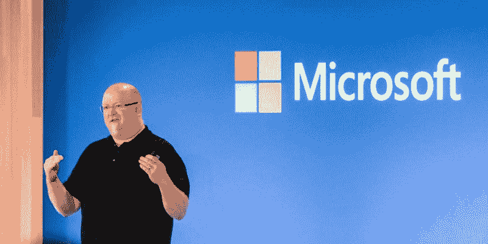

# 人工智能和物联网将如何改变行业

> 原文：<https://www.freecodecamp.org/news/how-artificial-intelligence-the-internet-of-things-will-transform-industries-f3b3fd161c01/>

作者:姚

# 人工智能和物联网将如何改变行业

#### 微软首席技术官凯文·斯科特访谈

作为我们的[人工智能促进增长高管教育系列](https://www.topbots.com/ai-for-growth)的一部分，我们采访了成功应用人工智能发展企业的领先全球公司的高管。今天，我们采访了微软首席技术官[凯文·斯科特](https://www.linkedin.com/in/jkevinscott/)。

作为微软的首席技术官，凯文推动着这家科技巨头的人工智能战略和服务。在这次采访中，他重点关注人工智能和物联网的交叉，并揭示了企业如何成功地利用这两种新兴技术的结合来驱动真正的商业价值。

他还分享了他对人工智能和自动化已经成熟的行业的访问，以及经理如何为未来最好地准备他们的劳动力的关键学习。

**姚:**大家好，我是 TOPBOTS 的玛利亚。欢迎来到我们的 AI for Growth 高管教育系列，在这里，我们采访了成功地将人工智能应用于企业问题的顶级领导者和公司。今天，我非常兴奋地邀请到微软首席技术官凯文·斯科特。

Kevin，几周前，我们在午餐时进行了一次讨论，你提到了人工智能和物联网的结合在转变企业工作流程方面的非凡影响。你能给我们的观众一种感觉吗？在这个领域，你在哪里看到了最多的机会和最大的投资回报？

凯文·斯科特:回顾过去，看看趋势，这是自 90 年代初以来计算机领域最激动人心的时代之一。有几件事情同时发生，以一种非常有趣的方式结合在一起。

其中一个趋势是物联网本身正在爆炸式增长。有各种不同来源的不同研究。Gartner 对物联网设备的研究表明，到 2020 年，我们可能会拥有超过 200 亿台设备。

这些是连接到互联网的计算设备，作为一个参考框架，我们现在可能有 110 亿或 120 亿台物联网设备。大约有 10 亿台个人电脑和 25 亿部智能手机，因此物联网领域比今天出现的最大计算平台大一个数量级。

对于我们所有人来说，这本身就是一件非常令人兴奋的事情，也是一个非常有趣的机会。

当你将这一点与硅正以越来越快的速度变得更加强大的事实结合起来时，你会想到进行人工智能模型训练和人工智能推理所需的硅类型，这种特定类型的计算能力在过去五年中的性价比可能增长了 10 倍。我们认为这一趋势线可能会在未来八年左右的时间里再出现五个数量级。

这对高端计算有着明显的影响，在未来几年里，云中会有大量的额外容量，比如构建更复杂的模型。这也意味着，在这个物联网环境中，人工智能的力量正在降临到云边缘的消费价位设备上。

考虑到这一点，以及这些物联网设备越来越多地配备传感器的事实，你真的拥有我们认为将成为新计算范式的东西。

我们称之为“智能边缘”，因为它不仅仅是计算变得无处不在并融入到您的环境中，您走进的任何房间都可能会有数十个这样的设备，每个设备都能够感知环境内部发生的事情并智能地做出反应。

这真的需要我们在思考如何构建和管理这些系统的方式上进行一系列的改变。

**MY:** 有哪些例子？你提到，当它出现在这些边缘设备上时，会有更多的人工智能应用程序出现在消费者面前。鉴于物联网设备和人工智能的激增，有哪些应用在以前可能是不可能的，但现在企业应该考虑一下。

**KS:** 你已经看到了智能音箱中这些东西的早期阶段，但我认为这只是冰山一角。

如果我们在未来几年里做好我们的工作，你会看到越来越多的应用。

其中一个有趣的是这些智能商店，它们是零售商店，它们使用物联网设备和摄像头，货架传感器和一系列计算机视觉模型中的人工智能来识别你，当你走进商店时，只需看看你放入购物车和从商店拿出的商品，你甚至不必结账。

越来越多的这种商店作为概念证明出现。这并不是说一定会有这股席卷零售业并重新定义一切的浪潮。我们都应该把它看做是一个灵感，你可以用这项新技术做一些事情。

举个例子，我妻子今年年初做了手术。我在海湾地区的一家医院的外科恢复区呆了很长时间，我注意到了所有的流程和工作流程。

当你从手术中恢复时，会发生的一件事是医生希望你有一定程度的活动，但他们想确保你不会过度活动。做完手术后，你可能会受伤。

现在，他们监视你活动的方式是他们有护士。在这家医院里，整个病房有四个人轮班，这些护士不可能密切关注每一个正在康复的病人。

但是如果你看看这些带有摄像头和计算机视觉模型的物联网设备，我们应该很容易在这个新世界中编写软件，来识别我妻子何时在公共区域走动，并且他们可以增加她的活动记录。

如果她低于她的活动水平，您可以在护士工作站或移动设备上提醒护士说，“患者 Scott 今天没有达到他们的日常规定活动水平”。或者，如果他们过于活跃，它可以发送紧急警报，立即找到这个病人，让他们回到自己的房间。

我认为现在将会有成千上万的场景可以使用这种风格的软件。现在，我们有一些技术的包装问题。我们需要做更多的工作，让更多的人更容易接触到它，但我应该说，问题或挑战的一部分是让人们想象在这个新世界里会有什么可能。

**MY:** 没错，因为当你把物联网和人工智能放在一起时，你正在谈论将两个巨大的趋势，两个高度技术性和非常难以理解的技术结合在一起，所以在企业规模上实施它肯定会有很多挑战。

根据您的经验，在实施这些人工智能+物联网应用程序时，高管可以做哪些事情来更好地准备和增加他们的成功机会？

**KS:** 我认为你能做的最大的事情就是利用一些现在正在云中出现的公共基础设施。

基本上，我们在谈论物联网，我提到的第一件事是云，但拥有云是物联网上发生的一切的协调背板。

确保你的数据在云中，你已经让自己进入一个良好的状态，你对你的数据治理感到舒适，你知道你有什么数据和没有什么数据，这将真正有助于为你将能够构建的人工智能类型提供信息。

然后，让你的组织考虑现在所有可用的人工智能工具。这些东西中的一些仍然是难以置信的精英，[但是]一些工具却变得难以置信的简单。

就像计算机视觉一样——作为微软的首席技术官，这有点自私——你可以使用我们的 Azure 认知服务 API 来做计算机视觉的事情。

我们已经为你训练了一批计算机视觉的基线模型，但是你可以带着你定制的对你来说独一无二的东西的数据来找我们，你可以把你的数据添加到我们的模型中，然后从另一端得到一个定制的模型，让你做一些事情，比如识别你的员工，朋友的脸，等等。

或者，如果你从事制造业，例如，能够识别你的库存和你在制造过程中使用的零件…让你自己意识到这些能力是什么，我认为这是目前非常重要的事情。

另一件事是考虑你的安全策略是什么。真的很重要。随着互联设备的激增，我们所有人都必须考虑的一件真正有趣的事情是，它将带来一个更有趣的安全挑战，甚至比企业面临的智能手机笔记本电脑自带设备(BYOD)问题还要有趣。您是否允许他人将智能物联网设备添加到您的企业无线网络中？

一些公司已经在通过这些智能扬声器思考这个问题。我和那些在公司网络上没有 Amazon Echoes 或智能音箱的人聊过天。这可能是一种下意识的反应，会让你失去有趣的未来可能性

MY: 随着人工智能嵌入到一切事物中，人们有一种天然的担忧，尤其是媒体加剧了这种担忧，即人工智能与物联网的结合将会扰乱劳动力，让人们失业。

我知道你已经花了很多时间来思考这个问题，而且你认为事情根本不应该是这样的。你能分享更多关于这个话题的想法和故事吗？

**KS:** 我们作为一个社会，我们作为一个技术行业，可以选择我们要走的路。技术行业正在构建这些工具和能力，行业的其余部分、政府和社会正在决定如何部署。

关于我的工作，有趣和超级有趣的事情之一是，我可以看到相当广泛的人工智能开发。

例如，在过去的一年里，我在科技领域看到的最鼓舞人心的两件事是精准医疗和精准农业的发展。例如，精准农业，我们正在进入一个智能优势的时代，比如在任何地方都有这些人工智能设备，包括能够将它们安装在无人机上，这使你能够收集更多关于农业运营的有趣数据。

几年前——这可能还是最先进的技术——如果你想为你的作物建立一个水文模型，[比如]了解田地里的湿点和干点在哪里，试图优化你输送水的方式，以确保你尽可能少地浪费水，并[确保]你得到[你的作物]需要的确切水量， 你不得不经历这种极其昂贵和乏味的工作，在你的机械灌溉系统中到处放置一堆水传感器和流量计。

你必须有相当大规模的农业经营才能做到这一点，这是一件精英的事情。

现在，你可以用一架价值 1000 美元的无人机，它相当于运行计算机视觉模型的 [Raspberry Pi](https://www.raspberrypi.org/) ,就像飞越一片田野，他们可以为那片田野建立一个相当高精度的水文模型。然后你就可以[用这些数据]优化你的灌溉。它实际上是运行在超级便宜的商品硬件上的免费人工智能。

这是人工智能的一个流程，技术正在创造丰富。它没有将权力集中到少数人手中，而是将成吨成吨的人无法接触到的东西扩大到更多人的数量级。我看到这种趋势在 R&D 农业领域全面发生，这些创新将在未来五到十年内流入经济。

同样的事情也发生在医学上，你把来自智能手表或健身带的关于人体的越来越普遍的数据结合起来，然后把这些数据与当代人工智能结合起来，比如深度神经网络，你将能够做的事情真的很不可思议，比如在病人出现症状之前几乎免费预测严重的健康状况，这比病人生病后相对更容易修复潜在的健康状况。

这些东西可能会以这种积极的方式改变世界，我们得到的世界将在很大程度上取决于我们是否在考虑人工智能。这是一种创造富足的赋权技术，还是一种集中控制的狭窄技术？

我是一个巨大的支持者，对前者的潜力非常乐观。

毫无疑问，人工智能对社会来说有着巨大的潜力，尤其是在你提到的领域，精准农业和精准医疗。

我想深入探讨人们有时会抛出的这个论点:他们会说，“好吧，现在你有了一架带人工智能的无人机来做这些水文模型，那那个工作是手工建立这些模型的人会怎么样？”

这对那些工作自动化的人来说意味着什么？你真的可以在工业应用中看到这一点，人们的工作实际上已经自动化了。

你对此有什么想法，你在分析这些不同行业自动化的真实情况时有什么经验？

**KS:** 确实有破坏发生，但我真正看到的是，如果你是华盛顿州东部的一个当地有机小农场主，我们有合作伙伴，他们完全符合这种情况，以前没有人建立水文模型。这项技术对于经营小型企业的人来说是不可及的。

你把它带到发展中国家，在那里我们真的看到一些巨大的影响正在发生。这绝对不是一个在印度农村的小农场里建立水文模型或构建人工智能来准确预测人们应该何时种植作物的人。

以前没有人做这项工作，当你应用这项技术时，你得到的只是更高的生产率和更高质量的产品，对环境的有害副作用更少。

但你是对的，有些地方会出现工作中断。我已经做了很长时间，我建立的第一个机器学习系统是在大约 15 年前，我认为我们将看到的是这些机器学习系统具有巨大的潜力，可以为人们创造机会来做更高价值的工作。

这并不是说你永久地取代了工作。通常，机器会自动完成世界上最繁琐的事情，而你能让别人自由去做的事情价值更高。

我给你最后一个例子:当我还是一名年轻的工程师时，我的第一份工作是为一家电子合同制造商工作。

这是一家位于弗吉尼亚州林奇堡的不到 20 人的公司。只有很少一部分人试图让这项业务运转起来，所以有人会在电路板上做 QA，他们会做组装，他们会做组装后测试。他们在一堆不同的事物中进行上下文切换。

我想象过在我以前的生意中使用计算机视觉来做 QA。这将有助于解决一些问题，比如这种称为红外回流焊的工艺，你完全可以在回流焊机的两端安装摄像头。[它]会在电路板进入机器之前检查电路板，当电路板从机器中出来时，[人工智能]基本上会取代人类的视觉检查。

在(我的)旧公司的背景下，它不会取消任何人的工作。这将是一件超级乏味的事情，会分散(员工)对他们更喜欢做的、能为公司创造更多价值的更高价值的事情的注意力。

人工智能的问题是——我认为这是人们的误解——它不会成为这种类似上帝、类似人类的东西，来取代人类和经济的需要。这种东西可以进来，让一堆乏味的工作变得单调乏味……我的意思是成千上万的任务消失了。人工智能应用程序有一条超级长的尾巴，人们将会像几十年前当个人电脑变得无处不在时人们构建成千上万的应用程序一样来构建它们。

他们建造的东西，就像将会有一整个产业在建筑之外被创造出来，这将会创造出无数的就业机会。他们正在自动化的东西将会减轻人们做一大堆单调乏味的工作的负担，这样他们就可以找到更高价值的事情，而这些事情是人类所独有的

MY: 非常感谢你的例子。凯文，我喜欢这个乏味的事情的个人故事，你会喜欢用人工智能和物联网来解决它，所以我真的很欣赏这种积极的态度。当我们考虑可以为我们自己、我们的公司和我们的社会构建的人工智能应用程序时，我们肯定需要更多这样的东西。

凯文，非常感谢你参加“人工智能促进增长”高管教育系列。非常感谢你的评论。

### 喜欢你刚刚读的吗？

嗯，不要就此打住！加入 [TOPBOTS](https://www.topbots.com) 社区，我们将确保您获得关于应用人工智能、机器学习和自动化的最佳内容。

*最初发布于 2018 年 6 月 25 日[www.topbots.com](http://bit.ly/2KrBwf1)。*