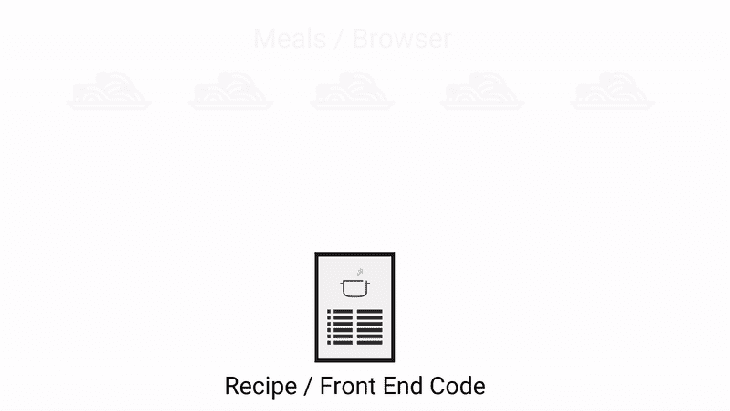
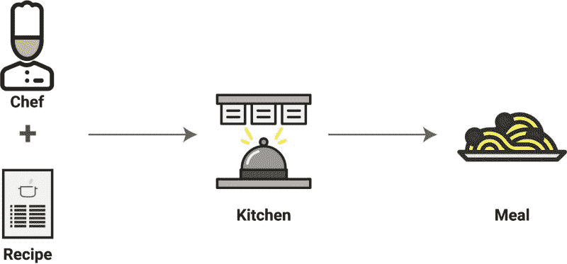
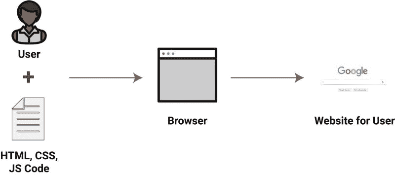
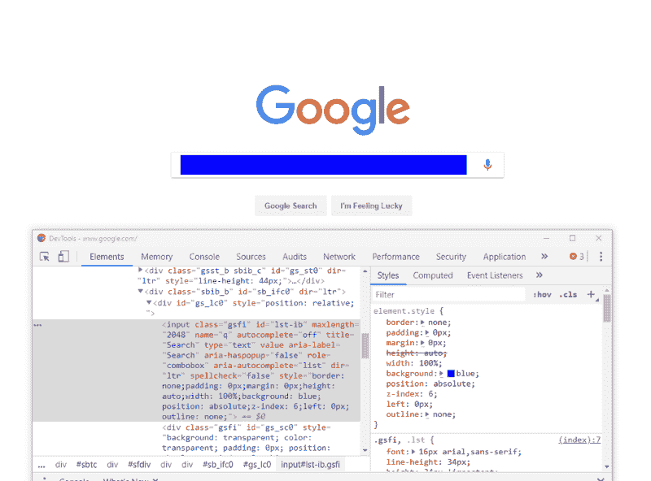
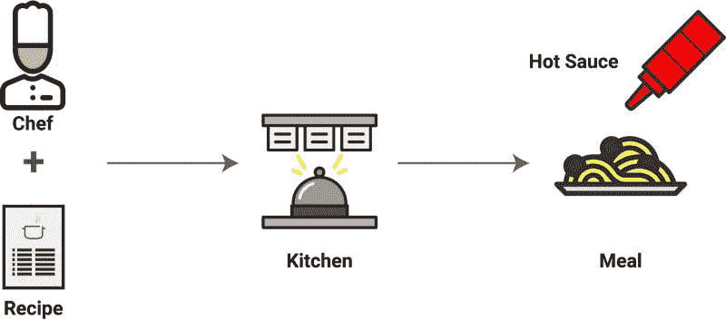
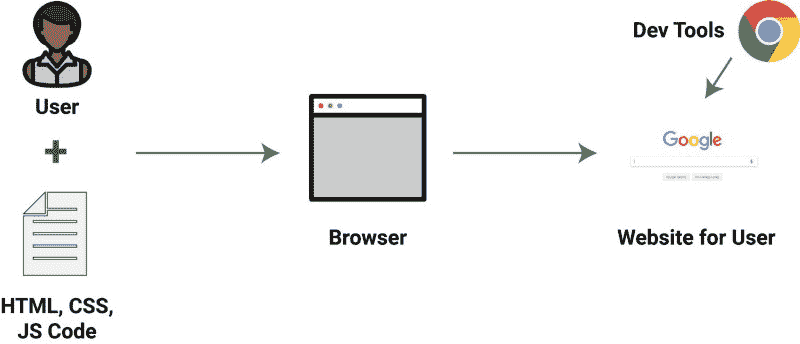
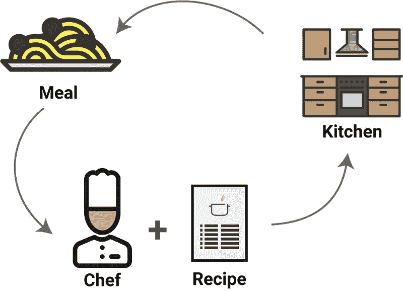
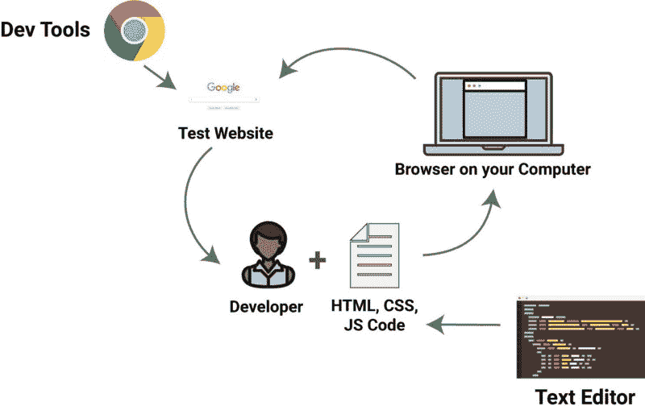
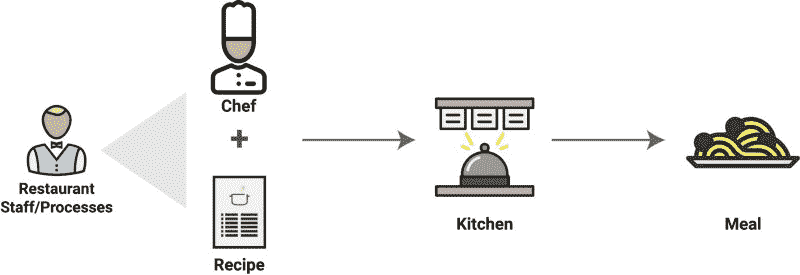

# 通过培训成为厨师来解释浏览器开发工具

> 原文：<https://www.freecodecamp.org/news/browser-developer-tools-explained-by-training-to-become-a-chef-edfaa82b740c/>

凯文·科诺年科

# 通过培训成为厨师来解释浏览器开发工具

如果你曾经去过一个餐馆，这个指南将帮助你理解 Chrome Dev Tools 这样的开发工具和 Sublime Text 这样的文本编辑器是如何工作的。

当你用 HTML 和 CSS 构建你的第一个网站时，你很容易被部署一个基本网站所需的所有新技术淹没。

托管服务？

文字编辑？

[文件目录](https://blog.codeanalogies.com/2018/06/24/file-directories-explained-by-getting-dressed-in-the-morning/)？

所有这些技术都超越了你可能在像 [freeCodeCamp](http://freecodecamp.com/) 和 [Codecademy](http://codecademy.com/) 这样的网站上尝试过的教程！

因此，我认为一个关于使用文本编辑器和开发工具的快速教程可以消除这个过程中的一个混乱部分。

事实上，所有这些都非常类似于餐馆厨师为顾客准备新饭菜的方式。想想食谱的概念。菜谱是一套特定的说明和配料，可以反复制作完全相同的饭菜。正如你将要看到的，开发一个新食谱的过程有点像用 HTML 和 CSS 建立一个网站。

为了理解这个教程，你只需要知道 HTML 和 CSS 的基础知识。让我们开始吧。

#### 比较配方和前端代码

我们来思考一下做厨师的根本目标。你的目标是将菜谱翻译成美味的食物给顾客。当然，当你考虑到所有需要同时处理的因素时，这就变得很困难了:新订单、不同的时间等等。但是让我们暂时忘记这一点。

这是一个餐厅系统可能的样子。

1.  一位厨师制定了一份每晚都会在餐厅使用的食谱。可以被厨房的工作人员一遍又一遍的复制，变成每晚一样的饭菜。
2.  厨房工作人员按照食谱上的说明做
3.  最终的产品是饭菜(这种情况下看起来像意大利面和肉丸，这是什么厨师？)

类似地，当你在建立一个网站时，你必须编写能被浏览器解释的代码，这样完全相同的网站才能为世界各地的访问者提供服务。

1.  你使用 HTML，CSS 和 JavaScript 编写代码，将产生一个完整的网页
2.  浏览器解释该代码并将其转换成 GUI(图形用户界面)
3.  网站访问者体验网站(例如，Google.com)

每次你访问一个特定的网站被称为一个“**会话**”。每次你在一个新的**域名**(比如 Google.com 或 Facebook.com)上打开一个页面，一个新的会话就开始了，一直持续到你离开这个域名。因此，一个人可以在一个会话中访问多个页面。这个会议有点像去餐馆。

#### 那么，什么是开发工具呢？

开发工具允许你检查一个网站的底层代码，并对其进行处理。如果你使用 Chrome 网络浏览器，那么你可以使用 [Chrome 开发工具](https://developers.google.com/web/tools/chrome-devtools/)。只需右键单击页面上的任意位置，然后选择菜单上的最后一个选项“检查”。

开发工具允许您在单个会话中操作页面的样式、结构和 JavaScript。但是，如果您刷新页面并开始新的会话，这些更改将不会持续。

在本例中，我将**输入**元素的背景色改为蓝色。相当无聊的东西。你可以去任何其他网站做同样的事情。当然，这些变化不会持续到你的个人会话之后。

这有点像是在餐馆里的那个人，拿了一顿美味的饭菜…然后把辣酱放在上面。因为你是那种喜欢什么都加辣酱的人。？

你对辣酱的喜爱不会对食谱本身产生任何影响。它不会对当晚供应的其他类似饭菜产生影响。而且，如果你去另一家餐馆，你将不得不再次要求辣酱。

同样，您可以使用开发人员工具来处理另一个领域中的代码，但是除了该领域中的特定会话之外，它不会产生任何影响。

#### 在建立你的第一个网站时使用开发工具

作为厨师，你的工作是想出能让顾客喜欢的食物的食谱。但是，你**可能**不想通过发明一个食谱，把它交给厨房工作人员，然后知道顾客是否喜欢它来弄清楚这个问题。

相反，你可能想在你自己的厨房里试验一堆食谱，然后发布一个看起来味道最好的。

这消除了与厨房工作人员一起工作和生产大量食物的所有复杂性。你同时扮演着厨师和顾客的角色。

请注意，在这种情况下，您可以控制配方和最终产品。因此，你可以制作食谱的一部分，然后以不同的方式组合配料，而不是把一顿饭推给顾客。然后，你可以随时调整食谱，以反映正在起作用的组合。

当你建立你的第一个网站时，你也应该使用原始代码和开发者工具在你的笔记本电脑或台式机上调整你的网站。

文本编辑器(如 Sublime Text、Vim 或 Emacs)是允许您更改原始配方(HTML、CSS 和 JavaScript 文件)的工具。

然而，当您实时调整浏览器时，您可能不希望每次都更改“配方”、保存文件并重新加载页面。累死了！

相反，您可以通过使用开发人员工具进行更改来缩短反馈周期，然后在您创建了一些值得保存在浏览器本身中的内容后调整“配方”。

请记住，如果您使用开发人员工具构建了一些有价值的东西，但随后刷新页面，您的更改将会消失。即使该文件驻留在您的本地计算机上。

#### 开发者工具只适用于前端

当然，一家餐厅同时有许多支持厨师的流程。有人在门口迎接你，服务员，清洁工，酒保等等。

这些人不参与将食谱转化为食物，但仍然帮助经营餐馆。

这有点像服务器端代码，或者后端代码。尽管您也可以使用文本编辑器编写服务器端代码，但是您不能通过开发人员工具进行任何更改。

这是为什么呢？嗯，你能想象如果个人顾客被允许像改变他们的食物一样改变餐馆的规则吗？这太疯狂了！顾客无法改变餐馆的经营方式，不管他们多么想改变。

开发者工具只允许你调整 HTML，CSS，JavaScript。它们不会暴露服务器端代码，因为这将允许任何人识别 web 应用程序中存在的任何安全漏洞。但是，服务器端代码也是在文本编辑器中编写的。

如果你想第一次学习更多关于设置服务器端代码的知识，请查看我的关于本地主机概念的指南。

#### 获取最新教程

你喜欢这个教程吗？给它“鼓掌”？或者在这里注册以获得关于 web 开发主题的最新可视化教程。