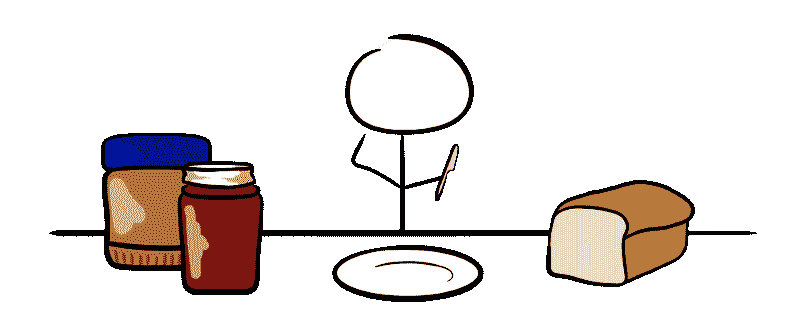

# 如何建立一个短的反馈循环作为独奏编码器

> 原文：<https://www.freecodecamp.org/news/how-to-set-up-a-short-feedback-loop-as-a-solo-coder-67709cba21e0/>

在过去的几年里，我一直是一名独立的自由开发者。将这种经历与以前在公司工作的经历相比较，我注意到我们这些单独工作的人比团队工作的开发人员有更少的迭代改进机会。

为了有机会改进，我们需要接受短反馈循环的概念。这是一个在很短的时间内不断地从观察和以前的经验中吸收新知识的过程。这个过程必须由大多数独自工作的人**制造**，而不是像通常情况那样，当你加入一个团队时**采用**。

在这篇文章中，我希望分享我所学到的如何让自己作为一名独立程序员快速而持续地提高。

### 关于反馈循环

美国空军上校约翰·伯伊德提出了 OODA 循环(T1)的概念，OODA 是 T2 观察、定位、决定、行动(T3)的缩写。在军事行动中，这说明了一个基于不断吸收新信息的决策过程:

**观察:**获取展开情况和当前环境的原始信息。

**Orient:** 将原始观察放入上下文中。考虑与当前形势和以前获得的知识和专业技能的相关性。

决定:为你的目标制定一个计划。

**行动:**执行计划。

因为这是一个循环，所以**行为**阶段直接返回到**观察**阶段。这是关键的“反馈”概念，使得迭代越来越成功。它广泛应用于军事行动之外——你可能认为它是 [PDCA](https://en.wikipedia.org/wiki/PDCA) (计划-执行-检查-行动)方法的起源。

我喜欢 OODA 循环，因为它是一般反馈循环的简洁说明。许多概念和工作方法建立在反馈循环的思想上，包括 [DevOps](https://en.wikipedia.org/wiki/DevOps) 和[敏捷软件开发](https://en.wikipedia.org/wiki/Agile_software_development)方法。

### 开发团队反馈循环

让我们看看团队中开发人员的反馈循环的一些组成部分可能是什么样子的:

1.  来自产品所有者的指示或来自用户的评论
2.  整个团队的日常争吵/站立
3.  与开发团队一起确定优先级
4.  单独编码和测试
5.  同行代码审查
6.  部署和性能监控

这些步骤隐含着员工和管理层的支持，换句话说，就是要有人负责。一个独立的自由开发者如何创造一个类似的负责任的环境？

### Solo 开发者反馈循环

个人自由开发者可以采取以下步骤来创建一个简短的反馈循环:

1.  建立纪律
2.  阐明具体的顶层目标
3.  优先考虑和计划中级和低级目标
4.  自动化您的工作
5.  划出代码评审的时间
6.  留出时间进行流程评审
7.  根据您的评估结果更新您的目标和流程

我将在下面详细介绍每个阶段。

#### 建立纪律

与其说是一个阶段，不如说是一个先决条件，建立纪律才是让我们的短反馈回路发挥作用的原因。除非我们有能力做我们不想做的事情，否则这篇文章中的其他内容都不会有帮助。纪律无疑是一种技能。它可以像其他任何东西一样被学习、训练和改进。

为什么纪律如此重要？因为当我们在周五晚上努力完成一个项目时，我们不会想要写一个好的提交消息。我们不想清理代码注释。我们只是想看到这该死的东西消失，*你好，git push -f* 。

正是在这些时刻，纪律使我们不会错过实践、学习和改进工作流程的机会。纪律有助于我们避免周五晚上的事情变成周一早上的事情。

#### 阐明具体的顶层目标

无论是为客户工作还是开发我们自己最好的新应用程序，如果没有可衡量的东西，我们将无法衡量任何进展或改进。

当我和客户讨论一个新项目时，我总是谈论具体的成就。这可以采取在某个日期前完成某个特定特性的形式，或者决定 MVP 对用户来说是什么样子。这对我和我的委托人都有好处。通过以书面形式约定**将实现什么**以及**何时**，我和我的客户已经清楚地定义了顶级目标，并且都可以评估项目进展如何。

当我为自己工作时，我会像对待客户一样对待自己。我以书面形式做出承诺，描述将要实现的目标和时间。这可以是简单的一周目标清单，也可以是详细的看板。

然而，有一个具体目标的要点是不要不惜一切代价去坚持它。为我们自己和我们的客户设定一个期望是很重要的，在项目过程中，目标将在双方同意的日期被重新审视。这使得循环中最重要的“反馈”部分成为可能。

#### 优先考虑和计划中级和低级目标

很少有目标是一步到位的。甚至制作花生酱和果冻三明治的简单过程(一个最受欢迎的计算机编程教学例子)也可以被分解成更小、更精确的指令。虽然我们人类可能不需要计算机程序那样的粒度，但被分成时间框、可实现的步骤的目标更容易理解。？

从中级目标开始，将每一步具体化。例如，如果目标是发布一个新的开源 web 应用程序，步骤可能是这样的:

1.  完整的应用 JavaScript
2.  创建前端和样式表
3.  做局部测试
4.  设置云服务器
5.  将应用部署到云
6.  做测试
7.  将存储库添加到 GitHub
8.  黑客新闻上的帖子
9.  利润！！！

上面的每个例子都包含了许多更小的、低层次的目标——我们可以把它们看作是我们的待办事项。例如，“设置云服务器”可能涉及:

1.  研究云提供商
2.  决定服务并注册
3.  设置服务器/实例
4.  添加集成
5.  测试部署

我们的块大小参数和“步骤”的构成可能互不相同，并且可能会因项目而异。如果你的中级和低级步骤清楚地定义了实现你设定的高级目标的具体路径，那么你就处于良好的状态。稍后，评估将我们带到这些中级和低级目标的决策过程，使我们能够将我们的反馈循环完整。

#### 自动化您的工作

我最近读了一篇很棒的文章，标题是[手工工作是一个 Bug](https://queue.acm.org/detail.cfm?id=3197520) 。它讨论了成功的开发人员记录并最终自动化他们的工作的过程。这个想法的美妙之处在于它的简单。通过写下我们手动做的事情，我们能够纠正和改进我们的流程。通过细化我们的过程，我们可以更容易地将它们翻译成代码片段和脚本。有了一组可以串在一起的脚本，我们就可以自动化我们的工作。

自动化工作不仅仅是为了节省时间。它减少了“还没喝咖啡”的错误，最小化了认知负荷，允许更多的创造性空间，并允许我们的过程在合作者和项目之间可重复。它有助于缩短我们的反馈循环，确保我们不会以三种不同的方式做同样的事情三次。

我们可以通过建立自己的个人维基来开始自动化。如果我们养成了写下我们所做的每一件手工事情的习惯，不管它在当时看起来有多基础，我们会给自己更多的机会去发现模式，从而发现可能的集成和改进。

第一次手动做某件事的时候，我们会写出步骤。第二次，我们按照步骤。这给了我们一个机会，根据我们第一次学到的知识来修正和提炼它们。

在连续的迭代中，我们可能会用变量替换部分手动命令。我们可能会找到一些方便的 bash 脚本片段，它们只自动化了我们任务的一部分。只要我们不断修改和改进我们的个人维基，我们就在向自动化迈进。

#### 划出代码评审的时间

当我们单独工作时，很容易犯混乱的代码。我们想，谁会去看呢？我过会儿会修理它。每次发生这种情况，我们都会养成一种习惯。这是一个坏消息。

独自工作意味着当我们做一些没有意义或者可以改进的事情时，没有人会对我们的提交给出反馈。相反，我们必须积极寻找改进的机会。开源社区在这方面令人惊叹。我们可以从编码风格、重构代码的例子和代码片段的大杂烩中获得丰富的信息，这些代码片段用更少的代码行实现了我们曾经尝试要做的事情。我们可以随心所欲地学习，只要我们挤出时间去做。

将您自己的代码评审安排在对您和您正在进行的项目有意义的时间。这可能是每次你完成一个修复或功能，或定期每天或每周。如果你有可以帮忙的人，那就预定他们。也有满是乐意帮忙的人的聊天室。

对你正在从事的工作做一些基本的最佳实践的研究。不过，给自己设定一个时间限制，对你读到的东西要有所保留。那块地里有许多兔子洞。作为起点，我建议学习一下干代码，看看[鲍勃大叔要求软件开发的专业性](https://www.youtube.com/watch?v=p0O1VVqRSK0&feature=youtu.be&t=330)。

#### 代码审查清单

这是我的个人代码审查清单，基于一些通用的最佳实践。请随意将它作为您自己的起点！

> ***维多利亚的代码审查大汇演！***

> *- [ ]这解决了一个高优先级项目。*
> *- [ ]这是一个遵循规范的完整实现。*
> *- [ ]离题变更未包含在内，已添加到待办事项中。*
> *-【】变量名有意义，没有幻数。*
> *- [ ]一有机会就返回正确有用的错误信息。*
> *-【无调试】打印报表。*
> *- [ ]这个代码是干的，模块化的。*
> *-【本码安全】。私有代码和公共代码是分开的。*
> *- [ ]这段代码是自己的文档，或者是最新的文档。*
> *- [ ]一个五岁的孩子能跟得上这个，当真就那么可读。*
> *-【单元测试成功通过】。*
> *-【Master】被合并到分支测试。*
> *- [ ]格式遵循样式准则。*
> *- [ ]我找不到任何进一步的边缘案例或已知缺陷。*
> *- [ ]如果这段代码被公开归功于我，我会很高兴。*
> *- [ ]我完全理解代码的作用以及我所做的更改的影响。*
> - *【我实际验证了它确实做到了我说的那样。*

[这里有一个很好的例子](https://dev.to/gonedark/writing-clean-code),用以上几点来清理代码。

#### 留出时间进行流程评审

正如我们从审查我们的代码中学习一样，我们也通过审查它们来精炼我们的过程。在整个项目中定期进行过程评审是最有益的，而不仅仅是在项目完成之后。

对于短期项目，安排过程评审的一个好的起点是在每个半标记处——中途一次，完成后再一次。长期项目可能在每个季度都有评审。

#### 流程评审问题

流程评审可以简单到一个简短的问题列表:

1.  我在此期间的最高目标是什么？我见过他们吗？
2.  在此期间，我的中级和低级目标是什么？我见过他们吗？
3.  如果有不同的或更具体的目标，我会得到更好的服务吗？为什么？
4.  我是否成功移除或自动化了障碍？
5.  我坚持我的代码审查计划了吗？为什么或为什么不？
6.  下次我该如何消除障碍？

为我们的过程评审留出专门的时间可以帮助我们深思熟虑地、诚实地回答这些问题。这使我们能够从我们的回顾中挤出每一点可以学到的东西，帮助缩短我们的反馈循环。

#### 根据您的评估结果更新您的目标和流程

如果我们不付诸实践，世界上所有的性能数据对我们都没有好处。随着每一次后续的代码审查，我们可以细化并添加到我们的清单中。利用我们从每次过程评审中所学到的东西，我们可以微调和改进我们的过程。我们越能发明具体的、可观察的方法来实施我们的学习，我们就越能成功。

有意识地努力利用和实践我们所学的东西是我们反馈循环的最后一个重要组成部分。我们吸收新知识的次数越多，我们的循环就变得越短，从而让我们提高得更快。