# 如何激活你的 Bash 终端——带图片的逐步指南

> 原文：<https://www.freecodecamp.org/news/lolcat-colorls-catpix-and-other-ruby-gems-to-add-color-to-your-terminal-16f4d9499ac7/>

作者 rajaraodv


在这篇博客中，我将详细介绍添加主题、电力线、字体和电力线-gitstatus 的步骤，以使您的常规 Bash 终端看起来美观实用，如上图所示。

事实证明，如果你使用的是 Mac，你需要经历很多困难才能让它工作，因为很多指令是针对 linux 的，或者已经过时了。所以我想我应该把它写在博客上——希望对你有所帮助。

> 备注:
> 
> 1。小心地遵循这些步骤，因为任何错误都会引起很多麻烦。
> 2
> 。这是为了 MacOS 和 Terminal.app 中的常规 bash。我在这个博客中没有使用 ZSH 或 Hyper 我计划为他们写不同的博客。
> 
> 3。我的版本:Mac 高塞拉；git 版本 2.14.3(苹果 Git-98)；Python 2.7.10

好的，默认情况下，当你有了新的 mac，你的 Terminal.app 看起来会像下面这样。让我们继续添加主题、字体等等。

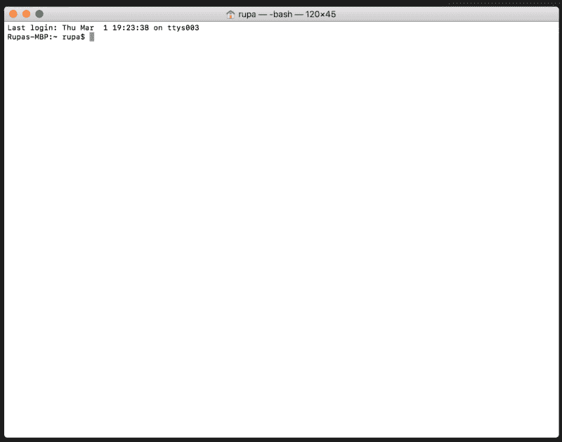

### 步骤 1 —添加新主题

第一个明显的步骤是增强主题。终端没有提供你看到的其他开发者使用的所有酷的和花哨的主题。让我们下载一个主题并将其添加到终端。

在这个博客中，我将添加曝光-黑暗主题到我们的终端。

> 注意:可以下载各种主题(。终端文件)从[这个 git 回购](https://github.com/lysyi3m/osx-terminal-themes/tree/master/schemes)。只需打开`**.terminal*`文件进行安装，即`*right-click on the *.terminal file > “open with" > Te*`终端

1.  前往[http://ethanschoonover.com/solarized](http://ethanschoonover.com/solarized)
2.  向下滚动并下载主题(solarized.zip)
3.  提取 Solaris 化的. zip 文件
4.  打开**OS x-terminal . app-colors-solarized**文件夹。该文件夹包含终端的主题。
5.  双击 ***“日晒黑暗 ansi . Terminal”***文件 **—** 这是 Terminal.app 的特定主题文件*注意:如果你得到一个警告，说这是来自一个身份不明的开发者，右击该文件，选择“打开方式”>终端选项*打开。
6.  此时，您已经将主题安装到了终端中。我们只需要让它成为默认主题。
7.  打开“终端”>“偏好设置”>“文本”,选择“晒暗”主题，点击“默认”。

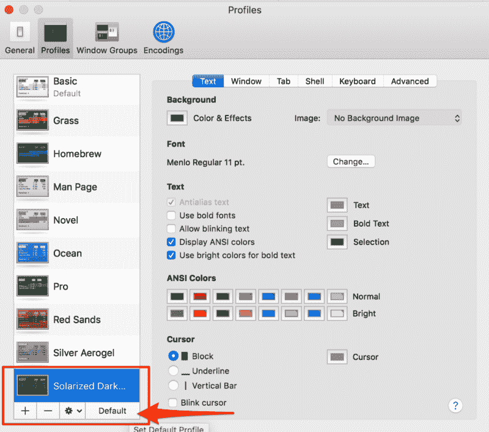

从现在开始，你的终端应该像下面这样。

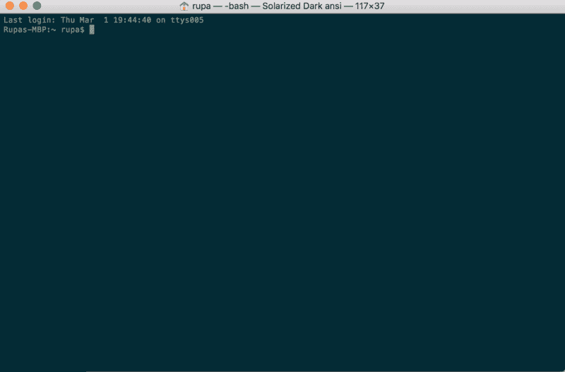

### 步骤 2 —安装电力线

Powerline 是一个 Python 应用程序，是 vim 的状态行插件，为其他几个应用程序提供状态行和提示，包括 zsh、bash、tmux、IPython、Awesome 和 Qtile。

它使得终端提示符如下所示。

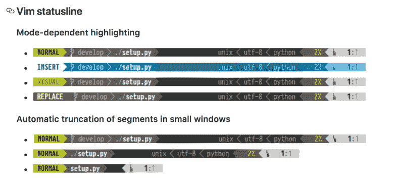

#### 2.1 安装 Python

因为 Powerline 是一个 Python 应用程序，所以我们需要 Python，这也是一个合适的 Python 版本。

*   MacOS 已经安装了 Python。**在终端输入** `python -V`确保 Python 的版本是 2.7.x。
*   如果不是 2.7，安装[家酿](https://brew.sh/)，它允许我们从命令行界面安装各种软件，通过运行:`/usr/bin/ruby -e "$(curl -fsSL https://raw.githubusercontent.com/Homebrew/install/master/install)"`
*   运行`brew install python`通过自制软件安装最新的 Python

#### 2.2 安装 pip—Python 的包管理器(类似于 npm)

通过运行以下命令安装 pip

`$ sudo easy_install pip`

#### 2.3 安装 XCode 开发者 CLI 工具

XCode 开发者 CLI 工具由电力线和其他操作核心 OSX 功能的应用程序使用。因此，请确保通过运行以下命令安装 XCode CLI 工具。

`$ xcode-select —-install`

> 注意:上面的命令会打开 Mac 的安装程序并安装 XCode 开发者 CLI 工具。如果不行，尝试`*xcode-select -r*`复位。

#### 2.4 安装电源线

最后，通过运行以下命令，通过 pip 安装电力线(稳定版本)。

```
$ pip install --user powerline-status
```

如果您想安装最新的开发分支，那么使用:

```
$ pip install --user git+git://github.com/powerline/powerline  //dev
```

#### 2.5 向 bash 添加电力线守护进程

我们现在需要向 bash 添加电力线守护进程，以便它可以监视终端提示符并做出更改。

**2.5.1 复制电源线的安装位置**

您可以通过运行以下命令来确定电力线的位置:`pip show powerline-status`从`Location`字段中复制值。


2.5.2 在适当的位置添加守护进程。bash_profile

1.  确保您的根目录中有`.bash_profile`文件。如果没有，通过做来创建一个:`cd ~ && touch ~/.bash_profile`

2.打开`.bash_profile`并添加以下内容:

```
export PATH=$PATH:$HOME/Library/Python/2.7/bin
powerline-daemon -q
POWERLINE_BASH_CONTINUATION=1
POWERLINE_BASH_SELECT=1
. /Users/rupa/Library/Python/2.7/lib/python/site-packages/powerline/bindings/bash/powerline.sh
```


Some details about bash_profile

> *注意:位置/Users/rupa/Library/Python/2.7/lib/Python/site-packages/来自上一步(2.5.1)。将其更改为与您的电脑位置相匹配。*

2.5.3。重启终端

如果终端已打开，请完全退出(“终端”>“退出终端”)。然后再打开。

> 您应该能够简单地使用`*$ source ~/.bash_profile*`来更新设置。但是我得到的一些古怪的`*powerline-config*`文件不见了！通常，如果您的路径中没有$HOME/Library/Python/2.7/bin，就会出现这个错误。

**2.5.4 您的新终端**

您的新终端应该如下所示。它应该使用“日晒黑暗 ansi”主题，并应显示在命令提示符电力线。但是也要注意有“？”人物！这是因为电力线使用了默认情况下不可用的各种图标和字体。所以我们需要安装字体。

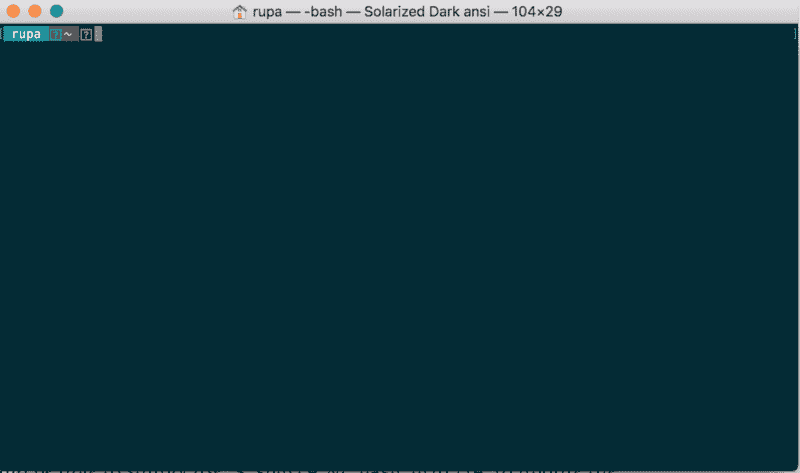

### 步骤 3 —安装电力线字体

要安装电力线字体，只需前往[https://github.com/powerline/fonts](https://github.com/powerline/fonts)。在那里你会看到一大堆文件夹。每一种都是一种字体，又名“补丁字体”。

> 它被称为“修补字体”,因为人们已经采用了常规字体，并添加/修补了额外的电力线特定图标和字体。

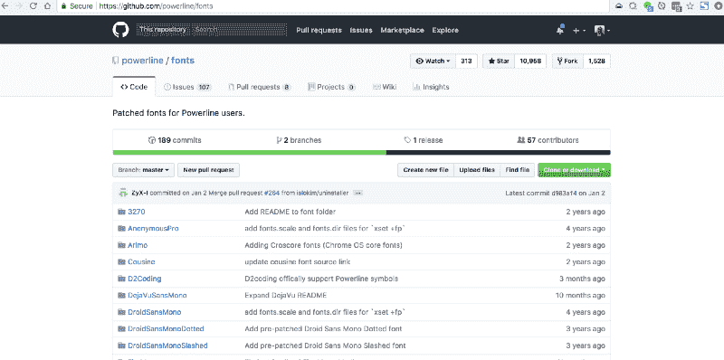

#### 3.1 下载整个回购并解压

*   点击“克隆或下载”按钮，下载整个回购，这样你就可以尝试各种字体。
*   解压字体-master.zip

#### 3.2 安装一些字体

让我们打开 **Meslo 点状**字体**T3 文件夹。它将看起来像下面。你会看到一大堆。ttf 文件。它们中的每一个都是字体，但有些是“粗体”版本的字体，有些是“常规”版本的字体等等。**

只需双击。ttf 文件，然后按“安装字体”将字体安装到您的计算机上。

对于我们的例子，让我们安装“mes lo LG L DZ Regular for power line . TTF”和“mes lo LG L DZ Italic for power line . TTF”。这将增加一个 ***常规*** 和一个*斜体版本的 ***Meslo*** 字体。*

*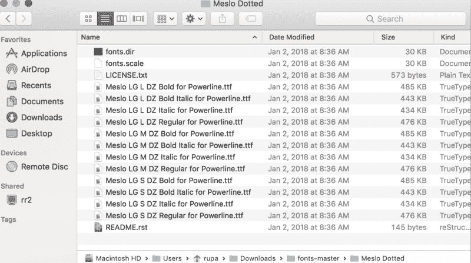*

#### *3.3 选择终端主题中的字体*

*还记得我们在第一步中添加的“日晒黑暗”主题吗？里面没有任何字体，MacOS 有一些默认字体。我们所需要做的就是为这个主题设置我们的 **Meslo dotted** 字体，我们就完成了！*

1.  *打开终端>偏好设置>文本*
2.  *选择**曝光深色 ansi** 主题*
3.  *点击“字体”按钮，这将打开“字体”对话框*
4.  *在“字体”对话框中，选择系列中的“Meslo LG L DZ for Powerline”，并选择字体大小 14(这样更容易阅读)。*

*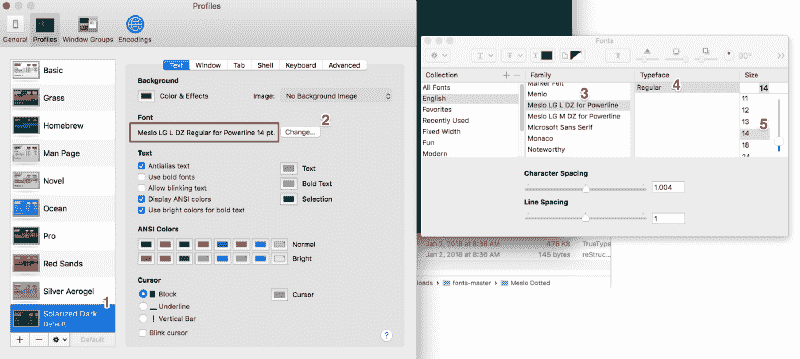*

#### *3.4 重启终端*

*完全退出终端(“终端”>“退出终端”)，然后重新打开它。*

*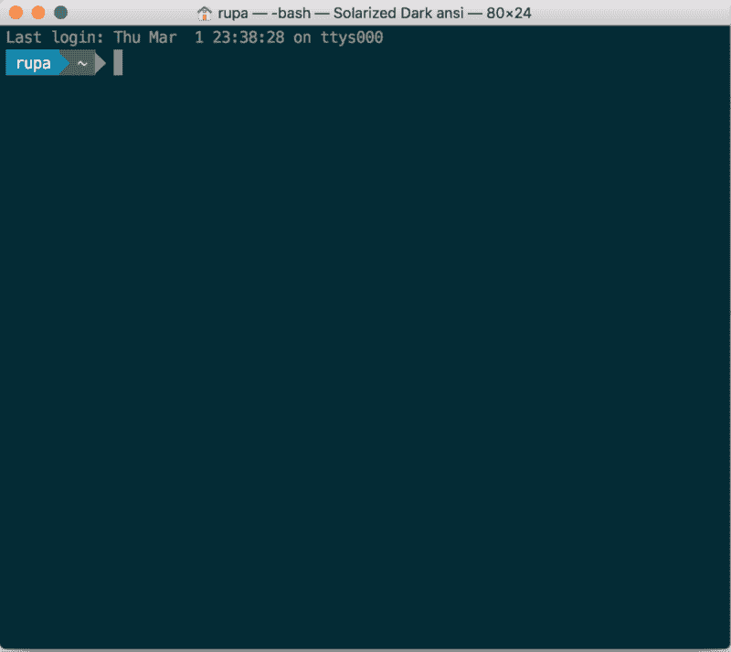*

### *步骤 4 —将 Git 信息添加到提示中*

*为了在提示符下显示各种 Git 状态，我们需要安装 [powerline-gitstatus](https://github.com/jaspernbrouwer/powerline-gitstatus) 。它是 Powerline 的一个简单附件，添加了多种颜色和主题来显示各种 git 状态信息。*

*

PS: We will be dealing with files in the “color schemes” and “themes” folders* 

#### *4.1 安装电力线-gitstatus*

```
*`pip install --user powerline-gitstatus`*
```

> *注意:在用户的配置文件中安装它需要“— user”命令。*

#### *4.2 向电力线添加电力线-gitstatus 配色方案*

*4.2.1 打开以下`colorschemes/shell/default.json`文件夹*

```
*`${powerline-install-directory}/powerline/config_files/colorschemes/shell/default.json

//For example:
/Users/rupa/Library/Python/2.7/lib/python/site-packages/powerline/config_files/colorschemes/shell/default.json`*
```

*4.2.2 添加以下颜色:*

*如电力线-gitstatus [自述](https://github.com/jaspernbrouwer/powerline-gitstatus#installation)中所述。PS:复制“groups”里面的颜色，然后追加到 default.json，如下所示。*

*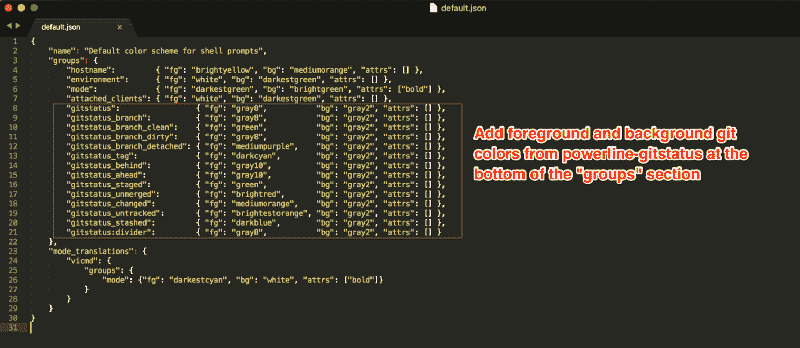

Click to zoom* 

*以下是我的配色方案 default.json(你可以复制并粘贴它):*

```
*`{
	"name": "Default color scheme for shell prompts",
	"groups": {
		"hostname": {
			"fg": "brightyellow",
			"bg": "mediumorange",
			"attrs": []
		},
		"environment": {
			"fg": "white",
			"bg": "darkestgreen",
			"attrs": []
		},
		"mode": {
			"fg": "darkestgreen",
			"bg": "brightgreen",
			"attrs": ["bold"]
		},
		"attached_clients": {
			"fg": "white",
			"bg": "darkestgreen",
			"attrs": []
		},

		"gitstatus": {
			"fg": "gray8",
			"bg": "gray2",
			"attrs": []
		},
		"gitstatus_branch": {
			"fg": "gray8",
			"bg": "gray2",
			"attrs": []
		},
		"gitstatus_branch_clean": {
			"fg": "green",
			"bg": "gray2",
			"attrs": []
		},
		"gitstatus_branch_dirty": {
			"fg": "gray8",
			"bg": "gray2",
			"attrs": []
		},
		"gitstatus_branch_detached": {
			"fg": "mediumpurple",
			"bg": "gray2",
			"attrs": []
		},
		"gitstatus_tag": {
			"fg": "darkcyan",
			"bg": "gray2",
			"attrs": []
		},
		"gitstatus_behind": {
			"fg": "gray10",
			"bg": "gray2",
			"attrs": []
		},
		"gitstatus_ahead": {
			"fg": "gray10",
			"bg": "gray2",
			"attrs": []
		},
		"gitstatus_staged": {
			"fg": "green",
			"bg": "gray2",
			"attrs": []
		},
		"gitstatus_unmerged": {
			"fg": "brightred",
			"bg": "gray2",
			"attrs": []
		},
		"gitstatus_changed": {
			"fg": "mediumorange",
			"bg": "gray2",
			"attrs": []
		},
		"gitstatus_untracked": {
			"fg": "brightestorange",
			"bg": "gray2",
			"attrs": []
		},
		"gitstatus_stashed": {
			"fg": "darkblue",
			"bg": "gray2",
			"attrs": []
		},
		"gitstatus:divider": {
			"fg": "gray8",
			"bg": "gray2",
			"attrs": []
		}
	},
	"mode_translations": {
		"vicmd": {
			"groups": {
				"mode": {
					"fg": "darkestcyan",
					"bg": "white",
					"attrs": ["bold"]
				}
			}
		}
	}
}`*
```

#### *4.3 激活主题*

*4.3.1 打开主题的 default.json 文件*

```
*`${powerline-install-directory}/powerline/config_files/themes/shell/default.json

//For example:
/Users/rupa/Library/Python/2.7/lib/python/site-packages/powerline/config_files/themes/shell/default.json`*
```

*4.3.2 将以下内容添加到 default.json 中*

```
*`{
    "function": "powerline_gitstatus.gitstatus",
    "priority": 40
}`*
```

*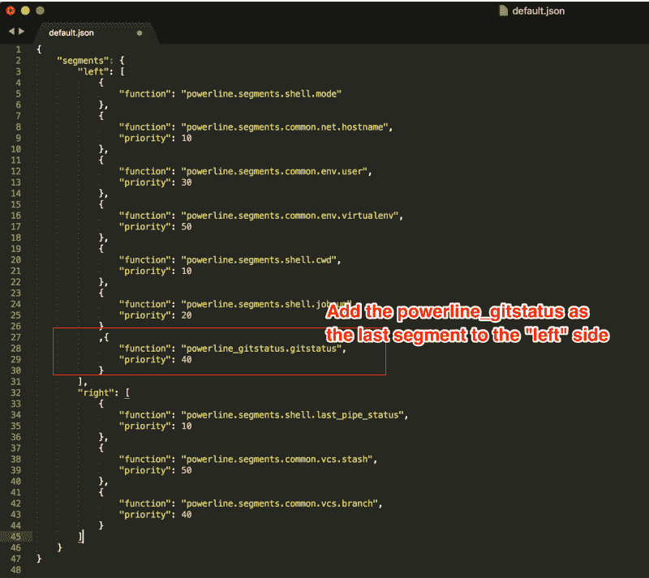*

*下面是我的 Powerline 的主题 default.json(你可以复制并粘贴它):*

> *注意:为了保持整洁，我已经删除了“右”部分的所有内容，还删除了“作业号”(“jobnum”)。否则，您将会在提示符的右侧边缘看到一个小瑕疵。*

```
*`{
	"segments": {
		"left": [{
				"function": "powerline.segments.shell.mode"
			},
			{
				"function": "powerline.segments.common.net.hostname",
				"priority": 10
			},
			{
				"function": "powerline.segments.common.env.user",
				"priority": 30
			},
			{
				"function": "powerline.segments.shell.cwd",
				"priority": 10
			}, {
				"function": "powerline_gitstatus.gitstatus",
				"priority": 40
			}
		],
		"right": []
	}
}`*
```

#### *4.4 重新启动守护程序*

*保存文件，在终端中运行`*powerline-daemon —-replace*` *。**

> ***重要提示:**每次你对电力线的配置进行更改，除了重启终端，你还需要**重启** **守护进程，通过运行:`*powerline-daemon —-replace*`来查看**反映的更改。*

#### *4.5 重启终端*

*退出终端(“终端”>“退出终端”)，然后再次打开它。*

*至此，我们都完成了！咻！如果您打开终端，并导航到任何 git repo，然后到处玩，它应该看起来像下面这样。*

**

*这是它在阳光主题下的样子:*

**

*这是它在《钴 2》主题中的样子:*

**

*？？谢谢大家！*

*如果你有问题，请随时在推特上问我:[https://twitter.com/rajaraodv](https://twitter.com/rajaraodv)*

#### *如果这有用，请点击拍手？下面扣几下，以示支持！⬇⬇⬇ ?？*

### *我的其他帖子*

*[*https://medium.com/@rajaraodv/latest*](https://medium.com/@rajaraodv/latest)*

#### **ECMAScript 2015+**

1.  ***[看看这些有用的 ECMAScript 2015 (ES6)提示和技巧](https://www.freecodecamp.org/news/check-out-these-useful-ecmascript-2015-es6-tips-and-tricks-6db105590377/)***
2.  **[*ES6*](https://medium.com/@rajaraodv/5-javascript-bad-parts-that-are-fixed-in-es6-c7c45d44fd81#.7e2s6cghy)中修复的 5 个 JavaScript“坏”部分**
3.  **[*ES6 中的“类”是新的“坏”的部分吗？*](https://medium.com/@rajaraodv/is-class-in-es6-the-new-bad-part-6c4e6fe1ee65#.4hqgpj2uv)**

#### **终端改进**

1.  ***[如何让你的终端变得有趣——一步一步的图片指导](https://www.freecodecamp.org/news/jazz-up-your-bash-terminal-a-step-by-step-guide-with-pictures-80267554cb22/)***
2.  ***[用七个步骤让你的“ZSH”码头焕然一新——视觉指南](https://www.freecodecamp.org/news/jazz-up-your-zsh-terminal-in-seven-steps-a-visual-guide-e81a8fd59a38/)***

#### **万维网**

1.  **一段精彩纷呈的网络和 JavaScript 历史**

#### **虚拟 DOM**

1.  **[*虚拟 DOM 的内部运作*](https://medium.com/@rajaraodv/the-inner-workings-of-virtual-dom-666ee7ad47cf)**

#### **反应性能**

1.  **[*两种快速缩减 React App 生产规模的方法*](https://medium.com/@rajaraodv/two-quick-ways-to-reduce-react-apps-size-in-production-82226605771a#.6lepbl7ae)**
2.  **[*用 Preact 代替 React*](https://medium.com/@rajaraodv/using-preact-instead-of-react-70f40f53107c#.7fzp0lyo3)**

#### **函数式编程**

1.  **[*JavaScript 是图灵全集——解释*](https://medium.com/@rajaraodv/javascript-is-turing-complete-explained-41a34287d263#.6t0b2w66p)**
2.  **[*JS 中的函数式编程—结合实例(上)*](https://medium.com/@rajaraodv/functional-programming-in-js-with-practical-examples-part-1-87c2b0dbc276#.fbgrmoa7g)**
3.  ***[JS 中的函数式编程—结合实例(下)](https://www.freecodecamp.org/news/functional-programming-in-js-with-practical-examples-part-2-429d2e8ccc9e/)***
4.  **[*Redux 为什么需要还原器是“纯函数”*](https://medium.com/@rajaraodv/why-redux-needs-reducers-to-be-pure-functions-d438c58ae468#.bntrywxrf)**

#### **网络包**

1.  **[*Webpack —令人困惑的部分*](https://medium.com/@rajaraodv/webpack-the-confusing-parts-58712f8fcad9#.6ot6deo2b)**
2.  **[*Webpack &热模块更换【HMR】*](https://medium.com/@rajaraodv/webpack-hot-module-replacement-hmr-e756a726a07#.y667mx4lg)*(引擎盖下)***
3.  **[*Webpack 的 HMR 和 React-Hot-Loader —失踪手册*](https://medium.com/@rajaraodv/webpacks-hmr-react-hot-loader-the-missing-manual-232336dc0d96#.fbb1e7ehl)**

#### **Draft.js**

1.  **[*为什么选择 Draft.js，为什么要投稿*](https://medium.com/@rajaraodv/why-draft-js-and-why-you-should-contribute-460c4a69e6c8#.jp1tsvsqc)**
2.  **[*draft . js 如何表示富文本数据*](https://medium.com/@rajaraodv/how-draft-js-represents-rich-text-data-eeabb5f25cf2#.hh0ue85lo)**

#### **反应和还原:**

1.  **[*逐步构建 React Redux 应用指南*](https://medium.com/@rajaraodv/step-by-step-guide-to-building-react-redux-apps-using-mocks-48ca0f47f9a#.s7zsgq3u1)**
2.  **[*React Redux CRUD App 构建指南*](https://medium.com/@rajaraodv/a-guide-for-building-a-react-redux-crud-app-7fe0b8943d0f#.g99gruhdz) *(3 页 app)***
3.  **[*在 React Redux 应用中使用中间件*](https://medium.com/@rajaraodv/using-middlewares-in-react-redux-apps-f7c9652610c6#.oentrjqpj)**
4.  **[*添加一个健壮的表单验证来反应 Redux 应用程序*](https://medium.com/@rajaraodv/adding-a-robust-form-validation-to-react-redux-apps-616ca240c124#.jq013tkr1)**
5.  **[*用 JWT 令牌保护 React Redux 应用*](https://medium.com/@rajaraodv/securing-react-redux-apps-with-jwt-tokens-fcfe81356ea0#.xci6o9s6w)**
6.  **[*在 React Redux 应用中处理交易邮件*](https://medium.com/@rajaraodv/handling-transactional-emails-in-react-redux-apps-8b1134748f76#.a24nenmnt)**
7.  **[*解剖一个 React Redux App*](https://medium.com/@rajaraodv/the-anatomy-of-a-react-redux-app-759282368c5a#.7wwjs8eqo)**
8.  **[*Redux 为什么需要还原器是“纯函数”*](https://medium.com/@rajaraodv/why-redux-needs-reducers-to-be-pure-functions-d438c58ae468#.bntrywxrf)**
9.  **[*两种快速缩减 React App 生产规模的方法*](https://medium.com/@rajaraodv/two-quick-ways-to-reduce-react-apps-size-in-production-82226605771a#.6lepbl7ae)**

#### **如果这有用，请分享它！谢谢大家！？？**