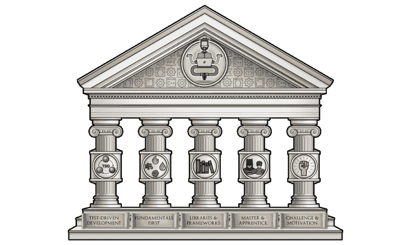
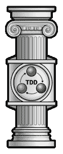
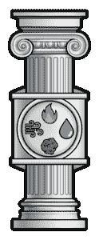
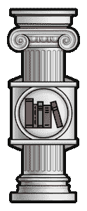
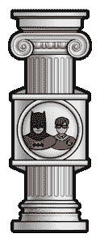
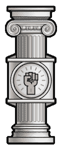

# 学习编程的主要支柱——以及为什么初学者应该掌握它们。

> 原文：<https://www.freecodecamp.org/news/the-main-pillars-of-learning-programming-and-why-beginners-should-master-them-e04245c17c56/>

赖纳·哈内坎普

# 学习编程的主要支柱——以及为什么初学者应该掌握它们。

我已经编程 20 多年了。在那段时间里，我有幸和许多人一起工作，从他们身上我学到了很多东西。我也和许多刚从大学毕业的学生一起工作过，和他们一起，我不得不扮演老师或导师的角色。

最近，我作为一名培训师参与了一个向绝对初学者教授编程的项目。

学习如何编程很难。我经常发现大学课程和训练营错过了编程的重要方面，并且采用了糟糕的方法来教授新手。

我想分享我认为成功的编程课程应该建立的五个基本支柱。和往常一样，我正在处理主流 web 应用程序的上下文。

一个菜鸟的目标是掌握编程的基础，理解库和框架的重要性。

诸如云、一般操作或构建工具等高级主题不应成为课程的一部分。说到设计模式，我也持怀疑态度。他们假定初学者没有经验。

所以让我们看看新程序员应该从哪里开始。

### 测试驱动开发(TDD)

TDD 带来了很多[好处](https://www.rainerhahnekamp.com/en/why-we-test-do-things-faster-with-test-driven-development/)。不幸的是，这是一个初学者还没有完全准备好的高级话题。

初学者不应该写测试。这对他们的基本技能水平来说太难了。相反，他们应该学会如何使用和处理测试。

每门编程课程都应该以练习为中心。我用单元测试扩展了我的练习，并为学生提供了一个已经设置好的运行这些测试的环境。

所有学生要做的就是写他们的代码，然后看着 testrunner 的灯从红色变成绿色。由此产生的游戏化是一个很好的副作用。

例如:如果选择的技术是 Spring，我提供 Spring 项目中的练习和测试。学生们不需要知道任何关于春天的知识。他们需要知道的只是演习的地点和触发测试的按钮。

此外，学生必须知道如何使用调试器，并且手边有一个读取-评估-打印循环(REPL)。在 TDD 中，在运行时分析代码的能力和拥有一个小实验的平台是非常重要的。

主要的一点是确保学生在获得核心编程技能后，不必学习基本的 TDD 行为。在学生职业生涯的后期改变习惯将比现在学习这些习惯困难得多。这就是为什么他们应该从一开始就进行单元测试。

在他们职业生涯的后期，他们应该对没有单元测试的项目反感。他们应该直观地将单元测试的缺失视为反模式。

### 基本面第一

我经常听到新手应该立即开始使用框架。这就像教人们如何驾驶一样，把他们放在一辆拉力赛车中，并要求他们避免过度转向。这完全忽略了一个事实，他们仍然错把刹车当成油门。

同样的道理也适用于我们用 Angular 这样的框架来开始学生。新手首先需要了解编程的基础知识。在使用别人的代码之前，他们需要熟悉代码的基本元素以及编写代码的意义。

新手对函数、变量、条件和循环的概念完全陌生。这四个要素构成了编程的基础。组成程序的一切都依赖于它们。

学生们第一次听到这些概念，但最重要的是学生们能够熟练掌握它们。如果学生没有掌握基础知识，接下来的一切看起来就像魔术一样，会导致困惑和沮丧。

老师们应该在这些基础知识上花更多的时间。但是，可悲的是，许多人走得太快了。问题是一些老师努力把自己放在学生的角色中。他们已经编程很久了，已经忘记了初学者需要处理什么类型的问题。和职业拉力赛车手很像。他无法想象有人需要在刹车前思考。他只是自动地做它。

我设计我的练习，通过使用四个主要元素的组合，使它们具有挑战性，但可以在合理的时间内解决。

一个很好的例子是罗马数字和阿拉伯数字的转换器。这项挑战需要学生们的耐心。一旦他们成功地运用这四个要素来解决挑战，他们的动力也会大大增强。

基本面很重要。在他们安顿下来之前不要继续前进。

### 库和框架

在学生花了大量时间编写代码后，他们必须了解大多数代码已经以库或框架的形式存在。这与其说是一种模式，不如说是一种心态。

正如我在之前写的[:现代开发者知道并选择正确的库。他们不会花几个小时自己写一个漏洞百出的版本。](https://www.rainerhahnekamp.com/en/modern-software-development/)

为了成功实现这种思维模式的转变,“基础阶段”的例子应该可以通过使用 Moment.js、Jackson、Lodash 或 Apache Commons 等著名的库来解决。

这样，学生将立即理解图书馆的价值。他们绞尽脑汁思考那些复杂的问题。现在，他们发现图书馆可以很快解决这个问题。

与 TDD 类似，当同事吹嘘他们自制的状态管理库使得 Redux 变得没有必要时，学生应该会变得怀疑。

当谈到框架时，一旦学生理解了库的有用性，他们就会明白它的重要性。

根据课程的时间框架，可能很难在框架上花时间。但是正如我已经指出的，最重要的方面是将学生的思维方式从从头开始编程转移到探索和使用库。

我没有在这个支柱中添加工具，因为它们只对有经验的开发人员有用。在这个早期阶段，学生不需要学习如何集成和配置工具。

### 大师和学徒

20 出头的时候，我想学弹钢琴。我不想要老师，认为我可以自己学习。五年后，我咨询了专业导师。我能说什么呢？我在一个月里学到的东西比之前五年都多。

我的钢琴老师指出了我演奏中听不到的错误，并让我意识到一些我从未想象过的诠释。毕竟，她向我灌输了音乐和艺术的思维模式，这两者对我这个技术人员来说都是遥不可及的。

编程也是一样。如果有人没有编程经验，那么自学可能是个坏主意。虽然有很多成功的故事，但我质疑单独做的效率。

相反，应该有一种“师徒”关系。一开始，师傅给徒弟定下必须遵守的规则——盲目的！师傅可能会解释规则，但通常道理是徒弟理解不了的。

这些内在的规则形成了一种安全网。如果一个人迷路了，他总是有一些安全的地方可以返回。

教学不应该是独白。老师必须单独对待每个学生。他应该检查学生的学习情况，提出建议，并根据他们的进度调整课程的进度。

一旦学徒达到一定的精通水平，他们应该被鼓励去探索新的领域。大师演变为分享“智慧”并开放讨论的导师。

### 挑战和动力

"让我们创造一个脸书克隆体！"这不是来自一个由一群高级软件开发人员和数百万欧元预算支持的首席执行官。这是程序员入门课程中的一个练习。这样的任务实际上是不可能的。更糟糕的是，学生们被带进了仙境，并被欺骗相信他们拥有超出他们能力的技能。

毫无疑问，老师意识到了这一点，但出于激励的原因创造了这样的练习。

锻炼的主要目的不是娱乐。它应该围绕一种特定的技术来创建，并且应该帮助学生理解这种技术。

动机是好的，但不能以牺牲内容为代价。编程不容易。如果学生没有内在的动机，编码可能不是一条出路。

新手应该体验一下作为一名专业开发人员意味着什么。在他们投入大量时间之前，他们应该知道等待他们的是什么。

例如，许多业务应用程序都围绕着复杂的表单和网格。创造这些是锻炼可以传授的一项重要技能。构建一个类似于脸书的应用程序可能不是学生们马上就能学到的最好的一课。

类似地，非程序员可能会对开发人员每天编写的代码行如此之少感到惊讶。甚至有时我们删除代码或者什么也没有完成。

为什么？因为事情总是出错。我们花了数不清的时间来修复一些极其奇怪的错误，结果却是一个简单的打印错误。一些工具可能不工作，仅仅是因为一个库获得了一个小版本升级。或者系统崩溃，因为有人忘记向 git 添加文件。这个清单可以一直列下去。

学生应该享受这些经历。在时间紧迫的情况下，以一个未知的图书馆为目标的练习可能是完全正确的。；)

现实生活中阳光并不总是灿烂。初学者应该为编程的现实做好充分准备。

### 最后的建议

最后但同样重要的是:一个人不可能在两周、两个月甚至一年内成为职业程序员。这需要时间和耐心。

培训师不应该仓促行事或做出虚假承诺。他们应该关注学生是否理解这些概念，不要走得太快。

*最初发布于 2018 年 6 月 10 日[www.rainerhahnekamp.com](https://www.rainerhahnekamp.com/en/5-pillars-of-learning-programming/)。*