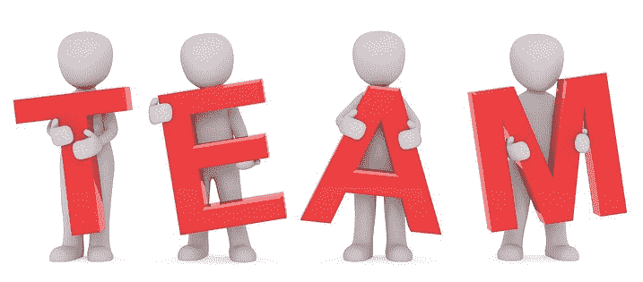

# 如何使用 GitHub 的本地特性来帮助管理一个中等规模的分布式团队

> 原文：<https://www.freecodecamp.org/news/using-github-native-features-for-a-mid-size-distributed-team-3acdfd0f027c/>

我的团队在我们的私人 Github repo 中创建了一个 wiki 页面，介绍我们如何在公共代码基础上工作。我想和你分享一下。

我们是一个 15 人的团队，有 10 名开发人员、一名项目经理( **PM** )、一名技术主管( **TL** )、一名工程经理、一名 UXer 和 DevOps，分布在三个欧洲国家。该产品是一个内部基于网络的 SaaS，由公司内部的其他团队使用。

### 沟通

我们主要通过 Slack 进行交流，但每两周举行一次视频会议(VC)。我们没有每日站立，而是每周提醒一周的任务，每个人都可以在一个帖子里写更新。这个想法是将站立问题从与人有关转变为与任务有关。我们从 Marcus Hammarberg 的“流动”研讨会中获得了灵感:

### 为什么？

随着项目和团队的成长，我们可以通过以一种聪明的方式跟踪问题和 PRs 来更有效地工作。

GitHub 内置了许多项目管理功能。此外，开发人员更容易将他们的代码和任务放在一个地方。像带有评论的[关闭问题](https://help.github.com/articles/closing-issues-using-keywords/)、[投稿指南](https://help.github.com/articles/setting-guidelines-for-repository-contributors/)和[问题模板](https://help.github.com/articles/manually-creating-a-single-issue-template-for-your-repository/)、[代码所有者](https://help.github.com/articles/about-codeowners/)及其与其他服务的[集成等特性使其成为一个非常有用的工具。](https://github.com/marketplace)

这个想法是定义一种松散的处理工作的方式，而不会给 PM/TL 带来太多的负担，同时仍然可以在需要时获得他们的输入。

### 什么？

我们使用一些原生 GitHub 特性来组织问题，并随时对项目进展有一个更清晰的了解。

### 怎么会？

我们使用 GitHub 问题、标签和里程碑。我们目前不使用 GitHub 项目(而是使用 [Zenhub](https://www.zenhub.com/) 作为我们的看板)。

### 什么时候？

我们使用每周里程碑。在每周的开始，我们有一个计划会议(也在 VC 上),在会上我们和 PM/TL 一起定义每周的里程碑，这是团队在那一周的焦点。

我们使用 GitHub 里程碑，其名称类似于 W22，描述了在周末应该实现的目标。还明确提到了验收标准。

在周末，我们有每周演示(也在 VC 上),我们展示结果，并对工作出色的人给予表扬。

### 原子问题和拉取请求

*   每个问题应该解决一件事。如果关于某个问题的讨论超出了范围，请创建另一个问题。
*   永远从问题开始，而不是从公关开始。在提交解决方案(在 PR 中)之前，一定要讨论问题(在问题中)。
*   合并时挤压 PRs 以保持`master`分支的历史清晰合理。
*   在简历中添加背景信息是一个很好的做法，但是如果你写得太多，这可能意味着你需要对这个问题进行评论。
*   在问题中进行讨论，并在开始编码之前分配优先级。

### 问题和减贫战略之间的一对一映射

*   在极少数情况下，你制作一个没有相关问题的 PR，制作一个问题并在 PR 描述中提及它。
*   每个 PR 必须至少有一个问题。
*   建议每个 PR 关闭一期。
*   在 PR 中简要描述解决方案，并提及相关问题。

### 没有直接提交给主机

*   对主文件的所有更改应来自 PRs。
*   这个想法是要一直有一个工作的分支。

### 谁啊。

在我们的团队中，我们采用精益的方式承担任务。一旦他们被项目经理优先考虑，任何人都可以去选择一个任务并开始工作。要表示问题正在进行中，您只需将其分配给自己。

我们对更大的任务使用 mob 编程，在这种情况下，所有参与任务的人都被分配。他们也在 PR 描述中被 ping，所以他们将获得 PR 评论的更新。

### 标签

创建问题时，我们会为其分配相关标签，以便于过滤。例如，我们可以通过一次点击过滤所有与`test`相关的问题或`prio-hi`问题，甚至可以将查询加入书签。

有许多标签，但它们基本上分为以下几类:

#### 优化

当一个新问题出现时，它会等待，直到被项目经理优先处理，并获得以下标签之一:

*   应该尽快完成的高优先级任务
*   没有高优先级任务时可以完成的中优先级任务
*   `prio-low`:可以等待的低优先级任务
*   在接到进一步通知之前我们不会做的任务

如果一个问题没有这些标签中的任何一个，它就不应该被处理。项目经理可以根据利益相关者需求的变化来改变问题的优先级。

当一个问题有了一个里程碑，它就可以被开发了。不在里程碑中的所有其他问题都在“backlog”中。可以将问题分配给即将到来的一周的每周里程碑。如果你不能为本周的里程碑做出贡献，也许你可以通过做一些那样的工作来为下周做准备。

任何人都可以制造问题。事实上，如果你觉得一个问题是获得答案的最佳方式，那么它就可以成为一个议题。问题不会自动转换为任务，直到它被划分优先级(获得`prio-*`标签)并添加到里程碑。

#### 大小

*   `EPIC`:是一个可能导致多个 PRs 的问题，应该在实施之前分解为`atomic`个问题。
*   `atomic`:是一个可以独立实施的问题，将会产生一个公共关系。

#### 分组

我们还使用标签将相似的问题组合在一起，或者标记某个问题或公关的不同方面。一个问题可以有任意数量的这些标志:

*   `tooling`涉及构建系统、林挺、测试工具的问题...
*   关于测试和质量保证的问题
*   需要一些 UX 工作、改善 UX 或以某种方式影响 UX 的问题
*   `config`与配置变更相关的问题
*   关于文档的问题(代码中的注释或像 wiki 这样发布的文档)
*   `perf`:监控和改进绩效的建议
*   改善开发者体验的东西，比如日志等等。
*   `security`:安全问题或安全改进。
*   我们还没有达成共识，也许你可以出一份力？
*   这个问题需要外部团队的帮助(如果你在等内部志愿者，你可以直接联系他们)。这些问题通常是 PM/TL 促进跨团队沟通的良好候选。
*   `feature`:用于引入新功能
*   `bug`:针对 bug 报告
*   如果我们有足够多的问题适合某个类别，可以添加更多的标签。

### GitHub 做不到的事情

不幸的是，当前的 Github 工具至少在两个重要方面存在不足:

1.  没有简单的方法将问题归入(史诗)一类。我们使用了一段时间的标签，但它不是最理想的。
2.  除了使用标签，没有办法区分问题的优先顺序。我们需要一个工具来显示问题的重要性。

这两个问题都由 [Zenhub](https://www.zenhub.com/) 解决，它是 Chrome/Firefox 的扩展，丰富了原生 GitHub 接口。它还为不使用 Chrome/Firefox 的用户提供托管服务。

Zenhub 唯一不足的地方是对在制品的限制( [WIP limit](https://github.com/ZenHubIO/support/issues/272) )。