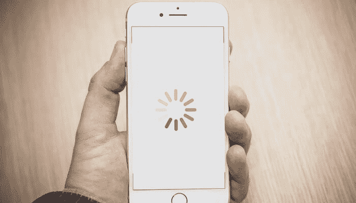

# 你的移动应用程序运行缓慢的主要原因及解决方法

> 原文：<https://www.freecodecamp.org/news/top-reasons-why-your-mobile-app-is-slow-and-how-to-fix-it-f0f7ce524934/>

作者 Rajput Mehul

# 你的移动应用程序运行缓慢的主要原因及解决方法

在技术飞速发展的时代，人们没有任何耐心，你必须保持警觉，以确保留住你的用户。

的确，大多数终端用户都迫不及待地想从移动应用程序那里得到回应。一个手机应用的理想加载时间大约是**两**秒。然而，[根据 Akamai research](https://wemakewebsites.com/blog/a-1-second-delay-on-your-page-load-can-cause-a-7-reduction-in-conversions-how-do-you-solve-it) 的一项研究，应用每多消耗一秒，转化率就会下降 7%。

雪上加霜的是，如果用户不得不等待更长时间，永远不会再回到同一个应用程序，他们会感到沮丧和愤怒。另一份[报告](http://www.apteligent.com/news-press/latency-impacts-user-experience-48-percent-of-consumers-uninstall-or-stop-app-use-due-to-slow-speeds-crittercism-report-reveals/)显示，48%的客户卸载或停止使用运行缓慢的应用程序。

因此，手头上的第一个当务之急是找到 app 运行缓慢的实际原因或原因。一旦您确定了主要问题，您就可以采取必要的措施来解决问题，并为您的用户提供增强的体验。

导致您的移动应用程序运行缓慢的主要问题有:

1.  你的应用程序已过时且不支持
2.  服务器速度缓慢
3.  加密连接未优化
4.  闲聊
5.  有缺陷的库和软件开发工具包
6.  应用程序数据过多
7.  网络延迟

在本文中，我们将详细讨论这些问题。所以让我们开始吧。

### 1.你的应用程序已过时且不支持

如果你从事应用程序开发业务，你一定很清楚定期更新你的应用程序有多重要。无论你是 Android 还是 iOS 应用开发者，你都必须确保应用是在最新版本的操作系统上设计的。

例如，目前在 Android 的情况下，它必须是 Android 奥利奥或牛轧糖。对于 iOS，需要是 iOS 11 或 10。因此，如果你没有优化你的应用程序在这些平台上运行，或者如果你使用一个旧的框架，应用程序往往会变得很慢。此外，较旧的平台版本无法从供应商处获得所需的支持，并且在特定日期后，该支持将完全停止。

解决问题的方法是更新和优化软件，并与应用程序开发和设计的最新趋势保持联系。更新您的应用程序并在较新的平台上测试它，还可以确保它与较新的操作系统版本兼容。它也增强了你的应用程序的性能。

你总是能获得关于安全警报和漏洞修复的最新信息，这加快了应用程序的速度。

### 2.服务器速度缓慢

您一定多次遇到过这条消息——服务器关闭或没有连接。嗯，这是一些网站需要很长时间才能加载的常见原因之一，同样的问题在移动应用程序中重复出现。服务器速度慢或超载。

后端基础架构缓慢可能有多种原因:

*   由于大多数现代应用程序运行在多层基础结构上，服务器可能会变慢。
*   您可能在从磁盘访问文件、运行应用程序代码或通过聊天与用户即时交流等方面遇到问题。

所有这些问题的根本原因都是一样的:过载或超负荷的服务器。有时，问题可能与另一个进程的延迟有关，而您的应用程序的大多数任务都严重依赖于该进程。

要解决这个问题，您可以采用两种方法。

1.  确定应用程序各种组件之间的交互，这就是所谓的应用程序依赖映射(ADM)。
2.  尝试通过提供额外的反向代理服务器来减轻服务器的负载。反向代理提供了许多好处，并通过提供压缩、SSL 终止、缓存和其他好处来加速 web 请求。

事实上，您还可以选择另一种方法，即部署负载平衡器来帮助平均分配流量。

### 3.加密连接未优化

SSL/TLS 连接为传输中的数据提供加密，从应用程序开发的角度来看非常重要。所以不要忽视它们！但是如果不进行优化，它们也会产生问题。

未优化的加密连接会降低应用程序的性能。专家指出的一些主要原因是:

1.  每次打开新连接时都需要握手，这会影响速度。
2.  在服务器上加密数据和在客户端解密数据的过程中会遇到问题。

为了解决这些问题，必须优化加密连接。这可以通过合并 HTTP/2 和 SPDY 来实现，这两种协议只要求每个会话进行一次握手，从而减少了与客户端的连接开销。

您还可以采用其他技术来解决这个问题，比如使用 OpenSSL、会话票证、会话缓存等等。

### 4.闲聊

当客户机代表应用程序中的单个操作发出几个进行事务处理的请求时，就会出现与应用服务器聊天的问题。

既然已经引入了虚拟化，这就允许您开发设备或资源的虚拟版本，如存储设备、服务器、网络甚至操作系统。

可能是服务器团队将自动迁移的服务器映像配置到了一台由于虚拟化而负载较轻的主机上。它可能会将服务器映像移动到另一个位置，使其远离服务器或磁盘存储系统许多毫秒。

如果您想解决这个问题，您必须查看与网络连接的系统之间的请求数量。检查请求之间的延迟也是一个好主意。

### 5.有缺陷的库和软件开发工具包

应用程序开发人员可能非常注重确保一流的性能。但是，供应商提供的库和软件开发工具包(SDK)可能会出现开发人员无法控制的问题。

你需要查看第三方库的代码，看它是否包含错误或 bug。如果没有仔细监控库，应用程序往往会变得缓慢。

我想到的第三方库问题的几个例子是:

*   允许通过使用[毕加索](http://square.github.io/picasso/)和[格莱德](https://bumptech.github.io/glide/)库将图像加载到应用程序中
*   通过使用 [Eventbus](https://github.com/greenrobot/EventBus) 库简化应用程序不同部分之间的通信过程
*   翻新，一个基于 Android 的库，帮助安排项目中的 API 调用

确保您使用的是拥有大型社区的安全、稳定、可靠的库。

### 6.应用程序数据过多

嗯，这不是火箭科学，可以很容易地确定和解决。应用程序变得数据过载，结果是应用程序变慢。如果加载了太多的服务器，会消耗很多时间。然而，缩减你的数据和损害你的应用程序的便利功能并不是一个好主意。

最简单且无可否认的最佳解决方案是压缩数据。无论你有图像，视频，图形或音频内容，如果你压缩数据，它将使你的应用程序加载速度更快，你不必弄乱它的任何特性或功能。

但是你必须根据文件大小和内容选择合适的压缩标准。如果我们讨论一些压缩或减少数据大小的常用方法，有两种选择。第一种是无损方法，第二种是有损压缩。

1.  **无损压缩:**在这种方法中，开发者可以将文件恢复到其原始大小，并且在文件未被压缩时没有数据丢失。这种类型的数据压缩技术用于减小文本和电子表格文档的大小。
2.  **有损压缩:**在第二种方法中，你实际上是从应用程序中删除数据，这通常不会引起注意。这种数据压缩方法用于压缩视频、音频和图形文件的大小。

### 7.网络延迟

网络速度会极大地影响你的移动应用程序的速度。如果网络慢，app 性能也会慢。如果一个应用程序向一个不存在的主 DNS 服务器发出查询，但没有得到回复，它将尝试第二个 DNS 服务器，但这会降低应用程序的速度。

为了修复问题，你必须一直检查网络速度，并查看应用程序何时变慢。

### 结论

移动应用是接触目标受众的一个很好的来源。但是如果他们的表现没有达到标准或者变得很慢，就需要尽快解决。你的应用程序在速度因素上失利有不同的原因，所以你必须找出确切的问题并尽快解决它。

或者，您可以利用经验丰富且高度可靠的[应用程序开发公司](https://www.mindinventory.com)的服务，该公司拥有懂得如何加快应用程序速度的专业开发人员:)

如果你喜欢这个故事，请点击？按钮并分享，帮助其他人找到它！