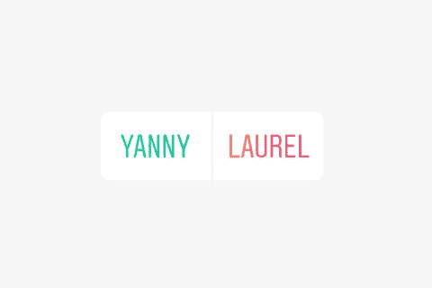

# 如何使用网络音频 API 听到“Yanny”和“Laurel”

> 原文：<https://www.freecodecamp.org/news/how-you-can-hear-both-yanny-and-laurel-using-the-web-audio-api-306051cfcede/>

by _ 浩川

# 如何使用网络音频 API 听到“Yanny”和“Laurel”



[https://www.highsnobiety.com/p/yanny-versus-laurel-audio-meme](https://www.highsnobiety.com/p/yanny-versus-laurel-audio-meme/)

最近，一段询问听众是否听到单词“Yanny”或“Laurel”的音频片段彻底困扰了世界，并在网上引发了朋友之间的争论。

高中生们将这段视频和“Yanny 或 Laurel”投票发布在 Instagram、Reddit 和其他网站上，他们说这是从一个词汇网站上录制的，通过电脑上的扬声器播放。现在，成千上万的人正在就他们听到的内容进行辩论。这让人们疯狂，并导致双方激烈的辩护。

然而，这场辩论背后的魔力非常简单。**不同的耳朵对同一个音频片段有不同的敏感频率区。**还有，不同的扬声器对不同的音频有不同的反应。

本教程将详细介绍如何使用网络音频 API 和简单的 JavaScript 来创建工具，帮助您听到“Yanny”**和**“Laurel”那么你就能赢得任何一场辩论。:)

如果你只是想试试工具，这里是直播[这里是](https://haochuan.github.io/yanny-vs-laurel/static/)。只需打开浏览器，播放音频，并在移动频率滑块的同时，尝试找到“Yanny”和“Laurel”的最佳位置。

### 它是如何工作的

先说重点部分。为了听到不同的单词，你需要在特定的频率范围内增加音量，这取决于你的耳朵。幸运的是，网络音频 API 已经为我们准备好了一些东西:`BiquadFilterNode`。

您可以使用不同类型的`[BiquadFilterNode](https://developer.mozilla.org/en-US/docs/Web/API/BiquadFilterNode)`。在这种情况下，我们将只使用`bandpass`过滤器。

> *带通滤波器是一种电子器件或电路，它允许两个特定频率之间的信号通过，但会歧视其他频率的信号。([来源](https://whatis.techtarget.com/definition/bandpass-filter) )*

对于带通滤波器，大多数情况下，我们只需定义想要提升或削减的中心频率值，而不是频率范围的起点和终点。我们使用一个`Q`值来控制频率范围的宽度。`Q`越大，频率范围越窄。[查看维基百科](https://en.wikipedia.org/wiki/Q_factor)了解更多细节。

这就是我们此时需要知道的全部知识。现在，让我们写代码。

### 网络音频 API 初始化

```
const AudioContext = window.AudioContext || window.webkitAudioContext;
```

```
const audioContext = new AudioContext();
```

#### 创建音频节点以及设置和信号链

```
// the audio tag in HTML, where holds the original audio clipconst audioTag = document.getElementById('audioTag');
```

```
// create audio source in web audio apiconst sourceNode = 
```

```
audioContext.createMediaElementSource(audioTag);
```

```
const filterNode = audioContext.createBiquadFilter();
```

```
filterNode.type = 'bandpass'; // bandpass filterfilterNode.frequency.value = 1000 // set the center frequency
```

```
// set the gain to the frequency rangefilterNode.gain.value = 100;
```

```
// set Q value, 5 will make a fair band width for this casefilterNode.Q.value = 5;
```

```
// connect nodessourceNode.connect(filterNode);filterNode.connect(gainNode);gainNode.connect(audioContext.destination);
```

#### 示例 HTML 文件

```
<!DOCTYPE html><html lang="en"><head>  <meta charset="UTF-8">  <title>Yanny vs Laurel Web Audio API</title></head><body>  <div id="container">    <audio id='audioTag' crossorigin="anonymous" src="yanny-laurel.wav" controls loop></audio>    <hr>    <input type="range" min="20" max="10000" value="20" step="1" class="slider" id="freqSlider">  </div>  <script src='script.js'></script></body></html>
```

#### 添加频率滑块用户界面

为了更容易调整我们的带通滤波器的中心频率，我们应该添加一个滑块来控制值。

```
<!DOCTYPE html><html lang="en"><head>  <meta charset="UTF-8">  <title>Yanny vs Laurel Web Audio API</title></head><body>  <div id="container">    <audio id='audioTag' src="yanny-laurel.wav" controls loop></audio>    <hr>    <input type="range" min="50" max="4000" value="1000" step="1" class="slider" id="freqSlider">    <br>    <p id="freqLabel" >Frequency: 1000 Hz</p>  </div>  <script>;    // add event listener for slider to change frequency value    slider.addEventListener('input', e => {
```

```
 filterNode.frequency.value = e.target.value;      label.innerHTML = `Frequency: ${e.target.value}Hz`;
```

```
 }, false);  <script src='script.js'></script><;/body></html>
```

### iOS Safari 中的 createMediaElementSource bug

我发现`createMediaElementSource`在 iOS Safari 和 Chrome 里都不行。为了解决这个问题，你必须使用`createBufferSource`来创建一个 AudioBufferNode 来存储和播放音频，而不是 HTML 音频标签。
详情请看[这里的代码](https://github.com/haochuan/yanny-vs-laurel/blob/master/static/script.js)。

现在你把自己变成了一个工具，这样你就可以同时听到“Yanny”和“Laurel”只需打开浏览器，播放音频，并在移动频率滑块的同时尝试找到最佳位置。

如果你只是想试试这个工具，这里是 live [这里是](https://haochuan.github.io/yanny-vs-laurel/static/)。

我写音频和网络代码，在 YouTube 上弹吉他。如果你想看更多我的资料或了解我，你可以随时在以下网址找到我:

网址:
[https://haochuan.io/](https://haochuan.io/)

GitHub:
[https://github.com/haochuan](https://github.com/haochuan)

中:
[https://medium.com/@haochuan](https://medium.com/@haochuan)

YouTube:[https://www.youtube.com/channel/UCNESazgvF_NtDAOJrJMNw0g](https://www.youtube.com/channel/UCNESazgvF_NtDAOJrJMNw0g)