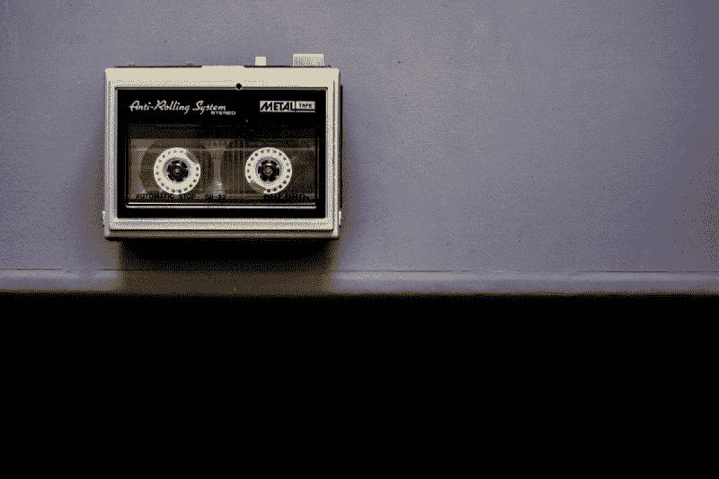

# “你听起来不自信”——如何记录你自己可以帮助你赢得下一次面试

> 原文：<https://www.freecodecamp.org/news/you-sound-insecure-how-recording-yourself-can-help-you-ace-your-next-interview-5b2395c0e27e/>

DJ 钟

# “你听起来不自信”——如何记录你自己可以帮助你赢得下一次面试

你听过自己的录音吗？很奇怪。我不是说你的声音很奇怪(嗯，可能是)，但这是一种奇怪的体验。你在脑海中有一个你认为你听起来像什么的大脑记录，但当你实际听到回放时，它是完全不同的。

#### 最重要的是，你在回答面试问题时有没有听到过自己的声音？

超级尴尬。至少对我来说是这样。

就在我申请我梦想中的公司 Dropbox 之前，我申请了一些不太知名的公司来练习面试，但是我一直在轰炸我的电话面试。

我的朋友尼克提出要对我进行一次模拟面试，看看他是否能帮上忙。

他唯一的一条反馈彻底改变了我的面试成功率。他说，

> 你的答案很好，但是你听起来很不自信。你的声音没有激发任何你会做好工作的信心**。**

这让我大吃一惊。我不知道我的声音是一个问题或者是我应该考虑的事情。

起初我并不相信尼克，但后来我们录下了另一次模拟采访，一切立刻明朗了。我听起来非常没有安全感，而且经常处于防御状态。我必须解决这个问题。

#### 我开始录音我的模拟面试练习，这改变了游戏规则。

如果您还没有这样做，您应该这样做！

你会从一段录音中学到很多东西。如果你东拉西扯，如果你经常使用填充词或短语(“像”、“嗯”、“你知道”)，如果你的声音听起来不安全，你会听到你如何组织你的答案。

也许你不介意听起来不自信，但你的声音或措辞中可能有其他东西分散了你对答案内容的注意力。

录完自己的声音后，我注意到我的声音中有三点让我听起来不安全，我是如何解决这些问题的。

### **1。我回答的最后一句话听起来像一个问题。**

大多数时候，当我回答完一个问题时，我的声音会提高一个八度，就像我在问一个问题一样。我会说这样的话，“我监督了这个项目，它确实帮助改进了我们的流程(？)"

我如此专注于说正确的事情，并试图记住我准备的所有答案，就好像我在寻求对我的答案的认可。如果我没有录下自己的声音，我永远不会注意到这一点。

为了解决这个问题，我专注于做陈述性的陈述，并想象在我说的句子后面加上一个句号。

“我监督了这个项目，它使我们的流程效率提高了两倍(期间)。”或者，“我的分析表明注册流程(期间)有问题。”

有了这个想法也让我在每一句话后都有一个短暂的停顿，这很有帮助，因为我也发现我说得太快了。这是我的下一个发现…

### **2。我说得非常快，因为我想说出每一条相关信息。**

很多人都在努力克服语速过快的问题，原因可能有很多。

当我多次重播我的录音时，我发现我说得这么快是因为我对确保说出我想说的一切没有信心。这几乎就像是我在和面试官说话(在这种情况下，是尼克，我的模拟面试官)，而不是和他说话。

试图说出一个情况的每一个细节或者与一个项目相关的每一项成就，往好里说会让我显得傲慢，往坏里说会让我显得非常有防御性。我的回答听起来像是辩解，尤其是那些涉及冲突的问题，比如“告诉我一次你和一个团队成员的工作关系有困难的时候。”

我急于解释我的答案，提供关于情况的非常具体的细节，并匆忙告诉面试官我的思维过程，这实在是太过分了。即使对我自己来说，听着我回答的录音也是无法抗拒的。

为了防止我说得太快，我逐字逐句地写下了常见面试问题的答案，比如“给我介绍一下你的简历”和“告诉我一个你引以为豪的项目。”我没有隐瞒我想说的话，并写下了我认为我应该如何最好地回答这些问题。

#### 然后，我把字数减少了 50%。

这听起来有些极端，也许不可能，但是如果你因为试图说出每一条相关信息而觉得语速太快有问题，试试这个。

也许你不需要把字数减少一半，但也许是 25%。无论如何，这将是一个很好的练习，帮助你抓住你想在采访中讲述的故事的本质和实际的关键细节。

此外，我有一个小咒语。我会提醒自己，

> 慢下来好吗？

### **3。我漫无边际地谈论一个情境的背景，而不是真正地回答问题。**

对于像“告诉我你是如何解决与一个难相处的队友的冲突的”这样的问题，我会花大部分时间来建立背景和描述情况，而不是告诉我实际上是如何解决冲突的。

为了回答这种类型的问题，我尝试使用 STAR(情景、任务、行动、结果)方法来回答面试问题(如果你没听说过，可以谷歌一下)。但是我发现我花了太多时间谈论这个情况。

在听到我漫无边际的回答后，我首先专注于回答实际问题(STAR 的动作部分)，然后提供上下文。

因此，对于冲突问题，用我的新方法，我会首先回答说，“我解决了与团队中一名工程师关于时间表的冲突，首先试图理解她来自哪里，然后根据对我们两个最重要的事情做出权衡。”然后，我会继续描述情况。

首先说这句话会给面试官和你的回答提供一个依据。对于面试官来说，他们可以看到你在这种情况下实际做了什么。对你自己来说，它提供了一个框架，这样你就不会在解释上下文时偏离不相关的细节。

对于行为/情境面试问题，重点在前 2-3 句回答你在情境中做了什么。最终，面试官想知道你是如何影响改变的，因为面试是关于你的！

### **语音记录自己！**

真是大开眼界(还是大开眼界？)听到一段自己回答面试问题的录音。如果我没有这样做，我永远也不会知道我的回答听起来不安全、不自信，因为我说话的方式。

通过给自己录音，我能够充分利用我准备面试的时间，因为我发现了我需要努力的地方。

综上所述，试着在和朋友的模拟面试中给自己录音。我保证你会立刻知道你需要改进什么！

#### 你的求职被卡住了吗？想知道如何突破并在技术领域找到一份工作吗？

点击此处获得获得你想要的工作的一步一步的策略，并查看我在 Dropbox 获得工作的确切简历。

*最初发表于[hackcareer.com](http://hackcareer.com/)*