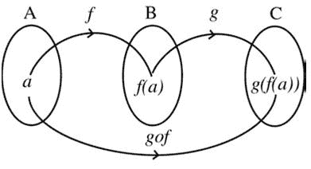

# Swift 中函数组合的快速介绍

> 原文：<https://www.freecodecamp.org/news/a-quick-intro-to-function-composition-in-swift-17f5c9999cee/>

程序员每天都会碰到函数。函数代表一种特殊类型的关系:函数接受的每个输入值都与某个输出值相关联。因此，从更一般的角度来说，函数是将一些输入值映射到一个输出值的规则。

函数组合背后的基本思想是将一个函数应用于另一个函数的结果。所以是把函数组合成一个函数的数学概念。



Function Composition

#### 入门指南

让我们和数学概念一起讨论一下。在上图中，“f”和“g”是两个函数。我们可以将这些函数表示如下:

```
f: A -> Bg: B -> C
```

如果我们做这两个函数的合成，那么我们可以把它表示为“g o f”(你可以说 g of f)。

```
(g o f): A -> C such that (g o f)(a) = g(f(a)) for all a in A
```

让我们试着用一个简单的例子来探索它:

```
Let f(a) = 2a + 3 & g(a) = 3a + 5, then function composition
```

```
(g o f)(a) = g(f(a)) = 3(f(a)) + 5 = 3(2a + 3) + 5 = 6a + 14
```

这个概念不仅适用于数学——我们也可以将它应用于编程语言。这些语言被称为函数式编程语言。理解这个概念可以提高代码的可读性，并让其他程序员更容易理解。

#### Swift 作为函数式编程语言的介绍

现在，好消息是 swift 也是一种函数式编程语言。在 Swift 编程中，函数具有最重要的作用，所以你每天都要和它们互动。Swift 函数可以返回值，然后我们可以将返回值作为另一个函数的输入。这是一种常见的编程实践。

#### 在 swift 中实现功能组合

假设我们有一个整数数组，我们希望输出是唯一的偶数整数的平方数组。因此，通常情况下，我们会实现如下功能:

这段代码为我们提供了正确的输出，但是正如您所看到的，这段代码的可读性不是很好。此外，函数调用顺序看起来与我们想要的相反，这可能会给一些新程序员带来困惑。这段代码很难分析。

因此，函数合成来拯救我们，使我们摆脱上述所有问题。我们可以利用泛型、闭包和中缀运算符来实现函数组合。

因此，让我们看看上面的代码块中发生了什么:

1.  我们声明了一个自定义中缀运算符“> > >”。它保留了结合性和优先顺序，就像+运算符一样。
2.  我们声明了一个与中缀运算符同名的函数。该函数使用三个泛型 T、U、V，并接受两个闭包作为输入参数。
3.  左边的参数是一个闭包，它接受 T 类型的输入并返回 u 类型的输出。
4.  右边的参数也是一个闭包，它接受 U 类型的输入并返回 v 类型的输出。
5.  现在>>>函数返回一个函数或闭包，它的类型是(T) → V，输出闭包接受 T 类型的输入，返回 v 类型的输出，这里左边参数的输出是右边参数的输入。

```
left :  (T) -> U right: (U) -> V
```

```
Output Type: (T) -> V
```

如果你理解了函数合成的数学表示，那么你可以看到它和 Swift 的实现是一模一样的。

6.在函数体中，它返回右参数对左参数的结果。

现在，如果我们想要相同的结果(唯一偶数整数的平方数组)，我们可以通过函数组合来实现。

这是一个返回相同结果的函数链。功能顺序现在看起来与人类可能想到的相似。可读性更好，大家更容易理解。

感谢您的阅读！