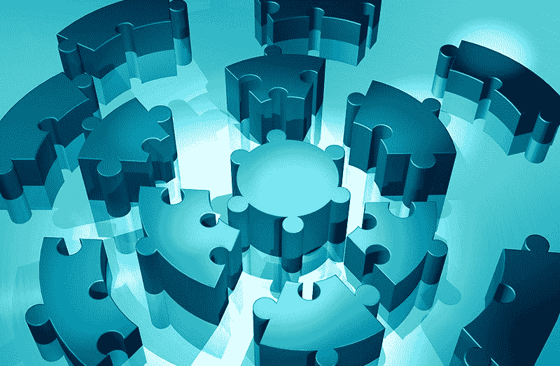

# 如何像程序员一样思考——问题解决课程

> 原文：<https://www.freecodecamp.org/news/how-to-think-like-a-programmer-lessons-in-problem-solving-d1d8bf1de7d2/>

理查德·赖斯

By [Richard Reis](https://twitter.com/richardreeze)

如果你对编程感兴趣，你可能以前见过这句话:

> "这个国家的每个人都应该学会给计算机编程，因为它教会你思考。"—史蒂夫·乔布斯

你可能也想知道像程序员一样思考到底意味着什么？你是如何做到的？？

本质上，都是关于**一种更有效的解决问题的方式**。

在这篇文章中，我的目标就是教你这种方法。

到最后，你会确切地知道如何成为一个更好的问题解决者。

#### 为什么这很重要？

解决问题是元技能。

我们都有问题。大大小小。我们如何处理他们有时，嗯…相当随机。

除非你有一个系统，否则这可能就是你“解决”问题的方式(我开始编码时就是这么做的):

1.  尝试一个解决方案。
2.  如果那个不行，试试另一个。
3.  如果这不起作用，重复第 2 步，直到你运气好。

听着，有时候你运气好。但那是最糟糕的解决问题的方法！这是对时间的巨大浪费。

最好的方法包括 a)建立一个框架，b)实践它。

> “几乎所有的雇主都会优先考虑解决问题的技能。

> 解决问题的能力几乎被一致认为是雇主寻找的最重要的资格。超过编程语言的熟练程度，调试和系统设计。

> 展示计算思维或分解大型复杂问题的能力，与工作所需的基本技能一样重要(如果不是更重要的话)。"—黑客排名( [2018 开发者技能报告](https://research.hackerrank.com/developer-skills/2018/))

#### 有框架

为了找到正确的框架，我遵循了蒂姆·菲利斯的学习书籍《4 小时厨师》中的建议。

这让我采访了两个真正令人印象深刻的人: [C .乔丹·鲍尔](https://www.linkedin.com/in/cjordanball/)(在 [Coderbyte](https://coderbyte.com/) 的 65，000+用户中排名第一或第二)，以及 [V .安东·斯普劳尔](http://vantonspraul.com/)(《像程序员一样思考:创造性解决问题入门》一书的作者)。

我问了他们同样的问题，你猜怎么着？他们的答案非常相似！

很快，你也会认识他们。

旁注:这并不意味着他们做任何事情都是一样的。每个人都不一样。你会与众不同。但是如果你从我们都认同的好原则开始，你会走得更远更快。

> “我看到新程序员犯的最大错误是专注于学习语法，而不是学习如何解决问题。”— [诉安东·斯普拉](http://vantonspraul.com/)

那么，当你遇到一个新的问题时，你该怎么办呢？

以下是步骤:

#### 1.明白；理解

确切地知道被问的是什么。大多数难题之所以难，是因为你不理解它们(因此这是第一步)。

如何知道自己什么时候理解了一个问题？当你能用简单的英语解释它的时候。

你还记得被一个问题困住，你开始解释它，你立刻发现了你以前没有发现的逻辑漏洞吗？

大多数程序员都知道这种感觉。

这就是为什么你应该写下你的问题，涂鸦一个图表，或者告诉别人这件事(或者事情……有些人用[橡皮鸭](https://en.wikipedia.org/wiki/Rubber_duck_debugging))。

> "如果你不能用简单的术语解释一件事，那你就没有理解它。"—理查德·费曼

#### 2.计划

不要在没有计划的情况下就开始解决问题(并且希望你可以蒙混过关)。规划您的解决方案！

如果你不能写下确切的步骤，什么也帮不了你。

在编程中，这意味着不要马上开始黑客攻击。给大脑时间分析问题，处理信息。

要得到一个好的计划，请回答这个问题:

"给定输入 X，返回输出 Y 需要什么步骤？"

旁注:程序员有一个很好的工具来帮助他们…注释！

#### 3.划分

注意了。这是最重要的一步。

不要试图解决一个大问题。你会哭。

而是把它分解成子问题。这些子问题就好解决多了。

然后，逐个解决每个子问题。从最简单的开始。最简单的意思是你知道答案(或者更接近答案)。

之后，最简单意味着这个子问题的解决不依赖于其他子问题的解决。

一旦你解决了每一个子问题，把这些点连接起来。

把你所有的*【子解】*连接起来，就会给你原问题的解。恭喜你！

这项技术是解决问题的基础。记住它(如果你必须的话，再读一遍这一步)。

> “如果我能教每个初学编程的人一种解决问题的技巧，那就是‘减少问题技巧’

> 例如，假设你是一个新的程序员，你被要求编写一个程序来读取十个数字，并计算出哪个数字是第三高的。对于一个全新的程序员来说，这可能是一项艰巨的任务，尽管它只需要基本的编程语法。

> 如果你被卡住了，你应该把问题简化。不是第三高的数字，而是找到最高的总数怎么样？还是太强硬？找到三个数字中最大的一个怎么样？还是两者中的较大者？

> 将问题简化到你知道如何解决的程度，并写出解决方案。然后稍微扩展一下问题，重新编写与之匹配的解决方案，继续下去，直到回到开始的地方。“— [诉安东·斯普拉](http://vantonspraul.com/)

#### 4.卡住了？

现在，你可能正坐在那里想“嘿，理查德...这很酷，但是如果我被卡住了，甚至不能解决一个子问题呢？?"

首先，深呼吸。第二，这很公平。

别担心，朋友。每个人都会这样！

不同之处在于，最好的程序员/问题解决者对 bugs 错误更好奇，而不是被激怒。

事实上，当面临厄运时，这里有三件事可以尝试:

*   调试:一步一步地检查你的解决方案，试图找到哪里出错了。程序员把这个叫做*调试*(其实这都是调试器做的事情)。

> “调试的艺术是弄清楚你真正告诉你的程序做什么，而不是你认为你告诉它做什么。””—安德鲁·辛格

*   再评估:退一步。换个角度看问题。有没有什么可以抽象成更通用的方法？

> “有时我们会迷失在问题的细节中，以至于忽略了在更普遍的层面上解决问题的一般原则。[…]

> 这方面的经典例子当然是一长串连续整数 1 + 2 + 3 + … + n 的求和，一个非常年轻的高斯很快就认识到这只是 n(n+1)/2，从而避免了必须做加法的努力。”— [C .乔丹球](https://www.linkedin.com/in/cjordanball/)

旁注:另一种重新评估的方式是重新开始。删除一切，用全新的眼光重新开始。我是认真的。你会惊讶于这有多有效。

*   研究:啊，好 ol' Google。你没看错。不管你有什么问题，很可能已经有人解决了。找到那个人/解决方案。事实上，这样做就算你解决了问题！(可以从别人的解决方案中学到很多)。

警告:不要寻找大问题的解决方案。只寻找子问题的解决方案。为什么？因为除非你奋斗(哪怕一点点)，否则你什么都学不到。如果你没有学到任何东西，你就浪费了你的时间。

#### 实践

不要期望仅仅一个星期后就变得伟大。如果你想成为一个优秀的问题解决者，那就解决大量的问题！

练习。练习。练习。你认识到“这个问题可以用<insert concept="" here="">轻松解决”只是时间问题</insert>

怎么练？外面有很多选择！

国际象棋，数学问题，数独，围棋，大富翁，视频游戏，密码猫，啦…啦…啦…

事实上，成功人士的一个共同模式是他们练习“解决微小问题”的习惯例如，彼得·泰尔下象棋，埃隆·马斯克玩电子游戏。

> “拜伦·里夫斯说‘如果你想看看三到五年后的商业领导力会是什么样子，看看网络游戏正在发生什么。’

> 快进到今天。埃隆·马斯克(elon Musk)、里德·霍夫曼(Reid Hoffman)、马克·扎克伯格(Mark Zuckerberg)和许多其他人都说，游戏是他们成功建立公司的基础。”—玛丽·米克尔( [2017 互联网趋势报告](https://www.recode.net/2017/5/31/15693686/mary-meeker-kleiner-perkins-kpcb-slides-internet-trends-code-2017))

这是否意味着你应该只玩电子游戏？一点也不。

但是电子游戏是关于什么的呢？没错，解题！

所以，你要做的就是找到一个练习的出口。能让你解决很多微观问题的东西(理想情况下，是你喜欢的东西)。

例如，我喜欢编码挑战。每天，我都试图解决至少一个挑战(通常是在 [Coderbyte](https://coderbyte.com/) 上)。

就像我说的，所有的问题都有相似的模式。

#### 结论

那都是乡亲们！

现在，你更清楚“像程序员一样思考”意味着什么

你也知道解决问题是一项难以置信的技能(元技能)。

如果这还不够，请注意你还知道如何练习解决问题的技巧！

唷… 很酷吧？

最后祝你遇到很多问题。

你没看错。至少现在你知道怎么解决它们了！(此外，您将了解到，每一个解决方案都会带来改进)。

> “就在你认为自己已经成功越过一个障碍的时候，另一个又出现了。但这就是生活有趣的地方。[…]

> 生活是一个突破这些障碍的过程——一系列我们必须突破的防线。

> 每一次，你都会学到一些东西。

> 每一次，你都会发展力量、智慧和洞察力。

> 每一次，竞争对手都会减少一点。直到剩下的只有你:最好的你。”—瑞安·哈乐迪([障碍是道路](https://www.amazon.com/dp/1591846358/?tag=richardreeze-20)

现在，去解决一些问题吧！

祝你好运。

**特别感谢**到[c·乔丹球](https://www.linkedin.com/in/cjordanball/)和[诉安东·斯普拉](http://vantonspraul.com/)。这里所有的好建议都来自他们。

感谢阅读！如果你喜欢，测试一下你能在 5 秒钟内击中多少次。这对你的手指来说是很好的有氧运动，并且会帮助其他人看到这个故事。