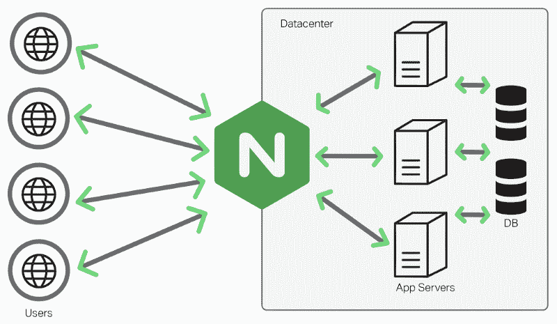

# 面向开发人员的 NGINX 简介

> 原文：<https://www.freecodecamp.org/news/an-introduction-to-nginx-for-developers-62179b6a458f/>

斯特凡诺斯·瓦达洛斯

# 面向开发人员的 NGINX 简介


想象一下——您已经创建了一个 web 应用程序，现在正在寻找合适的 web 服务器来托管它。

您的应用程序可能包含多个静态文件——HTML、CSS 和 JavaScript，一个后端 API 服务甚至多个 web 服务。使用 Nginx 可能是您正在寻找的，这有几个原因。

NGINX 是一个功能强大的 web 服务器，它使用非线程的、事件驱动的架构，如果配置正确，它的性能将超过 Apache。它还可以做其他重要的事情，如负载平衡、HTTP 缓存或用作反向代理。



NGINX Architecture

在本文中，我将介绍一些关于如何安装和配置 NGINX 最常见部分的基本步骤。

#### 基本安装—架构

安装 NGINX 有两种方法，要么使用预构建的二进制文件，要么从源代码开始构建。

第一种方法更容易也更快，但是从源代码构建它可以包含各种第三方模块，使 NGINX 更加强大。它允许我们定制它以适应应用的需要。

要安装一个预建的 Debian 包，你唯一要做的就是:

```
sudo apt-get updatesudo apt-get install nginx
```

安装过程完成后，您可以通过运行下面的命令来验证一切正常，这应该会打印出 NGINX 的最新版本。

```
sudo nginx -vnginx version: nginx/1.6.2
```

您的新 web 服务器将安装在位置`/etc/nginx**/**`。如果你进入这个文件夹，你会看到几个文件和文件夹。稍后需要我们注意的最重要的是文件`nginx.conf`和文件夹`sites-available`。

#### 配置设置

NGINX 的核心设置在`nginx.conf`文件中，默认情况下是这样的。

```
user www-data;worker_processes 4;pid /run/nginx.pid;events {	worker_connections 768;	# multi_accept on;}http {	sendfile on;	tcp_nopush on;	tcp_nodelay on;	keepalive_timeout 65;	types_hash_max_size 2048;	# server_tokens off;	# server_names_hash_bucket_size 64;	# server_name_in_redirect off;	include /etc/nginx/mime.types;	default_type application/octet-stream;	access_log /var/log/nginx/access.log;	error_log /var/log/nginx/error.log;	gzip on;	gzip_disable "msie6";	# gzip_vary on;	# gzip_proxied any;	# gzip_comp_level 6;	# gzip_buffers 16 8k;	# gzip_http_version 1.1;	# gzip_types text/plain text/css application/json application/x-javascript text/xml application/xml application/xml+rss text/javascript;	include /etc/nginx/conf.d/*.conf;	include /etc/nginx/sites-enabled/*;}
```

该文件被组织成**个上下文**。第一个是**事件**上下文，第二个是 **http** 上下文。这种结构支持配置的一些高级分层，因为每个上下文可以有其他嵌套的上下文，这些上下文从其父上下文继承所有内容，但也可以根据需要覆盖某个设置。

该文件中的各种内容可以根据您的需要进行调整，但是 NGINX 使用起来非常简单，您甚至可以使用默认设置。NGINX 配置文件中一些最重要的部分是:

*   **worker_processes:** 该设置定义了 NGINX 将使用的工作进程的数量。因为 NGINX 是单线程的，这个数字通常应该等于 CPU 内核的数量。
*   **worker_connections:** 这是每个工作进程的最大并发连接数，它告诉我们的工作进程 NGINX 可以同时服务多少人。它越大，NGINX 能够同时服务的用户就越多。
*   **access_log & error_log:** 这些是 NGINX 将用来记录任何错误和访问尝试的文件。这些日志通常用于调试和故障排除。
*   gzip: 这些是 NGINX 响应的 gzip 压缩的设置。启用这个选项以及默认情况下被注释掉的各种子设置，将会带来相当大的性能提升。从 GZIP 的子设置中，应该注意 gzip_comp_level，它是压缩的级别，范围从 1 到 10。一般来说，这个值不应该超过 6，因为它需要更多的 CPU 使用，所以在大小减少方面的收益是微不足道的。gzip_types 是将对其应用压缩的响应类型列表。

您的 NGINX 安装可以支持远不止一个网站，定义服务器站点的文件位于/etc/nginx/sites-available 目录中。

然而，这个目录中的文件不是“活的”——您可以在这里拥有任意多的站点定义文件，但是 NGINX 实际上不会对它们做任何事情，除非它们被符号链接到/etc/nginx/sites-enabled 目录中(您也可以将它们复制到那里，但是符号链接确保每个文件只有一个副本需要跟踪)。

这为您提供了一种快速将网站上线和下线的方法，而无需实际删除任何文件——当您准备好让一个网站上线时，将其符号链接到已启用网站并重启 NGINX。

`sites-available`目录包括虚拟主机的配置。这允许为具有独立配置的多个站点配置 web 服务器。该目录中的站点不是实时的，只有当我们创建一个到`sites-enabled`文件夹的符号链接时，这些站点才会被启用。

为您的应用程序创建一个新文件或编辑默认文件。典型的配置如下图所示。

```
upstream remoteApplicationServer {    server 10.10.10.10;}upstream remoteAPIServer {    server 20.20.20.20;    server 20.20.20.21;    server 20.20.20.22;    server 20.20.20.23;}server {    listen 80;    server_name www.customapp.com customapp.com    root /var/www/html;    index index.html        location / {            alias /var/www/html/customapp/;            try_files $uri $uri/ =404;        }        location /remoteapp {            proxy_set_header   Host             $host:$server_port;            proxy_set_header   X-Real-IP        $remote_addr;            proxy_set_header   X-Forwarded-For  $proxy_add_x_forwarded_for;            proxy_pass http://remoteAPIServer/;        }        location /api/v1/ {            proxy_pass https://remoteAPIServer/api/v1/;            proxy_http_version 1.1;            proxy_set_header Upgrade $http_upgrade;            proxy_set_header Connection 'upgrade';            proxy_set_header Host $host;            proxy_cache_bypass $http_upgrade;            proxy_redirect http:// https://;        }}
```

与`nginx.conf`非常相似，这个也使用了嵌套上下文的概念(所有这些也嵌套在 nginx.conf 的 **HTTP** 上下文中，所以它们也继承了它的所有内容)。

**服务器**上下文定义了一个特定的虚拟服务器来处理客户的请求。您可以拥有多个服务器块，NGINX 将根据`listen`和`server_name`指令在它们之间进行选择。

在服务器块中，我们定义了多个**位置**上下文，用于决定如何处理客户端请求。每当有请求进来时，NGINX 都会尝试将其 URI 与其中一个位置定义进行匹配，并相应地进行处理。

在位置上下文中可以使用许多重要的指令，例如:

*   **try_files** 将尝试提供指向根指令的文件夹下的静态文件。
*   **proxy_pass** 将请求发送到指定的代理服务器。
*   **rewrite** 将基于正则表达式重写输入的 URI，以便另一个位置块能够处理它。

**上游**上下文定义了 NGINX 将请求代理到的服务器池。在我们创建了一个上游块并在其中定义了一个服务器之后，我们就可以在我们的位置块中通过名称来引用它。此外，上游上下文可以分配许多服务器，以便 NGINX 在代理请求时进行负载平衡。

#### 启动 NGINX

完成配置并将 web 应用程序移到适当的文件夹后，我们可以使用下面的命令启动 NGINX:

```
sudo service nginx start
```

此后，每当我们更改配置时，我们只需使用下面的命令重新加载它(无需停机)。

```
service nginx reload
```

最后，我们可以使用下面的命令检查 NGINX 的状态。

```
service nginx status
```

#### 结论

有了这么多现成的特性，NGINX 可以很好地服务于您的应用程序，甚至可以用作其他 web 服务器的 HTTP 代理或负载平衡器。理解 NGINX 的工作方式和处理请求的方式将会极大地提高应用程序的负载平衡能力。