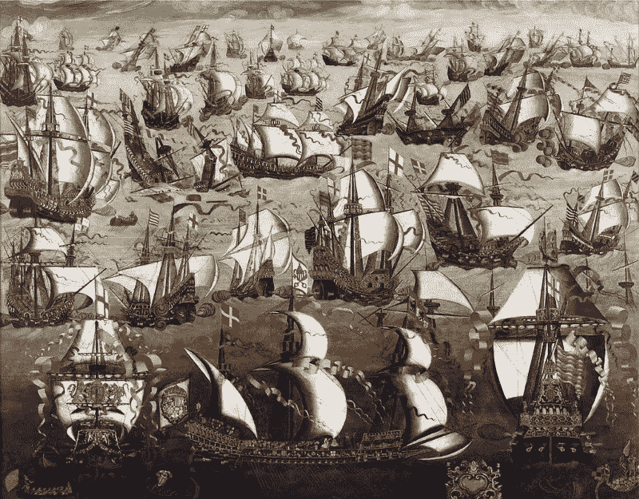

# 如何建立一个 ML 舰队并在预算内运行数百亿次 ML 预测

> 原文：<https://www.freecodecamp.org/news/ml-armada-running-tens-of-billions-of-ml-predictions-on-a-budget-f9505c820203/>

作者:马塞洛·洛蒂夫

# 如何建立一个 ML 舰队并在预算内运行数百亿次 ML 预测



English ships and the Armada Invencible. Unknown author, August 1588\. Source: [Wikipedia](https://commons.wikimedia.org/wiki/File:Invincible_Armada.jpg).

在本指南中，我们将逐步介绍如何使用 Docker 容器设置 [AWS 的 SpotFleet](https://aws.amazon.com/blogs/compute/powering-your-amazon-ecs-clusters-with-spot-fleet/) 来运行 Tensorflow 和 Keras 应用程序。

Docker 使得安装 Tensorflow 和 Keras 变得非常容易，并且可以在不同的机器上多次可靠地复制该安装。与此同时，SpotFleet 是一个启动大量机器的好工具，同时还可以利用从 AWS 的 spot 实例中节省下来的资源。将这些放在一起，您将获得强大而廉价的处理能力。

此处描述的设置旨在从头开始，让您从零开始，无需花哨的配置，只需最少的配置，就能让您入门，不会陷入常见的陷阱。

因此，这将是一个详细而简单的解释，如何把所有的部分放在一起。我希望您了解基本的 AWS 配置，并且熟悉命令行。但是，如果您已经熟悉下面的任何部分，您可以使用以下链接跳过它们:

1.  [构建张量低+喀尔巴阡—启用坞站映像](#7246)
2.  [将您的 docker 映像推送到 AWS 并创建任务定义](#1ca7)
3.  [请求 SpotFleet](#e9a7)
4.  [设置您的 ECS 集群以将 Docker 容器运行到 SpotFleet 机器中](#0fff)
5.  [现实生活中的应用和结果](#07fc)

最后一部分解释了这种设置如何帮助我们运行我所在公司(暂时未披露)的一次回填所需的数十亿次预测，以及与市场上其他现成的解决方案相比为我们节省资金。

### 1.构建 tensorlow+keras-enabled dock image

我们将从[利用 tensorflow 团队](https://github.com/tensorflow/tensorflow/blob/master/tensorflow/tools/docker/README.md)完成的工作开始，使用 [tensorflow/tensorflow 公共 Docker 图像](https://hub.docker.com/r/tensorflow/tensorflow/)之一来构建我们自己的图像。

首先，克隆我制作的 [Keras/Docker hello world 项目](https://github.com/lotif/keras-docker-hello-world)来让我们开始:

```
$ git clone https://github.com/lotif/keras-docker-hello-world.git
```

**注:**我试图做你需要的最基本的工作，以便建立一个训练样本模型的 Docker 映像。为了制作`hello_world.py`文件，我使用了[这个教程](https://elitedatascience.com/keras-tutorial-deep-learning-in-python)，做了一些小的修改，使它可以与 Keras 2 一起工作。

我不会详细介绍如何设置这一切，但是如果您有任何问题，请不要犹豫，在这里或在 Github repo 中提出来。

其次，[在您的本地机器上安装 Docker](https://docs.docker.com/install/)(如果您还没有安装的话),并在本地构建映像:

```
$ docker build -t hello-world .
```

完成后，您应该会在最后看到如下日志:

```
[...]Successfully built 3841f29fa5b9Successfully tagged hello-world:latest
```

现在是测试它的时候了:

```
$ docker run hello-world:latest
```

所有的乐趣现在都要开始了——模型将被建立，它应该开始训练。它将运行几分钟，完成后将生成如下日志消息:

```
[...]Epoch 9/1060000/60000 [===============] - 12s - loss: 0.1022 - acc: 0.9679     Epoch 10/1060000/60000 [===============] - 12s - loss: 0.0991 - acc: 0.9695#############################Score: [0.06286391887611244, 0.9799]Training Finished! Exiting...
```

太好了！现在我们有了一个训练模型的工作 Docker 映像。是时候把它放到云中了:)

### 2.将 docker 映像推送到 AWS 并创建任务定义

你应该[在你的本地机器](https://docs.aws.amazon.com/cli/latest/userguide/installing.html)上安装 AWS 命令行，基本上按照[这个 AWS 指南](https://docs.aws.amazon.com/AmazonECS/latest/developerguide/docker-basics.html#use-ecr)做一个重要的改变:

*   在[下一步](https://docs.aws.amazon.com/AmazonECS/latest/developerguide/docker-basics.html#docker_next_steps)部分，我将 JSON 简化成如下代码。确保在运行之前用您的 AWS 帐户 id 替换`<aws-account-` id >。

此外，不要担心现在用`hello-world`任务定义“步骤来运行任务。我们稍后将设置 ECS。

有两个主要的修改首先，删除了我们现在不需要的某些配置。其次，我们将使用`memoryReservation`属性来代替`memory`。这样，如果超过内存限制，你的容器就不会崩溃。第三，还有从 *Dockerfile* 借用的`command`属性。你可以根据你的项目修改它。

您可以通过访问 AWS 上的 [ECS 的任务定义部分](https://console.aws.amazon.com/ecs/home?region=us-east-1#/taskDefinitions)来检查您的任务定义。

现在我们准备好组建我们的舰队了！

### 3.请求派遣舰队

我制作了一个简化的 JSON 来帮助您入门，但是如果您愿意使用的话，Spot 请求的 UI 也不错。在这一部分的末尾有它的快速说明。

我个人更喜欢 JSON 方法，因为它易于文档化和版本化，而且更快更灵活。还有一些事情你不能使用 UI 来做，比如[实例加权](https://docs.aws.amazon.com/AWSEC2/latest/UserGuide/spot-fleet.html#spot-instance-weighting)。你可以查看 [AWS 参考文件](https://docs.aws.amazon.com/AWSEC2/latest/APIReference/API_SpotFleetRequestConfigData.html)了解其方案的完整规格。

车队配置可以随意更改。但是，为了让它与 ECS 群集一起正常工作，您需要做一些事情:

1.  **AMI:** 它必须是[列表](https://docs.aws.amazon.com/AmazonECS/latest/developerguide/ecs-optimized_AMI.html)中的一个 ECS 优化的 AMI id。选择你正在创建舰队的区域。
2.  **Key pair:** 您拥有的 AWS 密钥对的名称，这样如果您需要检查 Docker 日志或调试任何东西，您就可以 *ssh* 到实例中。如果你还没有，你可以去 EC2 上的[密钥对，点击**创建密钥对**。](https://console.aws.amazon.com/ec2/v2/home#KeyPairs)
3.  **IAM 车队角色:**使用`AmazonEC2SpotFleetRole`策略为 EC2 服务分配一个 IAM 角色。您可能需要为此创建一个新的。
4.  **IAM 实例概要:**使用`AmazonEC2ContainerServiceforEC2Role`策略为 EC2 服务分配一个 IAM 角色。您可能需要为此创建一个新的。

将这些值放入下面文件的占位符中，以获得 JSON 格式的最终 spot fleet 请求:

有了最终文件，你现在可以运行下面的`request-spot-fleet`命令(完整规格[在这里](https://docs.aws.amazon.com/cli/latest/reference/ec2/request-spot-fleet.html)，它会为你请求舰队:

> **小心:**如果这个命令发现机器的价格比给定的配置价格更便宜，那么它实际上会请求 EC2 实例。

```
$ aws ec2 request-spot-fleet --spot-fleet-request-config file:///path/to/spot-fleet-config.json
```

你完了！现在，您应该能够转到 [EC2 Spot Requests](https://console.aws.amazon.com/ec2sp/v1/spot/home) 页面，并在那里看到您的车队。也可以从那里检查状态并关闭舰队。

您可以在`LaunchSpecifications`列表中添加任意多的实例类型。由于我们已经将分配策略设置为`lowestPrice`，SpotFleet 将根据当前现货价格请求最便宜类型的实例。

要通过 UI 做到这一点，[转到 Spot 请求页面](https://console.aws.amazon.com/ec2sp/v1/spot/home)并点击**请求 Spot 实例**按钮。然后点击**请求并保持**，你应该可以请求一个现货舰队。不要忘记更改我上面提到的四个项目，否则它将无法加入 ECS 集群。

### 4.设置 ECS 集群以将 Docker 容器运行到 SpotFleet 机器中

通过使用上述配置创建一个机群，您还将允许它在 ECS 上为您创建一个默认集群，并将机群实例分配给它。现在，您可以转到 [ECS 集群页面](https://console.aws.amazon.com/ecs/home?#/clusters)，您应该能够看到这个默认集群并对其进行管理。

在默认的集群页面中，有一个名为 **ECS Instances** 的选项卡，在这里您应该能够看到您刚刚启动的车队的实例。他们目前正在运行空。

现在是让机器来工作的时候了！为此，需要创建一个 ECS 服务，以便它可以自动将 Docker 任务分配给这些机器并开始执行。

为此，使用`create-service`命令(完整规格[此处为](https://docs.aws.amazon.com/cli/latest/reference/ecs/create-service.html)):

```
aws ecs create-service --service-name hello-world-service --cluster default --task-definition hello-world-task-def --desired-count 4
```

现在，您应该能够转到集群的 **Services** 选项卡，并在那里看到您新创建的服务。

您可能已经注意到，我已经在上面的命令中将期望的计数设置为 4。你可能也注意到了，我已经把舰队的目标容量设置为 2。如果您给它几分钟时间，该服务将自动将这些任务分布到实例中，在每个实例中启动 2 个 Docker 容器。太棒了，不是吗？

您可以通过更改`create-service`命令上的`--placement-strategy`参数来自定义该行为。

Docker 容器将启动并执行任务定义上的命令。当它完成时，任务将会停止，服务将会启动另一个任务重新开始，总是试图保持它的 4 个任务运行的计数。

要查看日志并检查 Docker 容器是否正常运行，您应该 *ssh* 进入机器，执行一个`docker container ls`，获取您的容器的散列号，并执行一个`docker logs <container-ha` sh >。但是这对于大量的机器来说是不可伸缩的。整合我们需要的所有日志可能需要另一篇文章:)

您可以对服务进行许多其他配置，包括分配策略、健康检查和自动伸缩。你应该根据你的需要来调整它们。

### 5.现实生活中的应用和结果

现在，我将介绍我们这一解决方案的基本原理，以及它如何帮助解决我们公司在应用程序中大规模采用机器学习的最紧迫问题。

#### 为什么选择 SpotFleet？

[AWS 的 spot 实例](https://aws.amazon.com/ec2/spot/)是一个很棒的工具。它们是闲置的盒子，AWS 提供的价格只是全价的一小部分。

如果你正在研究机器学习，你可能会意识到有些事情需要太长时间才能运行。对于由数十万到数百万训练样本组成的真实生活数据集，训练机器学习模型是一个非常资源密集型的过程。

另一个众所周知的痛点是回填。当您有一个非常大的数据集时，即使试图为每个数据点运行一些预测也是一项艰巨的任务。

要在合理的时间内完成所有这些(读:当你还活着的时候)并且不给公司的财务造成巨大的亏空，你需要大量廉价的处理能力。SpotFleet 提供了一种无缝加速许多 spot 实例和 Docker 容器的方法，使它们以最大的并行性完成所有您需要做的事情，而成本只是总成本的一小部分。

#### 现实生活的改善

在为我们的回填运行了一些基准之后，出于成本效益的原因，我们决定使用一台每分钟能够进行 1000 次预测的机器。如果我们使用常规的 AWS 价格，在那台机器上运行一百万次预测将花费我们 1.42 美元。

看起来不错，但是使用现货定价，同样数量的预测将花费我们 0.5 美元！相当可观的节省。

另一个问题是时间。我们需要进行数百亿次预测，而仅仅一台这样的机器就需要几十年才能完成所有的工作。不太好。

但是有了 SpotFleet，我们可以一次启动大量这样的机器，根据我们的需要轻松地增减数量。

在我们的一次测试中，我们能够启动一个由 650 台机器组成的车队，并以每小时 19 美元的成本达到每小时 3500 万次预测的峰值。按照这种速度，我们可以在短短几个月内回填所有数据。现在这似乎是可行的:)

在另一个测试中，我们使用了功能更强大但价格仍可承受的机器，我们能够达到每秒 25，000 次预测的峰值，即每天超过 20 亿次！

#### 与其他按需图像处理解决方案的价格比较

让我们将这些数字与市场上几个最大的预制 ML 图像处理解决方案进行比较。我们使用 spot 实例的基准成本是 **$0.50 每百万张图像**。

[**谷歌视觉——每百万张图片 600 美元**](https://cloud.google.com/vision/pricing) **:** 根据需求有不同的层级。如果你打破每月 500 万张图片的大关，价格会下降近三分之一，我们肯定会的。为了简化计算，我只考虑最便宜的选择，但分析一百万张图像仍然要花费我们 600 美元。

[**亚马逊 Rekognition——每百万张图片 400 美元**](https://aws.amazon.com/rekognition/pricing/) :他们最便宜的层级只有在每月 1 亿张图片之后才开始生效。如果我们再次考虑最低价格以简化计算，分析一百万张图像将花费我们 400 美元。

[**亚马逊 sage maker——每百万张图片 3.97 美元**](https://aws.amazon.com/sagemaker/pricing/) **:** 这是一个更通用的 ML 解决方案，就像本指南中的那个一样，这里更容易进行比较，因为他们提供的机器与我们对回填进行基准测试的机器相同。一台每分钟能做 1000 次预测的机器需要花费 3.97 美元来获得 100 万张图像。这是这台机器正常价格的两倍多，几乎是现货价格的 8 倍。

请在评论区告诉我这个设置对你有什么帮助。欢迎任何建议和改进，如果你知道如何使这变得更好，请评论。玩得开心！