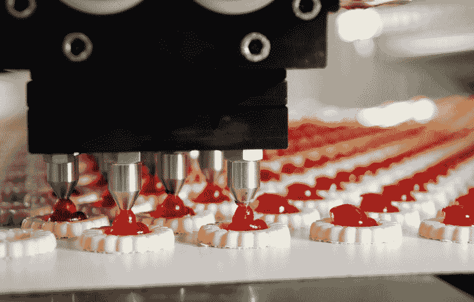

# 如何用 Sass 映射生成所有的实用程序类

> 原文：<https://www.freecodecamp.org/news/how-to-generate-all-your-utility-classes-with-sass-maps-8921ab3b4508/>

莎拉·达扬



Photo by [Vic](https://www.flickr.com/photos/59632563@N04/) on [Flickr](https://www.flickr.com/photos/59632563@N04/6645629155)

# 如何用 Sass 映射生成所有的实用程序类

实用程序类的一个强大之处在于，它让你可以在各种环境下访问设计系统的每个小概念。如果你的主色是皇家蓝，你可以把它作为文本颜色应用到任何带有`.text-royal-blue`类的东西上，作为背景颜色应用到`.bg-royal-blue`类上，等等。

但是，如何以一种有效的、一致的、可扩展的方式来编写它们呢？

***TL；*** *博士:这篇文章深入讨论了如何操作的问题。如果你想理解整个思维过程，请继续阅读。否则你可以在 [GitHub](https://gist.github.com/sarahdayan/4d2cc04a636e8039f10a889a0e29fbd9) 上抓取代码或者在 [SassMeister](https://www.sassmeister.com/gist/4d2cc04a636e8039f10a889a0e29fbd9) 上测试。*

```
$royal-blue: #0007ff;
```

```
.text-royal-blue {  color: $royal-blue;}
```

```
.bg-royal-blue {  background: $royal-blue;}
```

```
...
```

那是重复的。您不仅每次都手工输入颜色名称和值，而且还创建了一个不可维护的系统。当你有十个像这样的颜色工具，而你需要增加一种颜色的时候，会发生什么呢？

你不应该把时间花在无聊乏味的任务上。这就是脚本语言的用途。如果您已经在使用 Sass，那么您需要利用它的力量并让它帮助您。

### 什么是萨斯地图？

[映射](http://sass-lang.com/documentation/file.SASS_REFERENCE.html#Maps)是一种 Sass 数据类型，它表示**键和值**之间的关联。如果你熟悉其他脚本语言，你可以把它看作一个[关联数组](https://en.wikipedia.org/wiki/Associative_array)。它允许你存储数据，并有一个名字来引用每一块。

[列表](http://sass-lang.com/documentation/file.SASS_REFERENCE.html#Lists)和地图有点类似，因为它们都存储一组数据，并且在`@each`循环中都是可迭代的。但与列表不同，地图通过名称来引用任何信息都很容易。这使得它非常适合对逻辑上相关的信息进行分组。

```
$colors: (  mako-grey: #404145,  fuel-yellow: #ecaf2d,  pastel-green: #5ad864);
```

### 让我们添加一些逻辑

既然我们的颜色已经整齐地存储在地图中，我们需要迭代它来生成我们的实用程序类。为此，我们将在一个`@mixin`中使用`@each`指令，稍后我们将在我们的实用程序基类中包含这个指令。

```
@mixin color-modifiers {  // do stuff}
```

现在让我们使用`@each`指令遍历`$colors`并获取正确的数据。

```
@mixin color-modifiers {  @each $name, $hex in $colors {    // do stuff  }}
```

我们正在迭代`$colors`，在每一次循环中，当前键将在`$name`中被引用，颜色的十六进制代码将在`$hex`中。我们可以开始构建我们的规则集。

```
@mixin color-modifiers {  @each $name, $hex in $colors {    &-#{$name} {      color: $hex;    }  }}
```

现在，对于映射中的每一对，`@each`将生成一个规则集，该规则集引用带有`&`字符的父选择器，附加一个连字符和颜色的名称，并将`color`属性设置为当前的十六进制值。

换句话说，这样做:

```
.text {  @include color-modifiers;}
```

将生成以下内容:

```
.text-mako-grey {  color: #404145;}.text-fuel-yellow {  color: #ecaf2d;}.text-pastel-green {  color: #5ad864;}
```

很漂亮，是吧？实际上，我们只是触及了表面。目前，我们的 mixin 只能输出带有`color`属性的规则。如果我们想为背景色创建一些实用程序类呢？

幸运的是，Sass 允许我们将参数传递给 mixins。

```
@mixin color-modifiers($attribute: 'color') {  @each $name, $hex in $colors {    &-#{$name} {      #{$attribute}: $hex;    }  }}
```

现在我们可以确切地指定我们想要的属性。

让我们再改进一下 mixin:现在，修饰符前缀是硬编码的连字符。这意味着你的类总是以`.base-modifier`的形式出现。如果你需要它来改变呢？如果您还想生成一些 BEM 风格的修饰符(两个连字符)呢？同样，这是我们可以通过使用论点来实现的。

```
@mixin color-modifiers($attribute: 'color', $prefix: '-') {  @each $name, $hex in $colors {    &#{$prefix}#{$name} {      #{$attribute}: $hex;    }  }}
```

现在我们可以用我们想要的任何类型的前缀生成修饰符类。所以，这样做:

```
.text {  @include color-modifiers($prefix: '--');}
```

将生成以下内容:

```
.text--mako-grey {  color: #404145;}.text--fuel-yellow {  color: #ecaf2d;}.text--pastel-green {  color: #5ad864;}
```

**Pro 提示**:在 Sass 中，当调用 mixin 或函数时，可以显式命名参数(就像上面的例子)。这避免了必须按顺序提供它们。

### 地图中的地图

我喜欢使用稍微不同的颜色系统，这样我可以管理色调的变化。通过在贴图中嵌套贴图，我有了一个清晰易读的方法来将阴影组织在一起。

```
$colors: (  grey: (    base: #404145,    light: #c7c7cd  ),  yellow: (    base: #ecaf2d  ),  green: (    base: #5ad864  ));
```

如果我们想使用这样的颜色系统，我们需要调整我们的 mixin，这样它就可以更深入地迭代。

```
@mixin color-modifiers($attribute: 'color', $prefix: '-', $separator: '-') {  @each $name, $color in $colors {    &#{$prefix}#{$name} {      @each $tone, $hex in $color {        &#{$separator}#{$tone} {          #{$attribute}: $hex;        }      }    }  }}
```

我们添加了一个新的参数`$separator`，将颜色的名称和色调联系起来。我们本可以使用`$prefix`，但它没有相同的用途。使用带有默认值的专用变量是一个更好的选择，因为当我们使用 mixin 时，它给了我们充分的自由。

现在，这样做:

```
.text {  @include color-modifiers;}
```

将生成以下内容:

```
.text-grey-base {  color: #404145;}.text-grey-light {  color: #c7c7cd;}.text-yellow-base {  color: #ecaf2d;}.text-green-base {  color: #5ad864;}
```

太好了！我们现在有了由基类、颜色和色调组成的助手。不过，我们需要改进的一点是基色修改器的输出方式。我们实际上不需要那个`-base`后缀——基类和颜色就足够了。

我们必须做的是检查嵌套的`@each`循环中的音调，只有当它不是“base”时才输出它和`$separator`。幸运的是，萨斯已经有了我们需要的一切。

### @if，@else，if()

我们的第一反应可能是使用`@if/@else`指令。问题是，这将迫使我们重复代码，并将导致复杂的代码。相反，我们要使用萨斯的秘密武器之一:`if()`。

`if()`是萨斯的‘条件(三元)运算符。它需要三个参数:一个条件和两个 return 语句。如果条件满足，`if()`将返回第一条语句。否则，它将返回第二个。你可以把它看作是`@if/@else`的速记。

```
@mixin color-modifiers($attribute: 'color', $prefix: '-', $separator: '-', $base: 'base') {  @each $name, $color in $colors {    &#{$prefix}#{$name} {      @each $tone, $hex in $color {        &#{if($tone != $base, #{$separator}#{$tone}, '')} {          #{$attribute}: $hex;        }      }    }  }}
```

每次嵌套的`@each`循环将解析不同于“base”的`$tone`，它将返回`$separator`和`$tone`作为类后缀。否则，它将不返回任何内容，保持类的原样。

```
.text-grey {  color: #404145;}.text-grey-light {  color: #c7c7cd;}.text-yellow {  color: #ecaf2d;}.text-green {  color: #5ad864;}
```

### 擦干它

在现实世界的项目中，您可能需要使用各种地图结构。例如，对于字体大小，可以有一级深度贴图，对于颜色，可以有两级深度贴图。你不需要为每个深度级别编写不同的混音。这将是重复和不可维护的。你需要能够依靠一个 mixin 来处理这个问题。

我们想要一个通用的 mixin 来生成所有的修改器，并且能够处理多维贴图。如果你比较我们在本教程中提出的两种混音，你会发现它们看起来非常相似。唯一的区别是在打印计算出的 CSS 声明之前执行一个额外的循环。这是一个典型的**递归混音**的工作。

它将从一个`@each`指令开始，在那里我们可以开始构建我们的选择器。这里我们将检查当前的`$key`是否等于“base ”,这样我们就可以决定是否输出它。然后，我们将检查当前的`$value`是否是一个地图本身:如果是，我们需要从我们所在的地方再次运行 mixin 并传递嵌套的地图给它。否则，我们可以打印 CSS 声明。

```
@mixin modifiers($map, $attribute, $prefix: '-', $separator: '-', $base: 'base') {  @each $key, $value in $map {    &#{if($key != $base, #{$prefix}#{$key}, '')} {      @if type-of($value) == 'map' {        @include modifiers($value, $attribute, $separator);      }      @else {        #{$attribute}: $value;      }    }  }}
```

然后*瞧啊*！这个混合将与任何深度的地图一起工作。请随意在您自己的项目中使用它！如果你喜欢它，你可以通过 GitHub 上的[主演来表达你的爱。还有，如果你想改进，请留言评论大意，我好更新？](https://gist.github.com/sarahdayan/4d2cc04a636e8039f10a889a0e29fbd9)

*最初发表于 [frontstuff.io](https://frontstuff.io/generate-all-your-utility-classes-with-sass-maps) 。*