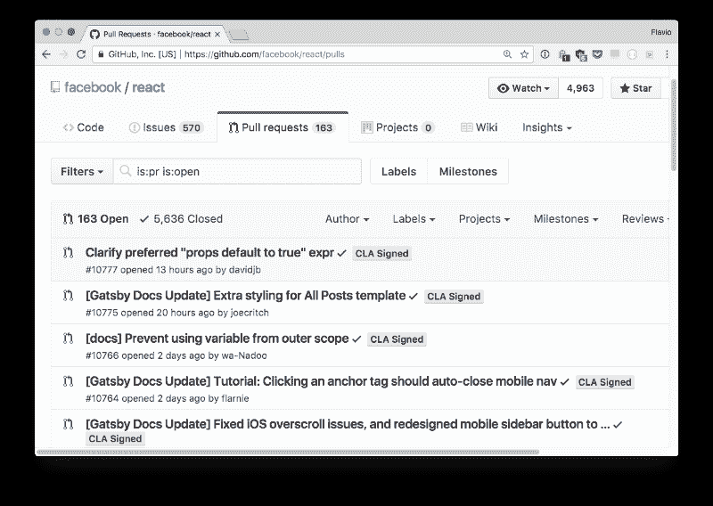
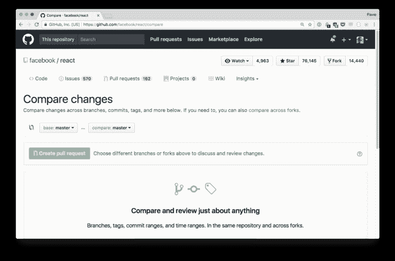
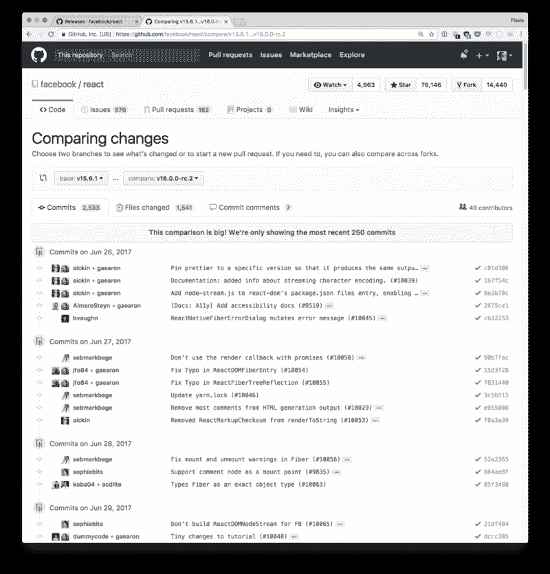

# GitHub 的开发者介绍

> 原文：<https://www.freecodecamp.org/news/a-developers-introduction-to-github-1034fa55c0db/>

> 对学习 JavaScript 感兴趣？在 jshandbook.com 获得我的电子书

GitHub 是一个拥有数十亿行代码的网站，每天数百万开发人员聚集在这里合作并报告开源软件的问题。

简而言之，它是一个面向软件开发人员的平台，并且是围绕 Git 构建的。

*提示:如果你还不知道 Git，[查看我的 Git 指南](https://flaviocopes.com/git-guide)。*

作为一名开发人员，**你无法避免在日常工作中使用 GitHub 或其他基于 Git 的工具**。它用于托管您的代码或协作开发其他人的代码。本文解释了 GitHub 的一些关键概念，以及如何使用它的一些特性来改进您的工作流程。

### 为什么选择 GitHub？

现在你知道 GitHub 是什么了，你可能会问为什么要用它。

毕竟 GitHub 是由私人公司管理的，它通过托管人们的代码来获利。那么，你为什么要使用它，而不是类似的平台，如 BitBucket 或 GitLab 呢？

除了个人喜好，和技术原因，还有一个很大的原因:大家都用 GitHub，所以网络效应巨大。

由于 Git 的便利性，随着时间的推移，主要的代码库已经从其他版本控制系统迁移到 Git，GitHub 在历史上一直处于有利地位，并投入了大量精力来满足开源社区的需求。

所以今天，任何时候你查找某个库，99%的时间你都会在 GitHub 上找到它。

除了开源代码，由于平台的便利性，许多开发人员也在 GitHub 上托管私有存储库。

现在让我们从开发人员需要了解的重要 Git 特定概念开始。

### GitHub 问题

GitHub issues 是世界上最流行的 bug 追踪器之一。

它们为存储库的所有者提供了组织、标记问题以及将问题与里程碑相关联的能力。

如果您在其他人管理的项目中打开了一个问题，它将保持打开状态，直到您关闭它(例如，如果您发现了您遇到的问题)或回购负责人关闭它。

有时你会得到一个明确的答案，而在其他时候，这个问题会被搁置，并标记一些分类信息。然后，开发人员可以回去解决问题，或者根据您的反馈改进代码库。

大多数开发人员没有得到报酬来支持他们在 GitHub 上发布的代码，所以你不能指望得到及时的回复。但是，一些开源存储库是由围绕这些代码提供服务的公司发布的，这些公司为具有更多功能的版本提供商业产品，或者利用基于插件的架构。所以他们付钱给从事开源项目的开发者。

### 社会编码

Image credit: [https://octodex.github.com](https://octodex.github.com)

几年前，GitHub 的标志包括了“社会编码”的标语。

这是什么意思，这仍然相关吗？的确如此。

#### 跟随

使用 GitHub，你可以通过访问用户的个人资料并点击“关注”，或者点击 repo 上的“关注”按钮来关注开发者或存储库。

在这两种情况下，活动都会显示在您的仪表板中。关注用户或存储库与 Twitter 不同，在 Twitter 上你可以看到人们**说什么**——相反，你可以看到人们**做什么**。

#### 明星

GitHub 的一大特色是能够**启动存储库**。此操作会将其包括在您的“带星号的存储库”列表中，这允许您跟踪您感兴趣的项目并发现类似的项目。

这也是最重要的评级机制之一，因为回购的星级越多，它通常就越受欢迎和重要。这导致它在搜索结果中更加突出。

重大项目可以有上万颗星。

GitHub 也有一个[趋势页面](https://github.com/trending)，在那里它展示了在一段确定的时间内(例如，今天、本周或本月)获得最多明星的存储库。

进入这些趋势列表可以产生其他网络效应，比如出现在其他网站上，只是因为你有更多的可见性。

#### 叉

项目最后一个重要的网络指标是分叉数。

这是 GitHub 工作的关键，因为 fork 是 Pull Request (PR)的基础，而 Pull Request 是一个变更提议。有人可能会派生您的存储库，进行一些更改，然后创建一个拉请求，要求您合并这些更改。

有时分支存储库的人可能永远不会让你合并任何东西。他们可能只是因为喜欢你的代码，决定在你的代码上添加一些他们不想合并回原来的代码库的东西，而派生出你的代码库。用户也可以修复他们遇到的特定于他们的错误。

#### 受欢迎=更好

总而言之，这些都是项目受欢迎程度的关键指标。除了上面的指标，最近一次提交的日期和作者在问题追踪器中的参与是你是否应该依赖一个库或软件的有用指示。

### 拉取请求

在前一节中，我介绍了什么是拉取请求(PR)。重申一下，一个人可能会派生您的存储库，进行一些更改，然后创建一个 pull 请求，要求您合并这些更改。

一个项目可能有数百个 pr，通常情况下，一个项目越受欢迎，它的 pr 就越多，如 React 项目:

一旦一个人提交了一个 pull 请求，它需要被项目的核心维护者审查。

根据你的拉请求的**范围**(变更的数量，受你的变更影响的事情的数量，或者接触的代码的复杂性)维护者可能需要或多或少的时间来确保你的变更与项目兼容。

一个项目可能有一个他们想要引入的变更的清晰的时间表。当您在 pull 请求中引入一个复杂的架构时，维护者可能希望事情简单一些。

这就是说**拉请求并不总是很快被接受**，并且**也不能保证拉请求会被接受**。

在我上面发布的例子中，回购中有一个 pull 请求，可以追溯到 1.5 年前。而且这种情况发生在**所有**项目中——这很正常，可能是由于我上面提到的原因。

### 项目管理

除了开发人员从用户那里获得反馈的问题之外，GitHub 接口还提供了其他功能，旨在提供一些项目管理功能。

其中之一就是**项目**。它在生态系统中非常新，很少使用，但它是一个**看板**，帮助组织需要完成的问题和工作。

**Wiki** 旨在用作用户的文档。到目前为止，我见过的最令人印象深刻的维基用法之一是 [Go 编程语言 GitHub Wiki](https://github.com/golang/go/wiki) 。

另一个流行的项目管理辅助工具是**里程碑**。它是问题页面的一部分，您可以将问题分配给特定的里程碑，这些里程碑可以是发布目标。

说到版本，GitHub 通过引入**版本**增强了 **Git 标签**的功能。

Git 标记是一个指向特定提交的指针，如果坚持使用，它可以帮助您回滚到代码的前一个版本，而无需引用特定的提交。

GitHub 版本建立在 Git 标签之上，代表代码的完整版本，以及 Zip 文件、发行说明和二进制资产，它们可能代表代码最终产品的完整工作版本。

虽然 Git 标签可以通过编程方式创建(例如，使用命令行`git`程序)，但创建 GitHub 版本是一个通过 GitHub UI 进行的手动过程。你基本上是告诉 GitHub 创建一个新的版本，并告诉他们你想把这个版本应用到哪个标签上。

### 比较提交

GitHub 提供了许多工具来处理你的代码。

你可能想做的最重要的事情之一是比较一个分支和另一个分支。或者，您可能希望将最新提交的版本与您当前使用的版本进行比较，以查看随着时间的推移做了哪些更改。

GitHub 允许你用**比较视图**来做到这一点:只需在 repo 名称的末尾加上`/compare`。

例如，[https://github.com/facebook/react/compare](https://github.com/facebook/react/compare)

在下图中，我将最新的 **React v15.x** 与撰写本文时可用的最新 **v16.0.0-rc** 版本进行了比较，以查看有什么变化。

这个视图向您显示了**在两个被更改的发布(或者标签或者提交引用)之间所做的提交**，以及**实际的差异**，**，如果更改的数量低于合理的数量**。

### 网页挂钩和服务

GitHub 提供了许多有助于开发者工作流程的特性，比如 webhooks 和服务。

#### Webhooks

Webhooks 允许在存储库中发生某些事件时对外部服务进行 ping 操作，例如，当推送代码、生成分叉、创建或删除标记时。

当事件发生时，GitHub 向我们告诉它使用的 URL 发送 POST 请求。

这个特性的一个常见用法是，当我们从本地计算机推送更新时，ping 远程服务器以从 GitHub 获取最新的代码。

我们推送到 GitHub，GitHub 告诉服务器我们推的，服务器从 GitHub 拉。

#### 服务

GitHub 服务和新的 GitHub 应用程序是第三方集成，可以改善开发者体验或为您提供服务。

例如，您可以使用 [TravisCI](https://travis-ci.org/) 设置一个测试运行器，在每次推送新的提交时自动运行测试。

您可以使用 [CircleCI](https://circleci.com/) 设置持续集成。

您可能会创建一个 [Codeclimate](https://codeclimate.com/) 集成来分析代码，并提供一份“技术债务”和测试覆盖的报告。

### 最后的话

GitHub 是一个值得利用的令人惊叹的工具和服务，是当今开发者工具集中的真正瑰宝。本教程将帮助您入门，但从事 GitHub 开源(或闭源)项目的真实体验是不容错过的。

> 对学习 JavaScript 感兴趣？在 jshandbook.com 获得我的电子书