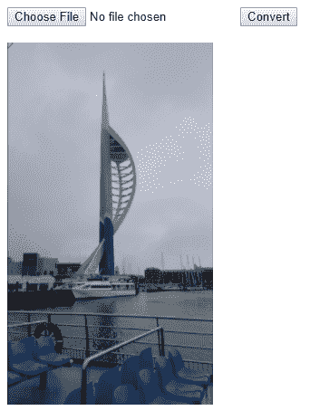
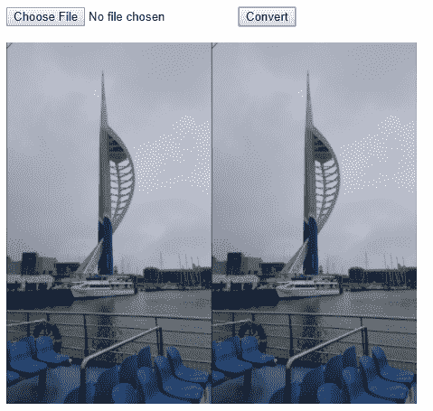
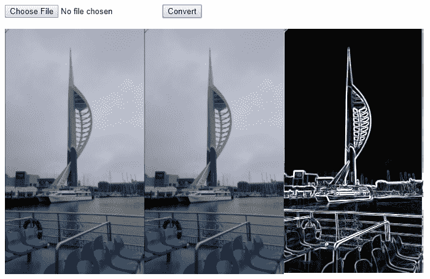
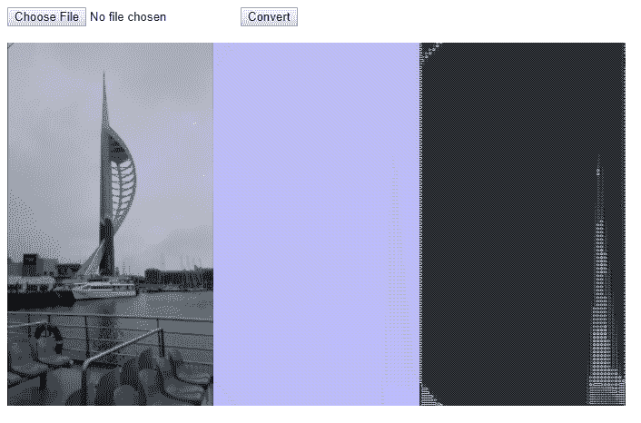

# 如何在 WebAssembly 中使用 WebGL 着色器

> 原文：<https://www.freecodecamp.org/news/how-to-use-webgl-shaders-in-webassembly-1e6c5effc813/>

由丹路

# 在 WebAssembly 中使用 WebGL 着色器


WebAssembly 在[数字处理](https://ai.danruta.co.uk/webassembly)、[游戏引擎](http://webassembly.org/demo/)和许多其他事情上速度极快，但没有什么能与运行在 GPU 上的着色器的极端并行化相提并论。

如果你想做一些图像处理，尤其如此。通常，在 web 上，这是通过 WebGL 完成的，但是当使用 WebAssembly 时，如何访问它的 API 呢？

### 安装

我们将非常简要地介绍如何设置一个示例项目，然后我们将看看如何将图像作为纹理加载。然后，在一个单独的上下文中，我们将对图像应用边缘检测 GLSL 着色器。

所有的代码都在这里的回购协议中，如果你想直接跳到那里的话。请注意，您必须通过服务器提供文件，WebAssembly 才能工作。

作为先决条件，我将假设您已经设置了 WebAssembly 项目。如果没有，你可以查看文章[这里](https://medium.com/statuscode/setting-up-the-ultimate-webassembly-c-workflow-6484efa3e162)如何做到这一点，或者只是叉上面链接的回购。

为了演示下面的代码，我使用了一个基本的 html 文件，它只用来加载一个图像，获取它的 imageData，并使用[*ccallArrays*函数](https://becominghuman.ai/passing-and-returning-webassembly-array-parameters-a0f572c65d97)将它传递给 WebAssembly 代码。



The HTML file with the preview input image

至于 C++代码，有一个 emscripten.cpp 文件，它管理方法调用并将其路由到在 Context.cpp 文件中创建的上下文实例。Context.cpp 文件的结构如下:

### 汇编

WebGL 基于并遵循 OpenGL ES(嵌入式系统)规范，它是 OpenGL 的一个子集。编译时，emscripten 会将我们的代码映射到 WebGL API。

我们可以瞄准几个不同的版本。OpenGL ES 2 映射到 WebGL 1，而 OpenGL ES 3 映射到 WebGL 2。默认情况下，你应该瞄准 WebGL 2，因为它附带了[一些免费的优化和改进](https://github.com/kripken/emscripten/blob/incoming/site/source/docs/optimizing/Optimizing-WebGL.rst#which-gl-mode-to-target)。

为此，我们必须将[标志`USE_WEBGL2=1`添加到编译中。](https://kripken.github.io/emscripten-site/docs/porting/multimedia_and_graphics/OpenGL-support.html#webgl-friendly-subset-of-opengl-es-2-0-3-0)

如果你计划使用一些在 WebGL 规范中没有的 OpenGL ES 特性，你可以使用 t [和/或`FULL_ES3=1`标志](https://kripken.github.io/emscripten-site/docs/porting/multimedia_and_graphics/OpenGL-support.html#opengl-es-2-0-3-0-emulation)。

为了能够处理大的纹理/图像，我们还可以添加[`ALLLOW_MEMORY_GROWTH=1`标志](https://kripken.github.io/emscripten-site/docs/optimizing/Optimizing-Code.html#memory-growth)。这消除了 WebAssembly 程序的内存限制，但代价是一些优化。

如果您提前知道需要多少内存，您可以使用`TOTAL_MEMORY=X`标志，其中 X 是内存大小。

所以我们最终会得到这样的结果:

`emcc -o ./dist/appWASM.js ./dev/cpp/emscripten.cpp -O3 -s ALLOW_MEMORY_GROWTH=1 -s USE_WEBGL2=1 -s FULL_ES3=1 -s WASM=1 -s NO_EXIT_RUNTIME=1 -std=c++1z`

最后，在我们的代码中，我们需要以下导入:

```
#include <emscripten.h>#include <string>#include <GLES2/gl2.h>#include <EGL/egl.h>extern "C" {       #include "html5.h" // emscripten module}
```

### 履行

如果你以前有过使用 WebGL 或 OpenGL 的经验，那么这一点可能看起来很熟悉。

当编写 OpenGL 时，API 将不会工作，直到你创建一个上下文。这通常是使用特定于平台的 API 来完成的。然而，网络是不受平台限制的，我们可以使用集成到 OpenGL ES 中的 API。

然而，使用 html5.h 文件中的【emscripten 的 API 可以更容易地实现大部分的跑腿工作。我们感兴趣的函数有:

*   *EMS cripten _ web GL _ create _ context*—这将为给定的画布和属性实例化一个上下文
*   *EMS cripten _ web GL _ destroy _ context*—这是在析构上下文实例时清理内存所需要的
*   *em scriten _ webgl _ make _ context _ current*—这将分配和切换 web GL 将渲染到的上下文

#### 创建上下文

要开始实现，您必须首先在 JavaScript 代码中创建 canvas 元素。然后，当使用`emscripten_webgl_create_context` 函数时，将画布的 id 作为第一个参数传递，将任何配置作为第二个参数传递。`emscripten_webgl_make_context_current` 函数用于将新的上下文设置为当前正在使用的上下文。

接下来，顶点着色器(指定坐标)和片段着色器(计算每个像素的颜色)都被编译，程序被构建。

最后，将着色器附加到程序，然后链接并验证程序。

虽然这听起来很多，但代码如下:

着色器编译在`CompileShader`辅助函数中完成，该函数执行编译，打印出任何错误:

#### 创建着色器

此示例的着色器代码很少，它只是将每个像素映射到自身，以将图像显示为纹理:

除了 C++代码中的上下文之外，您还可以在 JavaScript 中访问 canvas 的上下文，但它必须是同一类型，“webgl2”。虽然定义多个上下文类型在仅使用 JavaScript 时没有任何作用，但是如果您在 WebAssembly 中创建 webgl2 上下文之前这样做，当代码执行到那里时，它将抛出一个错误。

#### 加载纹理

应用着色器时要做的第一件事是调用`emscripten_webgl_make_context_current`函数来确保我们仍然使用正确的上下文，并调用`glUseProgram`来确保我们使用正确的程序。

接下来，我们通过`glGetAttribLocation`和`glGetUniformLocation` 函数获得 GLSL 变量的索引(类似于获得一个指针)，因此我们可以将自己的值赋给这些位置。用来做这件事的函数取决于值类型。

例如，一个整数，比如纹理位置需要`glUniform1i`，而一个浮点则需要`glUniform1f`。[这是一个了解你需要使用哪个功能的好资源](https://www.khronos.org/registry/OpenGL-Refpages/es3.0/html/glUniform.xhtml)。

接下来，我们通过`glGenTextures`获取纹理对象，将其指定为活动纹理，并加载 imageData 缓冲区。然后绑定顶点和索引缓冲区，以设置纹理的边界来填充画布。

最后，我们清除现有的内容，用数据定义剩余的变量，并绘制到画布上。



The texture being loaded

#### 使用着色器检测边缘

为了添加另一个上下文，在边缘检测完成的地方，我们加载了一个不同的片段着色器(它应用了 [Sobel](https://en.wikipedia.org/wiki/Sobel_operator) 过滤器)，并且我们在代码中将宽度和高度绑定为额外的变量。

为了在不同的片段着色器之间进行选择，对于不同的上下文，我们只需在构造函数中添加一个 if-else 语句，如下所示:

为了加载宽度和高度变量，我们将以下内容添加到 run 函数中:



如果您遇到类似于`ERROR: GL_INVALID_OPERATION : glUniform1i: wrong uniform function for type`的错误，那么对于给定的变量有一个不匹配的赋值函数。

发送 imageData 时要注意的一点是使用正确的堆，无符号整数(Uint8Array 类型化数组)。你可以在这里了解更多关于那些[的信息，但是如果你正在使用 ccallArray 函数，设置“ *heapIn* 配置为“ *HEAPU8* ”，如上图所示。](https://becominghuman.ai/passing-and-returning-webassembly-array-parameters-a0f572c65d97)

如果类型不正确，纹理仍然会加载，但你会看到奇怪的渲染，就像这样:



### 结论

我们经历了一个迷你的“你好世界！”-style 项目，显示如何在 WebAssembly 中加载纹理并对其应用 GLSL 着色器。完整的代码存放在 GitHub [这里是](https://github.com/DanRuta/webassembly-webgl-shaders)，供进一步参考。

对于一个真实的项目，您可能想要添加一些额外的错误处理。为了清楚起见，我在这里省略了它。

在上下文之间共享诸如 imageData 纹理之类的数据也可能更有效(在上面的例子中)。你可以在这里阅读更多相关信息和更多[。](https://blog.gvnott.com/some-usefull-facts-about-multipul-opengl-contexts/)

为了进一步阅读，你可以查看[这个链接](https://www.khronos.org/opengl/wiki/Common_Mistakes)中的常见错误，或者你可以在 GitHub 上查看 emscripten 的 [glbook](https://github.com/kripken/emscripten/tree/incoming/tests/glbook) 文件夹中的一些演示项目。

要查看 WebAssembly 项目中使用的 WebGL，您可以查看 jsNet 上的 [dev 分支，这是一个基于 web 的深度学习框架，在接下来的几周内，我将致力于将更重的计算转移到着色器上(通过 OpenGL ES 3.1 支持 WebGL 计算着色器](https://github.com/DanRuta/jsNet/tree/dev)[不能很快实现](https://www.khronos.org/webgl/public-mailing-list/public_webgl/1706/msg00034.php)？).

**更新**

要了解使用着色器的 GPU 计算在 WebAssembly 中是什么样子，您可以查看我正在开发的一个小库 GPGPU 的 repo，它有 JavaScript 和 WebAssembly 两个版本。