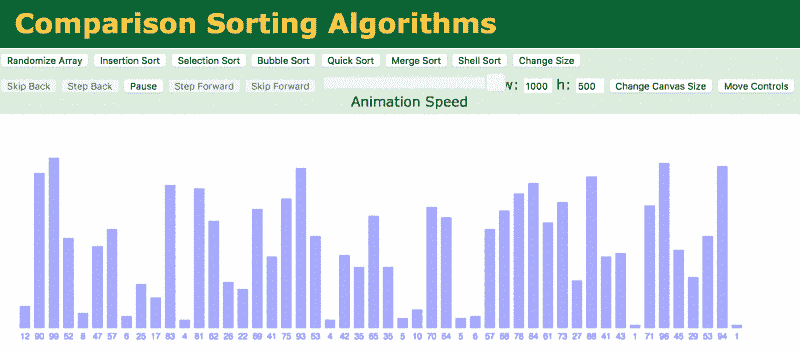

# 我开发了一个应用程序，让学习算法和数据结构变得更加有趣

> 原文：<https://www.freecodecamp.org/news/i-built-an-app-that-makes-learning-algorithms-and-data-structures-way-more-fun-46fbb8afacaf/>

彼得·魏因贝格

# 我开发了一个应用程序，让学习算法和数据结构变得更加有趣

The CS-Playground-React Interface

[我是一个自学成才的程序员](https://medium.freecodecamp.org/the-freecodecamp-alumni-network-a-homegrown-mentorship-network-for-fcc-alumni-529e4531c34f)。这意味着我一直在处理[冒名顶替综合症](https://guide.freecodecamp.org/working-in-tech/imposter-syndrome)。对我来说，觉得自己能力不足并在理解复杂的计算机科学概念时处于劣势并不罕见。

我从来都不擅长数学。我一直将强大的数学技能与一个人擅长编程的天赋联系在一起。我感觉我要比其他人(在数学方面有先天技能的人)更努力地学习同样的概念。这种想法深深植根于我的大脑中，我非常确定我永远也学不会像遍历二分搜索法树这样的事情，也不会像 Mergesort 那样在头脑中解析递归噩梦。

虽然用了一点力气，我还是设法让自己大吃一惊。所以我想分享一下我是如何做到的，以及我的努力所取得的切实成果。一如既往，希望可能会有一些贡献者愿意投入！

进入 [CS-Playground-React](http://cs-playground-react.surge.sh/) ，这是一个简单的浏览器内 JavaScript 沙盒，用于学习和练习算法和数据结构。

这款无需注册的面试准备应用程序会自动保存你的进度，为你遇到困难时提供解决方案，并提供大量有用文章、教程和其他资源的[链接](https://github.com/no-stack-dub-sack/cs-playground-react/blob/master/RESOURCES.md)，让你的旅程比我的旅程少很多痛苦！

让我坦率地承认，这个应用程序没有什么开创性的。(我知道你是这么想的！)有大量的应用程序教授类似的技能，让你能够在浏览器中编写和运行代码。

但是 CS Playground React 打算非常简约，专注于一组非常具体的主题。另外，这个*并不意味着*会成为下一个大事件。开发这个应用只是我让学习变得有趣的一种方式。如果它最终成为一个有价值的资源，哪怕是对另外一个人，那就更好了。

该应用程序仍在开发中，当涉及到主题和潜在功能时，还有大量的内容要介绍。因此，如果你知道一个我没有提到的很酷的挑战或数据结构，或者看到你认为可以改进的地方，不要犹豫[提出一个问题](https://github.com/no-stack-dub-sack/cs-playground-react/issues/new)或提交一个拉请求。？

如果你只是想看看这个应用程序，不要再看了——它是实时的[这里](http://cs-playground-react.surge.sh)(也可以通过 https 获得，将注册服务人员进行离线缓存)。

如果你对代码感兴趣，[不用再找了](https://github.com/no-stack-dub-sack/cs-playground-react)。

剩下的都是关于为什么和如何的无聊东西:-)

### 我为什么建造这个

我开发这个应用的动机很简单:我想学习，我想让学习变得更简单、更有趣。更重要的是，为什么我想学习这些特定的技能。

在过去的 18 个月左右，我可以自信地说我已经学会了如何编码。尽管我仍然不愿意称自己为程序员。而这并不是因为我不以编码为生(我没有)，而是或多或少因为我之前提到的[冒名顶替综合征](https://en.wikipedia.org/wiki/Impostor_syndrome)现象。我当然知道怎么造东西。但是直到最近，我对正规的计算机科学知之甚少。

通过学习 CS 基础，我不仅希望对自己作为一名程序员更有信心，而且希望帮助别人也这样看待我。

自学成才的程序员是近年来科技行业发现更容易吞下的一颗药丸。尤其是在硅谷这样的地区，编码训练营已经在每个街角涌现。

然而，对于大多数希望在没有正规计算机科学教育的情况下进入该行业的程序员来说，仍然有一个主要障碍需要克服。

因此，为了减轻持有文学学士学位而不是理科学士学位的打击，我开始自学一些计算机科学一年级或二年级学生可能会学到的概念。我认为这将补充我的一些更实际的开发技能，并帮助其他人更认真地对待我这个程序员。

我使用了一组编程面试中常见的主题作为我想要涵盖的基线。

冒泡排序、选择排序、插入排序、合并排序、快速排序、堆排序、堆栈、队列、链表、哈希表和二分搜索法树。Phwewf…

我被这一系列的问题吓到了，并且已经推迟了很长一段时间去解决它们。

不愿意接受失败，我终于开始努力了。寻找教程，阅读我能找到的每一篇文章，日复一日地在困惑中打转。

然而，随着时间的推移，一些概念开始深入人心。但是有几个问题:

1.  我开始有点厌倦了。我喜欢解决问题，但让我们面对现实吧，为你的最新应用解决一个现实世界的问题比解决一个二叉查找树的遍历要无趣得多。
2.  这是非常耗费时间的。我全职工作(不是整天写代码)，我写代码的空闲时间非常宝贵。我知道我会在这上面花上几个月的时间，我开始担心我会失去我更有市场价值的技能。

所有这些 CS 的东西对你来说都很棒，但是让我们面对现实吧，大多数时候我们 web 开发人员都是被雇佣来构建东西的。这些概念在日常的 web 开发中并没有太多的实际用途。

对我来说，学习这些概念是一种骄傲，我不打算放弃。但是我的首要任务仍然是精通实用的 web 开发。

所以我决定把这两个想法结合起来。答案是构建一个简单的应用程序，它将帮助我实现目标*和*，让我在核心技能方面得到很好的锻炼。

对我来说，学习一些东西(尤其是枯燥的东西)的最好方法，是把它和你喜欢的东西联系起来。所以当我在开发这个应用程序的时候，我也在为它开发内容。

现在，学习算法和数据结构是我最新项目的必要部分。因为，当然，除非你要用问题填满它，否则构建一个面试准备应用程序有什么意义！

每隔几天，我都在学习一种新的算法或数据结构。一旦我差不多记下来了，我就会把学习资源汇编起来，添加到应用程序中。现在，我可以在我自己搭建的超级简单的工作空间里反复练习。多酷啊！？

A really cool site I found which visualizes how sorting algos and data structures work. This is Quicksort doing its thing on a 100 item array. You can find the full list of visualizations [here](https://www.cs.usfca.edu/~galles/visualization/Algorithms.html). Thanks USF, this is awesome!

最重要的是，我做了一件拖延了很久的事情，并找到了让它变得有趣的方法。果然，因为它，我在实现目标方面取得了更大的成功。

我为自己开发了这个应用程序，但我想与大家分享它是有原因的。如果有一个人发现 CS-Playground-React 有用，我会觉得我已经尽了自己的一份力量(或者至少是一部分)来回报这个社区。

有如此多的程序员自由地分享他们的知识和经验，并且不求回报。如果没有这样一个思想开放的社区，自己学习编码几乎是不可能的。

十年前，自主学习的选择要少得多。因此，我每天都很感激生活在一个信息时代，在这个时代，如此多的知识是如此容易获得。

它使我的旅程成为可能，我希望其他人会偶然发现这篇文章，并发现他们自己的旅程变得稍微容易了一点。

#### 技术堆栈和黑客

如果你感兴趣，我用 React & React-Redux 构建了这个应用程序(尽管第一个版本[是普通的 JS、CSS 和 HTML)。它还使用](https://github.com/no-stack-dub-sack/algos-and-data-structures) [CodeMirror](https://codemirror.net/) 和 [React-Codemirror2](https://github.com/scniro/react-codemirror2) 在浏览器中嵌入了一个编辑器(注意:原来的 React-Codemirror 不再维护，并且不能很好地与 React 的新版本兼容，所以去 GitHub 上给 [Scniro](https://github.com/scniro) 的 repo 一颗星，以收拾残局！).

#### 模拟控制台

一个小小的技巧允许我在每次用户调用代码中的`console.log`时触发一个 redux 动作。这样，我可以捕获记录的消息，然后在浏览器中模拟一个控制台来显示代码的输出——我认为这很酷！您可以在任何时候运行`clearConsole()`来清除模拟控制台的消息。

#### 持久代码

我想让这个应用程序超级容易使用。因此，我没有实现数据库并要求用户登录，而是选择了一种更简单的方法来保存进度。Redux 在每个会话期间管理应用程序的状态，我使用`localStorage`来跨会话持久化代码。该应用程序在您下次访问时检索这个保存的状态，并使用它来恢复 Redux 存储。这样你就可以从你离开的地方重新开始。

如果出于某种原因，你想删除所有的进度，你可以在编辑器中随时运行`resetState()`。如果您不想将代码提交到本地存储，请在离开之前在代码中留下一个`// DO NOT SAVE`注释。这将阻止保存任何代码，不仅是那个文件。

顺便提一下，原来有一个包可以帮你做到这一点，叫做 Redux-Persist(这是我事后才发现的)。但是对于一个简单的用例，如果你能用几行代码做一些事情，或者安装一个 NPM 包来做同样的事情？我每次都会选择前者。很有可能，您节省了数百行代码和一组全新的依赖项。这永远是一种交换，你必须决定什么时候高度优化(但更重)的解决方案比你的简单方案更好。

#### 可调整大小的窗格

我的最后一招是让工作空间灵活易用。我想让用户能够调整编辑器和控制台的大小，所以我使用了一个名为`[simpleDrag.js](https://github.com/lingtalfi/simpledrag)`、React `refs`的小脚本，以及 flexbox 的魔力来实现这一点。

感谢阅读，祝黑客快乐！