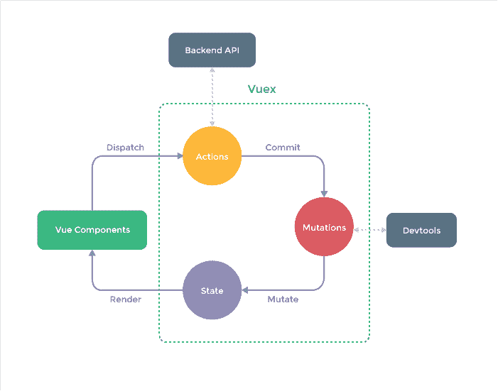

# 如何用 Vuex 和 Firebase 管理用户状态

> 原文：<https://www.freecodecamp.org/news/managing-user-state-with-vuex-firebase-77eebc64f546/>

作者加雷斯·雷德费恩

# 如何用 Vuex 和 Firebase 管理用户状态

本教程将向一个简单的 Vue.js Firebase 应用程序添加 Vuex。我们使用 Vuex 来管理登录的用户状态并显示受保护的内容。

在之前的[教程](https://medium.freecodecamp.org/authentication-with-vue-js-firebase-5c3a82149f66)的基础上，我们现在将看看如何处理登录用户的存储。当用户登录时，我们需要一种方法来存储他们的详细信息，并从我们的路线和组件中检查他们。

数据存储将需要在一个地方，以便所有的路线和组件可以有数据流向他们。当用户注销时，我们需要将该信息从组件传递回商店。

Vuex 允许我们做我们需要的事情。它提供了一个存储所有共享数据的地方。然后，每个组件可以使用和更新该单个数据存储。让我们首先向我们的站点添加一个 store 文件夹，并创建一个 [store.js](https://github.com/garethredfern/vue-auth-demo/blob/master/src/store/store.js) 文件。我们需要从 NPM 引入 Vuex 库，然后在我们的应用程序中使用它(T2 的项目文件已经这样做了)。

安装了 Vuex 之后，我们将它包含在我们的 [store.js](https://github.com/garethredfern/vue-auth-demo/blob/master/src/store/store.js#L2) 文件中，并告诉 Vue 我们想要使用它。现在我们将使用`export const = new Vue.Store()`创建商店。将 state 属性作为一个对象传入，在这里我们添加应用程序在商店级别需要的所有属性。导出商店后，我们可以将其导入到我们的 [main.js](https://github.com/garethredfern/vue-auth-demo/blob/master/src/main.js#L5) 文件中，然后将其添加到 [Vue 实例](https://github.com/garethredfern/vue-auth-demo/blob/master/src/main.js#L58)。商店数据现在可供我们在应用程序中使用:

`this.$store.state.propertyName`

#### 使用 Getters 获取状态

直接用`this.$store.state.propertyName` 访问商店不是很干。如果您能调用一个方法来获取我们的属性，那就更好了。如果需要，您也可以使用这个方法来执行额外的计算。这就是[吸气剂](https://vuex.vuejs.org/en/getters.html)来拯救我们的地方。

> Vuex 允许我们在存储中定义“getters”。您可以将它们视为商店的计算属性。像计算的属性一样，getter 的结果是基于它的依赖关系缓存的，并且只有当它的一些依赖关系改变时才会重新计算。

我们向 store 实例中的 [store.js](https://github.com/garethredfern/vue-auth-demo/blob/master/src/store/store.js#L11) 文件添加 getters。它们被设置为`getters`对象上的方法。在这里，我们可以使用 state 参数访问我们的状态:

`getUser: (state) => { return state.user; } // ES6 funct`离子

这个简单的 getter 从状态返回我们的用户属性。现在，我们可以通过调用以下命令在我们的任何组件中使用它:

`this.$store.getters.getUser;`

虽然这里的例子非常简单，但它展示了如何在我们的应用程序中重用这些代码。如果你需要改变这个方法的工作方式，你只需要在一个地方改变它。

#### 使用突变来改变状态

这也是一个好主意，有一个单一的地方来改变我们的商店的状态。这样，组件可以操作状态并更新所有实例。

突变是 Vue 用来执行这些任务的。我们将突变添加到 store 实例中的 [store.js](https://github.com/garethredfern/vue-auth-demo/blob/master/src/store/store.js#L16) 文件中。组件运行这些方法来更新整个应用程序的状态。然后，他们可以通过我们设置的 getters 监听这些变化。

在我们的应用程序中，我们创建了一个变种，它可以连接到 Firebase 并设置当前登录的用户。如果没有任何人登录，那么 Firebase，auth 方法返回 null。

`setUser: state => { state.user = Firebase.auth().currentUser`；}

我们的应用程序现在可以在一个地方检查登录的用户。所有组件都可以使用它来访问用户详细信息并加载相关的 UI。

#### 使用动作提交突变

这个 Vuex 旅程的最后一部分是理解[动作](https://vuex.vuejs.org/en/actions.html)是如何工作的。突变只能同步运行，我们其实是想从它们身上得到这种行为。通过运行同步方法，您可以可靠地知道它会在您需要时改变状态。

假设我们想调用第三方 API，我们该怎么做呢？当异步方法完成时，我们添加一个动作来提交一个仅的突变*。这样，我们可以运行异步方法，但只在它们完成后提交它们的状态。*

让我们看看如何在我们的应用程序中做到这一点。

我们用`store.dispatch`方法触发动作。在我们的 [App.js](https://github.com/garethredfern/vue-auth-demo/blob/master/src/App.vue#L23) 组件中，当第一次创建 Vue 实例时，我们触发了`setUser`方法。然后执行我们的 [store.js](https://github.com/garethredfern/vue-auth-demo/blob/master/src/store/store.js#L22) 文件中的`this.$store.dispatch(‘setUser’);` 动作。现在让我们看看作为方法设置的`setUser`动作。

`setUser: context => { context.commit(‘setUser’)`；}

这里我们传入从 Vuex 获得的`context` ，它让我们可以访问`commit`方法。然后，提交方法采用您想要运行的变异方法。在我们的情况下`setUser`。我们的突变方法被命名为与`setUser`动作相同，但并不必须如此。

#### 把所有的放在一起

Image taken from the Vuex docs

上图总结了 Vuex 的 3 个关键部分如何协同工作，为我们的组件提供数据。对于本教程来说，Vuex 可能有点过头了。

然而，它解决了知道用户何时登录的问题，以便我们可以在导航中显示链接。看一下 [Header.vue](https://github.com/garethredfern/vue-auth-demo/blob/master/src/components/Header.vue) 组件。

这里我们根据用户是否登录来显示链接。我们需要做的就是将`v-if=”!user”`添加到我们的每个`[router-link](https://router.vuejs.org/en/api/router-link.html)`组件中。`user`变量是一个计算属性，它返回用户对象或`null`,不管是否有人登录。

#### 附加阅读

*   [了解 Vue 生命周期挂钩](https://alligator.io/vuejs/component-lifecycle/)
*   [应用结构](https://vuex.vuejs.org/en/structure.html)