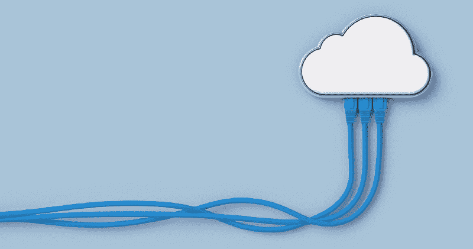

# 完成表格——使用谷歌电子表格作为你的数据后台

> 原文：<https://www.freecodecamp.org/news/get-sheet-done-using-google-spreadsheets-as-your-data-backend-650ba23dc6d9/>

吉拉德·达雅吉

# 完成表格——使用谷歌电子表格作为你的数据后台



如果你想快速原型化你的下一个网络应用，尝试使用谷歌电子表格作为你的数据后台。

有了我创建的一个名为 [get-sheet-done](https://www.npmjs.com/package/get-sheet-done) 的小库，你可以在不到 5 分钟的时间里拥有一个免费的带有 GUI 编辑器的云数据库。

### 搞定床单背后的故事

不久前，我需要快速构建一个可以显示结构化数据的 web 应用程序原型。问题是这些数据必须由非技术人员频繁编辑。

由于这是一个原型，当考虑到开发时间和维护成本时，我一直在寻找一个能给我最大回报的解决方案。

我考虑了几种解决方案，包括使用完整的后端即服务方法，将数据作为文件存储在 Dropbox 中。然后我选择了一个有点非正统的解决方案:我将数据存储在一个谷歌电子表格中。

### 基于电子表格的数据库何时是合适的解决方案？

使用 Google 电子表格作为 web 应用程序的数据库不是主流解决方案，它可能适合也可能不适合你的下一个项目。

为了帮助你决定这是否是一个好的选择，我列出了下面的考虑事项。

记住:我们讨论的是电子表格，它非常适合结构化的表格数据。但是对于文档/对象存储来说效果不好。

除此之外，以下是一些要考虑的利弊:

#### 赞成的意见

*   它是免费的
*   非常容易设置—不需要 API 密钥或复杂的 SDK
*   零维护
*   你可以免费获得一个数据编辑界面
*   你可以免费获得写访问管理
*   可以包括使用电子表格函数的内部计算
*   使用数据的应用程序可以在以后的阶段轻松升级，以使用真正的数据库，因为数据是作为标准 JSON 公开的
*   通过将应用程序脚本与[时间驱动触发器](https://developers.google.com/apps-script/guides/sheets#triggers)结合使用，可以实现一定程度的自动化
*   它可以结合谷歌表单进行数据收集

#### 骗局

*   没有服务器端过滤逻辑可谈
*   你想访问的所有数据都必须是公开的
*   整个数据库都是可手动编辑的，因此人为错误可能会破坏应用程序。例如，如果有人不小心更改了某个字段的标签，该字段将无法用于应用程序。这可以通过保护关键细胞得到部分补救
*   在一个电子表格中，你可以有[多达 200 万个单元格](https://support.google.com/drive/answer/37603?hl=en)

### 我是如何实现的

我找不到很多信息，也找不到好的库来方便地从谷歌电子表格中读取数据。所以我决定推出自己的解决方案。它现在在 npm 上作为 [get-sheet-done package](https://www.npmjs.com/package/get-sheet-done) 提供。

我的实现是基于这样一个事实，即一旦电子表格发布到 web 上，它也可以作为标准的 RSS 提要，可以被获取和解析。

一个复杂的问题是，您必须使用 JSONP 获取它，或者以某种方式处理 CORS。我选择使用 JSONP 并使用 [fetch-jsonp](https://www.npmjs.com/package/fetch-jsonp) 库来管理它，所以不需要特殊的措施。

### 如何使用它

为您的 web 应用程序获得一个简单的可编辑数据库，您需要做以下工作:

1.  用一些数据创建一个谷歌电子表格
2.  将工作表发布到 web: `File -> Publish to the` web。
    注意 URL 中的文档 ID
3.  安装软件包:`npm install --save get-sheet-done`
4.  获取数据:

```
import GetSheetDone from 'get-sheet-done'
```

```
GetSheetDone.labeledCols(DOCUMENT_ID).then(sheet => console.log(sheet))
```

5.利润！

请注意，根据应该如何解析数据，可以使用三个函数来获取数据:原始 2d 数组、对象数组、对象的对象。

这里有一个[现场演示](https://giladaya.github.io/get-sheet-done/)你可以玩。

值得考虑使用 Google 电子表格作为 web 应用程序的数据源，尤其是如果您只是在构建一个快速原型的话。它有一些独特的优点，并且有(或没有)我的库都很容易实现。

请在评论中告诉我你是否觉得这个库有用，以及是否有缺失的特性。