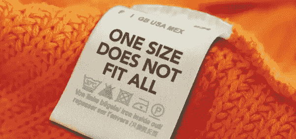
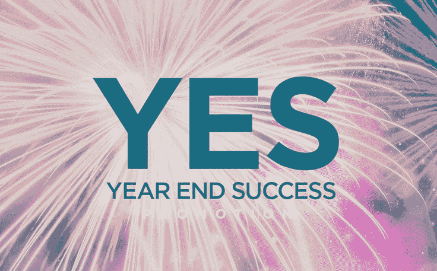

# 告诉你正在建造没人想要的东西的 8 种方法(以及该怎么做)

> 原文：<https://www.freecodecamp.org/news/its-a-trap-8-ways-to-tell-you-re-building-something-no-one-wants-ea67299ef14b/>

杰弗里·伯恩

# 告诉你正在建造没人想要的东西的 8 种方法(以及该怎么做)

构建用户想要的东西很难——非常难。他们是一群善变的人，他们不清楚自己到底想要什么，这让事情变得非常困难。他们让我们猜测，当我们给他们一些我们知道他们需要的东西时，他们不想要。他们不知道什么对他们好吗？他们为什么不听？Grrrr。好沮丧！

问题是，我们已经*告诉*用户他们想要什么，而不是*弄清楚*用户想要什么。我们感到沮丧，因为我们的决定是错误的。谁喜欢被人说自己错了？那么，我们如何推断用户想要什么，并实现我们一直在寻找的产品市场契合度呢？

[精益创业](http://theleanstartup.com/)方式始于一个假设(希望基于研究、经验或灵感)。然后，您构建一个最小可行的产品，测量结果，并调整产品或假设。换句话说，我们需要以最快的方式，通过多次迭代，弄清楚用户*真正*想要什么。

有许多关于寻找产品市场契合度的文章和书籍。他们经常不讨论落入陷阱，认为你在成功的道路上，但实际上在失败的道路上。辨别你是否在造没人想要的东西的最好方法是留意这八个陷阱。

### 陷阱 1:一无所知，像什么。

你不知道有多少人在使用新的功能、应用程序或网站。你没有统计，测量，或硬数据。当被问到时，你回答说，“嗯……”。

怎么办:对自己的成功或失败视而不见不是做任何事情的好方法。首先用工具收集数据和指标，如[谷歌分析](https://www.google.com/analytics/analytics/#?modal_active=none)(免费)或 [MixPanel](https://mixpanel.com/) (大型网站需要付费)。你应该拥有这些数据，并且能够快速说出你拥有的用户数量、参与度和反馈。定义您的关键指标并拥有它们！

### 陷阱 2:错误的利益相关者。

你只关心你的内部业务所有者是否开心。你成功的起点和终点是你企业主的幸福。当你被要求做一些你知道不是个好主意的事情时，你会去做，因为这是“企业主要求的”

做什么:你的目标是让你的最终用户(真正的用户)开心还是让你的企业主开心？不幸的是，公司通常根据企业所有者的幸福感来衡量员工的成功(如薪酬、晋升)。但是您的最终用户—外部或内部—才是最重要的。它们是成功和产品市场适应性的真正衡量标准。只有将全部精力放在最终用户身上，才能取得成功。如果这在你的公司是不可能的，那就去找一份新工作。

### 陷阱 3:我知道他们会喜欢，我就是知道。

你还没有 A/B 测试任何新功能，因为你已经知道用户会喜欢它。你已经发布了产品，人们喜欢它或正在使用它，所以工作做得很好。

The Mirador Building in Madrid. Designed by Dutch architecture studio MVRDV in collaboration with the Spanish architect Blanca Lleó and opened in 2005

**怎么办:**这又回到了度量和测量。停止假设，因为你很可能是错的。只假设你不知道，需要验证。使用 [Google Optimize](https://www.google.com/analytics/optimize/) (免费)或 [Optimizely](https://www.optimizely.com/) (付费)等工具来证实你的假设，即新功能比旧功能更好。你会惊讶于通过 A/B 测试所能获得的更大的成功。典型的例子是，如果按钮是绿色而不是红色，点击次数会增加 25%。

### 陷阱 4:我的方式或高速公路。

你的内部客户没有采用你知道比旧产品好得多的新功能/产品。你关闭了旧的功能/应用，迫使你的用户使用新的。你等待着用户的感谢信。

**怎么办:**你的用户已经明确告诉你，他们不想要新的功能/应用，所以，请停止把你的意愿强加给他们。弄清楚为什么用户不想要你的新系统:问他们，A/B 测试 MVP，或者愿意刮或枢轴。我遇到过这样的情况，我们强迫用户进入他们不想要的新系统。为什么？因为我们已经在新系统上花了很多时间和金钱。可想而知，它以绝对的灾难告终。

### 陷阱 5:我做了我的工作。

你知道人们并没有使用刚刚建成的东西。但是，您衡量成功的标准是按时按预算交付全部范围。你宣告成功！

怎么办:意识到你只是失败了。衡量成功的真正标准是:你的最终用户想要这个产品吗？借口是没有用的，除非你打算和每个用户坐下来说，“我知道你不喜欢我做的东西，但是我满足了所有的要求。该产品准时上市，并且符合预算。因此，你应该使用它并喜欢它。”

很容易(相信我，我知道)陷入“我做了我的工作”的思维。尤其是如果你的公司鼓励你专注于你狭窄的领域(如工程、营销)。抵制这种错觉，总是问自己，“我构建的东西(无论从我的角度来看有多棒)是我的用户想要的吗？”用从 Google Analytics 等工具收集的数据驱动的指标来回答这个问题。

### 陷阱 6:每个人都说他们喜欢它。

你用“用户真的很喜欢它，我们得到了很好的反馈，我的老板说……”来衡量产品的成功。

**怎么办:**与上面的第五个陷阱相反，你实际上相信你已经达到了产品市场适合度。你是通过听轶事证据得出这个结论的。想象一下，如果你因为你的巨大成功而向投资者要求更高的估值。你会提出你的证据吗，“用户乔·史密斯说，‘干得好，恭喜’”或者“首席运营官说这对企业真的很好。坚持下去！”

如果你掉进了这个陷阱，不要难过。我参加过许多十亿美元市值公司的全体会议。我们用类似的名言来衡量我们的成功。请记住，数据驱动的指标有助于您真正衡量产品的市场适合度。

### 陷阱 7:没有这个功能我们无法发布。

出货前，你要花三个月、六个月或十二个月的时间来建造。你已经把你的血、汗、泪投入到产品中，它终于发生了。你已经构建了用户*需要*的每一个特性，这是非常棒的。放生吧！

**做什么:**尽可能构建最小可行产品(MVP)。从那里你会了解到你所建立的产品是否符合市场需求。想象一下，你正以每小时 100 英里的速度朝一堵砖墙开去，墙上有 6 英尺宽的空间供你通过。如果你在一英里之外，但距离洞口几百英尺，你将有时间调整和适应。如果你在 10 英尺之外，但是离洞口有几百英尺远…哎哟。

在寻找适合市场的产品时，你的时间/金钱是有限的。你愿意不断地测量、学习和调整来找到合适的方法吗？还是宁愿闭上眼睛，建设 3-12 个月，最后睁开眼睛看看自己是否适合？

### 陷阱 8:年终回顾时间。

你将年终评估的重点放在你工作有多努力，完成了要求你做的一切。你得到了好评，所以你一定很成功。

**怎么办:**看看你上一次的年终回顾。您是否能够引用数据驱动的指标，并明确证明您发现产品符合市场需求？老实说，这很难，因为没有人想说他们失败了，尤其是在年终评估时。然而，如果你的公司文化拥抱失败，如果你从失败中吸取教训，那么也许你可以诚实。如果没有，展望下一年，朝着用户想要的方向努力。如果你有数据驱动的年终评估指标，而其他人没有，你将远远超过你的同事。

在大公司工作多年后，我可以证明我们经常通过在白板上画些东西来想出下一个改变游戏规则的东西。然后，我们自我庆祝我们的才华，并花了六个月的时间来建设。这证明了为什么即使用户不喜欢我们的产品，我们也应该得到奖金。

### 结论

找到适合市场的产品很难——如果容易的话，每个人都会这么做。即使你正在练习构建 MVP，并且对你的公司有一个整体的看法，你仍然可能没有击中你的用户(实现曲棍球棒增长)。最好的办法是继续尝试。并且总是问你自己，“我在构建用户想要的产品吗？”或者“我是不是掉进了产品市场契合度的陷阱之一？”

**关于作者:** [Geoffrey Bourne](https://www.freecodecamp.org/news/its-a-trap-8-ways-to-tell-you-re-building-something-no-one-wants-ea67299ef14b/undefined) 是 [RETIRETY](https://www.retirety.com) 的首席执行官和创始人——帮助退休或接近退休的人找到更好的退休方式。

#### 感谢阅读！

### 如果你喜欢这篇文章，请随意点击下面的按钮。去帮助别人找到它！