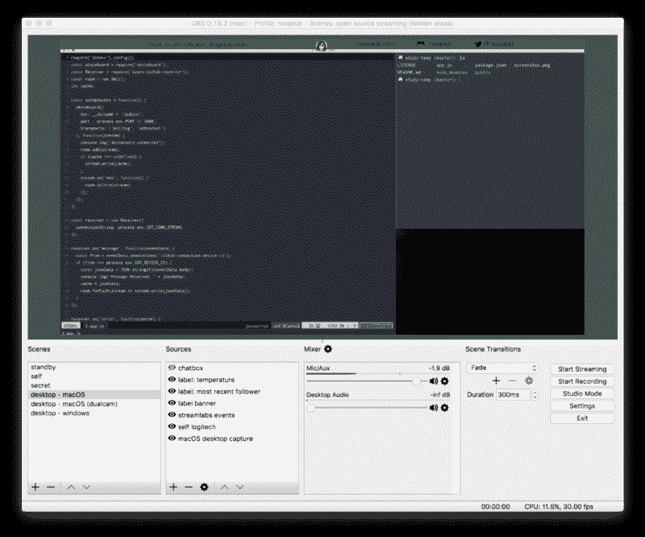
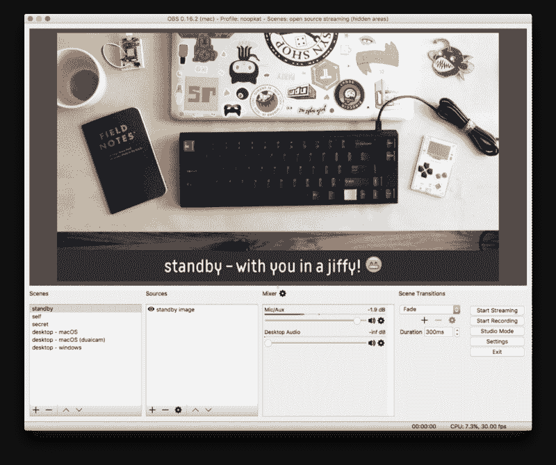
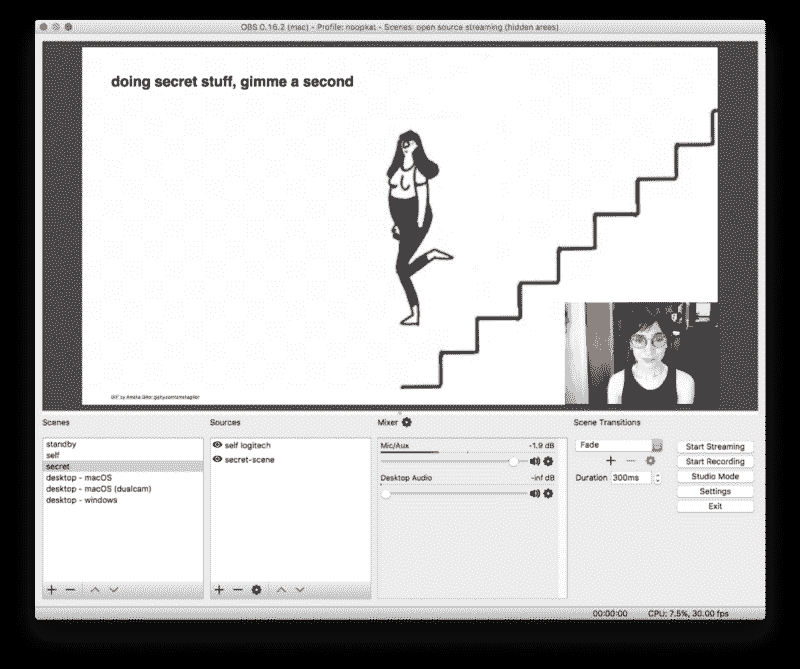
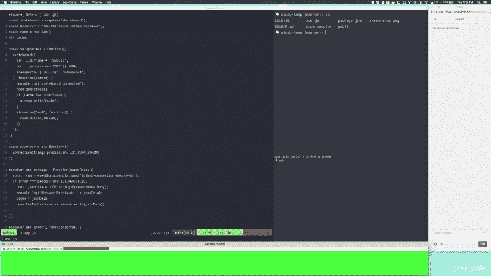
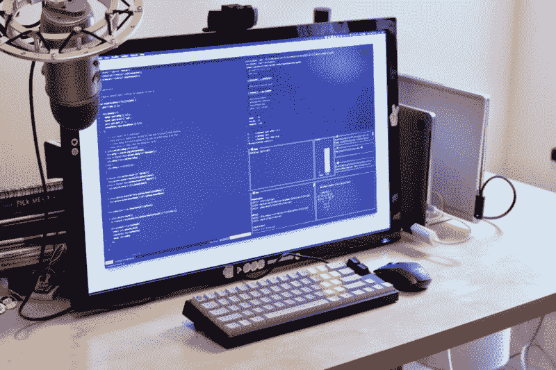
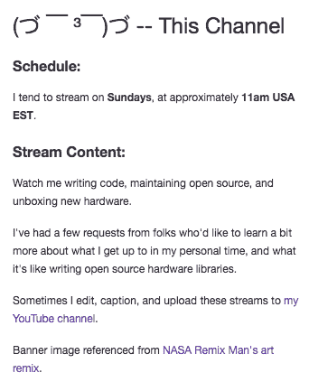

# 我在 Twitch 上第一年现场编码的经验

> 原文：<https://www.freecodecamp.org/news/lessons-from-my-first-year-of-live-coding-on-twitch-41a32e2f41c1/>

作者:苏兹·辛顿

# 我在 Twitch 上第一年现场编码的经验

去年 7 月，我第一次尝试了流媒体。与 Twitch 上大多数流媒体工具所做的游戏不同，我想流传输我在私人时间做的开源工作。我在 NodeJS 硬件库上工作了一段时间(其中大部分是我自己的)。既然我已经在 Twitch 上占有一席之地，为什么不在一个更小的位置，比如 JavaScript 驱动的硬件；)我注册了自己的[频道](https://www.twitch.tv/noopkat)，从那以后就一直定期播放。

当然我不是第一个这样做的人。手工英雄是我在网上观看代码的第一批程序员之一，随后是在 Twitch 上开发核王座直播的 T2 的开发者。我对弗兰比尔特别着迷。

是什么把我推到了希望我能做到的边缘到*真的做到了*归功于[诺兰·劳森](https://twitter.com/nolanlawson)，我的一个朋友。我在一个周末看了他的开源作品[，感觉棒极了。他解释了他一路上所做的一切。一切。回复 GitHub 上的问题，对 bug 进行分类，调试分支中的代码，你说吧。我发现这很有趣，因为 Nolan 维护的开源库有很多用途和活动。他的开源生活和我的很不一样。](https://www.youtube.com/watch?v=9FBvpKllTQQ)

你甚至可以看到我在他的视频下面留下的评论:

大约一周后，在设置了我的 Twitch 频道并通过使用 OBS 摸索出一条路后，我自己尝试了一下。我相信我做的是 Avrgirl-Arduino，我现在仍然经常在流的时候做这个。这是一个粗糙的第一次流。我非常紧张，前一天晚上我熬夜排练我要做的一切。

虽然那个星期六我得到的少量观众真的很鼓舞人心，所以我坚持了下来。这些天来，我有超过 1000 名粉丝，其中一部分是我称为“noopkat fam”的常客。

我们有很多乐趣，我喜欢把现场编码部分称为“大型多人在线结对编程”。我真的被每个周末和我一起的每个人的善良和智慧所感动。我经历过的最有趣的时刻之一是，当一位 fam 指出我的 Arduino 板无法与我的软件一起工作，因为板中的微芯片丢失了:

我已经注销了一个流很多次了，只是在我的收件箱里发现有人发来了一个拉请求，是关于我提到的我没有时间开始的一些工作。我可以诚实地说，由于 Twitch 社区的慷慨和鼓励，我的开源工作已经变得更好了。

关于 Twitch 上的流媒体带给我的好处，我还有很多要说，但那可能是另一篇博客文章了。相反，我想把我学到的经验分享给其他想以这种方式尝试现场编码的人。最近一些开发者问我他们如何开始，所以我发布了我给他们的同样的建议！

首先，我将你链接到一个名为[“在 Twitch 上获得成功”的指南](https://www.reddit.com/r/Twitch/comments/4eyva6/a_guide_to_streaming_and_finding_success_on_twitch/)，它给了我很大的帮助。它特别关注 Twitch 和游戏流，但仍然有相关的部分和很好的建议。我建议在考虑开始你的频道的任何其他细节(比如设备或软件选择)之前，先读一下这个。

下面是我自己的建议，这是我从自己的错误和同道中人的睿智中获得的(你知道你是谁！).

### 软件

有很多免费的流媒体软件可供使用。我用[打开广播软件(OBS)](https://obsproject.com) 。它可以在大多数平台上使用。我发现起身离开真的很直观，但其他人有时需要一段时间来了解它是如何工作的。您的里程可能会有所不同！以下是我的 OBS“桌面场景”设置的截屏图(点击查看大图):

流式传输时，您实际上是在“场景”之间切换。一个场景是一个“源”的集合，分层并相互合成。来源可以是相机、麦克风、你的桌面、网页、实时文本、图像等等。OBS 很厉害。

上面的这个桌面场景是我做所有现场编码的地方，我大部分时间都住在这里。我使用 iTerm 和 vim，也有一个方便切换的浏览器窗口，以便在 GitHub 上查找文档和分类等。

底部的黑色矩形是我的网络摄像头，所以人们可以看到我的工作，有更多的个人联系。我为我的场景准备了一些“标签”,其中很多都与顶部横幅中的统计数据和信息有关。横幅只是增加了个性，是一个很好的持续的信息来源，而流。这是我在 [GIMP](https://www.gimp.org/) 中制作的图像，你将它作为源导入到你的场景中。一些标签是从文本文件中提取的实时统计数据(比如最近的关注者)。另一个标签是我做的[定制标签](https://github.com/noopkat/study-temp)，它显示我所在房间的实时温度和湿度。

我还在我的场景中设置了“提醒”,每当有人关注或捐款时，就会在我的信息流上方显示可爱的横幅。我使用 web 服务 [Stream Labs](https://streamlabs.com/) 来完成这项工作，将其作为浏览器网页源导入到场景中。流实验室还创建了我最近的追随者现场文本文件，以显示在我的横幅。

我也有一个待机屏幕，当我要直播时使用:

此外，我还需要一个输入秘密令牌或 API 密钥的场景。它在网络摄像头上显示我，但用一个有趣的网页隐藏我的桌面，所以我可以隐私地工作:

正如你所看到的，我在流式传输时不会太认真，但我喜欢为我的观众提供一个好的设置，以便从我的流中获得最大的收益。

但现在是一个实际的秘密:我使用 OBS 来裁剪我的屏幕的底部和右边，同时保持与 Twitch 期望的相同的视频大小比例。这让我有空间在底部观看我的活动(关注等)，并在右侧查看和回复我的频道聊天框。Twitch 允许你在一个新窗口中弹出聊天框，这真的很有帮助。

这就是我的全桌面*真正的*样子:

几个月前开始做这个，一直没有回头。我甚至不确定我的观众意识到这是我的设置如何工作。我想他们理所当然地认为我可以看到一切，即使当我忙于编程时，我看不到实际上正在直播的内容！

你可能想知道为什么我只用一个显示器。这是因为两台显示器实在是太多了，我无法在流式传输的同时处理其他事情。我很快就明白了这一点，并一直坚持使用一个屏幕。

### 五金器具

我一开始用较便宜的东西，慢慢地买了更好的东西，因为我意识到流媒体将是我坚持的事情。开始时，使用你拥有的任何东西，即使是你的笔记本电脑内置的麦克风和摄像头。

如今，我使用罗技 Pro C920 网络摄像头，麦克风臂上的蓝色 Yeti 麦克风带有麦克风震动。如果你有钱花的话，这钱最终是完全值得的。这对我的溪流质量产生了影响。

我使用大显示器(27 英寸)，因为正如我前面提到的，使用两个显示器对我来说不合适。我在聊天中错过了一些东西，因为我没有足够地看第二台笔记本电脑的屏幕，等等。在这里，你的形象可能会有所不同，但是让所有的东西都在一个屏幕上对我来说很关键，可以让我关注所有发生的事情。

硬件方面差不多就是这样；我没有非常复杂的设置。

如果你感兴趣，我的桌子看起来很正常，除了令人讨厌的隐约出现的麦克风:

### 技巧

这最后一节是我收集的一些通用技巧，它们让我的信息流整体上变得更好、更愉快。

#### 嵌板

花一些时间创造伟大的面板。面板是每个人的频道页面底部的小内容框。我把它们看作是新的 MySpace 个人资料框(哈哈，真的)。小组想法可以是聊天规则、关于你何时流的信息、你使用什么电脑和设备、你最喜欢的猫品种；任何创造个人风格的东西。看看其他渠道(尤其是热门的)的思路！

我的一个小组的例子:

#### 闲谈

聊天真的很重要。当人们中途加入你的信息流时，你会一遍又一遍地得到同样的问题，所以拥有聊天“宏”真的很有帮助。“你在忙什么？”是我编码时最常被问到的问题。我有聊天快捷方式“命令”,这是我用 [Nightbot](https://beta.nightbot.tv/) 做的。它会提前对我输入的内容进行解释，只需输入一个小小的单词命令，比如*！正在做什么*

当人们问问题或留下好的评论时，和他们顶嘴！说谢谢，说他们的抽动把手，他们会真的感谢你的关注和认可。当你第一次开始流式传输时，这是非常困难的，但随着你做得越来越多，多任务处理会变得越来越容易。试着每隔几分钟花几秒钟查看一下聊天记录，看看有没有新消息。

编程时，*解释你在做什么*。话很多。开玩笑。甚至当我遇到困难时，我会说，“哦，糟糕，我忘了怎么用这个方法了，让我用谷歌搜索一下，哈哈哈”，人们总是很友好，有时他们甚至会和你一起阅读，帮你解决问题。这很有趣，也很吸引人，让人们一直看下去。

当我看节目流的时候，我很快就失去了兴趣，在节目流中，我静静地坐着输入代码，忽略聊天和他们新的关注者提醒。

很有可能 99%的人会友好和好奇的找到你的频道。我偶尔会遇到巨魔，但 Twitch 和 Nightbot 提供的调节工具确实有助于阻止这种情况。

#### 准备时间

尽可能自动化您的设置。我的终端是 iTerm，它可以让你保存窗口排列和字体大小，这样你以后就可以恢复它们。我有一个流窗口排列和一个非流窗口排列。这是一个巨大的时间节省。我按下一个命令，一切都是完美的大小和正确的位置，准备好了。

还有其他应用程序可以自动放置你的应用程序窗口，看看它们是否有帮助。

在你的终端和代码编辑器中使用大字体，这样每个人都能看到。

#### 规则性

有规律地安排你的时间表。我每周只流一次，但总是在同一时间。让人们知道，如果你不能在预期的时间流你通常做的。这为我赢得了一个固定的观众。有些人喜欢例行公事，就像和朋友叙旧一样。你和你的社区在一个社交圈里，所以要这样对待它。

我想更频繁地流，但我知道因为旅行，我不能承诺每周超过一次。我正试图想出一种方法，在旅途中播放高质量的视频，或者只是随意聊天，把节目留到我的周日常规节目中。我还在想办法解决这个问题！

#### 笨拙

刚开始的时候会感觉怪怪的。你会对观看你编程的人感到紧张。那很正常！虽然我有公开演讲的经验，但一开始我就强烈地感受到了这一点。我觉得我无处可藏，这让我很害怕。我想，“每个人都会认为我的代码很糟糕，我是一个糟糕的开发人员”。这是一种困扰我整个职业生涯的思维模式，尽管这并不新鲜。我知道有了这个，我就不能在推到 GitHub 之前悄悄地重构代码，这对于我作为开发人员的声誉来说一般要安全得多。

通过 Twitch 上的现场编码，我对自己的编程风格了解了很多。我明白了我绝对是那种“让它工作，然后让它可读，然后让它快速”的类型。我不再排练前一天晚上的节目了(我在开始的 3 或 4 个流后就放弃了)，所以我在 Twitch 上写了相当粗糙的代码，并且不得不接受这一点。当我独自思考，不看聊天框和大声说话的时候，我能写出最好的代码，这很好。我忘记了我已经使用了一千次的方法签名，并且在几乎每一个流中都犯了“愚蠢”的错误。对大多数人来说，这不是一个让你处于最佳状态的高效环境。

我的 Twitch 社区从来不会因为这个评判我，他们给了我很多帮助。他们理解我在同时处理多项任务，并且非常重视务实的建议和意见。有时他们保释我出来，而其他时候我必须向他们解释为什么他们的建议行不通。这真的就像常规的结对编程一样！

我认为对这种媒体的“直言不讳”的态度是一种优势，而不是劣势。这让你更有亲和力，而且重要的是要表明没有完美的程序员，也没有完美的代码。对于新程序员来说，这可能很新鲜，对于我这样一个更有经验的程序员来说也很惭愧。

### 结论

如果你一直想在 Twitch 上进行现场编码，我鼓励你尝试一下！如果你不知道从哪里开始，我希望这篇文章能帮助你。

如果你想在周日加入我，你可以在 Twitch 上关注我的频道

最后，我想亲自感谢马蒂亚斯·约翰松在我流媒体之旅的早期给予我的智慧和鼓励。他非常慷慨，他的[funfunfunfunfun YouTube 频道](https://www.youtube.com/channel/UCO1cgjhGzsSYb1rsB4bFe4Q)是源源不断的灵感来源。

**更新:**一群人一直在询问我的键盘和工作站的其他部件。[这是我用的](https://gist.github.com/noopkat/5de56cb2c5917175c5af3831a274a2c8)的完整清单。感谢您的关注！