# 用 React 构建特斯拉的电池续航里程计算器(第 2 部分:Redux 版本)

> 原文：<https://www.freecodecamp.org/news/building-teslas-battery-range-calculator-with-react-part-2-redux-version-2ffe29018eec/>

马修·崔

# 用 React 构建特斯拉的电池续航里程计算器(第 2 部分:Redux 版本)


本教程是用 React 构建特斯拉电池续航里程计算器的第二部分。

在第 1 部分中，在通过 create-react-app 构建项目之后，我们通过细分 UI 来实现每个组件。我们使用本地状态和道具管理状态和事件，并完成了整个应用程序。

如果您还没有阅读，请务必阅读第 1 部分，该部分重点介绍 React，[这里](https://medium.freecodecamp.com/building-teslas-battery-range-calculator-with-react-part-1-2cb7abd8c1ee):

[**用 React 构建特斯拉的电池续航里程计算器(第一部分)**](https://medium.freecodecamp.com/building-teslas-battery-range-calculator-with-react-part-1-2cb7abd8c1ee)
[*在这一系列文章中，我将带你了解用 React 构建特斯拉的电池续航里程计算器的过程……*medium.freecodecamp.com](https://medium.freecodecamp.com/building-teslas-battery-range-calculator-with-react-part-1-2cb7abd8c1ee)

在这一期中，我们将介绍 Redux，一个状态管理解决方案，看看我们如何将我们的应用程序转换成一个用 Redux 管理应用程序状态的应用程序。

这是我们的应用程序在第 2 部分中的最终图像:

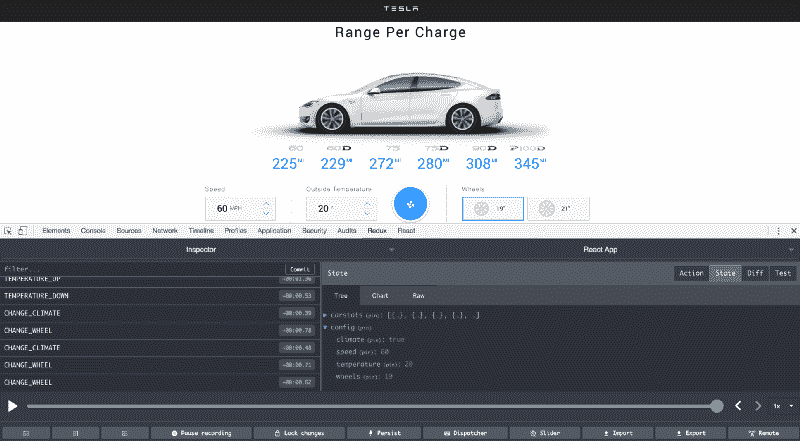

？查看第二部分第五集演示。

在我们研究 Redux 是什么之前，让我们看看为什么我们需要使用 Redux 来解决问题。

### 1.我们解决什么问题？

Redux 正在成为构建 React 应用程序的事实方式。但是 Redux 应该用在所有 React apps 上吗？至少，不是所有的应用程序从一开始就需要一个雄心勃勃的状态管理解决方案。

如今的前端发展趋势是**组件化**。组件可以有数据状态和 UI 状态，随着应用的增长，它们需要管理的状态变得越来越复杂。

**状态管理**出现了解决以下问题的解决方案，Redux 作为其他解决方案中的一个标准越来越受欢迎。

*   组件共享状态
*   状态应该可以从任何地方访问
*   组件需要改变状态
*   组件需要改变其他组件的状态

Redux 是一个**状态管理库**，它是一个工具，可以让你在某个地方存储我们 app 的状态，对状态进行变异，接收更新后的状态。

换句话说，有了 Redux，我们就有了一个可以引用状态、更改状态和获取更新状态的地方。

Redux 是在考虑 React 的情况下编写的，但它也是与框架无关的，甚至可以用于 Angular 或 jQuery 应用程序。

> 我建议你阅读丹·阿布拉莫夫的《T2》，在选择 Redux 之前，你可能不需要 Redux。

### 2.Redux 中的数据流

正如您在第 1 部分中看到的，在 React 中，数据是使用 props 通过组件传递的。这被称为从父节点流向子节点的单向数据流。

由于这些特征，除了父子关系之外的组件之间的通信并不清楚。

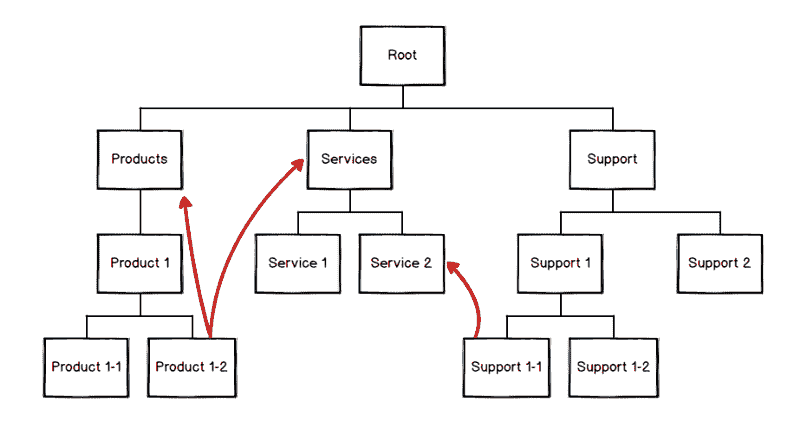

React 不推荐如上所示的直接**组件对组件**通信。在 React 中有一个建议的方法，但是您必须自己实现它。

根据**反应文件**:

> 对于没有父子关系的两个组件之间的通信，您可以设置自己的全局事件系统。…通量模式是安排这种情况的可能方式之一。

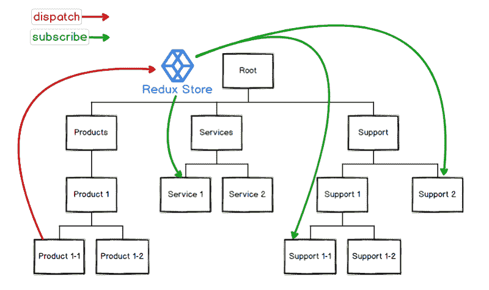

这就是 Redux 派上用场的地方。

Redux 提供了一个在一个叫做`store`的地方管理所有应用程序状态的解决方案。

然后，组件将状态更改存储起来，而不是直接传递给其他组件

需要知道状态变化的组件可以`subscribe`存储。

> 简而言之，Redux 是一个**状态容器**，它将应用程序的状态作为基于 JavaScript 的应用程序中的单个对象来表示和管理。

### 3.Redux 核心概念

Redux 本身很简单。我们在上一篇文章中创建的应用程序的状态可以表示为一个通用对象，如下所示:

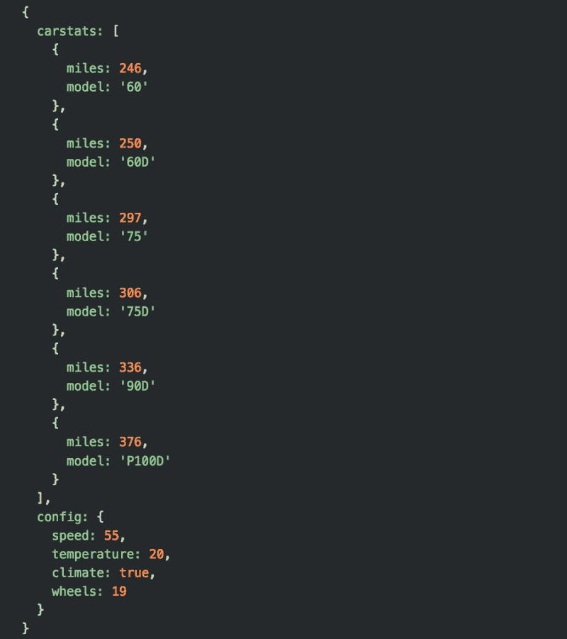

该对象与没有设置器的模型相同。

要在 Redux 中改变这种状态，必须调度一个`action`。

动作是描述应用程序中发生的事情的普通对象，并且是描述 T2 意图改变数据的唯一方式。这是 Redux 的**基本设计选择**之一。

下面是一些即将在我们的应用中实现的例子。

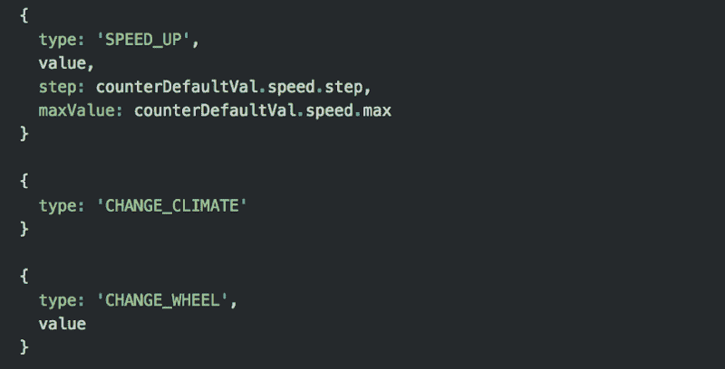

将所有这些状态改变付诸行动将让我们清楚地了解你的应用程序中发生了什么。当事情发生时，我们可以看到它为什么会发生。

现在我们需要一个名为`reducer`的函数将这些状态和动作绑定在一起。Reducer 无非是一个以状态和动作为自变量，返回一个**新状态**的函数。

一句话:

> **(状态，动作)= > st** ate

动作只描述了发生的事情，并没有指定**应用程序的状态如何响应**而改变。这是减速器的工作。

下面是一个要在我们的应用中实现的缩减器示例:

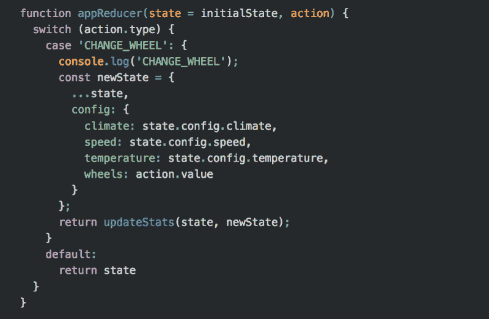

### 4.冗余三原则

我提到过几次`Flux`。Flux 是状态管理的一种**模式，而不是像 Redux 那样的可下载工具。另一方面，Redux 是通量模式**的**实际实现，有三个主要原则。**

### 4.1 真理的单一来源

> 整个应用程序的状态存储在**单个存储**中的对象树中。

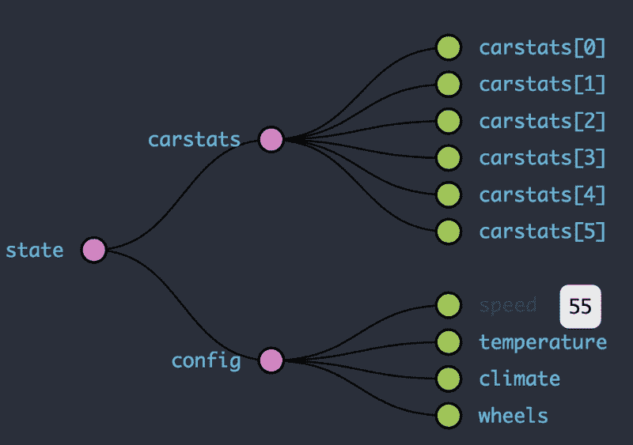

因为所有的状态都存在于一个地方，这被称为`single source of truth`。

Redux 的这个`one-store`方法是它和 **Flux 的多重存储**方法的主要区别之一。

单一状态树的优势是什么？这使得调试应用程序或执行内部检查变得更加容易，并且容易实现一些以前难以实现的功能(例如，撤销/重做)。

### 4.2 状态为只读

> 改变状态的唯一方法是**发出一个描述发生了什么的动作**。

换句话说，应用程序并不直接改变状态，而是通过传递动作来表达转换状态的意图。

事实上，如果您查看 Redux API，您会发现它仅由四个方法组成:

```
store.dispatch(action)store.subscribe(listener)store.getState()replaceReducer(nextReducer)
```

可以看到，没有 **setState()** 方法。因此，**传递一个动作**是改变应用程序状态的唯一途径。

### 4.3 用纯函数进行更改

> 你把 reducers 写成纯函数来指定状态树被动作转换的具体方式。

Reducers 是纯函数，它采用先前的状态和动作，并返回新的状态。请记住，您必须返回一个**新状态**对象，而不是改变旧状态。

> 给定相同的参数，它应该计算下一个状态并返回它。没有惊喜。没有副作用。没有 API 调用。没有突变。只是一个计算。”— [还原文档](http://redux.js.org/docs/basics/Reducers.html)

纯函数具有以下特征:

*   它不进行外部网络或数据库调用。
*   它的返回值只取决于它的参数值。
*   它的参数应该被认为是“不可变的”，意味着它们不应该被改变。
*   用相同的参数集调用一个纯函数将总是返回相同的值。

### 5.将应用程序分为容器和组件

现在，让我们重新构建我们在第 1 部分中制作的 Tesla calculator 应用程序，作为 Redux 版本。

首先来看一下本文将要实现的 app 的**整体组件 UI 布局**。

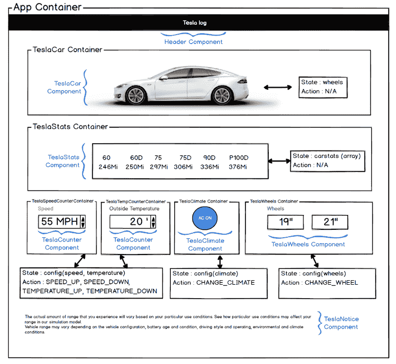

**overall component UI layout**

将 React 和 Redux 逻辑放在一个组件中可能会很麻烦，所以建议您创建一个仅用于表示目的的`Presentational`组件，以及一个`Container`组件，一个处理 Redux 和调度动作的上层包装器组件。

父容器组件的作用是为表示组件提供状态值，管理事件，并代表表示组件与 Redux 进行通信。

### 6.列出每个组件的状态和操作

参考整个组件布局，为每个组件创建一个状态和操作列表:

```
TeslaCar Container :	state : wheels	action : N/A
```

```
TeslaStats Container :	state : carstats(array)	action : N/A	TeslaSpeedCounter Container : 	state : config.speed	action : SPEED_UP, SPEED_DOWN
```

```
TeslaTempCounter Container : 	state : config.temperature	action : TEMPERATURE_UP, TEMPERATURE_DOWN	TeslaClimate Container : 	state : config.climate	action : CHANGE_CLIMATE
```

```
TeslaWheel Container : 	state : config.wheel	action : CHANGE_WHEEL
```

### 7.设置第 1 部分项目代码库

> 如果您想直接进入第 2 部分而不看第 1 部分，您需要首先通过克隆第 1 部分的代码[来构建代码库。](https://github.com/gyver98/part1-react-tesla-battery-range-calculator-tutorial)

在 **npm 开始**之后，让我们确保应用程序工作。

*   **git 克隆**[https://github . com/gyver 98/part 1-react-特斯拉-电池-续航里程-计算器-教程](https://github.com/gyver98/part1-react-tesla-battery-range-calculator-tutorial)


*   **npm 安装**


*   **npm 开始**

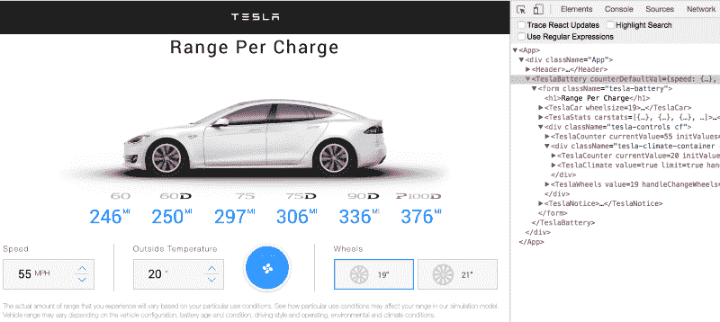

### 8.为每个动作创建动作创建者

现在您已经创建了一个动作列表，是时候创建`action creators`了。

动作创建器是一个创建动作对象的函数。在 Redux 中，动作创建者只需返回一个动作对象，并在必要时传递参数值。

**换轮动作创建者示例:**

```
const changeWheel = (value) => {  return {    type: 'CHANGE_WHEEL',    value  }}
```

这些动作创建者作为结果值传递给调度函数，然后执行调度。

```
dispatch(changeWheel(size))
```

调度函数可以作为 **store.dispatch()** 从商店中直接访问，但在大多数情况下，它将使用像 react-redux 的`connect()`这样的助手来访问。我们稍后再看**连接**。

### 8.1 创建 Action.js

在 src/actions 目录中创建一个索引文件，并按如下方式定义操作创建者:

**src/actions/index.js**

```
import { counterDefaultVal } from '../constants/counterDefaultVal';
```

```
export const speedUp = (value) => {  return {    type: 'SPEED_UP',    value,    step: counterDefaultVal.speed.step,    maxValue: counterDefaultVal.speed.max  }}
```

```
export const speedDown = (value) => {  return {    type: 'SPEED_DOWN',    value,    step: counterDefaultVal.speed.step,    minValue: counterDefaultVal.speed.min  }}
```

```
export const temperatureUp = (value) => {  return {    type: 'TEMPERATURE_UP',    value,    step: counterDefaultVal.temperature.step,    maxValue: counterDefaultVal.temperature.max  }}
```

```
export const temperatureDown = (value) => {  return {    type: 'TEMPERATURE_DOWN',    value,    step: counterDefaultVal.temperature.step,    minValue: counterDefaultVal.temperature.min  }}
```

```
export const changeClimate = () => {  return {    type: 'CHANGE_CLIMATE'  }}
```

```
export const changeWheel = (value) => {  return {    type: 'CHANGE_WHEEL',    value  }}
```

```
export const updateStats = () => {  return {    type: 'UPDATE_STATS'  }}
```

*   查看 [index.js](https://gist.github.com/gyver98/9d088084834ec6a0f893c8576c7d9204#file-index-js)

因为我们需要基于动作创建者的**默认值**，所以我们在 src 目录下的 constants/counterDefaultVal 中定义这个常量值并导入。

**src/constants/counterdefaultval . js**

```
export const counterDefaultVal = {  speed: {    title: "Speed",    unit: "mph",    step: 5,    min: 45,    max: 70  },  temperature: {    title: "Outside Temperature",    unit: "°",    step: 10,    min: -10,    max: 40  }}
```

*   查看 [counterDefaultVal.js](https://gist.github.com/gyver98/e560ca69057d40e0688000b94d7c0fd9#file-counterdefaultval-js)

### 9.为每个动作创建减速器

**reducer**是从 Redux 存储中接收状态和动作对象并返回一个新状态以存储回 Redux 的函数。

重要的是不要在这里直接修改给定的状态。减速器必须是**纯函数**，并且必须返回一个**新状态**。

*   Reducer 函数从用户动作发生时创建的**容器**中调用。
*   当 Reducer 返回一个状态时， **Redux 将新状态**传递给每个组件， **React 再次渲染每个组件**。

### 9.1 不可变的数据结构

*   JavaScript 原始数据类型(数字、字符串、布尔、未定义和空)= & g**t；immuta** 表
*   对象、数组和函数= & g**t；可变**表

已知对数据结构的改变是错误的。由于我们的存储由状态对象和数组组成，我们需要实现一个策略来保持状态不变。

这里有三种方法可以改变状态:

**ES5**

```
// Example Onestate.foo = '123';
```

```
// Example TwoObject.assign(state, { foo: 123 });
```

```
// Example Threevar newState = Object.assign({}, state, { foo: 123 });
```

在上面的例子中，第一个和第二个改变了状态对象。第二个例子发生了变化，因为 **Object.assign()** 将其所有参数合并到第一个参数中。

第三个例子**没有改变状态**。它将 state 和{ foo: 123 }的内容合并成一个**新的空对象**，这是第一个参数。

在 **ES6** 中引入的 spread 操作符提供了一种更简单的方法来保持状态不变。

**ES6 (ES2015)**

```
const newState = { ...state, foo: 123 };
```

> 有关扩展运算符的更多信息，请参见此处的。

### 9.2 创造应对气候变化的减压器

首先，我们将通过**测试驱动开发**的方法创造变化的环境。

在第 1 部分中，我们的应用程序是通过 **create-react-app** 生成的，所以我们基本上使用`jest`作为测试运行程序。

jest 使用以下命名约定之一查找测试文件:

```
Files with .js suffix in __tests__ foldersFiles with .test.js suffixFiles with .spec.js suffix
```

在 src/reducers 中创建 **teslaRangeApp.spec.js** 并创建一个测试用例。

```
describe('test reducer', () => {  it('should handle initial stat', () => {    expect(      appReducer(undefined, {})    ).toEqual(initialState)  })})
```

在创建测试之后，运行`npm test`命令。您应该能够看到下面的测试失败消息。这是因为我们还没有写出**的制作者**。

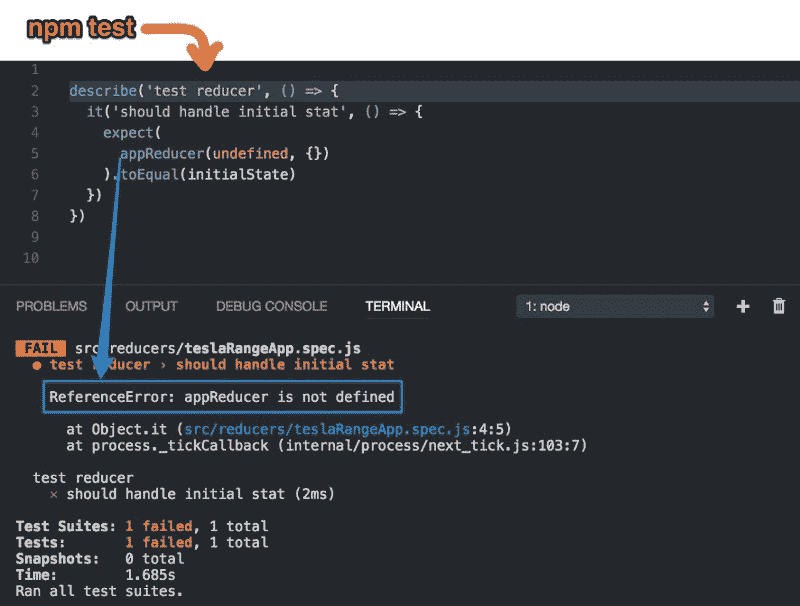

npm test console

为了让第一次测试成功，我们需要在同一个 reducers 目录下创建 **teslaRangeApp.js** 并编写**初始状态和 reducer** 函数。

**src/reducers/teslarangeapp . js**

```
const initialState = {  carstats:[    {miles:246, model:"60"},    {miles:250, model:"60D"},    {miles:297, model:"75"},    {miles:306, model:"75D"},    {miles:336, model:"90D"},    {miles:376, model:"P100D"}  ],  config: {    speed: 55,    temperature: 20,    climate: true,    wheels: 19  }}
```

```
function appReducer(state = initialState, action) {  switch (action.type) {        default:      return state   }}
```

```
export default appReducer;
```

接下来，从 teslaRangeApp.spec.js 导入 teslaRangeApp.js 并设置 initialState。

**src/reducers/teslarangeapp . spec . js**

```
import appReducer from './teslaRangeApp';
```

```
const initialState =  {  carstats:[    {miles:246, model:"60"},    {miles:250, model:"60D"},    {miles:297, model:"75"},    {miles:306, model:"75D"},    {miles:336, model:"90D"},    {miles:376, model:"P100D"}  ],  config: {    speed: 55,    temperature: 20,    climate: true,    wheels: 19  }}
```

```
describe('test reducer', () => {  it('should handle initial stat', () => {    expect(      appReducer(undefined, {})    ).toEqual(initialState)  })})
```

再次运行 npm 测试，测试将会成功。

在当前测试用例中，动作类型是{}，因此返回 **initialState** 。

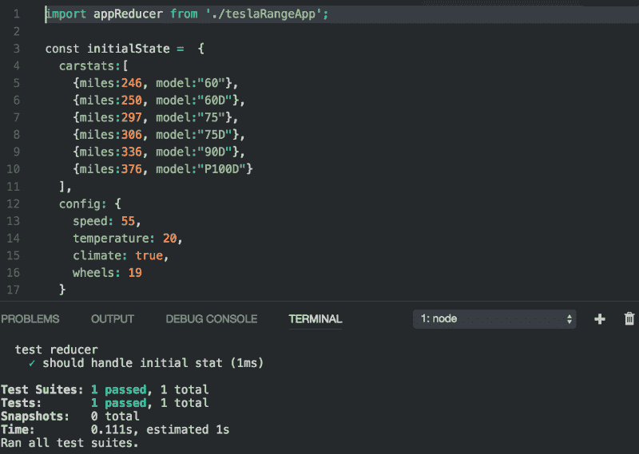

现在让我们测试一下 **CHANGE_CLIMATE** 动作。

将以下 climateChangeState 和 CHANGE_CLIMATE 测试案例添加到 teslaRangeApp.spec.js 中。

```
const climateChangeState = {  carstats:[    {miles:267, model:"60"},    {miles:273, model:"60D"},    {miles:323, model:"75"},    {miles:334, model:"75D"},    {miles:366, model:"90D"},    {miles:409, model:"P100D"}  ],  config: {    speed: 55,    temperature: 20,    climate: false,    wheels: 19  }}
```

```
it('should handle CHANGE_CLIMATE', () => {    expect(      appReducer(initialState,{        type: 'CHANGE_CLIMATE'      })    ).toEqual(climateChangeState)  })
```

然后将 **CHANGE_CLIMATE** case、 **updateStats** 和**calculatestas**函数添加到 teslaRangeApp.js 中。

```
import { getModelData } from '../services/BatteryService';
```

```
function updateStats(state, newState) {  return {    ...state,    config:newState.config,    carstats:calculateStats(newState)  }  }
```

```
function calculateStats(state) {  const models = ['60', '60D', '75', '75D', '90D', 'P100D'];  const dataModels = getModelData();  return models.map(model => {    const { speed, temperature, climate, wheels } = state.config;    const miles = dataModels[model][wheels][climate ? 'on' : 'off'].speed[speed][temperature];    return {      model,      miles    };  });}
```

```
function appReducer(state = initialState, action) {  switch (action.type) {    case 'CHANGE_CLIMATE': {      const newState = {        ...state,        config: {          climate: !state.config.climate,          speed: state.config.speed,          temperature: state.config.temperature,          wheels: state.config.wheels        }      };      return updateStats(state, newState);    }    default:      return state  }}
```

如果您检查测试结果，您可以看到这两个测试用例是成功的。


到目前为止，我们实现的是用户通过测试运行器在应用程序中打开和关闭空调时发生的状态变化，仅从**的动作和减速器**的角度，而没有 Redux Store 或 View。

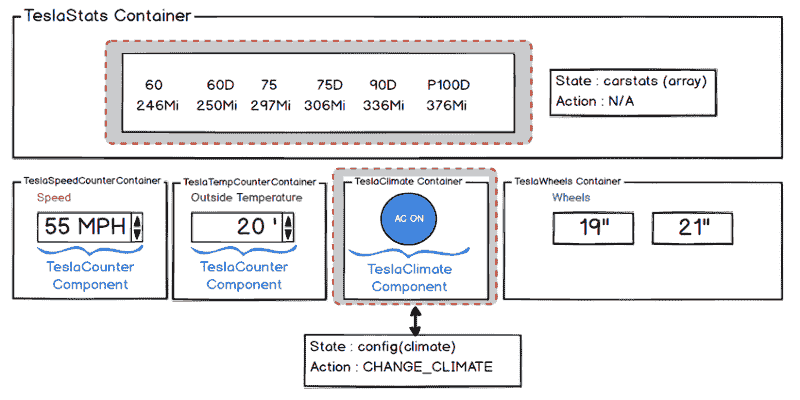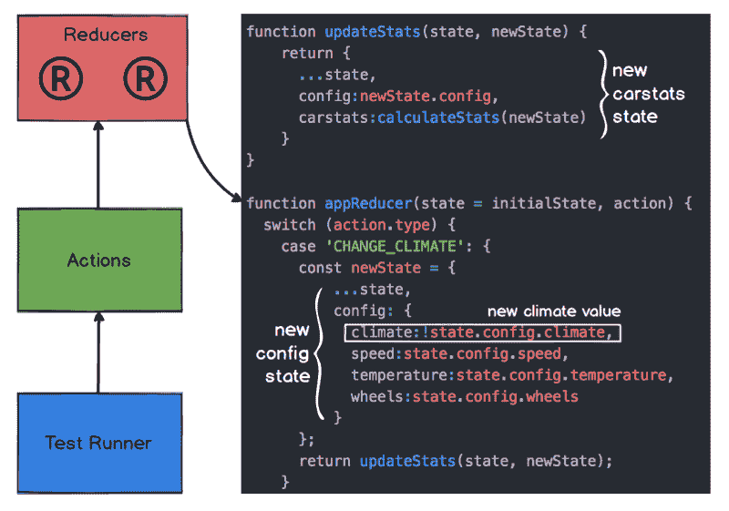

*   看看我们目前为止所写的
*   查看 [teslaRangeApp.spec.js](https://gist.github.com/gyver98/f482176b8c904a9ef1c64becb87b8023#file-teslarangeapp-spec-js)

### 9.3 为他人创建减速器

如果你参照上面的方法创建了其余的测试用例，你最终定义了 **teslaRangeApp.js** 文件，其中定义了所有应用的 reducers 和 **teslaRangeApp.spec.js** 来测试它们。

最终代码可在以下网址找到:

*   [teslar app . js](https://gist.github.com/gyver98/2f8c3a8e7652de29c090818f6b7999ea#file-final-teslarangeapp-js)
*   [teslaRangeApp.spec.js](https://gist.github.com/gyver98/f18ce2f9d04cf2b762f5ec4c2d0f9418#file-final-teslarangeapp-spec-js)

在完成代码和测试之后，总共七个测试用例必须成功。

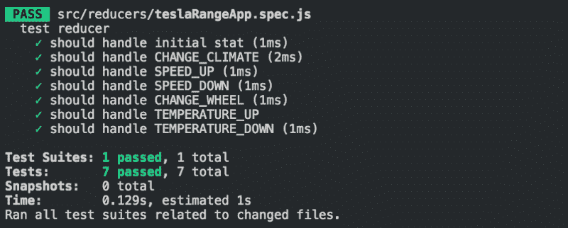

### 10.视图:智能和非智能组件

如 **5 所述。将应用程序分为容器和组件**，我们将创建**表示组件**(哑组件)用于表示目的，以及一个**容器组件**(智能组件)，它们是负责与 Redux 通信时的动作的包装组件。

智能组件**负责动作**。如果底层的哑组件需要触发一个动作，智能组件将通过 props 传递一个函数，然后哑组件可以将其视为一个**回调**。

在第 1 部分中，我们已经有了用于表示目的的哑组件，并将重用它们。

在这里，我们创建容器组件，作为每个哑组件周围的上层**包装器**。

### 10.1 视图层绑定

Redux 需要一些帮助来连接商店和视图。它需要某种东西将两者结合在一起。这被称为**视图层绑定**。在一个使用 react 的 app 里，这是`react-redux`。

从技术上讲，容器组件只是一个 React 组件，它使用 **store.subscribe()** 来读取 Redux 状态树的一部分，并向它呈现的表示组件提供**道具**。

因此，我们可以手动创建容器组件，但是对于 Redux 官方文档不推荐这样做。这是因为 **react-redux 执行了许多难以手动执行的性能优化**。

出于这个原因，我们没有手工编写容器组件，而是使用 react-redux 提供的`connect()`函数来编写。

让我们先安装必要的软件包。

*   **npm 安装–保存冗余**
*   **npm 安装–保存 react-redux**

### 10.2 特斯拉汽车集装箱

要使用 **connect()** ，需要定义一个名为`mapStateToProps`的特殊函数。这个函数告诉你**如何将当前的 Redux 商店状态转换为道具**以传递给表示组件。

TeslarCar 容器获取存储在当前存储中的 wheelsize，并将其传递给 props，以便可以由 TeslarCar 组件呈现它。这个道具会在每次状态更新的时候更新。

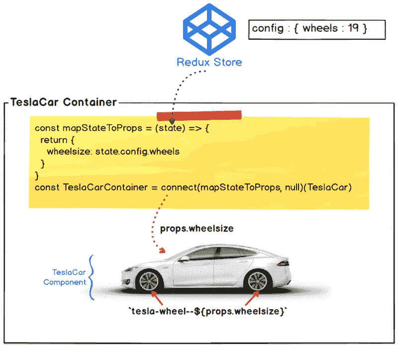

在定义了 **mapStateToProps** 函数之后，我们定义了如下所示的 **connect()** 函数。

```
const TeslaCarContainer = connect(mapStateToProps, null)(TeslaCar)
```

connect()接受`mapDispatchToProps`作为第二个参数，它将存储的 dispatch 方法作为第一个参数。在 TeslaCar 组件中，我们不需要动作，所以我们必须传递 null。

> **connect()()** 中的另一个括号可能看起来很怪异。这种形式实际上意味着两个函数调用， **first connect()返回另一个函数**，而**第二个函数需要你传递一个 React 组件**。在这种情况下，它是我们的 TeslaCar 组件。这种模式被称为**curry**或 **partial application** ，是函数式编程的一种形式。

创建**src/containers/teslacarcontainer . js**并编写代码。

> 查看 [TeslaCarContainer.js](https://gist.github.com/gyver98/7fa2b19d0bf023200a196ff1ec26f5d5#file-teslarcarcontainer-js)

### 10.3 特斯拉集装箱

与 TeslaCar 容器一样，只定义 **mapStatToProps** 函数，并将其传递给 TeslaStats 容器中的 connect()。

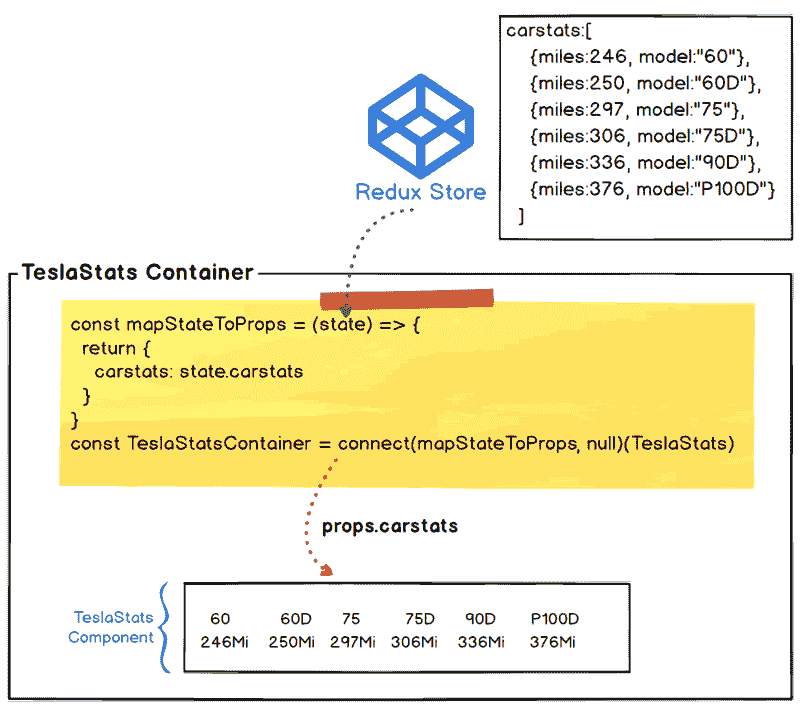

创建**src/containers/teslastatscontainer . js**并编写代码。

> 查看 [TeslaStatsContainer.js](https://gist.github.com/gyver98/065b988b03b0c823f7d8373f2235ec1e#file-teslastatscontainer-js)

### 10.4 TeslaSpeedCounter 容器

**TeslaSpeedCounter 容器**定义了一个额外的`mapDispatchToProps`函数来处理发生在 TeslaSpeedCounter 组件中的用户动作。

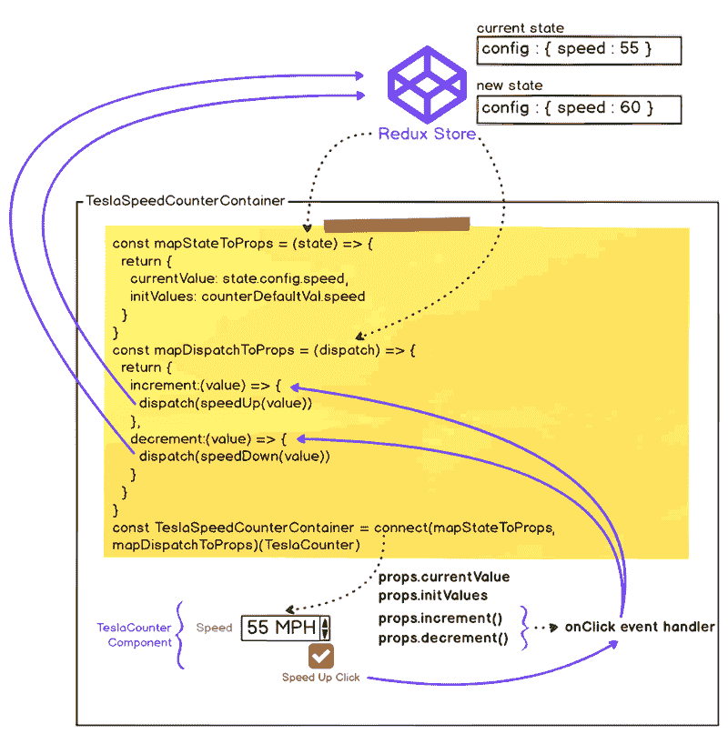

创建**src/containers/teslaspeedcountercontainer . js**并编写代码。

> 查看[teslaspeedcountercontainer . js](https://gist.github.com/gyver98/f1758643b7a9f3a5bcae546abda5861d#file-teslaspeedcountercontainer-js)

### 10.5 特斯拉计数器容器

除了传递状态和动作创建者之外， **TeslaTempCounter 容器**几乎与 TeslaSpeedCounter 相同。

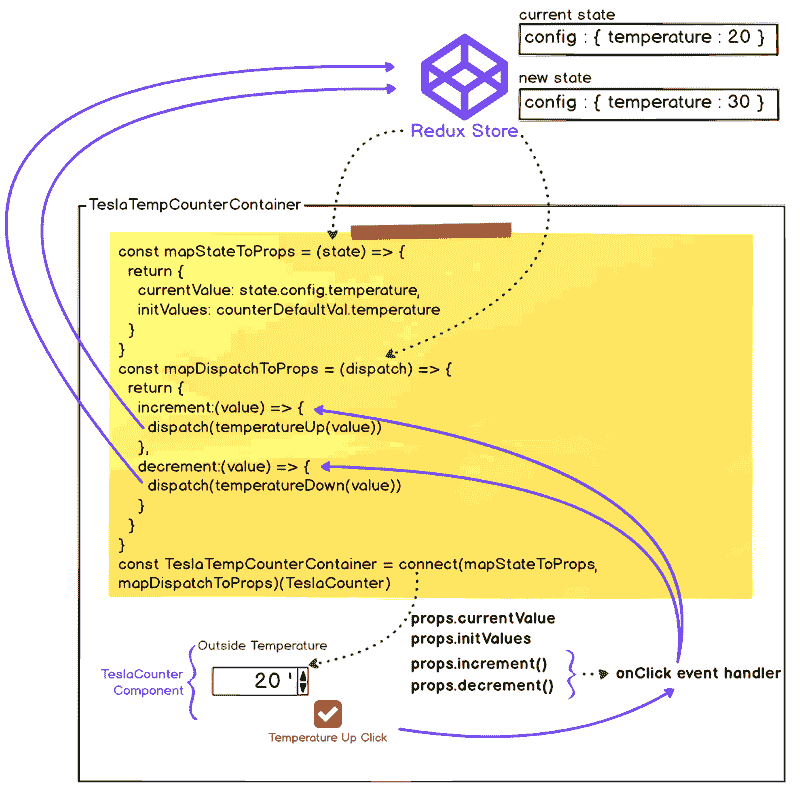

创建**src/containers/teslatempcountercontainer . js**并编写代码。

> 查看[teslatempcountercontainer . js](https://gist.github.com/gyver98/0986225c521d3213875a9849bf1e9d80#file-teslatempcountercontainer-js)

### 10.6 TeslaClimateContainer

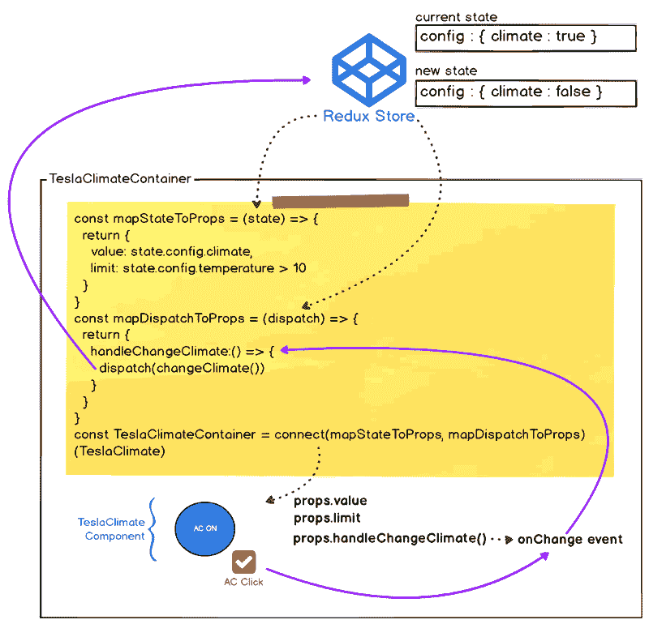

创建**src/containers/teslaclimatecontainer . js**并编写代码。

> 检查 [TeslaClimateContainer](https://gist.github.com/gyver98/bd677915a8b4ea68589497311c77eaee#file-teslaclimatecontainer-js)

### 10.7 特斯拉车轮集装箱

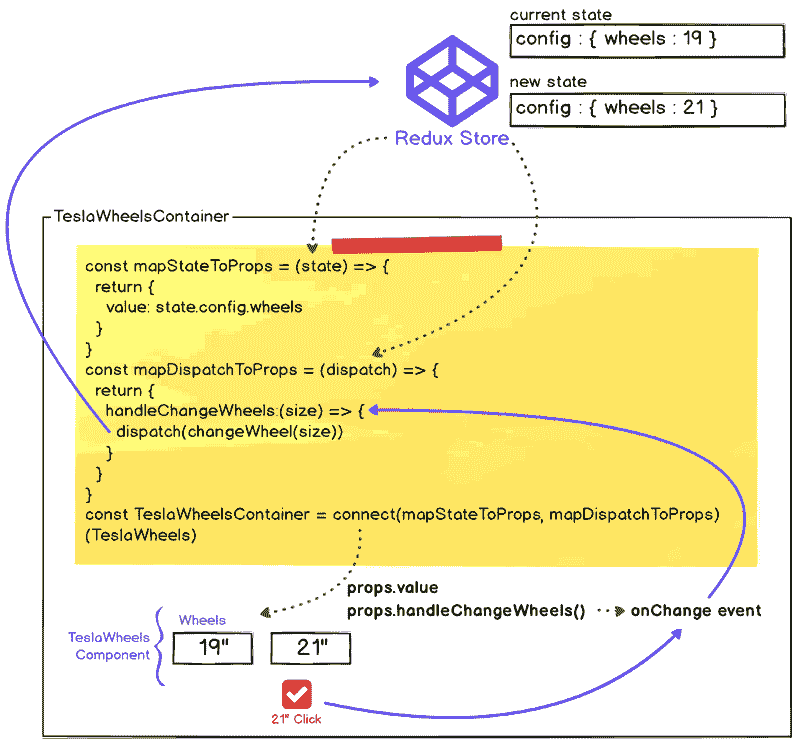

创建**src/containers/teslawheelscontainer . js**并编写代码。

> 查看 [TeslaWheelsContainer.js](https://gist.github.com/gyver98/2bc410b7c7aa07ac4def49702ba21738#file-teslawheelscontainer-js)

我们已经通过 react-redux 的 connect()创建了与第 1 部分中生成的[表示组件相对应的容器组件。](https://medium.freecodecamp.com/building-teslas-battery-range-calculator-with-react-part-1-2cb7abd8c1ee)

### 11.供应者

让我们把迄今为止所做的所有事情放在一起，让我们的应用程序正常工作。到目前为止，我们已经定义了**动作对象**并创建了**动作创建器**来创建动作对象。当一个动作发生时，我们创造了**减速器**，它实际上处理并返回一个新的状态。然后我们创建了一个**容器组件**，它将每个表示组件连接到 Redux store。

现在每个容器组件都需要一个访问存储的方法，这就是`Provider`所做的。提供者组件**包装了整个应用程序，并允许子组件通过 connect()** 与商店通信。

我们应用程序的顶层组件 **App.js** ，看起来像这样:

> 查看 [App.js](https://gist.github.com/gyver98/46b3929798503d057bf23e64a72c2011#file-app-js)

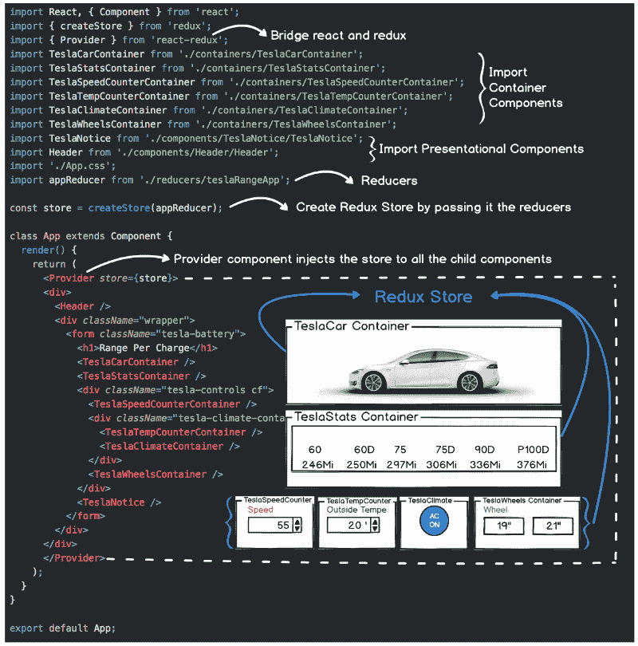

shield of Provider

### 12.他们是如何一起工作的

最后，所有的拼图都完成了。现在让我们看看下面的动画，作为所有拼图拼在一起，用户触发**加速**事件的例子。

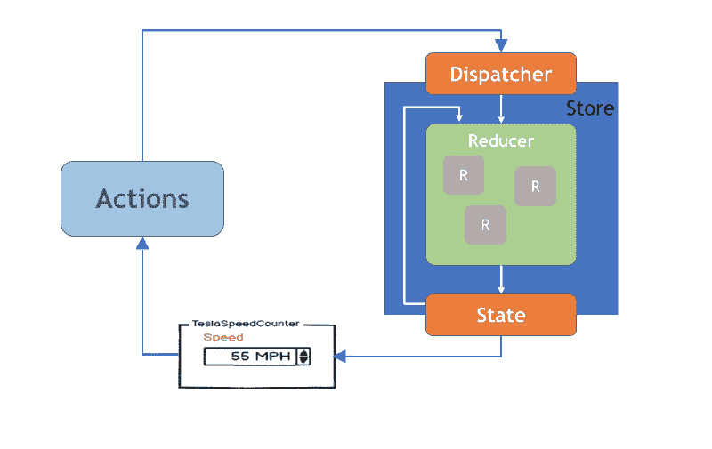

现在运行 **npm start** ，它将正常编译，应用程序将启动。

但是还有几件事要做。

*   首先，复制您在第 1 部分中创建的**/containers/Tesla battery . CSS**的所有内容，并将它们添加到 **App.css** 中。

> 查看 [App.css](https://gist.github.com/gyver98/fb061ac3997b055bf4628dcfdd83cb51#file-app-css)

*   接下来，打开**/components/Tesla counter/Tesla counter . js**，修改 **onClick** 事件处理程序如下:这是因为第 2 部分不再处理 **TeslaBattery.js** 中的事件处理。

```
onClick={(e) => props.increment(e, props.initValues.title)}-->onClick={(e) => {  e.preventDefault();  props.increment(props.currentValue)}}
```

```
onClick={(e) => props.decrement(e, props.initValues.title)}-->onClick={(e) => {  e.preventDefault();  props.decrement(props.currentValue)}}
```

*   接下来，我们不要通过使用 ES6 对象析构来重复使用 props。

```
const TeslaCounter = (props) => (  <p className="tesla-counter__title">{props.initValues.title}&lt;/p>  ...
```

```
-->const TeslaCounter = ({ initValues, currentValue, increment, decrement }) => (  <p className="tesla-counter__title">{initValues.title}</p>  ...
```

> 查看 [TeslaCounter.js](https://gist.github.com/gyver98/5c7f4755023643a84dc7514209f22997#file-teslacounter-js)

终于，我们的 **Redux 版特斯拉电池续航里程计算器 app** 完成了！

### 13.还有一件事:Redux 开发工具

`Redux Dev Tool`使得查看 Redux 状态跟踪和利用像时间旅行调试这样的酷功能变得更加容易。

我们将把它安装在 Chrome 上。

*   铬合金延伸件[安装](https://www.google.com.au/url?sa=t&rct=j&q=&esrc=s&source=web&cd=1&cad=rja&uact=8&ved=0ahUKEwijoqLQxdzSAhUEspQKHaEDA0AQFggZMAA&url=https%3A%2F%2Fchrome.google.com%2Fwebstore%2Fdetail%2Fredux-devtools%2Flmhkpmbekcpmknklioeibfkpmmfibljd%3Fhl%3Den&usg=AFQjCNFg4ldS78uapjCGBaNjL9NvIwZGhg&sig2=YuyPlshxe2eVaKrx0ReXfQ&bvm=bv.149760088,d.dGo)
*   为 Redux 存储添加

打开 **App.js** 文件，修改 **createStore** 部分如下:

```
const store = createStore(appReducer);-->const store = createStore(appReducer, window.__REDUX_DEVTOOLS_EXTENSION__ && window.__REDUX_DEVTOOLS_EXTENSION__());
```

*   在浏览器上检查

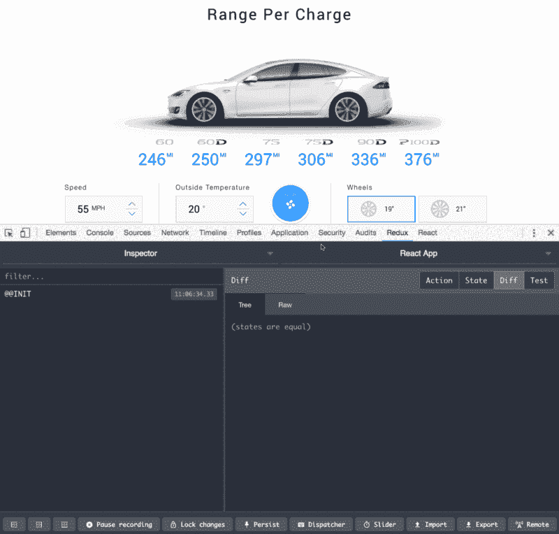

### 在你进入下一部分之前:

*   查看[最终项目代码](https://github.com/gyver98/redux-tesla-battery-range-calculator-tutorial)
*   查看[现场演示](http://redux-tesla-charge-calculator.surge.sh/)

### 其他资源:

*   [还原文档](http://redux.js.org/docs/introduction/)
*   [Redux 的卡通介绍](https://code-cartoons.com/a-cartoon-intro-to-redux-3afb775501a6#.4j7d5vz4l)
*   [使用 React: Redux](https://css-tricks.com/learning-react-redux/) 升级
*   【Redux 入门