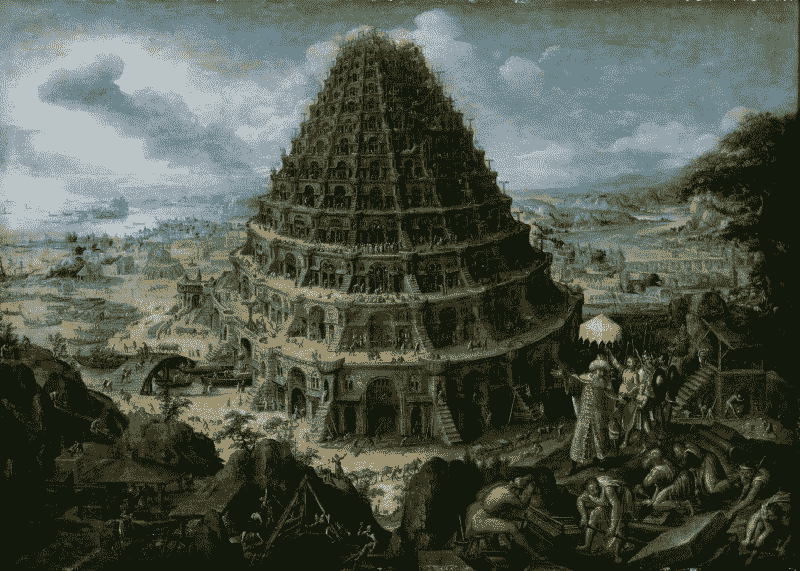

# 你可能错过的谷歌令人兴奋的人工智能公告。

> 原文：<https://www.freecodecamp.org/news/the-mind-blowing-ai-announcement-from-google-that-you-probably-missed-2ffd31334805/>

吉尔·福斯特

# 你可能错过的令人兴奋的谷歌人工智能公告。

*The Tower of Babel (Marten van Valckenborch [Public domain], via [Wikimedia Commons](https://commons.wikimedia.org/wiki/File%3AMarten_van_Valckenborch_the_Elder_-_The_Tower_of_Babel_-_Google_Art_Project.jpg))*

***免责声明*** *:我不是神经网络或机器学习方面的专家。自从最初写这篇文章以来，许多在这些领域比我专业得多的人都表示，虽然令人印象深刻，但谷歌取得的成就是渐进的，而不是革命性的。至少，公平地说，我在文本的某些部分犯了拟人化的错误。*

我没有改动这篇文章的内容，因为我认为将我的直觉反应与该领域专家随后的评论进行比较很有趣。我强烈建议读者在阅读文章后浏览评论，寻找一些比我自己更冷静、更有见识的观点。

在 2016 年的最后几周，谷歌发表了一篇文章，在大多数人的雷达下悄然航行。这很遗憾，因为这可能是我去年读过的关于机器学习的最令人惊讶的文章。

如果你错过了，不要难过。这篇文章不仅与我们大多数人正在浏览的圣诞节前的热潮相竞争——它还被藏在谷歌的研究博客上，在谷歌多语言神经机器翻译系统 *的极客标题 [*下。*](https://research.googleblog.com/2016/11/zero-shot-translation-with-googles.html)*

这并不完全意味着*必须读为*，不是吗？尤其是当你有项目要结束，有礼物要买，有家庭纠纷要解决的时候——所有这些都在降临节日历无情地倒计时，直到圣诞节，就像某种巧克力填充的圣诞末日时钟。

幸运的是，我是来给你介绍最新情况的。是这样的。

直到去年 9 月，谷歌翻译一直使用基于短语的翻译。当我们在孤独星球语言指南中查找关键词和短语时，它基本上做了和你我一样的事情。这已经足够有效了，而且比笨拙地翻阅一大堆页面寻找法语版的“请把你所有的奶酪都给我，直到我摔倒才停下来”要快得多。但它缺乏细微差别。

基于短语的翻译是一种生硬的工具。它做得很好，足以应付过去。但是，在不了解语言结构的情况下绘制大致相同的单词和短语只能产生粗糙的结果。

这种方法也受到可用词汇范围的限制。基于短语的翻译没有能力对它不认识的单词进行有根据的猜测，也不能从新的输入中学习。

所有这一切都在 9 月份发生了变化，当时谷歌给他们的翻译工具提供了一个新的引擎:谷歌神经机器翻译系统(GNMT)。这款新引擎满载所有 2016 年热门词汇，如*神经网络*和*机器学习*。

简而言之，谷歌翻译变聪明了。它发展了向使用它的人学习的能力。它学会了如何根据周围其他单词和短语的上下文，对短语的内容、语气和含义做出有根据的猜测。而且——这是应该让你的大脑爆炸的一点——它变得有创造性了。

谷歌翻译**发明了自己的语言**来帮助它更有效地翻译。

更何况，没人告诉它。它没有开发出一种语言(或者谷歌称之为国际语),因为它是被编码的。它开发了一种新的语言，因为随着时间的推移，软件确定这是解决翻译问题的最有效的方法。

停下来想一想。让它深入人心。一个旨在将内容从一种人类语言翻译成另一种语言的神经计算系统开发了自己的内部语言，以提高任务效率。却没有被告知这样做。几周之内。*(我在注释中添加了对这一段的更正/撤回)*

要理解这是怎么回事，我们需要理解什么是零镜头翻译能力。以下是谷歌的迈克·舒斯特(Mike Schuster)、尼基尔·苏拉(Nikhil Thorat)和梅尔文·约翰逊(Melvin Johnson)的原始博文:

> 假设我们用 Japanese⇄English 和 Korean⇄English 的例子来训练一个多语言系统。我们的多语言系统，与单个 GNMT 系统大小相同，共享其参数以在这四种不同的语言对之间进行翻译。这种共享使系统能够将“翻译知识”从一种语言对转移到其他语言对。这种迁移学习和在多种语言之间翻译的需要迫使系统更好地使用其建模能力。

> 这启发我们提出以下问题:我们能在系统从未见过的语言对之间进行翻译吗？这方面的一个例子是朝鲜语和日语之间的翻译，其中 Korean⇄Japanese 的例子不向系统显示。令人印象深刻的是，答案是肯定的——它可以生成合理的 Korean⇄Japanese 译文，尽管从未有人教过它这么做。

在这里，你可以看到谷歌新的神经机器相对于旧的基于短语的方法的优势。GMNT 能够学习如何在两种语言之间进行翻译，而无需明确教授。这在基于短语的模型中是不可能的，在这种模型中，翻译依赖于一个显式的字典来在每一对被翻译的语言之间映射单词和短语。

这让谷歌的工程师们有了惊人的发现:

> 零镜头翻译的成功提出了另一个重要问题:系统是否正在学习一种共同的表示方式，即不管语言如何，意思相同的句子都以类似的方式表示——即“国际语”？使用内部网络数据的三维表示，我们能够在该系统翻译所有可能的日语、韩语和英语语言对之间的一组句子时一窥其全貌。

> 在一个群体中，我们看到一个意思相同但来自三种不同语言的句子。这意味着网络必须对句子的语义进行编码，而不是简单地记忆短语到短语的翻译。我们把这解释为网络中存在国际语言的标志。

所以你有它。在 2016 年的最后几周，当世界各地的记者开始撰写他们的“这是人们记忆中最糟糕的一年吗”的文章时，谷歌的工程师们正在悄悄地记录软件工程和语言学领域的一项真正惊人的突破。

我只是想也许你会想知道。

好吧，为了真正理解正在发生的事情，我们可能需要多个计算机科学和语言学学位。我只是在这里勉强刮表面。如果你有时间获得几个学位(或者如果你已经获得了学位)，请写信给我，向我解释这一切。慢慢地。

***更新 1*** *:在我兴奋的时候，公平地说，我夸大了这是一个“智能”系统的想法——至少到目前为止，我们认为这是人类的智能和决策。请务必阅读这篇文章后克里斯·麦克唐纳的评论，以获得更清醒的观点。*

***更新 2*** *: [Nafrondel 精彩、详细的回复](https://medium.com/@nafrondel/you-requested-someone-with-a-degree-in-this-holds-up-hand-d4bf18e96ff?source=linkShare-36020d726097-1483995348)也是专家解释神经网络如何运作的必读之作。*