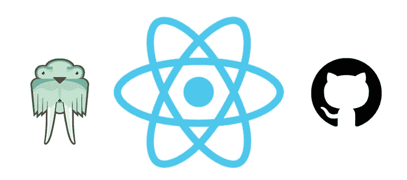
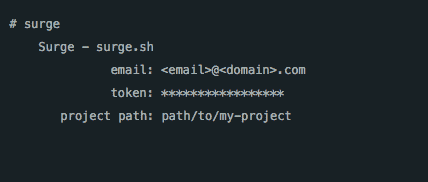
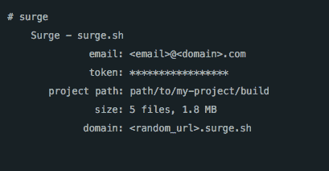
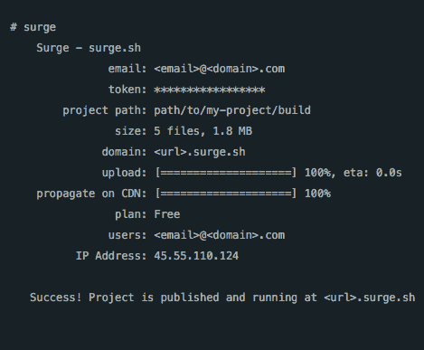
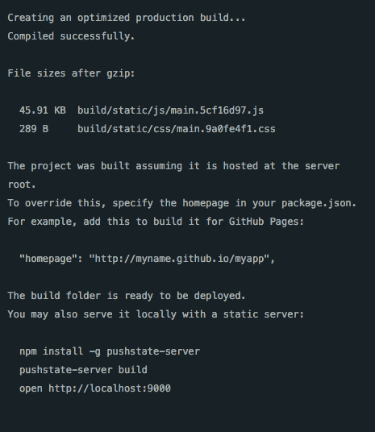
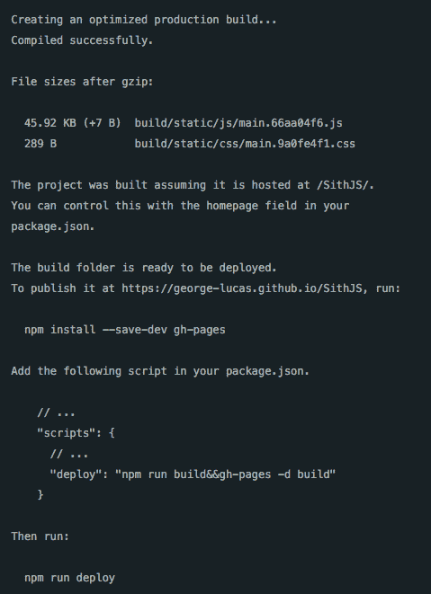
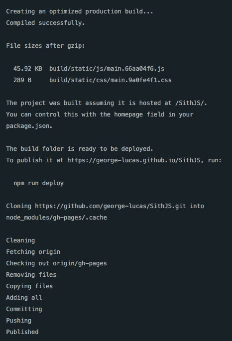

# Surge VS GitHub Pages:如何部署创建-反应-应用程序项目

> 原文：<https://www.freecodecamp.org/news/surge-vs-github-pages-deploying-a-create-react-app-project-c0ecbf317089/>

杰克·威斯勒

# Surge VS GitHub Pages:如何部署创建-反应-应用程序项目



作为一名开发人员，有几种方法可以向同事和未来的雇主展示你的技能。开源贡献很大。写博客很棒。但是在某些时候，你会想把项目放到网上，人们可以实际使用它们。

太多次了，我在当地开始了一件事，但从来没有完成。你可能也是这么做的。这种情况如此普遍的一个原因是因为部署中的所有额外工作。

如果有一个中心枢纽，可以存放所有项目，而不用担心托管和服务器配置，这不是很好吗？这篇文章将带您了解两种流行的部署工具，它们需要最少的努力。


Be the turtle.

### 创建-反应-应用

在你开始之前，让我告诉你我的新好朋友，`create-react-app`。如果你一直在考虑学习 React——但是被启动和运行一个项目所需的时间拖住了——这个[命令行界面(CLI)工具](https://github.com/facebookincubator/create-react-app)是你的救星。它会处理你开始一个项目所需要的大部分样板文件。

要安装它并创建您的第一个项目，请进入您的终端并运行以下命令:

```
npm install -g create-react-app 
```

```
create-react-app <your project name>
```

```
cd <your project name>
```

开箱即用的`create-react-app`附带了一些方便的脚本，允许您在本地开发项目，并在以后进行部署。它们可以在项目目录下的`package.json`文件中找到。

在开发项目时，使用`npm start`在本地运行项目。然后使用`npm run build`来准备您的项目进行部署。

### Surge.sh 和 GitHub 页面

让我们快进一点。您已经构建了一个基本的应用程序，并准备将其部署到 web 上。

静态网站托管平台领域有许多选择，但我们将使用的两个是 [Surge.sh](https://surge.sh/) 和 [GitHub Pages](https://pages.github.com/) 。

这两个平台本身都很强大。你用哪一个取决于你的情况。我的目标是让您更好地理解为什么这些工具存在，以及您可以用它们做什么。

还要注意的是，尽管这篇文章是关于发布用`create-react-app` CLI 创建的项目，但是 Surge 和 GitHub 页面甚至可以处理最基本的项目。如果您不使用 React 本身，您可以跳过其中的一些步骤。

### Surge.sh

Surge 是我最近在 Reddit 上的一个帖子中发现的一款非常棒的软件。Surge 的核心是一个 CLI，允许你免费部署你的项目。也很快。真正让 Surge 脱颖而出的是它的简单性。

让我们用`create-react-app`来看一个简单的例子。

首先，全局安装`surge`包:

```
npm install -g surge 
```

现在，Surge 已经安装在您的机器上，您需要准备您的项目进行部署。我上面提到过`create-react-app`在`package.json`中有一个脚本叫做`build`。这个脚本本质上是通过捆绑和优化所有代码来为应用程序的生产做准备。

在项目的根目录下运行`npm run build`:

```
npm run build
```

您应该注意到，在项目目录的根目录下已经创建了一个名为`build`的新文件夹。该文件夹包含生产就绪的应用程序。

太好了，你快完成了。剩下的工作就是在项目的根目录下运行`surge`命令:

```
surge
```

如果这是你第一次运行`surge`，系统会提示你创建一个账户。添加电子邮件和密码，然后按回车键。然后，您将看到类似如下的输出:



要部署您的项目，Surge 只需要您做两件事:

1.  项目的路径
2.  托管它的域

#### 项目路径

您会注意到终端中的*项目路径* 字段默认为根目录。Surge 假设您运行`surge`命令的目录就是您希望部署的目录。在您的例子中，您需要将 Surge 指向运行`npm run build`时创建的`build`目录。

如果您的项目路径是`path/to/my-project`，将其编辑为`path/to/my-project/build`。完成更改后，按 enter 键确认。



#### 领域

进入项目路径后，Surge 会建议一个随机域使用。如果你愿意，你可以删除它并添加你自己的域名。它只需要在末尾有一个`.surge.sh`扩展名。该工具还允许[自定义域名](https://surge.sh/help/adding-a-custom-domain)，这真是太棒了。

接受建议的域名，或者添加您自己的域名(自定义或随机，带有正确的浪涌扩展)，然后按回车键。



她就写了这么多！在浏览器中导航到该域，您应该看到您的项目启动并运行。

请注意，如果您的应用程序正在使用**客户端路由**，Surge 建议您在运行`surge`命令之前，将`build`目录中的`index.html`文件重命名为`200.html`。你可以在 Surge [文档](https://surge.sh/help/adding-a-200-page-for-client-side-routing)中找到更多信息。

### github pages-github 页面

GitHub Pages 可以轻松地将 GitHub 存储库转变为成熟的静态网站。许多组织使用这个服务来托管他们的文档和项目演示，但是你可以用它来做任何你想做的事情。

请注意，为了实现这一点，您必须首先将代码推送到 GitHub 上的存储库中。如果这对你来说听起来很陌生，请在这里查看更多的文档。

如果您以前曾经使用`create-react-app`运行过`npm run build`，那么您可能会注意到如下所示的输出:



initial output after running`npm run build`

附带详细的文档，帮助用户使用各种工具发布他们的作品。在这里你可以看到实时终端输出，指导我们如何通过 GitHub 页面这样做。让我们试一试。

#### 第一步

通过添加名为`homepage:`的新字段来编辑`package.json`

```
"homepage": "https://<github-username>.github.io/<project-repo>"
```

如果你的 GitHub 用户名是`george-lucas`，你的项目的 GitHub 库是`SithJS`,`homepage`字段的值应该是`"https://george-lucas.github.io/SithJS"`。

让我们在更改后再次运行`npm run build`:



new output after adding a `homepage` field in `package.json`

您注意到上面的新输出了吗？CLI 正在引导我们完成整个过程。相当时髦。

#### 第二步

接下来你需要安装`gh-pages`插件。这将允许我们直接从终端内部发布到 GitHub 上的`gh-pages`分支:

```
npm install --save-dev gh-pages
```

`gh-pages`是 GitHub Pages 用来发布项目的一个特殊分支。它的美妙之处在于，分支与项目代码存在于同一个存储库中，但不会影响项目本身。

注意，如果您的项目存储库中已经有了一个`gh-pages`分支，它将相应地更新这个分支。如果分支不存在，它将动态创建它。

#### 第三步

向`package.json`内的`scripts`字段添加一个新脚本。让我们称这个剧本为`deploy`:

```
"deploy" : "npm run build&&gh-pages -d build"
```

最后，让我们运行它:

```
npm run deploy
```



`npm run deploy`将首先通过`npm run build`构建您的项目。然后通过`gh-pages -d build`发布到 GitHub 上的`gh-pages`分支。

#### 第四步

我们快完成了。在 GitHub 上查看项目的存储库设置。在 **GitHub Pages** 部分，确认您的项目被设置为使用`gh-pages`分支。


An example of my React todo list using the gh-pages branch

现在您可以导航到您在`package.json`文件的`homepage`字段中输入的 URL，在这里您将看到您的项目已经被部署！


注意，和 Surge 一样，GitHub Pages 在客户端路由方面也有问题。`create-react-app`在[文档](https://github.com/facebookincubator/create-react-app/blob/master/packages/react-scripts/template/README.md#notes-on-client-side-routing)中列出了几个 GitHub 页面集成的解决方案。

### 获胜者

老实说，这两种选择都不会错。他们都很棒。让我们回顾一下每种产品的一些关键特性:

#### **浪涌**

*   部署项目的最低配置
*   对使用的技术不做任何假设
*   与 Grunt 和 Gulp 等构建工具无缝集成
*   可以在构建自己的工具时用作开发依赖项

#### github pages-github 页面

*   将项目代码和网页保存在一个存储库中
*   将所有项目集中在你的 *<用户名>下。吉斯* ub.io 域
*   从命令行或从 GitHub 上的存储库设置进行部署
*   适用于像 Jekyll 这样的静态站点生成器

就我个人而言，我选择 GitHub Pages 作为我最近的项目，因为我已经每天都在使用 GitHub，而且我喜欢让一切都集中起来。也许这是我的强迫症在说话，但是我喜欢为我可以作为`jake-wies.github.io`的子域部署的项目拥有单独的 GitHub 库。

如果你只是简单地创建一个测试项目，或者你想向客户展示一个演示，使用 Surge 的超快 CLI 来生成一个网页是很难拒绝的。您可以快速生成域，然后再将其拆除。

一天结束时，对工作来说最好的工具是让你有效率的工具。我提供的信息应该会让您很好地理解每种技术的优势。审核您的项目需求并选择适合您的项目。

*感谢阅读！我是一个自学成才的开发人员&我大部分的空闲时间都在钻研前端工具和[写我的出路](https://www.jakewiesler.com/)。如果您有任何问题，请通过 [Twitter](https://twitter.com/jakewies) 联系我！*