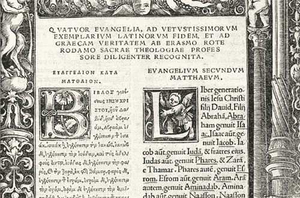
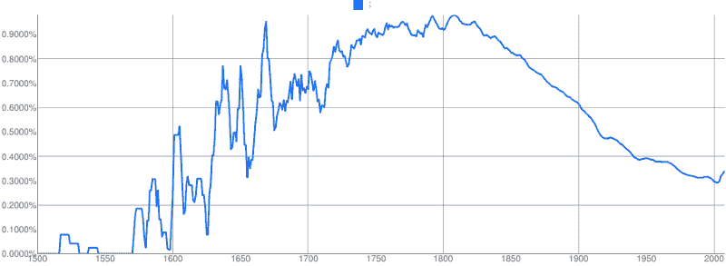

# 在媒体上写作的风格指南

> 原文：<https://www.freecodecamp.org/news/a-style-guide-for-writing-on-medium-fcbad27492ea/>

在花了 1000 多个小时为我们的媒体出版物撰写和编辑故事后，我决定为投稿人创建这个生活方式指南。您也可以在出版物中随意使用它。

### 大字标题

这些是你故事中最重要的部分，你应该认真思考一下。

不要使用 clickbait:

“你不会相信这是一个荒谬有效的标题暗模式”

不要使用列表条:

“迫使人们阅读你的媒介故事的 11 个骇人听闻的标题”

一定要说实话:

“一个有趣话题的巧妙而实际的标题”

不要把一个系列的第一部分称为“第一部分”它吓跑了人们，因为他们会认为阅读它是一个更大的时间承诺。谁知道你什么时候会开始写第二部分呢。

另外，如果你的标题太长，Medium 会将其截断。过长的标题也会阻止你的顶级形象出现在新闻提要中。

### 形象

Medium 提供四种不同的图像宽度。请注意，这些在手机上看起来都是一样的。

大多数情况下，您会希望坚持使用列宽:

如果您的图表太小很难阅读，请放大:

如果你真的对一张图片感到自豪，或者它充满了有趣的数据，那就全力以赴吧:

…然后还有侧跨。根本不要用这个尺寸，因为它会让文字读起来不太舒服。

当你谈完照片后，你的文字仍然被推到一边，这也很尴尬。

是啊。我还是被困在这里。

在你的标题下，总是在故事的顶部放一张高分辨率的图片。这有以下好处:

1.  当人们在脸书和 Twitter 上分享你的故事时，它会在新闻提要中更加突出，使人们更有可能点击它。
2.  在 Medium 自己的新闻源中会更好看。
3.  人类是视觉生物，点开图像。

### 属性

最简单的方法是在图片下面写上“图片来源”,并把这些文字链接到它的原始来源。

在某些情况下，这对图像权利人来说可能还不够。然而，实际上，大多数杂志和电影制片厂有更好的事情去做，而不是给那些仅仅把他们受版权保护的图片归属于自己的人发停止信。

如果你在寻找未经许可就可以安全使用的图片，请查看 [Pexels](https://www.pexels.com/) 、 [Unsplash](https://unsplash.com/) ，或者在谷歌上搜索标记为可重复使用的图片。

A Google image search query with the “Labeled for reuse” option selected.

剽窃——将他人的作品误认为是自己的——在大学里是一种严重的犯罪，在 Medium 上也同样严重。总是把引用归功于最初说它们的人。如果是多行引用，应该使用 Medium 的拉式引用:

> "当你有自己的智慧时，相信别人的智慧是一种乐趣。"
> ― **克里斯伊斯兰大教堂**

请注意，在任何其他情况下，您都不应该使用引用，因为它们会使文本更难阅读。抵制诱惑，不要引用你自己的故事，也不要取笑你即将要说的话。这是自我夸大，浪费读者的时间。

### 密码

在可能的情况下，代码应该是文本形式，而不是图像形式。这使得代码更容易被屏幕阅读器访问，也更容易被复制和粘贴。你可以这样做:

[**如何将代码块添加到 Medium 并使用嵌入工具突出显示语法**](https://medium.freecodecamp.com/how-to-add-code-to-medium-and-get-syntax-highlighting-d699761a5883)
[*Medium 有一个隐藏的快捷方式，可以将文本转换为纯文本……*medium.freecodecamp.com](https://medium.freecodecamp.com/how-to-add-code-to-medium-and-get-syntax-highlighting-d699761a5883)

### 链接

想办法把一个链接变成一个句子。如果一个链接对一个故事至关重要，把它放在自己的一行，然后按回车键。这将创建一个预览卡，如下所示:

[**如何站在巨人的肩膀上**](https://medium.freecodecamp.com/how-to-stand-on-shoulders-16e8cfbc127b)
[*征服这里没有发明的综合症，然后做点新的。*medium.freecodecamp.com](https://medium.freecodecamp.com/how-to-stand-on-shoulders-16e8cfbc127b)

给文本加下划线会使其更难阅读，所以只需超链接几个单词。

不要直接粘贴网址，像这样:[http://www.example.com](https://www.example.com)

如果这是他们品牌的一部分，一定要使用他们的顶级域名，比如[art.com](http://www.example.com)。

### 嵌入媒体

您可以嵌入推文、YouTube 视频和其他媒体，方法是将它们的 URL 粘贴到 media 中的新行上，然后按 enter 键。

请谨慎使用，因为它们可能会分散读者的注意力，让他们无法完成你的故事。

### 首字母缩略词

不要使用首字母缩写词，除非首字母缩写词比它所代表的含义更容易理解。例如，HTTP 比超文本传输协议更广为人知。

如果一个首字母缩略词还没有被广泛理解，并且您要多次引用它，您可以通过以下方式将其定义为首字母缩略词:

"让我们将代码分解成一个抽象语法树 (AST). "

为了方便读者，这里我还链接了维基百科的文章。但是，不要认为人们会阅读这些外部链接。你仍然需要定义概念或者通过例子来说明它们。

避免在你的开头段落中定义一个缩写词，因为这会减慢你的读者的阅读速度，使他们不太可能继续阅读。

这里有一个很短的技术缩略语列表，你不需要定义:API，AJAX，BIOS，CPU，CSS，HTML，HTTPS，LAN，RAM，REST，USB，WWW，XML。对于其他的事情，你应该把它拼写出来。

总是拼写出像 JavaScript 和前端这样的短的多部分单词。不要缩短它们——简洁不值得可能的混淆。

### 文本格式

你可以使用粗体或斜体来强调几个单词，但不要两者都用。这些会降低读者的阅读速度，应该谨慎使用。不要在链接上使用粗体或斜体。这些已经由于下划线而突出。

不要使用首字下沉。它们在旧书里看起来很优雅，但在网络上却很傻。

Some old-school-cool print dropcaps

如果你想强调什么，用**粗体**。*斜体字更难阅读。不要加粗超链接——它们下面的线条已经提供了足够的强调。*

只使用一个感叹号，通常是在感叹词之后，如:天哪！热狗！

将逗号和句号放在引号内，除非它可能会使读者困惑(如变量名或书名)。

在世界的某些地方，人们在冒号前加空格，就像这样:例如。不要这样。

使用英语而不是拉丁语:

*   用“例如”代替“例如”
*   用“那是”而不是“即”
*   用“注意”代替“注意”
*   而不是以“等等”来结束列表从“喜欢”开始:“猫王吃面包、花生酱和香蕉等食物。”

根据谷歌图书，分号已经慢慢消亡。让我们结束他们的痛苦。用句号代替，把从句分成独立的句子。

尽可能使用牛津逗号。它使东西读起来更容易、更清晰、更漂亮。

### 风格

使用[海明威 App](http://www.hemingwayapp.com/) 。这个简单的工具没有什么神奇的，但是它会自动检测广泛认同的风格问题:

*   被动式
*   不必要的副词
*   有更多相同词的单词

海明威应用程序将为你的写作指定一个“等级”。甚至技术故事也能达到 6 分。他们应该渴望。

大多数人的母语不是英语，那些母语是英语的人通常不会整天坐着读乔叟。他们希望他们的信息是可访问的和中肯的。

宁可把长句子和段落分成短的。

使用缩写。它们会让你的文章看起来更有对话性。这总是有利的。

始终保持你的时态一致。如果你在谈论过去发生的事情，用过去式。

称呼你的读者为“你”——而不是“我们”或“我们”“我们”不会去做这个教程，你的读者会去读你的教程，然后自己去做。

还有，**前端**发展(形容词形式加破折号)就是你在做**前端**(名词形式不带破折号)。后端、全栈和许多其他复合术语也是如此。

### 最后的建议

请记住，当你在媒体上发表文章时，你是在要求成千上万的人给你他们生活中的几分钟。不要认为你的读者是理所当然的。

在你发表一个故事之前，我建议你睡觉，醒来，然后再校对一遍。

如果你的母语不是英语，并且正在用英语写作，在把你的故事提交给出版物之前，请一位母语为英语的人校对一下。

当你把你的故事提交给一个出版物时，你应该期待编辑们真正地编辑它。请记住，这些人花在编辑故事上的时间比你多得多，他们对“什么有用”的理解也更加进化但是不要让这阻止你提问和纠正他们可能引入的任何事实错误。

警惕那些未经编辑就发表你的故事的出版物。如果他们懒得编辑它(甚至不去读它？)，他们可能也不会花太多精力去宣传它。

哦，不要以“这篇文章发表在我的博客上”或“更新:这篇文章已经发表在黑客新闻上”来开始你的故事如果你选择像这样添加注释，把它们放在你故事的最底部。人们点击阅读你的故事并不是为了马上被打发走——他们是来阅读你的故事的。

请注意，freeCodeCamp 本身不再在 Medium 上发布。相反，我们在这里发布。下面是如何在 freeCodeCamp 的出版物上发表的[。](https://www.freecodecamp.org/news/developer-news-style-guide/)

如果你想了解更多关于在媒介上有效写作的知识，请阅读[如何写人们会真正阅读的媒介故事](https://medium.freecodecamp.com/how-to-write-medium-stories-people-will-actually-read-92e58a27c8d8)。