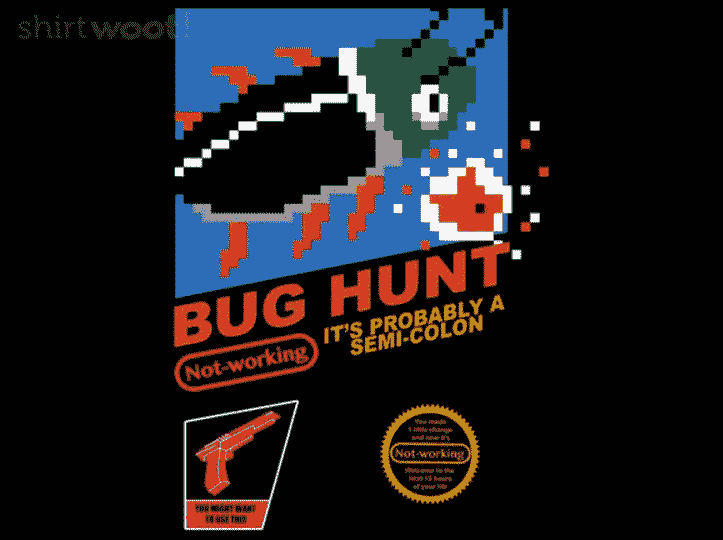

# 如何找到你要修复的第一个开源 bug

> 原文：<https://www.freecodecamp.org/news/finding-your-first-open-source-project-or-bug-to-work-on-1712f651e5ba/>

当您刚接触开源时，您会发现自己在问:

> 我懂一些[编程语言]。我想在帮忙的同时练习一下。我如何找到一个我可以贡献的开源项目？嗯……我不知道从哪里开始。这似乎很复杂。

我一遍又一遍地问许多开发人员这个问题。他们的答案可以归为三种方法之一:

#### 方法 1:为你喜欢的事情做贡献

我得到的最常见的答案是贡献给你已经每天使用的东西。你感兴趣的东西。

#### 方法 2:专门寻找对初学者友好的项目

以下是初学者友好的开源项目的一些特征:

*   定义良好的、详细的贡献指南，包括在本地设置他们的项目、他们的 Git 工作流和他们的编码风格指南
*   使用“好的第一个 bug”、“初学者”或“仅首次使用”等标签对问题进行正确分类
*   针对初学者问题的活动，快速回答之前的问题

#### 方法 3:停止搜索项目，开始搜索 bug。

这是我选择的方法，也是本文的重点。

在尝试了方法#1 和#2 之后，我不再考虑项目。相反，我专注于寻找我认为可以修复的错误。

每一个 bug 都与一个项目相关联，所以无论如何，当你发现 bug 时，你将不可避免地发现项目。

如果你想立即开始，这种方法是可行的。我不能保证它会在你最初的几个贡献之后激励你坚持一个项目。也许你终究不会感兴趣。但是也许你会深入这个项目，发现你真的喜欢它。

不管怎样，一旦你修复了一些错误，你就有信心去冒险，自己探索更多。

### 那么，如何从一开始就找到漏洞呢？

决定处理哪些 bug 并不容易。有很多项目，每个项目都有很多未解决的问题。但是你需要从某个地方开始。

所以我分享一下我用过的所有查找 bug 的资源和技巧。首先，我将集中精力在各种 bug 追踪器和代码托管网站中寻找好的初始 bug。然后，我将分享一些 Mozilla 生态系统的资源，我一直定期在这里做贡献。

#### 为初学者寻找好的 bug

开始寻找 bug 的一个好地方是[待价而沽](http://up-for-grabs.net/#/)。这个网站的全部目的是通过维护一个有初学者友好问题的项目列表来帮助新的贡献者熟悉环境。如果你感到完全迷失了，这是一个开始的好地方。

GitHub 有一个[强大的搜索引擎](https://help.github.com/articles/searching-github/)，你可以用多种方式定制你的搜索。最简单的搜索方式是通过问题标签搜索[。](https://help.github.com/articles/searching-issues/)

许多开源项目都标记了它们的问题，以便方便地跟踪它们。很多项目都使用类似于[初学者](https://github.com/search?utf8=%E2%9C%93&q=is%3Aissue+is%3Aopen+label%3A%22beginner%22&type=Issues&ref=searchresults)、[易](https://github.com/search?utf8=%E2%9C%93&q=is%3Aissue+is%3Aopen+label%3A%22easy%22&type=Issues&ref=searchresults)、[入门者](https://github.com/search?utf8=%E2%9C%93&q=is%3Aissue+is%3Aopen+label%3A%22starter%22&type=Issues&ref=searchresults)、[好的第一个 bug](https://github.com/search?utf8=%E2%9C%93&q=is%3Aissue+is%3Aopen+label%3A%22good+first+bug%22&type=Issues&ref=searchresults) 、[低挂的果子](https://github.com/search?utf8=%E2%9C%93&q=is%3Aissue+is%3Aopen+label%3A%22low+hanging+fruit%22&type=Issues&ref=searchresults)、 [bitesize](https://github.com/search?utf8=✓&q=is%3Aissue+is%3Aopen+label%3A%22bitesize%22+&type=Issues&ref=searchresults) 、[琐碎的](https://github.com/search?utf8=✓&q=is%3Aissue+is%3Aopen+label%3A%22trivial%22+&type=Issues&ref=searchresults)、[易修复](https://github.com/search?utf8=%E2%9C%93&q=is%3Aissue+is%3Aopen+label%3A%22easy+fix%22+&type=Issues&ref=searchresults)和[新贡献者](https://github.com/search?utf8=%E2%9C%93&q=is%3Aissue+is%3Aopen+label%3A%22new+contributor%22+&type=Issues&ref=searchresults)这样的标签。

通过在搜索查询中添加 *language: name* ，您可以根据您熟悉的编程语言进一步缩小搜索范围。例如，这里有所有在 JavaScript 中被标注为“初学者”的问题[。](https://github.com/search?utf8=%E2%9C%93&q=is%3Aissue+is%3Aopen+label%3A%22beginner%22+language%3Ajavascript)

[issue huio](http://issuehub.io)是一个按标签和语言搜索问题的工具，以防你觉得记住 GitHub 搜索语法很繁琐。

如果你完全是开源的新手，你绝对应该从第一次使用开始。这是由 [Kent C. Dodds](https://kentcdodds.com/) 发起的，基于他自己的[第一次仅](https://medium.com/@kentcdodds/first-timers-only-78281ea47455)帖子和 [Scott Hanselman](https://www.hanselman.com/) 的[将善意带回开源](http://www.hanselman.com/blog/BringKindnessBackToOpenSource.aspx)。这些漏洞被贴上了[的标签，只适用于初次尝试的人](https://github.com/search?q=label%3Afirst-timers-only&state=open&type=Issues)。

你可能也会发现这个推特机器人很有帮助。它在推特上发布所有被贴上“仅限新手”标签的问题。

另一个发现问题的好方法是夏洛特·斯宾塞的《你的第一次》。他们展示了 GitHub 上的初学者问题，新的贡献者可以很容易地解决这些问题。

是一个 GitHub repo，它为新的贡献者收集了带有好的 bug 的项目，并应用标签来描述它们。

Openhatch 是一个非营利组织，帮助降低进入开源的门槛。您也可以在这里找到 bug 和项目。

### Mozilla 贡献者生态系统

Mozilla 的许多项目都托管在 GitHub 上。对于这些项目来说，我上面列出的东西还是有用的。他们用“好的第一个 bug”这个标签来表示初始问题。

但是 Mozilla 也使用自己的工具 Bugzilla T1 作为主要的问题跟踪器。他们在这里托管他们的一些问题[，并使用](https://hg.mozilla.org/) [Mercurial 代替 Git](https://mozilla-version-control-tools.readthedocs.io/) 进行版本控制。

Firefox 是使用 Bugzilla 和 Mercurial 的项目之一。老实说，这有点可怕。有很多东西需要消化。所以我推荐这篇[优秀的博客文章和视频](http://blog.johnath.com/2010/02/04/bugzilla-for-humans/)，它很好地揭示了这些工具。

多年来，Mozillians 人试图尽可能简单地为 Mozilla 做贡献。以下是他们的努力:

*   好的第一个 bug:这些 bug 被开发人员认为是对项目的一个很好的介绍。它们通常(但不总是)相对容易解决
*   被指导的 bug:这些 bug 有一个被指派的指导者，当你在修复过程中遇到困难时，他会在 IRC 上帮助你。他们经常检查你的补丁并给出反馈。如果你不知道从哪里开始参与 Mozilla 项目，这是最好的开始。当你感到碰壁时，会有人回答你的问题。我共事过的所有导师自始至终都非常积极、支持和乐于助人。
*   这是一个致力于在 Bugzilla 上寻找 bug 的网站。它有一个友好的用户界面，你可以按语言过滤。
*   火狐开发工具(Firefox dev tools):这个网站致力于开发工具在火狐浏览器中的缺陷。您可以根据您想要处理的 DevTools 组件进行排序。
*   [我能为 Mozilla](http://whatcanidoformozilla.org/) 做些什么——这是一个很好的方式，通过回答一系列关于你的技能和兴趣的问题来探索和找出你可以做些什么。
*   启动 Mozilla :这是一个 Twitter 账户，发布适合 Mozilla 生态系统新手的问题。

如果你知道任何其他为新手贡献者找到好的 bug 的资源，请在评论中告诉我。我将非常乐意扩展这个列表。

*如果你认为这篇文章有用，请点击“︎*❤】*帮助向他人推广这篇文章。*

