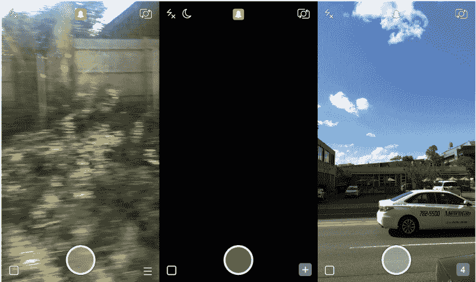
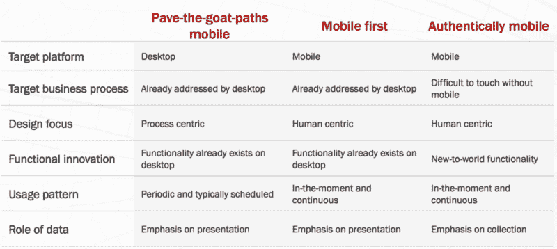
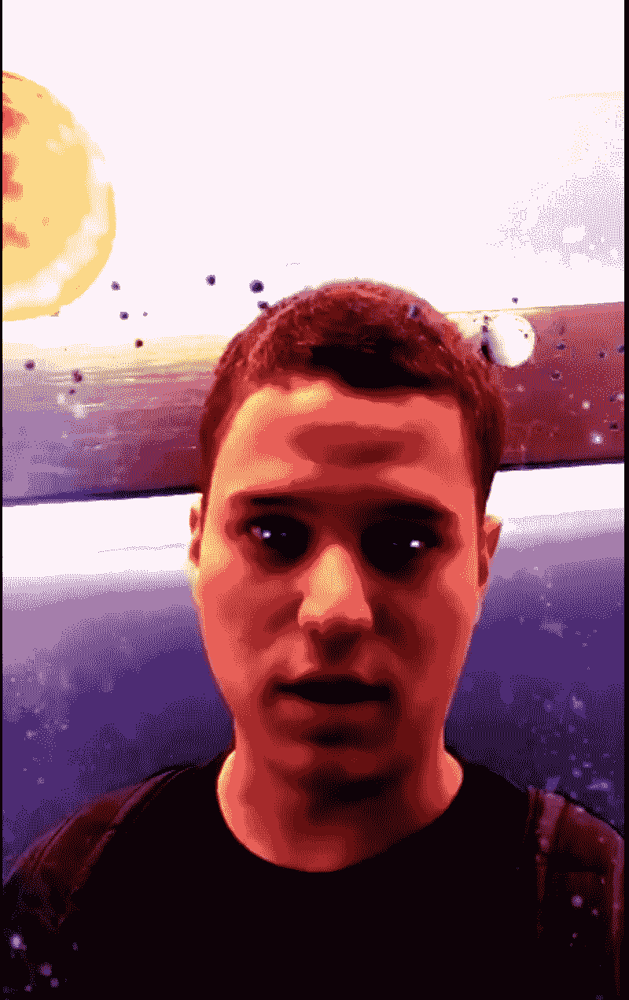

# 机器中的幽灵:Snapchat 不是移动优先，而是完全不同的东西

> 原文：<https://www.freecodecamp.org/news/ghost-in-the-machine-snapchat-isnt-mobile-first-it-s-something-else-entirely-4f6c265152a2/>

本·巴斯切

# 机器中的幽灵:Snapchat 不是移动优先，而是完全不同的东西

> “哦，你认为黑暗是你的盟友？你只不过是采用了黑暗，我生在其中，被它塑造。”贝恩

人们很容易将 Snapchat 视为应用革命的一部分，视为定义了我们智能手机时代的移动优先设计的光辉典范之一。

这在一定程度上当然是正确的，但看到 Snapchat 在美国应用商店中与脸书和谷歌的主要资产(以及本周的其他风味)一起连续排名第一或第二，多少掩盖了这里实际发生的事情。

Snapchat 不是移动优先，它也不再是一个真正的应用程序。也不是像 Facebook Messenger 那样的元应用平台(至少现在还不是)。Snapchat 是一个真正的移动产品，是一个活生生的化身，体现了我们带摄像头、联网的口袋电脑所能提供的一切。在它将智能手机融入一个真正的社交操作系统的过程中，我们看到了超越手机的端倪。

当我对着镜头打开 Snapchat 时，我无法摆脱这种感觉，那就是鬼魂在敲打玻璃，试图闯入这个世界。

#### 移动优先

当我们进入应用经济的第八个年头时，想想我们已经走了多远，这绝对是值得注意的。移动已经完全重塑了旧的行业，创造了新的行业，并彻底改变了整个计算世界。

各行各业的公司都因未能思考“移动优先”而走到了尽头(或者变成了以前的空壳)，这个词是卢克·乌鲁布莱夫斯基创造的，它与“精益”和“设计思维”一样定义了这个时代大多数面向消费者和许多 B2B 垂直市场都是由一些公司驱动的，这些公司设计或调整了他们的客户体验，以适应智能手机主导的世界。

然而，就像所有的技术浪潮一样，即使是那些站在主流社会一边的人，脚下的土地也在改变。

彼得·瓦格纳和马丁·贾尔斯去年在《移动优先，但下一步是什么？》中敏锐地写下了这些抱怨他们创造了“真正的移动”一词，以区分不仅为移动世界量身定制，而且充分利用移动设备独特功能的服务，没有移动设备他们就无法生存。

移动优先的公司采用新的便携式外形，并在桌面上或多或少可能但在某种程度上有限的东西上即兴创作，真正的移动公司正在真正创造体验，如果我们口袋里没有联网的超级计算机，这些体验要么是不可能的，要么完全没有意义。

真正移动的一个经典例子是优步，如果没有一个定位计算设备总是在我们身上(在双边市场的双方)，几乎肯定不会存在。瓦格纳和贾尔斯的表格总结了这种转变:

Credit: Peter Wagner and Martin Giles

很明显，Snapchat 在专栏#3 中得到了很好的描述——特别是关于它对收藏的强调——如果有专栏#4，它将会跨越这条线。“强调收藏”不能更完美地描述 Snapchat——一个众所周知默认其摄像头的应用程序。首席执行官埃文·斯皮格尔最近称 Snapchat 主要是“一家相机公司”

#### 饲料

没有一个用户界面隐喻像可滚动 feed 一样与“移动优先”的设计理念有着广泛的联系——无论是标准的反向时序还是算法驱动。人们只需要观察公共交通工具上的人们伸长脖子看着他们的手机不停地弹来弹去，就能感受到反馈在我们的日常生活中已经变得多么无处不在。

除了大型社交网站之外，从生产力到个人理财的无数其他移动应用程序中也有这种内容。但是，尽管智能手机的外形非常适合这种情况——从专注的屏幕尺寸到允许内容消费消耗我们生活中所有空闲时间的便携性——但**它并不是在移动设备上诞生的**。

在桌面浏览器全盛时期的末期，我们开始到处看到提要，其中最重要的提要显然是脸书的。在某种程度上，脸书让浏览器大战变得无关紧要，因为它本身成为了浏览器——我们体验网络的起点。尽管[遭到华尔街的强烈质疑](http://www.wsj.com/articles/SB10001424052702304791704577418260887981468)，脸书在将新闻内容移植到手机上方面取得了巨大成功。

[Adam Gale 有一个很好的总结](http://www.managementtoday.co.uk/news/1381279/mark-zuckerbergs-mobile-first-strategy-pays-off/),描述了这场移动赌博给脸书带来的丰厚回报:

> 事实上，脸书(包括 WhatsApp 和 Instagram)本质上是一家移动公司。2016 年第一季度，该平台的收入同比增长 70%(达到 44 亿美元，总收入为 54 亿美元)，上一季度增长 82%。移动收入现在占该业务的 82%。

就在脸书进行这一转变的时候，就在苹果手机的摄像头获得了拍摄可接受的照片的能力的时候，一个更纯粹、更专注的脸书新闻提要版本出现了:Instagram。您每周发布几张 Instagram 照片。然后，您会花费大量时间滚动浏览和查看内容，就像使用脸书蓝色应用程序一样。Instagram 简单的设计、创造性的限制和 s̶u̶s̶p̶i̶c̶i̶o̶u̶s̶l̶y̶̶一贯美丽的内容使它成为一种令人愉快的移动体验，并且在许多方面成为 Facebook 注意力帝国的皇冠上的宝石。

Instagram 是 Wagner & Giles“强调展示”移动优先标志的巅峰之作。Instagram 在年轻一代中的知名度早已超过了脸书，此次收购被誉为科技史上最伟大的收购之一。脸书在 feed 隐喻上的优势基本上是完全的和无可争议的。

但我们开始看到脸书和 Instagram 都出现了一些裂缝。今年年初(讽刺的是？)推特圈正在热烈讨论[彭博](http://www.bloomberg.com/news/articles/2016-04-07/facebook-said-to-face-decline-in-people-posting-personal-content)的一份报告，该报告称原创(即用户生成的)分享正在脸书下沉，该公司内部称之为“语境崩溃”

任何在脸书呆了很长时间的人可能都不需要数字来支持他们和他们的朋友不再上传周末活动的大型相册的普遍感觉，更不用说在别人的墙上分享一首很酷的歌了。与此同时，VentureBeat 报道称，2015 年 Instagram 的参与度大幅下降了 40%。

我对 Instagram 的数据持保留态度，因为它们没有完全通过 sniff 测试，但我认为，尽管 Instagram 继续增长(最近大幅超过 Twitter)，并在调解我们的社会等级制度方面保持着非常优越的地位，但人们(尤其是年轻人)似乎不那么频繁地发布帖子，并开始将时间花在其他地方。Instagram 的算法反馈能否解决这个问题，还有待观察。

诚然，脸书和 Instagram 仍然是人们每小时(好吧，每 15 分钟)例行“查看手机”的一部分，但我认为没有人可以否认，他们明显向更被动的消费体验演变，这不会引发一些危险信号。

#### 物理学——回到“现在”

这到底是怎么回事？这些数字支持了脸书和 Instagram 在美国有些动摇的观点，我认为将 Snapchat 用户和参与度的持续爆炸式增长视为原因之一是合理的。

但是，为什么 feed 的两个后裔和移动优先帝国的关键人物似乎难以推动人们分享他们的生活呢？也许不断修剪持久的在线身份的任务——仔细考虑你的数字废气将对你的自我产生什么影响——开始给人们带来压力。脸书和 Instagram 都被认为是展示最好的自己的舞台，你的每一篇帖子都在向外界展示一些东西，让人们从现在到永远对它们进行评判。

马克·扎克伯格因其对我们身份的独特性和持久性的极端观点而闻名，他甚至说[“拥有两个身份是缺乏诚信的一个例子。”](http://www.michaelzimmer.org/2010/05/14/facebooks-zuckerberg-having-two-identities-for-yourself-is-an-example-of-a-lack-of-integrity/)食用饲料加剧了我们一些更深层次的不安全感，这反过来又给我们的贡献带来了巨大的压力。

每个有母亲的人都可以证明，在度假期间，每次都会让家人停下来拍照，拍摄我们生活中所有最美好的时刻的冲动并不新鲜，但社交媒体已经将这种冲动推向了狂热的程度，如果没有发布，某个时刻就像没有发生一样。

在 2013 年以研究员的身份加入 Snapchat 之前， [Nathan Jurgenson 写了一篇名为“Pics and It not Happen”](http://thenewinquiry.com/essays/pics-and-it-didnt-happen/)的文章，揭示了最终回家休息的小鸡。他引用了苏珊·桑塔格的一句话，开始了最令人心酸的一段:

> 苏珊·桑塔格在《摄影》中写道，

> “拍照这一行为带有某种掠夺性。给人们拍照就是侵犯他们，以他们从未见过的方式看他们，以他们从未拥有的方式了解他们；它把人变成了可以象征性拥有的物品。”

> 桑塔格指出，这引发了一种怀旧的凝视，一种对主要是可记录的世界的理解。对于那些生活在状态更新、签到、喜欢、转发和无处不在的照片中的人来说，这样的理解几乎是不可避免的。社交媒体邀请用户采用一种纪录片的视角，通过这种视角，现在总是被理解为潜在的过去。Instagram 的仿古董滤镜就是最成功的例子。

我不认为这是这么多的同时按摩和粉碎我们的自我是重压在移动第一的巨头饲料。Snapchat 的故事当然有表演和偷窥的成分，可能永远不会在社交中消失。

相反，当我们淹没在大量已经失去意义的存档内容中时，Snapchat 和 plain old messaging 等平台的即时性和亲密性给了我们一个与当前时刻互动的孤岛。

当他说“通过快速拍摄，临时照片是对时间的微小抗议”时，他绝对抓住了这一点。相比之下，feeds 坚持认为我们一直活着是为了重温过去。

#### 机器中的幽灵——即将到来的征兆

根据移动设备上普遍接受的设计实践，无数人观察到(并且经常感叹)Snapchat 的“糟糕的 UX/UI”。在“好的设计”要求功能可发现的地方，Snapchat 几乎不为新用户提供支持，而是将功能隐藏在复杂的手势和不直观的屏幕后面。从点击“发现故事”( Discover stories)来创作分享+标记内容的快照，到双重过滤(按住第一个，然后继续滑动浏览), Snapchat 是世界上最简单的应用程序之一，也是最难学习的应用程序之一。

不过，重要的是，学习 Snapchat 的“困难”部分并不在于用户界面(许多人夸大了这个功能 bamboozling 在阻止“老用户”进入方面的作用)。相反，Snapchat“是什么”和“它是为了什么”的模糊性是旁观者的怀疑和所谓的陡峭学习曲线的主要原因。

除了定义智能手机时代的视觉设计实践之外，也许一个更为重要的指导移动应用评论的原则是要解决一个核心“问题”的想法，一个用户可以团结起来的单一组织原则。令人想起 Twitter 的早期，Snapchat 面临着关于其核心用例是什么的问题，但与 Twitter 不同的是，Snapchat 已经接受了这种模糊性，并基本上以？。

Snapchat 非常难以理解，即使对于那些经常使用它并且想起来头疼的人来说也是如此。它令人难以置信的成功的有形的原因是众多的，重叠的，并且在一天结束时，与使用它的实际感觉和体验相比是不充分的。

2013 年，埃文·斯皮格尔在发布 Stories 时接受了 The Verge 的采访，这是理解 Snapchat 是什么以及它将成为什么的最佳视角之一。他在描述新功能时说:

> 当你一天中有一分钟时间，并且对你的朋友在做什么感到好奇时，你可以投入到他们的经历中。今天的最后一张照片也将是明天的开始，所以没有写故事的压力。当你向一个静态的个人资料贡献一些东西时，会发生一件奇怪的事情。你必须担心这些新内容如何适应你的网络角色，而这个角色本该是你。很难受，也很不幸。

**“投入他们的体验”，**我认为这可能是我所听到的关于 Snapchat 是什么的最接近统一理论的东西。它意味着朋友之间(以及最近的影响者)积极的给予和索取。它预示着涂鸦、贴纸和滤镜的重要性，这些东西已经成为 Snapchat 的主要特征，更多的是给我们一个分享任何东西的借口，无论是深刻的还是平凡的，而不是摆出一幅永恒的自画像。只有当捕获和消费设备相同，并且输出(垂直照片/视频)完全沉浸在与您分享的每一次体验中时，它才真正起作用。

和所有真实的经历一样，这些共享的“跳跃”转瞬即逝。我们可以每时每刻戴上不同的面具([戴上面部过滤器，现在字面上是](https://medium.com/@johnnyfio/ar-snapchat-s-major-key-to-unlocking-a-new-universe-2e57603a9cee))然后下一秒重生。Snapchat 本身感觉像是在不停地跳动，就像那些汽车和城市灯光的延时视频一样。当我们窥探彼此的生活时，我们都会去“那里”，但实际上并没有那里，那里。

这样，Snapchat 这个“地方”就同时无处不在了。“应用程序”存在于我们自己的头脑和习惯中——任何时刻都有即时分享、共同体验和遗忘的潜力——就像它存在于 Snapchat 的服务器上一样。Snapchat 并不像一些竞争对手那样将生命固有的短暂性视为一种缺陷，而是毫不含糊地将其视为一种特性。如果没有这种短暂性，Snapchat 会感觉像是监视。相反，这感觉更像是心灵传输——当我们分开时，某种程度上允许我们在一起。

不足为奇的是，尽管 Snapchat 仍然只是脸书的一小部分，但在每日分享的照片方面，它几乎赶上了这个蓝色巨人。 [Ben Thompson 有一篇很棒的文章](https://stratechery.com/2016/what-facebook-is-and-isnt/),他认为科技市场似乎都有一个“电话簿”和一个“电话”——电话簿是人和内容的大目录，而电话是与我们生活中最重要的人积极联系的地方。在美国，他陈述了显而易见的事实:脸书是电话簿，Snapchat 正日益成为电话。

这似乎是一个稳定的僵局，但鉴于脸书疯狂地试图让 Messenger 在美国流行起来，我提出了这个问题:没有电话，电话簿还能存在多久？就像脸书成为桌面上的浏览器并将其势头带入移动优先的世界一样，我认为我们应该期待真正的移动 Snapchat 将其对手机的接管发挥到接下来的任何事情中。

更新 6/30: 我觉得我应该把两个有趣的新故事作为附录放在这里

*   [脸书正在改变新闻推送，重新关注朋友和家人](http://mobile.nytimes.com/2016/06/30/technology/facebook-to-change-news-feed-to-focus-on-friends-and-family.html)
*   [Instagram 个人分享被关闭](https://www.theinformation.com/sharing-decline-blurs-instagrams-picture)