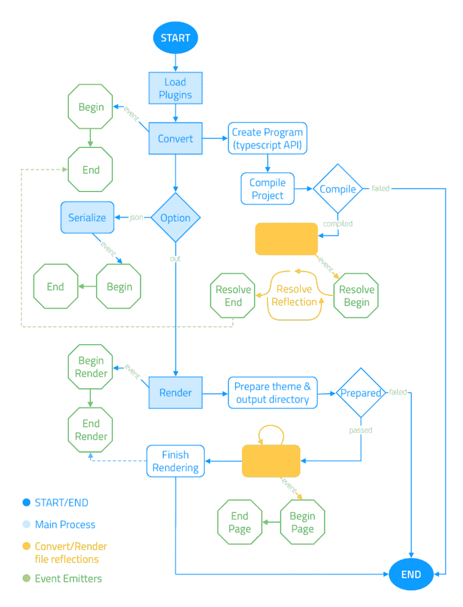

# 深入了解 TypeDoc 的工作流和可扩展性

> 原文：<https://www.freecodecamp.org/news/a-deep-dive-into-typedocs-workflow-and-extensibility-d464683e092c/>

亚历山大·卡梅诺夫

# 深入了解 TypeDoc 的工作流和可扩展性

本主题旨在涵盖如何扩展 **TypeDoc** 库功能的基础知识，以及它提供了哪些机会。

对于那些不熟悉 **TypeDoc** 的人来说，这是一个库，它允许你根据你的 **TypeScript** 源代码中的注释生成 API 文档。

默认情况下，有两种可能的输出:

*   *静态网站*
*   *JSON 文件。*

如果您想了解更多关于配置和使用条款的信息，请参考 [**自述文件**](https://github.com/TypeStrong/typedoc#typedoc) 。

### 我遇到的问题

缺少文档是一个非常普遍的情况，这也是我们面临的问题。正如你们大多数人可能知道的那样，出于探索的目的调试和钻研任何类型的软件都需要时间。这就是为什么我决定贡献并分享我在开发一个[插件](https://github.com/IgniteUI/typedoc-plugin-localization)的过程中获得的知识，这个插件为用户提供了将他们的文档本地化为多种语言的能力。

这里很好的例子是[Ignite UI for Angular library](https://github.com/IgniteUI/igniteui-angular)提供的[日文 API 文档](https://jp.infragistics.com/products/ignite-ui-angular/docs/typescript/latest/)。

所以我将粗略地解释一下 **TypeDoc** 是如何工作的，以及在开发这个插件的过程中采用了什么方法。

关于图书馆是如何运作的，我就不多赘述了。相反，我将尝试只暴露执行流程中最重要的方面，在我看来，它们是“树”的基础，从这里您可以开始探索并转移到不同的“分支”。

因此，不浪费更多的时间，让我们进入本质的部分。

### typedoc 如何工作。

#### 您需要了解的几个组件/类:

*   [应用](https://typedoc.org/api/classes/application.html) **:**
    默认主应用**类**。
*   [选项](https://typedoc.org/api/classes/options.html) :
    聚集并贡献配置声明，由组件或插件声明。从各种来源(配置文件、命令行、参数等)解析**选项**值。)
*   [转换器](https://typedoc.org/api/classes/converter.html) :
    使用 **TypeScript** 编译源文件，并将编译符号转换成反射。
*   [ProjectReflection](https://typedoc.org/api/classes/projectreflection.html) :
    表示**项目**的**根**的反射。
    项目**反射**充当全局索引。您可以通过这个**反射**接收被处理项目的所有反射和源文件。
*   [渲染器](https://typedoc.org/api/classes/renderer.html):
    **渲染器**处理的是 [ProjectReflection](https://typedoc.org/api/classes/projectreflection.html) 的表示，使用 **BaseTheme** 实例，将发出的 html 文档写入输出目录。
    简单来说，**渲染器**用于生成文档输出。
*   [EventDispatcher](https://typedoc.org/api/classes/eventdispatcher.html) :
    提供自定义事件通道的类。
    您可以使用“开”将回调绑定到事件，或者使用“关”移除回调。
*   [日志记录器](https://typedoc.org/api/classes/logger.html) :
    日志记录器为您提供不间断地记录任何类型的错误或消息的能力，如成功、警告、日志、详细等。
*   [插件主机](https://typedoc.org/api/classes/pluginhost.html) :
    负责发现和加载插件。

### Typedoc 执行流程:

*   应用程序试图通过搜索在您的 **package.json** 文件中声明的**‘TypeDoc plugin’**关键字来加载所有 **TypeDoc** 插件。

*   [转换器](https://typedoc.org/api/classes/converter.html) **:** 使用**类型脚本 API** 来编译引用的项目。如果在项目中检测到任何编译错误，转换过程将以遇到的错误结束。
    从上图中可以看到，在编译过程之后的**解析反射**过程中， [EventDispatcher](https://typedoc.org/api/classes/eventdispatcher.html) 发出几个事件，这些事件是操作或检索数据的良好先决条件。
    一旦转换过程结束，我们会收到一个 [ProjectReflection](https://typedoc.org/api/classes/projectreflection.html) 对象，该对象代表项目本身以及所有文件和它们的注释。
*   [选项](https://typedoc.org/api/classes/options.html) **:** 根据您已经通过**的[选项](https://github.com/TypeStrong/typedoc#arguments)来决定您的文档的输出。**有两种变体:
    1。 **JSON 文件**:表示 [ProjectReflection](https://typedoc.org/api/classes/projectreflection.html) 对象的 **stringified** 版本。这就是[序列化](https://typedoc.org/api/classes/serializer.html)做的事情
    2。**静态 HTML** 网站。
*   [渲染器](https://typedoc.org/api/classes/renderer.html) **:** 首先**渲染器**需要确保**输出静态网站**和**输出目录**对应的**主题**设置正确。如果一切正常，**渲染器**开始用来自**主题**的**模板**映射**反射**。
    这里的 [RendererEvent](https://typedoc.org/api/classes/rendererevent.html) 发出两个事件[begin renderer](https://typedoc.org/api/classes/rendererevent.html#begin)/[end renderer](https://typedoc.org/api/classes/rendererevent.html#end)适合操作输出数据。
*   **完成渲染**:这是过程结束的地方，提供生成文档的输出。

在执行流程的粗略解释和可视化之后，我们准备继续，看看如何实际处理**可扩展性**。

### 扩展 typedoc

#### 设置项目:

我们需要采取的第一步是用 npm 建立一个[节点项目。](https://www.wolfe.id.au/2014/02/01/getting-a-new-node-project-started-with-npm/)

声明**关键字`typedocplugin`** 进入你的**包. json:**

然后我们需要[导出一个模块](https://nodejs.org/api/modules.html#modules_exports)作为项目的入口点。 **TypeDoc** 如何加载插件？它只是简单地搜索所有的 **node_modules** 包和它们的 **package.json** 文件，当遇到那个**关键字**时，它[要求](https://nodejs.org/api/modules.html#modules_require_id)那个包，并通过传递一个对主**应用**类的引用来执行它。

一旦执行了所有这些步骤，我们就可以自由地操纵执行过程和输出数据了。。

### 方法和实例

正如我前面提到的，我在本文中分享的所有知识都是在开发一个[本地化插件](https://github.com/IgniteUI/typedoc-plugin-localization)的过程中获得的，我坚信它充分利用了 **TypeDoc** 提供的扩展机会。所以下面所有的例子和方法都是受那个“**生物**”的想法和来源的启发。

为了理解它是如何工作的，你可以浏览一下 [README](https://github.com/IgniteUI/typedoc-plugin-localization#typedoc-plugin-localization) 文件。理解前 3 步就足够了。

让我们从**主模块(** [index.ts](https://github.com/IgniteUI/typedoc-plugin-localization/blob/master/index.ts) **)** 文件开始，一旦 **typedoc** 需要**插件，就会执行该文件。**正如我们已经知道的，对默认**应用程序**类的引用是通过 **require** 回调传递的，在这里您可以访问我们在**TypeDoc 如何工作**一节中讨论过的所有主要组件。

通过所有这些组件引用，您能够注册您自己的定制组件，并且根据它们扩展的内容，提供一组不同的事件。

有时仅仅一个理论是不够的，所以让我们继续，看看事情在实践中是如何发生的。

以下是我们将要回顾的四件最重要的事情:

*   注册我们自己的选项。
*   *在转换过程中操作或检索数据。*
*   *在**渲染器**过程中操作或检索数据。*

#### 注册我们自己的选项。

正如我们已经知道的，所有组件注册都发生在**主模块**中。这里重要的部分是，为了在[选项](https://typedoc.org/api/classes/options.html)上下文中注册一个组件，您需要**扩展****[选项组件](https://typedoc.org/api/classes/optionscomponent.html)类。**

**[OptionComponent](https://github.com/IgniteUI/typedoc-plugin-localization/blob/master/components/options-component.ts) 的自定义定义如下:**

**最后，您需要将该声明添加到应用程序提供的选项中。**

**你可以参考我们正在讨论的扩展/插件的自述文件,看看暴露了什么样的选项，以及它们对这个过程有什么贡献。**

#### **在转换过程中操作或检索数据**

**这里的注册过程是相同的，但是你需要扩展[转换器组件](https://typedoc.org/api/classes/convertercomponent.html)，而不是扩展[选项组件](https://typedoc.org/api/classes/optionscomponent.html)。**

**正如你可能理解的，我们与数据交互的方式是通过 [EventDispatcher](https://typedoc.org/api/classes/eventdispatcher.html) **发出**的**事件**。因此，您可以在该上下文中订阅的所有**事件**都可以通过 [**转换器**](https://typedoc.org/api/classes/converter.html) 找到并访问。**

**我们将在[EVENT _ RESOLVE](https://typedoc.org/api/classes/converter.html#event_resolve)**EVENT**回调的上下文中查看一下。每当 **TypeDoc** 解析一个**类**、**接口**或**枚举**或**方法**、**属性**、**等时，该事件被触发。**)特定**类**、**接口**或**枚举**的一部分。等等什么？**

**好吧，这有点令人困惑，但是这个概念就像迭代一个数组一样简单。**

**让我们以一个简单的类为例。**

**该事件将发出四次引用该声明中的每个单元，在[声明反射](https://typedoc.org/api/classes/declarationreflection.html)中转换:**

1.  *****散发*** *参照他所有[子女](https://typedoc.org/api/classes/declarationreflection.html#children) ( **b** ， **c，d** )的阶层。***
2.  *****发出*** *属性 **b** 参照他的[父](https://typedoc.org/api/classes/declarationreflection.html#parent)(类 **A** )。***
3.  *****放出*** *属性 **c** 参照他的[母](https://typedoc.org/api/classes/declarationreflection.html#parent) (类 **A** )。***
4.  *****散发*** *方法 **d** 参照他的[母](https://typedoc.org/api/classes/declarationreflection.html#parent) (类 **A** )。***

**希望现在一切都清楚了！**

**让我们看看如何订阅发出的事件:**

**然后在**解析回调**中，你可以看到每个**类**、**枚举**和**接口**的注释是如何被取出并存储到一个 **JSON** 文件中，该文件分别代表每个单元(**类**、**枚举**、**接口**)。例如，如果我们有两个类 **A** 和 **B，**输出文件夹将包含两个 **JSON** 文件 **A.json** 和 **B.json** 。**

**下一个例子代表了检索每个 **getter** 和 **setter** 的注释的时刻，这是我们之前讨论过的**类**声明的下一个单元。**

**当然，这些只是例子——你可以在这里做任何你想做的事情。**

#### **在渲染器过程中操作或检索数据**

**这里我们有与 **Convert** 相同的概念，但是当然我们需要扩展另一个类。猜猜看，这个类的名字是 [RendererComponent](https://typedoc.org/api/classes/renderercomponent.html) ，保存事件引用的对象是 [RendererEvent](https://typedoc.org/api/classes/rendererevent.html) 。**

**事件的种类比[转换器](https://typedoc.org/api/classes/converter.html) 要少，但是事件提供的信息已经足够了。**

**订阅是相同的:**

**这里， [RendererEvent 的行为。BEGIN](https://typedoc.org/api/classes/rendererevent.html#begin) 事件有点不同。当**渲染器**进程刚刚启动时，它只被触发一次。然后，获取**转换器**创建的所有**反射**，并使用 **forEach** 的**幂**遍历每个[声明反射](https://typedoc.org/api/classes/declarationreflection.html)并对其进行处理:**

**流程是做什么的？它只是获取**转换器**构建的 **JSON** 文件的位置，并用反射中的内容替换那些**JSON**中的内容。**

**此处的示例再次涉及每个当前**类**的**获取器**和**设置器**的操作:**

**当然，在这里你可以即兴发挥，做任何你需要的事情。**

### **结论**

**这可能只是插件所做的三分之一。我可以展示和公开更多的功能。例如，我们如何想出一个在我们的自定义[主题](https://github.com/IgniteUI/igniteui-angular/tree/master/extras/docs/themes/typedoc)中操作**硬编码字符串**的解决方案。但是这篇博客的目的是关注**数据**的**可扩展性**和**操作**。所以如果你有更多的问题或兴趣，你可以在下面的评论中告诉我。**