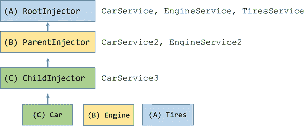
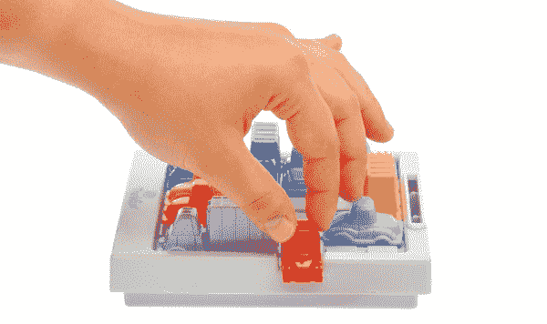

# Angular 的后院:组件依赖的解析

> 原文：<https://www.freecodecamp.org/news/angulars-backyard-the-resolving-of-component-dependencies-2015b40e5bd1/>

作者:多尔·摩西

# 棱角分明的后院:解析的组件依赖关系

***本*条** ***原载于 [dormoshe.io](https://dormoshe.io/articles/angulars-backyard-the-resolving-of-components-dependencies-10)***

我们许多人使用 Angular 的分层依赖注入机制。我们通过服务或组件使用它来解析另一个服务或提供者。但是，我们知道 Angular 为了解决依赖性做了什么吗？大概不会，因为 Angular 照顾到了我们把它当黑匣子用的需要。

在本文中，我们将打开黑盒，探索组件依赖解析机制的代码。

### 回到基础

依赖注入是一种管理代码依赖的强大模式。Angular 的 DI 系统**创建并交付相关服务**“准时制”。Angular 有自己的 DI 框架，没有它我们无法构建 Angular 应用。

角状 DI 系统实际上是一个**等级** 系统。该系统支持嵌套注射器与组件树并行。注入器使用提供者创建依赖关系。我们可以在组件树的任何级别重新配置喷射器。在幕后，每个组件设置自己的**注入器**，为组件本身定义零个、一个或多个提供者。

A mini Angular injectors tree

### 决议顺序

分层 DI 对依赖关系的解析有一个顺序。当一个组件请求一个依赖项时，如果它存在于`@Component.providers`数组(组件注入器)中，那么这个依赖项将被提供。

在其他地方，Angular 继续到父组件注入器并一次又一次地检查。如果 Angular 没有找到祖先，它将通过应用程序主注入器提供这种依赖性。这是分层 DI 机制的核心概念。

### 让我们看看代码

当 Angular 实例化一个组件时，它调用`resolveDep`函数。这个函数的签名包含组件视图容器、元素、依赖关系定义和其他一些参数。我们将关注组件视图和依赖对象。依赖关系对象只包含组件的一个依赖关系。

下面是来自 Angular GitHub 库的`resolveDep`函数框架:

功能框架包含解决方案的主要概念，没有边缘案例。完整的代码可以在这里找到[。在接下来的部分中，我们将探索函数框架。](https://github.com/angular/angular/blob/master/packages/core/src/view/provider.ts#L343)

#### 波萨

感叹号是 Typescript 2.0 的新功能。`!`后置表达式操作符可用于断言其操作数为非空且非未定义，在这种情况下，类型检查器无法得出该事实。Angular 经常使用这个功能，所以我们不要害怕。

#### 第 1 部分—准备

`const startView = view;`代码将原始视图(组件的视图容器)保存在一个变量中，因为视图变量很快就会改变。

`const tokenKey = depDef.tokenKey;`代码获取**令牌密钥**或依赖密钥，例如 **HeroService_4** 。该键由依赖项名称和一个生成的数字构建，以唯一地处理依赖项。

#### 第 2 部分—源组件和祖先搜索

**while** 循环实现了检查源代码`@Component.providers`和祖先组件的阶段。
根据依赖令牌密钥，将在第 1-3 行检查源组件提供者:

如果第 4 行中存在提供者，那么源组件满足依赖关系。因此，如果依赖关系是在第 6 行实例化的，那么实例将由第 10 行的`resolveDep`函数返回。如果这是组件或其子组件第一次请求依赖项，它将在第 7 行被创建，并由第 10 行的`resolveDep`函数返回。

如果在`view`组件注入器中没有找到依赖关系，将调用
`elDef = viewParentEl(view) !;`和`view = view.parent !;`将变量推进到父元素。`while`循环将继续运行，直到在祖先注入器中找到依赖关系。如果在检查完所有祖先后仍未找到依赖关系，则`while`循环将结束，并且**第三部分**将开始动作。

#### 第 3 部分—根部注射器

如果到了这一部分，依赖关系就不能被任何一个组件的祖先注射器所满足。然后在第 1 行检查`startView`或源组件:

如果源组件或其祖先组件之一是由路由器出口(路由器组件)加载的，那么**根**注入器就是**出口注入器**。这个注入器提供了一些依赖项，比如**路由器**服务。否则，根注入器就是引导组件的注入器。

如果在第 3 行找到依赖关系，那么值将由`resolveDep`函数返回。在另一种情况下，第 4 部分将开始起作用。

#### 第 4 部分—应用模块注射器

当我们到了这一部分，就意味着依赖关系不能被第二部分和第三部分所满足。这是满足依赖性的最后机会。这一部分的代码试图从应用程序模块注入器或根模块获得依赖关系。该模块包含应用范围的依赖:
`return startView.root.ngModule.injector.get(depDef.token,notFoundValue);`

该部分完成`resolveDep`流程。如果没有找到依赖关系，那么 Angular 不能满足这个依赖关系，它应该抛出一个异常。

### 结论

分级 DI 是 Angular 非常依赖的一个核心特性。有时，解决过程看起来复杂而漫长。离开 Angular 来管理这个流量，享受易用性，非常方便。现在，在我们研究了组件依赖解决方案的后院之后，我们知道当我们使用它时会发生什么。

***你可以在 [dormoshe.io](https://www.dormoshe.io) 或者 [Twitter](https://twitter.com/DorMoshe) 上关注我，阅读更多关于 Angular、JavaScript 和 web 开发的内容。***