# React 应该使用什么后端？

> 原文：<https://www.freecodecamp.org/news/backend-for-react-projects/>

您应该为正在构建的 React 项目选择什么样的后端？

有这么多不同的选项可供选择，你怎么知道你选择的后端是否是正确的呢？

在本指南中，您将学习如何以最简单、最经济的方式为您正在开发的 React 应用程序选择合适的后端。

让我们开始吧！

> 想要构建令人惊叹的 React 应用程序的首选方法吗？用 **[React Bootcamp](https://reactbootcamp.com)** 从头开始构建 4 个生产就绪 React 应用。

## 我的应用程序需要后端吗？

作为 React 开发人员，构建我们的项目很大程度上关注用户所看到的，这就是所谓的**前端**。

在每个 React 项目中，我们通过状态和用户交互来管理客户端上的数据。然而，如果没有来自后端的数据，许多应用是不可能实现的。

**后端**负责获取或更新我们应用程序中的数据，它对用户是隐藏的。

大多数后端由两部分组成:

1.  存储数据的地方(通常是数据库)
2.  检索数据的方法(通常是 API)

但是这里有一个好消息:根据你正在开发的应用程序的类型，你可能两者都不需要。

## 阶段 1:没有后端

如果你正在构建一个数据很少改变的应用，你可能不需要数据库或者 API。

例如，如果你正在建立一个个人博客，一周最多更新几次，并且是使用 Next.js 或 Gatsby 作为静态网站建立的，你不需要后端。

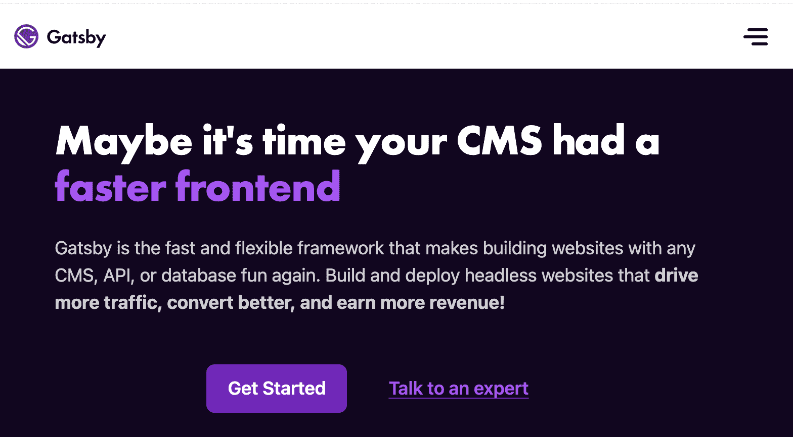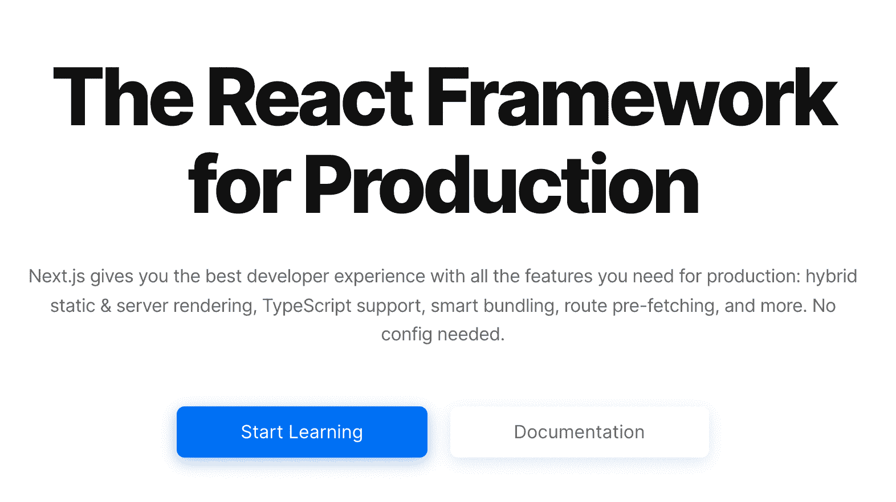

Static sites built with Gatsby or Next.js may not need a backend

相反，您可以简单地将您的博客文章写成 markdown 文件，这些文件存储在项目文件夹中并被跟踪(使用 Git)。

如果您有一个产品数据很少更改的电子商务应用程序，您可以将所有应用程序数据存储在 JSON 文件中，只需在 React 应用程序中导入和使用这些文件。

如果您可以手动更新文件并重新部署您的项目，这可能就是您所需要的。

您选择哪种类型的后端取决于您需要自问的数据的一些关键特征:

*   我的数据经常改变吗？
*   我可以将数据作为本地文件和文件夹进行管理吗？
*   我的应用程序数据或文件可以在版本控制(Git)中被跟踪吗？
*   其他人会更新数据吗？
*   我的应用程序需要认证吗？

根据您对这些问题的回答，您也许可以不使用静态文件作为数据源。

走这条路将最终节省大量的数据库和托管费用，因为静态网站可以托管在许多主机提供商的免费层。

## 阶段 2:内容管理系统

如果你需要比静态文件更多的功能，内容管理系统是下一步

内容管理系统为我们提供了更容易管理内容的工具。他们通常为我们提供带有内置编辑器的专用应用程序，以便更轻松地查看、更新和组织我们的数据。

我们的 React 应用程序特别需要的是一个无头 CMS。

一个**无头 CMS** 没有一个可见的界面，因为 React 将作为我们应用程序的用户界面。

如果您只是有太多的数据需要作为单独的文件进行管理，或者希望其他潜在的非技术用户编辑或添加内容到您的应用程序中，CMS 是您的应用程序的理想选择。

一些最简单的 CMS 包括像 Google Sheets 和 Airtable 这样的 Excel 表格，以及像 concept 这样的笔记应用程序。

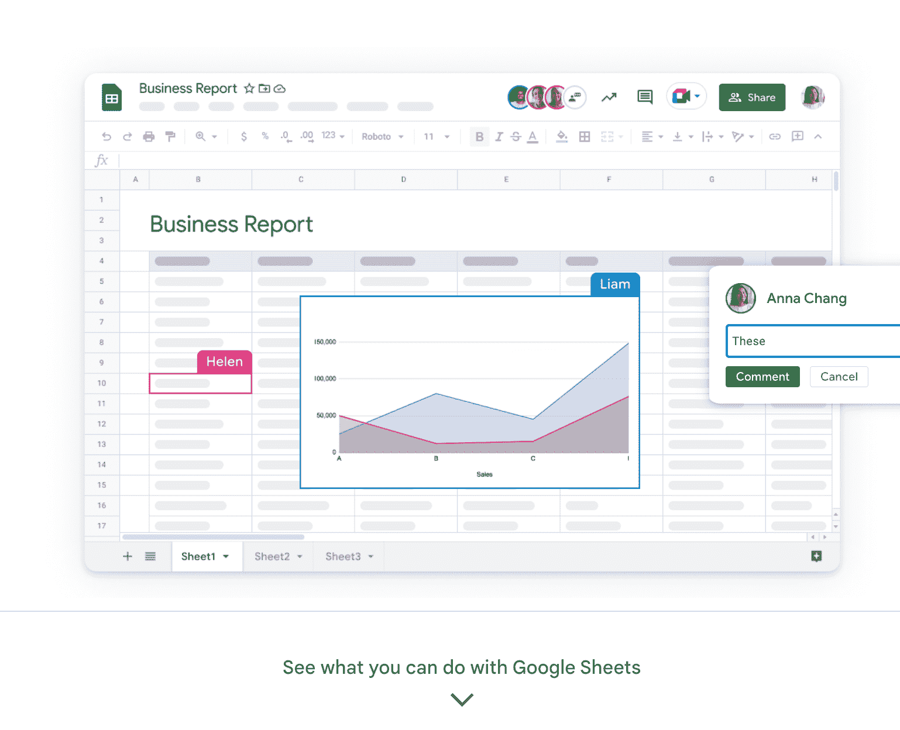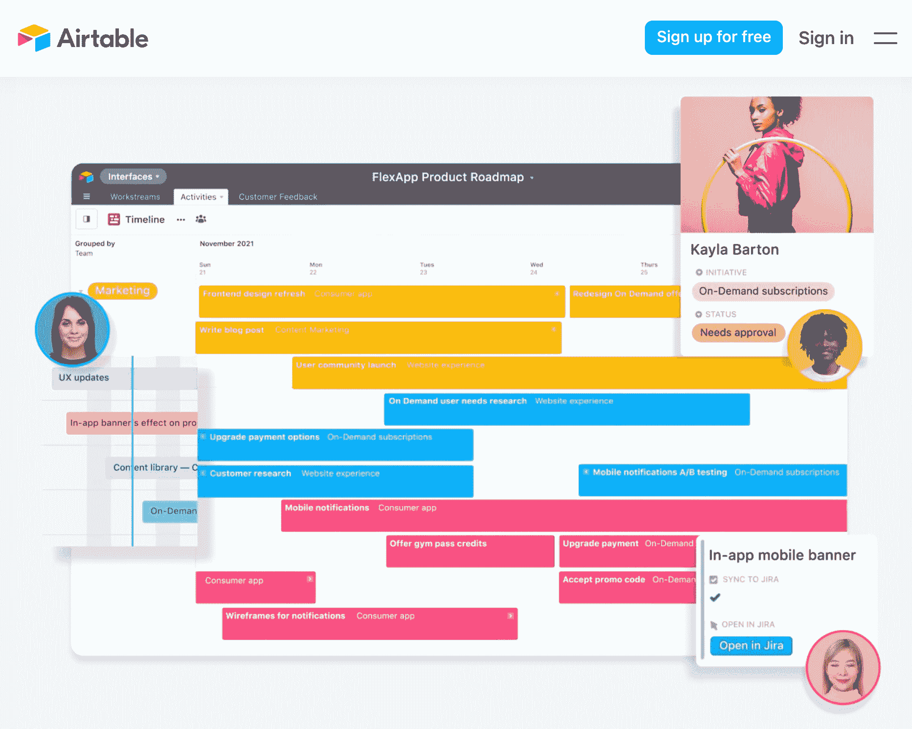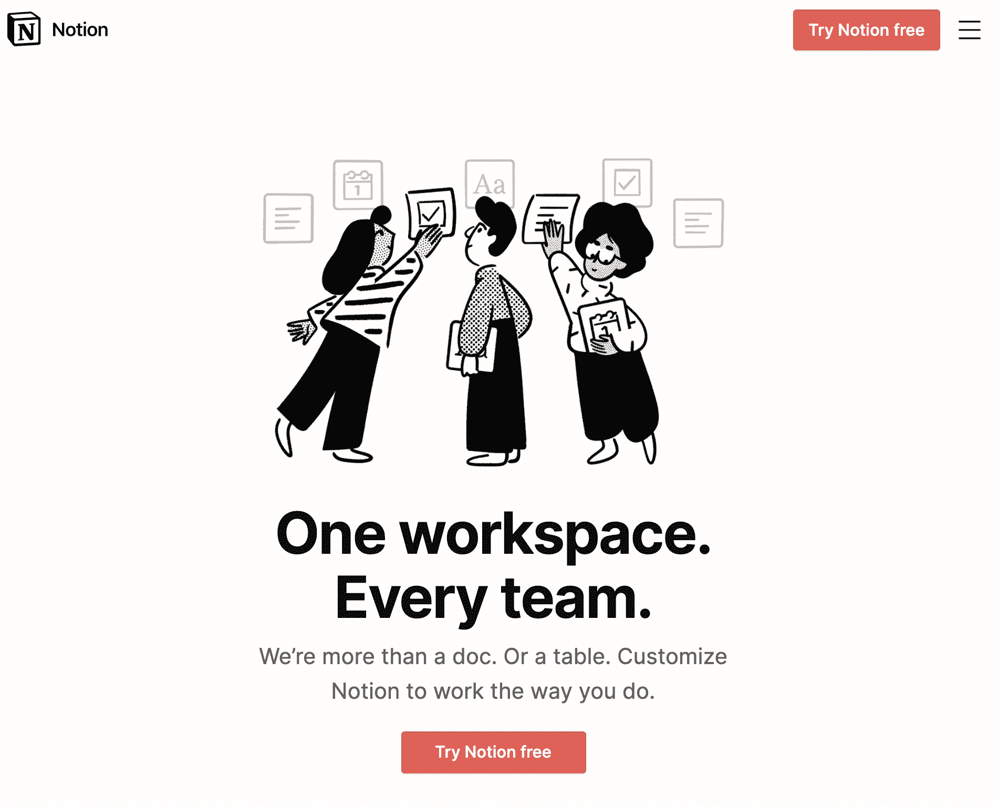

You can use tools like Google Sheet, Airtable and Notion to function as your app's CMS

这些解决方案的好处是易于上手，有一个慷慨的免费层，并有自己的内置 API 来获取数据。

还有其他 CMS 提供了开发人员友好的特性，如图像和媒体资产管理以及更广泛的 API 特性。

一些对开发人员更友好的 CMS 包括:

*   头脑清楚
*   制图法
*   满足的

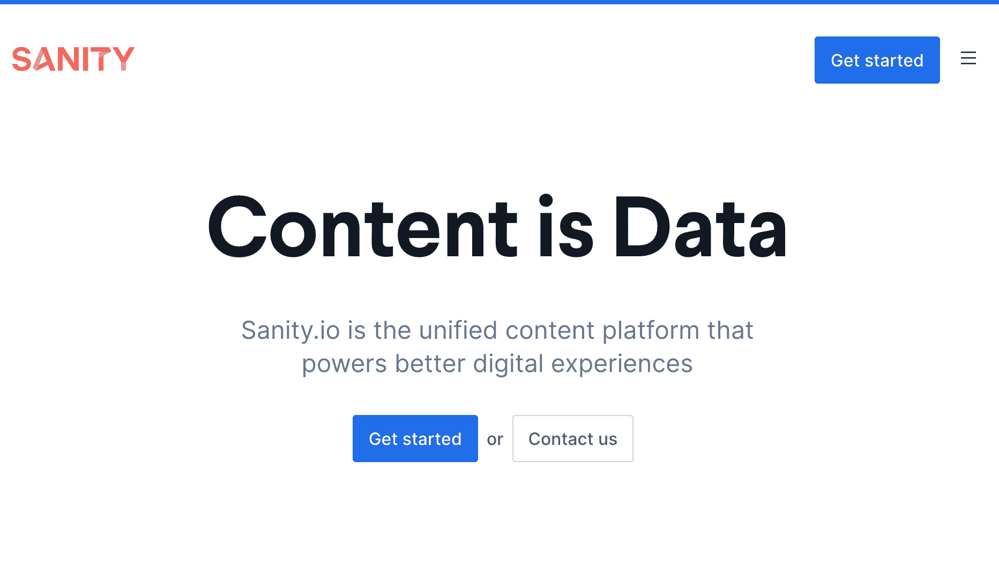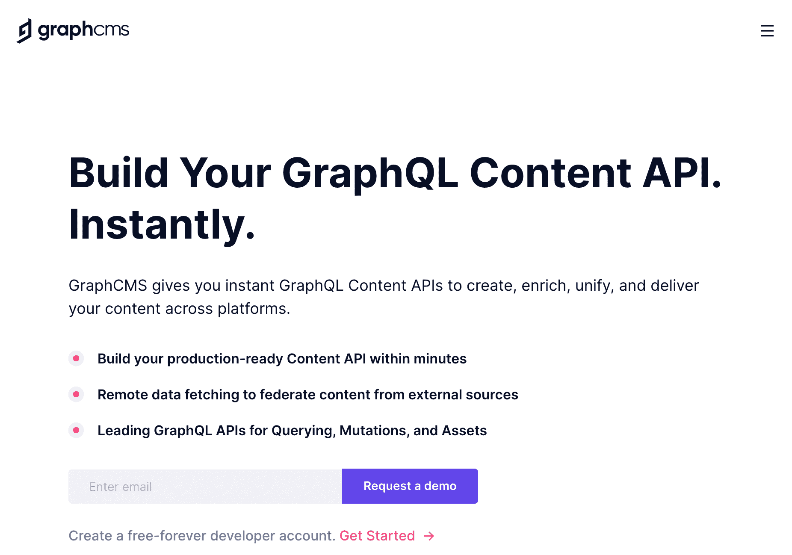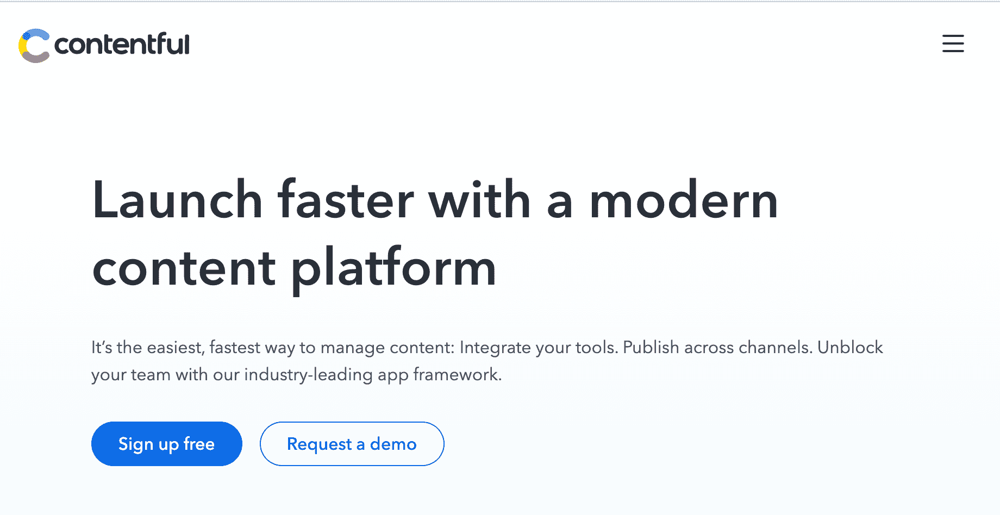

Sanity, GraphCMS and Contentful are more powerful, dev-friendly CMSs

如果您正在寻找最强大的内容管理系统，具有内置身份验证和从 React 客户端更新数据等功能，请查看:

*   斯特拉皮
*   KeystoneJS

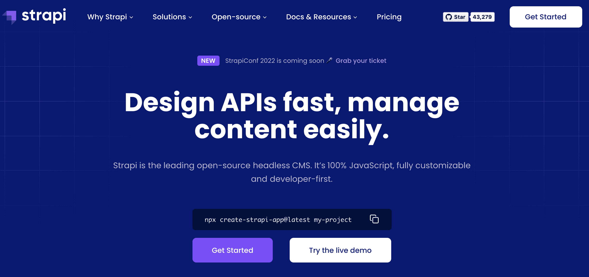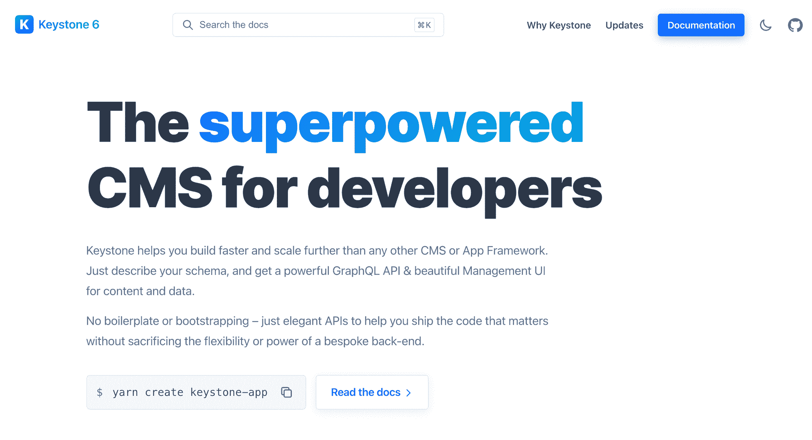

Want a CMS that is basically a complete backend? Check out Strapi or KeystoneJS

## 阶段 3:后端即服务

内容管理系统的局限性在于它们非常适合管理和访问数据。

然而，当您需要添加更复杂的定制功能时，例如从 React 客户端更新数据、认证用户、保护内容和实时数据，标准的 CMS 就不够用了。

管理一个数据库并构建一个完整的 API 来与该数据库进行交互是一项艰巨的挑战，尤其是如果您只做过前端工作的话。

如果你是这种情况，那么研究一下**后端即服务** (BaaS)可能是值得的。它将为您提供定制后端的强大功能，而无需特定领域的知识。

最受欢迎的 BaaS 是 **Firebase** ，理由很充分。它为您提供了大量您自己根本无法构建的功能，包括几十种身份验证策略、实时 NoSQL 数据库、云存储、机器学习工具等等。

还有许多其他的 BaaSs，只需要很少甚至不需要代码就可以提供 Firebase 的生产力:

*   Supabase
*   Hasura
*   Appwrite

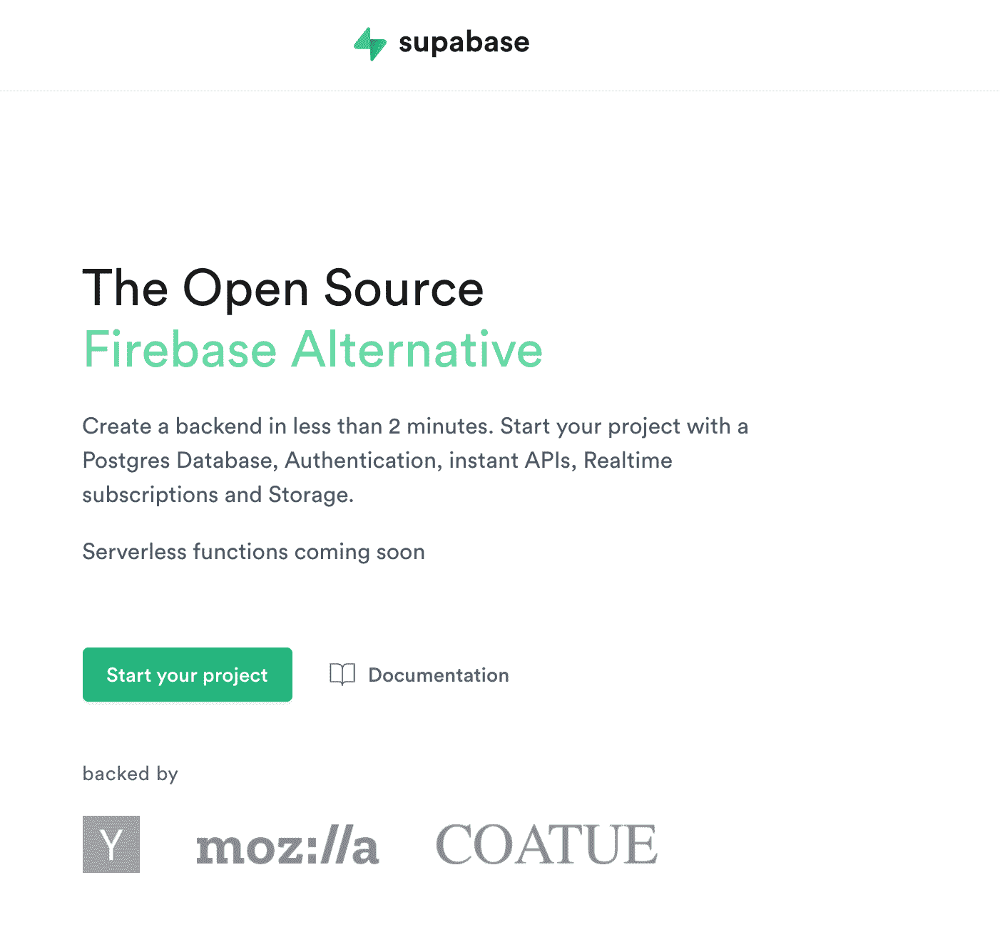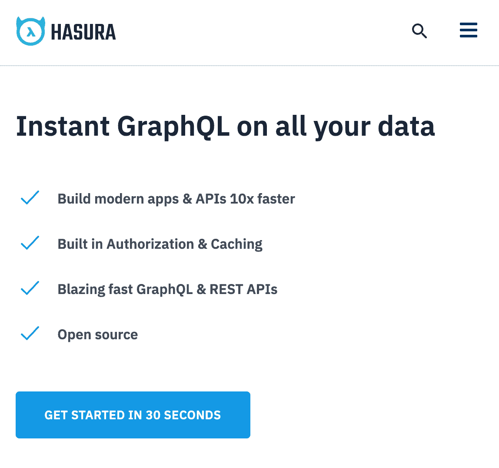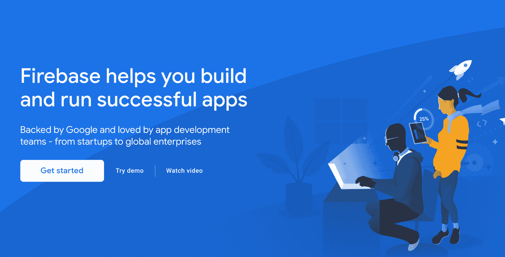

Firebase, Supabase, and Hasura are all great backends to use if you aren't comfortable building your own

**警告**:所有服务的开发速度可以帮助您更快地构建和发布应用程序。但是请注意，它们都有自己的相关成本，例如您使用的云存储和您执行的数据库操作(读/写)的数量。

## 阶段 4:构建自己的后端

在考虑这个阶段之前，您应该仔细考虑是否可以使用选项 1 到 3。

作为 React 开发人员，这是最高级的选择，因为它需要最多的知识、时间和编码技能。

也就是说，它也是最可定制的，考虑到你可以构建你需要的东西来驱动你的应用。

整本书都只写了构建你自己的后端的一部分，但是作为一个已经使用定制后端构建了许多生产应用程序的人，我建议你这样做。

我推荐使用一个 SQL 数据库，比如 Postgres 或者 MySQL。Heroku、Render.com 和 PlanetScale 等服务提供价格优惠的托管数据库(通常有免费的每日备份)。

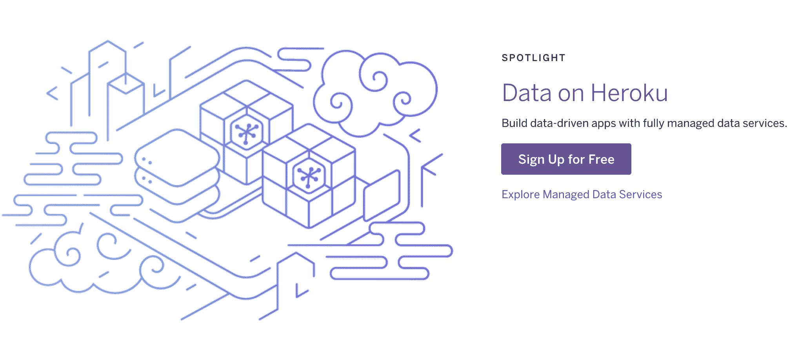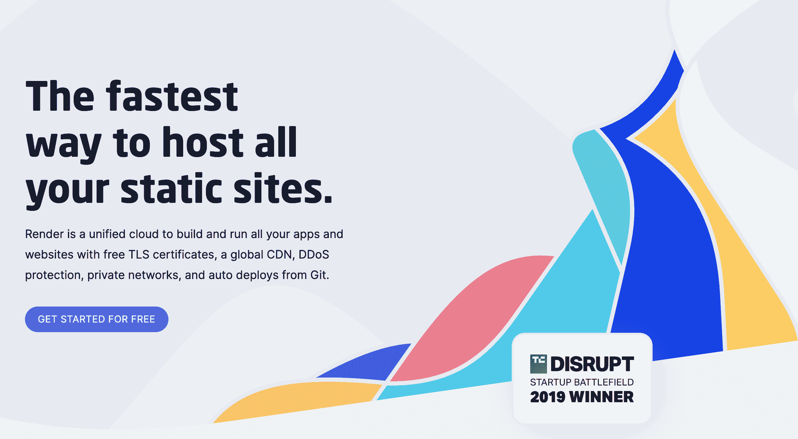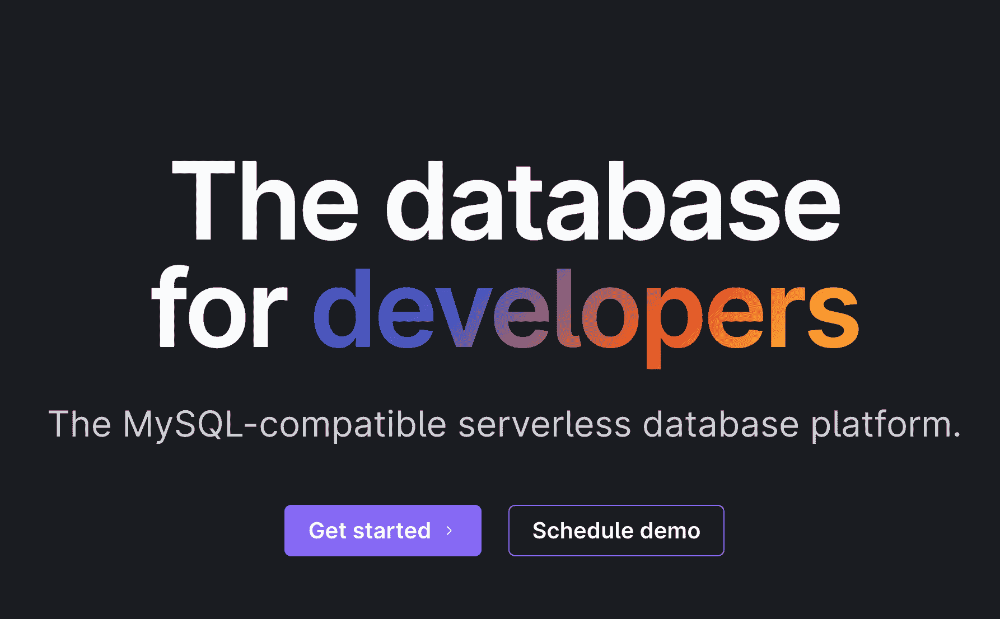

Heroku, Render.com and PlanetScale are some of the best places for your database to live

除非你对编写原始的 SQL 语句感到非常舒服和自信，并且知道采取所有的安全预防措施来避免像 SQL 注入这样讨厌的事情，否则使用一个**对象关系映射器**(一个 ORM)来创建一个数据库模式并与之交互。

我强烈推荐使用 Prisma 作为你的 ORM。它生成对数据库执行各种操作所需的所有代码以及每种操作的类型。

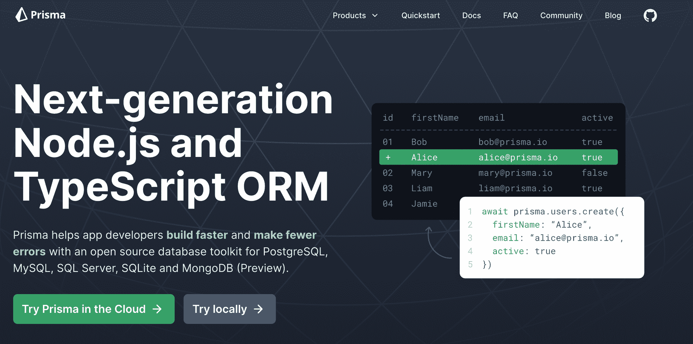

Use Prisma as your ORM

虽然你当然可以使用你最喜欢的节点库或框架(Express、Fastify、Nest.js)来构建一个定制的节点后端，但我建议你从小处着手，使用像 Next.js 的 API routes 这样的功能。

像 Next API routes 这样的工具允许您快速构建 API，而不需要在单独的存储库中运行和管理您的服务器代码。

## 想要构建令人惊叹的 React 应用程序吗？

如果您正在寻找构建自己的生产就绪 React 项目的完整指南，请查看 [**React Bootcamp**](https://reactbootcamp.com/) 。

它将为您提供所需的所有培训:

*   每天只需 30 分钟，就能从完全的初学者变成专业的反应者
*   从零开始到部署，构建 4 个全栈 React 项目
*   学习一套强大的技术来构建您喜欢的任何应用程序，包括 Hasura、Apollo 和 Material UI

 
*点击加入 React 训练营*