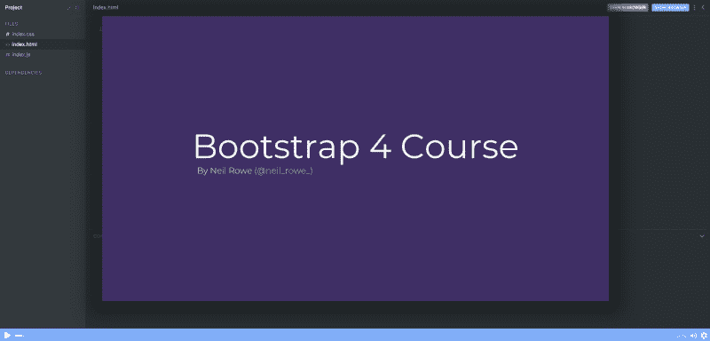
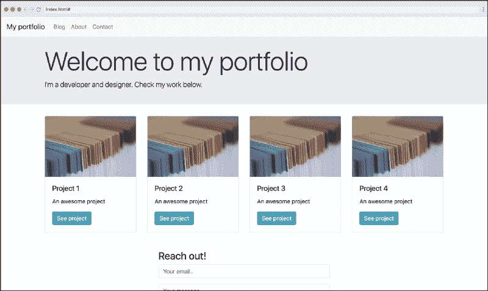
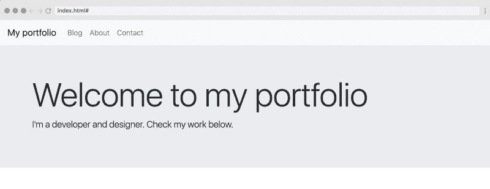
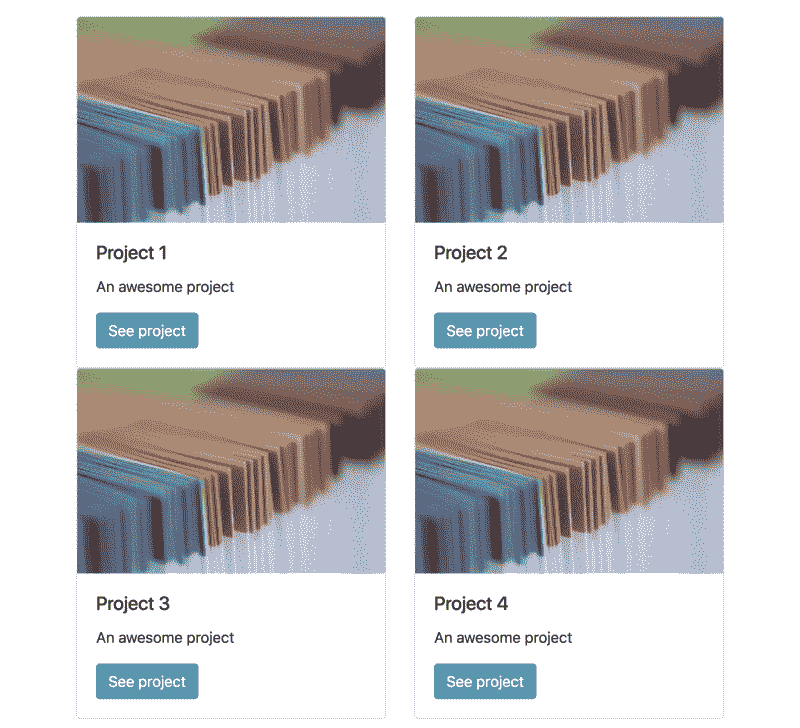

# 引导教程:学习构建第一个引导 4 站点

> 原文：<https://www.freecodecamp.org/news/building-your-first-bootstrap-4-0-site-b54bbff6bc55/>

#### 快速教程，帮助您快速了解最新版本的 Bootstrap。


在我看来，学习一项新技术的最好方法通常是从第一天开始构建。这让学习过程有了意义。另外，当你在材料中挣扎的时候，看到一个产品出现在你面前是令人满意的。

因此，在本文中，我将带您使用 Bootstrap 4.0 构建一个简单的网站，同时强调该库最重要的新特性。

如果你想学习 Bootstrap 4.0，请查看 Scrimba 上的这个免费课程！



*[*Click on the* here *to get to the course.*](https://scrimba.com/g/gbootstrap4?utm_source=freecodecamp.org&utm_medium=referral&utm_campaign=gbootstrap4_tutorial_article)*

现在让我们开始吧。

### 我们将建造什么

我们将建立一个基本的作品集网站。尽管它很简单，但它包含了几个您需要学习的核心概念，以便正确使用 Bootstrap 4.0。



如果你想玩代码，看看这个 Scrimba 游乐场。如果文章中有不明白的地方，需要自己去实验，可以随意参考。

### 导航条

让我们从导航条开始。在 Bootstrap 4.0 中，他们简化了导航条，因为现在需要的标记更少了。下面是我们创建最简单的导航条所需要的:

这会导致以下结果:


`bg-light`类将背景设为浅灰色，而`navbar-light`类将文本设为深色。默认情况下，导航条中的文本颜色是蓝色，但是，我认为用`navbar-light`类会更好看。

让我们在导航栏中添加一些内容，与品牌锚定标签处于同一级别:

```
<ul class="navbar-nav">  
  <li class="navbar-item">  
    <a href="#" class="nav-link">Homepage</a>  
  </li>  
  <li class="navbar-item">  
    <a href="#" class="nav-link">Blog</a>  
  </li>  
  <li class="navbar-item">  
    <a href="#" class="nav-link">About</a>  
  </li>  
  <li class="navbar-item">  
    <a href="#" class="nav-link">Contact Us</a>  
  </li>  
</ul> 
```

这里需要注意的三个类是`navbar-nav`、`navbar-link`和`navbar-item`。它们共同构建了您想要的导航选项。

这是它的样子:


然而，现在我们需要使它具有响应性，因为我们希望我们的导航选项在较小的屏幕上折叠成一个汉堡包图标。为了实现这一点，我们需要做两件事:

1.  告诉 Bootstrap 导航选项应该在哪个点崩溃成一个汉堡包
2.  为汉堡包创建标记

为了使它折叠，我们将把`navbar-expand-md`类添加到`nav`元素本身:

```
<nav class="navbar navbar-light bg-light `**navbar-expand-md**`">  
...  
</nav 
```

这告诉 Bootstrap 我们希望导航条选项在`md`断点(在`768px`处)在展开和折叠状态之间切换。

我们还需要将导航选项包装在一个 div 中(包含两个类`collapse`和`navbar-collapse`),这告诉 Bootstrap 这是我们想要折叠的部分。

```
<div class="collapse navbar-collapse" id="navbarNav">  
  <ul class="navbar-nav">  
  ...   
  </ul>  
</div> 
```

`navbarNav`的 id 是将这个项目与汉堡图标中的`data-target`属性连接起来，我们将这样创建:

```
<button class="navbar-toggler" type="button" data-toggle="collapse" data-target="#navbarNav">  
  <span class="navbar-toggler-icon"></span>  
</button>
```html
We now have a great looking navbar, which collapses and expands at our chosen breakpoint:


### Jumbotron

The next step is to create something that welcomes our users to the website below the navbar. To do that, we’ll use the [jumbotron](https://getbootstrap.com/docs/4.0/components/jumbotron/) component. It’s super simple:
```html
<div class="jumbotron jumbotron-fluid">  
  <div class="container">  
  <h1 class="display-3">Welcome to my website</h1>  
  <p class="lead">I'm a developer and designer. Check my portfolio below</p>  
</div> 
```

这会导致以下结果:



`display-3`和`lead`类是排版类，在我看来，它们使文本更有观点，更好看。你可以在这里阅读更多关于 Bootstrap 4.0 中的[排版。](http://When%20you%20need%20a%20heading%20to%20stand%20out,%20consider%20using%20a%20display%20heading%E2%80%94a%20larger,%20slightly%20more%20opinionated%20heading%20style.)

### 主要内容—网格和卡片

在我们的大屏幕下面，我们将添加我们网站的主要内容，它将由四张卡片组成。一个[卡](https://getbootstrap.com/docs/4.0/components/card/)是 Bootstrap 4.0 的全新组件，它取代了 Bootstrap 3.0 的面板、孔和缩略图。

让我们先来看看我们想要构建什么:


#### 创建网格

为了让它们看起来像这样漂亮，也为了确保它们能很好地响应，我们需要将卡片包裹在一个网格中。网格是 Bootstrap 的核心部分之一，许多开发人员使用这个库仅仅是因为网格。

我们将从创建一个没有内容的非常简单的网格开始。在 Bootstrap 中，您总是首先创建行*然后在行内包装列。默认情况下，网格在宽度上可以分为 12 列。*

在`sm`断点之上，我们希望每张卡片占据一半的宽度，所以我们给列一个`col-sm-6`类。当屏幕到达`lg`断点时，我们想要四张卡片的宽度，所以我们要做`col-lg-3`。

```
<div class="container">  
  <div class="row">  
    <div class="col-sm-6 col-lg-3">column</div>  
    <div class="col-sm-6 col-lg-3">column</div>  
    <div class="col-sm-6 col-lg-3">column</div>  
    <div class="col-sm-6 col-lg-3">column</div>  
  </div>  
</div> 
```

这给出了以下响应布局:


#### 制作卡片

现在我们只需要用一个卡片组件替换列文本。这是我们卡的价格:

```
<div class="card">  
    
  <div class="card-body">  
    <h5 class="card-title">Project 1</h5>  
    <p class="card-text">An awesome project</p>  
    <a href="#" class="btn btn-info">See project</a>  
  </div>  
</div> 
```

要将一张`div`变成一张*卡片*，我们只需添加一个`card`类。如果我们想要一个图像出现在卡片的头部，我们将添加`card-img-top`。至于其余的内容，我们将使用`card-body`、`card-title`和`card-text`类。

但是，有一个问题是，当网格有多行时，这种布局就不好看了。如你所见，我们需要在行与行之间增加一些间距。



这将向您介绍 Bootstrap 4.0 中新的间距概念，您可以添加类来设置填充和边距。我们将简单地将类`mt-3`添加到`card`div 中。

```
<div class="card mt-3">  
...  
</div> 
```

`mt`代表`margin-top`，3 是从 1 到 5 的数字，其中 5 是最多的。你也可以用`pb-4`来举例，将`padding-bootom`设置为 4。你现在可能已经明白了。一旦我们添加了这个，我们的网站上就有了一个漂亮的卡片网格。

### 联系方式

最后，我们再来添加一个联系方式。它只是我们网格中的一个新行。这次我们也将使用`offset`类，因为我们不希望它是全角的，至少不要在`md`断点之上。

所以从`md`开始，我们给它六列的宽度，三列的偏移量:

```
<div class="row mt-5">  
  <div class="col-sm-12 **col-md-6 offset-md-3**">  
    <h3>Reach out!</h3>  
    _...form goes here..._  
  </div>  
</div> 
```

现在让我们看看表单本身的代码:

```
<form>  
  <div class="form-group">  
    <input type="text" class="form-control" id="email" placeholder="Your email..">  
  </div>  
  <div class="form-group">  
    <textarea class="form-control" placeholder="Your message..">              
    </textarea>  
  </div>  
  <button type="submit" class="btn btn-primary">Submit</button></form> 
```

像`<input>`和`<textarea>`这样的控件是用`form-control`类设计的。他们让它看起来像一个经典的助推器形式:


就是这样！现在，您已经创建了第一个 Bootstrap 4.0 网站。如果你想适当地学习图书馆，一定要看看我们在 Scrimba 上的免费课程。

* * *

感谢阅读！我的名字叫 Per Borgen，我是最简单的学习编码方法——Scrimba 的联合创始人。如果你想学习建立专业水平的现代网站，你应该看看我们的[响应式网页设计训练营](https://scrimba.com/g/gresponsive?utm_source=freecodecamp.org&utm_medium=referral&utm_campaign=gbootstrap4_tutorial_article)。


[Click here to get to the advanced bootcamp.](https://scrimba.com/g/gresponsive?utm_source=freecodecamp.org&utm_medium=referral&utm_campaign=gbootstrap4_tutorial_article)