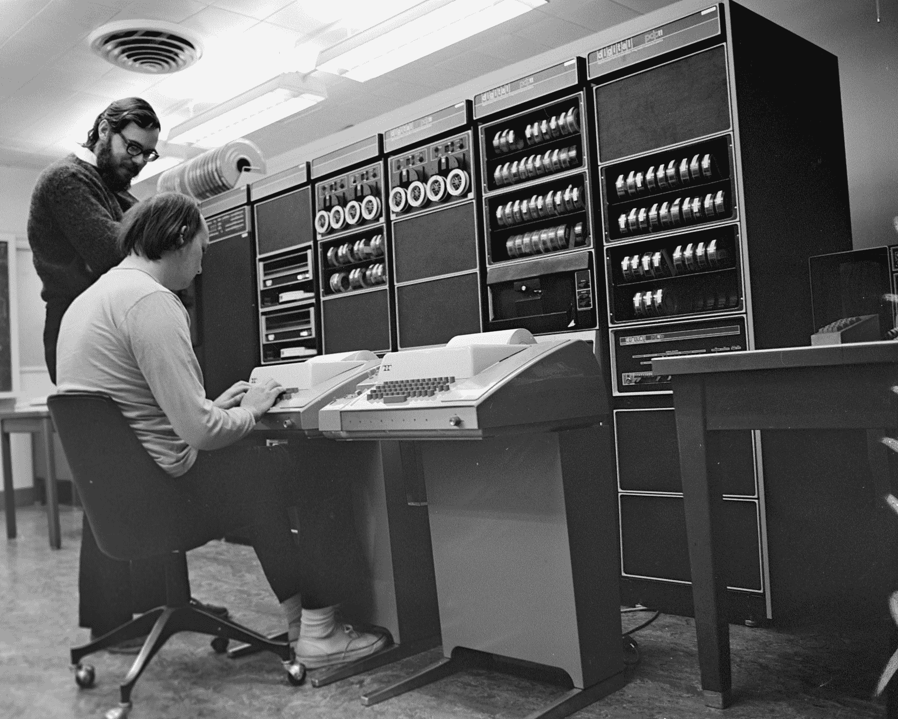

# C 与 c++–有什么区别？

> 原文：<https://www.freecodecamp.org/news/c-vs-cpp-whats-the-difference/>

C 和 C++编程语言为世界上的大部分产品、应用程序和网站提供了动力。

每一种都为许多流行编程语言的诞生奠定了基础，比如 Java。它们还支持许多您可能经常在编程项目中使用的语言，比如 Python。

在这篇文章中，你会发现这两种语言的一般和初学者友好的概述，以及它们的主要相同点和不同点。

## C 和 C++的起源

### C 编程语言的历史

肯·汤姆森和丹尼斯·里奇已经在美国电话电报公司·贝尔实验室的 MULTICS(多路复用信息和计算服务)项目上工作了好几年。

在项目停止后，1969 年肯·汤普森开始在一台很少使用的 PDP-7 机器上开发他的*太空旅行*游戏。

在这样做的同时，他最终用汇编语言从头开始编写了一个几乎完整的操作系统 Unix。

在开发 MULTICS 的时候，Thompson 和 Ritchie 都使用高级语言编写系统软件和编程工具。他们已经看到，与晦涩难懂的汇编语言相比，整个过程要容易得多。

Ritchie 和 Thompson 一起帮助将 Unix 移植到更新的机器上——PDP-11。

在此期间，他们尝试了各种高级语言来帮助完成这项工作。

他们使用 BCPL(基本组合编程语言)，这是在 MULTICS 时代大量使用。在尝试之后，Thompson 最终编写了一种新的语言——B 编程语言。

B 语言类似于 BCPL，但它是一个更简单、更精简版本。

但是 B 不够强大，没有充分利用 PDP-11 的新特性和功能。

Thompson (sitting) and Ritchie working together at a PDP-11\. [Image and text credit from Wikipedia](https://en.wikipedia.org/wiki/Ken_Thompson#/media/File:Ken_Thompson_(sitting)_and_Dennis_Ritchie_at_PDP-11_(2876612463).jpg)

丹尼斯·里奇开始改进 B 语言，最终创造了 C 编程语言。

c 是一种可移植语言，这意味着用它编写的程序可以在各种机器体系结构上移植和使用。它的编译速度非常快，也很容易，并且可以直接映射到机器代码，让程序员可以访问底层功能。

他们最终在 1972 年用 C 语言重写了 Unix 操作系统。

由于 C 语言是可移植的，并且是实现 Unix 的语言，开发人员开始采用它并广泛使用它。这导致了 Unix 操作系统的成功，反过来 C 语言也开始流行。

Dennis Ritchie 和 Brian Kernighan 在 1977 年合著了《C 编程语言》一书，这本书为语言的使用建立了一个标准。这本书进一步普及了这门语言。

c 语言在计算机历史上意义重大，它的诞生导致了许多其他编程语言的诞生。因此，它通常被称为所有编程语言的'*之母*。

### C++的历史

1979 年，研究员比雅尼·斯特劳斯特鲁普受雇于美国电话电报公司·贝尔实验室。

在 20 世纪 70 年代，计算机的复杂性和计算能力增加，C 编程语言的局限性开始显现。

20 世纪 80 年代初，比雅尼·斯特劳斯特鲁普创造了一种新的语言，这种语言受到了两种因素的影响:

*   另一种语言 Simula 具有面向对象的编程能力，与 c 相比，它提供了一种不同的编程方法。代码可以被抽象和更好地组织，任何东西都可以用类来表示。
*   系统编程语言 C，它提供了接近机器硬件并完成要求苛刻的低级计算任务的能力。

这两个想法结合起来允许更高层次的抽象，而不会失去 C 语言的低层次效率。因此，语言' *C 与类*'被创造出来。

1984 年,“带类的 C”被重命名为 C++。

所以，C++是 C 的超集，这意味着它是 C 的扩展，并且是基于 C 的。C++只是为 C 语言提供了额外的功能。

## C 和 C++的相似之处

下面是 C 和 C++的一些相似之处。

### 语法和代码结构

这两种语言的整体语法非常相似。在 C 中使用的操作符和关键字也在 C++中使用来实现同样的事情。但是 C++比 C 有更多的关键字，并且它有一个扩展的语法。

内联注释`//`和块注释`*/ */`看起来是一样的。

另外，每条语句都以分号`;`结尾。

条件、循环、初始化和声明变量——这两种语言看起来都很相似。

C 和 C++都有一个`main()`方法，它启动每个程序，并且都在各自文件的顶部包含头文件，带有`#include`。

### 编译程序语言

C 和 C++都是编译程序语言。

编译器是一种计算机软件程序。

它获取程序员用高级编程语言编写的源代码，*将*翻译成计算机可以理解的另一种语言。

这种形式是第一次汇编代码，再次翻译成机器代码-所有计算机的母语。

机器语言是计算机 CPU(中央处理器)直接理解的一组指令。

一旦源代码被转换成机器代码，就会创建一个二进制可执行文件`a.out`。

## C 和 C++的区别

现在让我们来看看这两种语言之间的一些差异。

### 输入和输出方法

C 和 C++使用不同的方式向控制台输出信息和从用户接收信息。

在 C 语言中，`scanf()`用于用户输入，而`printf()`用于输出数据。

在 C++中，`std::cin >>`用于获取用户输入，`std::cout <<`用于输出数据。

### 编程范例

这两种语言之间最重要的区别是各自使用不同的编程方法。

c 是一种面向过程的语言，它强调函数。

程序被分成一组功能，它们由一步一步的指令或命令组成，按顺序执行。

这种编程风格指定了*如何*做某事，按照自顶向下的方法给出了如何执行计算任务的结构化步骤。

当程序变大时，这种风格的编程会变得非常混乱和容易出错。这导致在文件中进行大量的复制和粘贴，并在有变化时更新许多函数。

除了是一种过程语言，C++还是一种面向对象的编程语言，它基于将程序分解成对象的概念。

按照自底向上的方法，所有的东西都被组织起来并分成更小的相关部分或对象组，它们是一个 T2 类的实例。

面向对象编程基于四个原则:*封装、抽象、继承和多态*。

这种编程风格创建了可读性更强、更易于维护的可用代码，同时还提供了更好的数据安全性。

### STL

C++提供了 STL——标准模板库——而 C 没有。

它为常用的数据结构和组件提供模板类，以实现附加的内置功能。

一个这样的组件是容器，如 [Vectors](https://www.freecodecamp.org/news/c-vector-std-pattern-vector-in-cpp-with-example-code/) ，它存储对象的集合。

### 名称空间

名称空间是 C++中的一个特性，而不是 C。

它们是容器，用于将代码组织到标识符的逻辑组和某个名称下某个范围内的类似对象中。

当存在多个库时，它们可以防止名称冲突，并防止与程序中其他命名空间的名称冲突。

名称空间的一个例子是`std::`。

使用名称空间并将其引入范围的一种方法是使用`using`关键字，例如`using namespace std;`。

### 异常处理

c 没有提供一种方法来处理程序中的异常，这有助于防止错误。

另一方面，C++通过引入`try`和`catch`块来支持异常处理。

### 文件扩展名

包含 C 代码的文件的文件扩展名是`.c`，而 C++文件的文件扩展名是`.cpp`。

## C 和 C++用在哪里？

c 通常用于要求非常高的低级计算任务，在这些任务中，速度、效率和对机器的接近是必须的。

c 假设程序员知道他们在做什么，并给他们自由。

因此，它是操作系统、嵌入式设备、系统编程、内核和驱动程序、编译器开发以及不断增长的物联网应用行业的首选语言。

C++再次允许程序员接近和操纵机器，同时为大规模系统提供效率和高性能。同时，它是更高层次的，具有足够的远离机器的抽象。

C++是一种流行的语言，用于创建游戏引擎、计算机图形和应用程序、VR 应用程序、web 浏览器(如 Google Chrome、Mozilla Firefox 和 Safari)以及 web 浏览器扩展。Google 搜索引擎也是用 C++构建的。

## 如何学习 C 和 C++

下面是一些资源列表，可以帮助你开始学习 C 和 C++的旅程。

学习 C 语言:

*   [C 初学者手册:在几个小时内学会 C 编程语言基础知识](https://www.freecodecamp.org/news/the-c-beginners-handbook/)
*   [什么是 C 编程语言？初学者教程](https://www.freecodecamp.org/news/what-is-the-c-programming-language-beginner-tutorial/)
*   [C 编程初学者教程](https://www.youtube.com/watch?v=KJgsSFOSQv0)

学习 C++:

*   [c++编程语言](https://www.freecodecamp.org/news/the-c-plus-plus-programming-language/)
*   [C++初学者教程](https://www.youtube.com/watch?v=vLnPwxZdW4Y)
*   [学习 C++中的面向对象编程(OOP)](https://www.freecodecamp.org/news/learn-object-oriented-programming-oop-in-c-full-video-course/)
*   [通过构建音频插件学习现代 c++](https://www.freecodecamp.org/news/learn-modern-cpp-by-building-an-audio-plugin/)

## 结论

感谢您坚持到最后，希望这篇文章对您有所帮助。

您了解了 C 和 C++的起源及其历史背景。然后，您看到了它们的一些相似之处和不同之处，每种语言是如何使用的，以及一些供您开始学习这些语言的资源。

编码快乐！