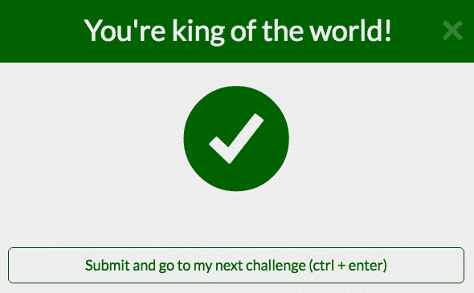

# 使用蔡加尼克效应学习更快地编码

> 原文：<https://www.freecodecamp.org/news/can-the-zeigarnik-effect-help-you-learn-to-code-c64282ed0f7b/>

史蒂文·吉尔伯特

# 使用蔡加尼克效应学习更快地编码

[**蔡加尼克效应**](https://en.wikipedia.org/wiki/Zeigarnik_effect) 可以帮助你更快地学习编码。首先我来解释一下这个概念是什么。然后我给你一个实用的方法，你可以把它应用到你的学习中。

### 什么是蔡加尼克效应？

现在是晚上 9 点。你在学 JavaScript。你在办公桌前坐下。你打开笔记本电脑，启动代码编辑器。你正在从事 freeCodeCamp 的[维基百科浏览器](https://www.freecodecamp.com/challenges/build-a-wikipedia-viewer)项目。

您花了一些时间编写代码，然后绕道进入浏览器，阅读 Mozilla Developer Network 的一篇关于[跨源资源共享(CORS)](https://developer.mozilla.org/en-US/docs/Web/HTTP/Access_control_CORS) 的文章，因为您想了解跨域 Ajax 请求。

进展顺利。你读 Mozilla 关于 CORS 的文章越多，你就越能理解它。

天色已晚。差不多是睡觉的时候了。

接下来你会做什么？你是否:

a)留下文章*未完成*第二天早上再来看？

或者

读完这篇文章？

蔡加尼克效应会让你选择(A)并且在休息前不完成文章。

为什么？

因为蔡加尼克效应说“[被打断的任务比完成的任务](http://wesscholar.wesleyan.edu/cgi/viewcontent.cgi?article=1286&context=div3facpubs)更容易被记住。”

作为人类，我们有一种*对结束的渴望，当一个问题悬而未决时，这种渴望就会被激活。想想侦探小说的逐渐揭露——或者在一次未解决的争论后与爱人通电话。正是这种紧张——由对结束的渴望产生——帮助我们更有效地记住未完成的任务。*

因此，如果你是一个有进取心的开发人员，你可以考虑在学习新工具和越来越深入软件开发的过程中应用蔡加尼克效应。因为——在相同的时间内，蔡加尼克效应可能会帮助你更好更快地记住这些编程概念。

这里有一个在你学习编码时如何利用蔡加尼克效应的想法。

### 建议:把一段未完成的代码留在“进展顺利的时候”，回头再来处理它

你正在进行 freeCodeCamp 的算法挑战之一。你已经解决了这个问题。你已经在纸上记下了一些笔记和伪代码。你已经为如何编写算法制定了一个高层次的计划。

你开始把你的想法转换成代码。你编码。然后你再写一些代码。进展顺利，你开始感觉到多巴胺在期待 freeCodeCamp 的挑战完成奖励时释放出来，这是一个积极强化的信息:

现在停下来。在你完成挑战之前。停下来。

故意决定不再编码。离开电脑去做些别的事情。

“可是我快好了！”你说。

这个想法是，如果你在编码过程中打断自己，你不仅可以提高你对正在练习的概念的记忆，还可以增强你返回免费代码营并完成挑战的动力。

对结束的渴望太强烈了，以至于无法让你长时间远离电脑。当你回来的时候，你会带着复仇回来。

同样，通过使用 Zeigarnik 效应，您将 1)更好地记住算法挑战正在测试的编程概念，2)产生返回到您的文本编辑器的动机。

并且产量加倍。

双重胜利。

### 蔡加尼克效应在起作用

最近我一直在疯狂阅读罗尔德·达尔的书籍和短篇小说，因为罗尔德·达尔是一位了不起的作家。他在一次采访中说，这听起来非常类似于蔡加尼克效应类型的策略:

> 我永远不会回到空白的一页；我总是半途而废。面对空白的一页并不太好。但是一位伟大的美国作家海明威告诉我，当你写一本很长的书时，最好的技巧就是，用他自己的话来说，“当你过得好的时候，停止写作”。

> 这意味着，如果一切进展顺利，你确切地知道这一章的结尾会怎样，你知道人们会怎么做，你不会一直写，写，写，直到你写完，因为当你写完的时候，你会说，好吧，我下一步要去哪里？你起身离开，不想回来，因为你不知道你想去哪里。

> 但是如果你像海明威说的那样，在做好事的时候停下来，那么你就知道你接下来要说什么。你让自己停下来，放下铅笔和其他东西，然后走开。你迫不及待地想回去，因为你知道你接下来想说什么，这很好，你必须努力做到这一点。一年中的每一天，每一次。

> 如果你在卡住的时候停下来，那么你就有麻烦了！"

你可以在这里听罗尔德·达尔的完整采访。

写小说和软件开发比你想象的更相似。两者都是强烈的创造性追求。如果在进展顺利的时候停下来帮助两位传奇作家写出了世界上最好的作品，它也可以帮助你提高编码技能，开发出一些最有用的软件。

开发人员还可以通过哪些方式应用蔡加尼克效应来提高编码水平？在下面留下你的想法。

如果你有任何问题，你可以发微博给我，地址是 [@gilbertginsberg](https://twitter.com/gilbertginsberg) 或者通过 [GilbertIndex](https://goo.gl/DgxjEj) 找到我。感谢阅读！