# CSS Flexbox 解释——柔性容器和柔性项目的完整指南

> 原文：<https://www.freecodecamp.org/news/css-flexbox-complete-guide/>

CSS Flexbox 为你提供了工具，以灵活和快速的方式创建基本和高级的网站布局。

本教程讨论了像专业人士一样使用 Flexbox 所需要知道的一切。

## 目录

1.  [什么是 Flexbox？](#what-is-flexbox)
2.  Flex 容器和 Flex 项目:有什么区别？
3.  [CSS 中的一个`flex`值是什么？](#what-is-a-flex-value-in-css)
4.  [CSS 中的一个`inline-flex`值是什么？](#what-is-an-inline-flex-value-in-css)
5.  [指定 Flexbox 布局的属性](#properties-for-specifying-flexbox-s-layout)
6.  [柔性容器的特性是什么？](#what-are-the-flexible-containers-properties)
7.  [Flexbox 的`flex-direction`属性是什么？](#what-is-flexbox-s-flex-direction-property)
8.  [Flexbox 的`flex-wrap`属性是什么？](#what-is-flexbox-s-flex-wrap-property)
9.  [Flexbox 的`flex-flow`属性是什么？](#what-is-flexbox-s-flex-flow-property)
10.  [Flexbox 的`justify-content`属性是什么？](#what-is-flexbox-s-justify-content-property)
11.  [Flexbox 的`align-items`属性是什么？](#what-is-flexbox-s-align-items-property)
12.  [Flexbox 的`align-content`属性是什么？](#what-is-flexbox-s-align-content-property)
13.  [灵活项目的属性是什么？](#what-are-the-flexible-items-properties)
14.  [Flexbox 的`align-self`属性是什么？](#what-is-flexbox-s-align-self-property)
15.  [Flexbox 的`order`属性是什么？](#what-is-flexbox-s-order-property)
16.  [Flexbox 的`flex-grow`属性是什么？](#what-is-flexbox-s-flex-grow-property)
17.  [Flexbox 的`flex-shrink`属性是什么？](#what-is-flexbox-s-flex-shrink-property)
18.  [Flexbox 的`flex-basis`属性是什么？](#what-is-flexbox-s-flex-basis-property)
19.  [Flexbox 的`flex`属性是什么？](#what-is-flexbox-s-flex-property)
20.  [如何使用 Flexbox 水平居中元素](#how-to-center-elements-horizontally-with-flexbox)
21.  [如何使用 Flexbox 垂直居中元素](#how-to-center-elements-vertically-with-flexbox)
22.  [如何使用 Flexbox 水平和垂直居中元素](#how-to-center-elements-horizontally-and-vertically-with-flexbox)
23.  [概述](#overview)

所以，事不宜迟，让我们了解一下 Flexbox 是什么。

## 什么是 Flexbox？

**Flexbox** 让浏览器将选中的 HTML 元素显示为灵活的[框模型](https://codesweetly.com/css-box-model)。

Flexbox 允许一维地调整灵活容器及其项目的大小和位置。

**注:**

*   “一维”意味着 Flexbox 允许一次在一行或一列中布置盒子模型。换句话说，Flexbox 不能同时在行和列中布置盒子模型。
*   Flexbox 有时被称为柔性盒布局模块。
*   如果需要二维调整元素大小和位置，使用[网格布局模块](https://codesweetly.com/css-grid-explained)。

## Flex 容器与 Flex 项目:有什么区别？

一个 **flex 容器**是一个 [HTML 元素](https://codesweetly.com/web-tech-terms-h#html-element)，其 [`display`](https://codesweetly.com/css-display-property) 属性值为`flex`或`inline-flex`。

**Flex 项目**是 Flex 容器的直接子容器。

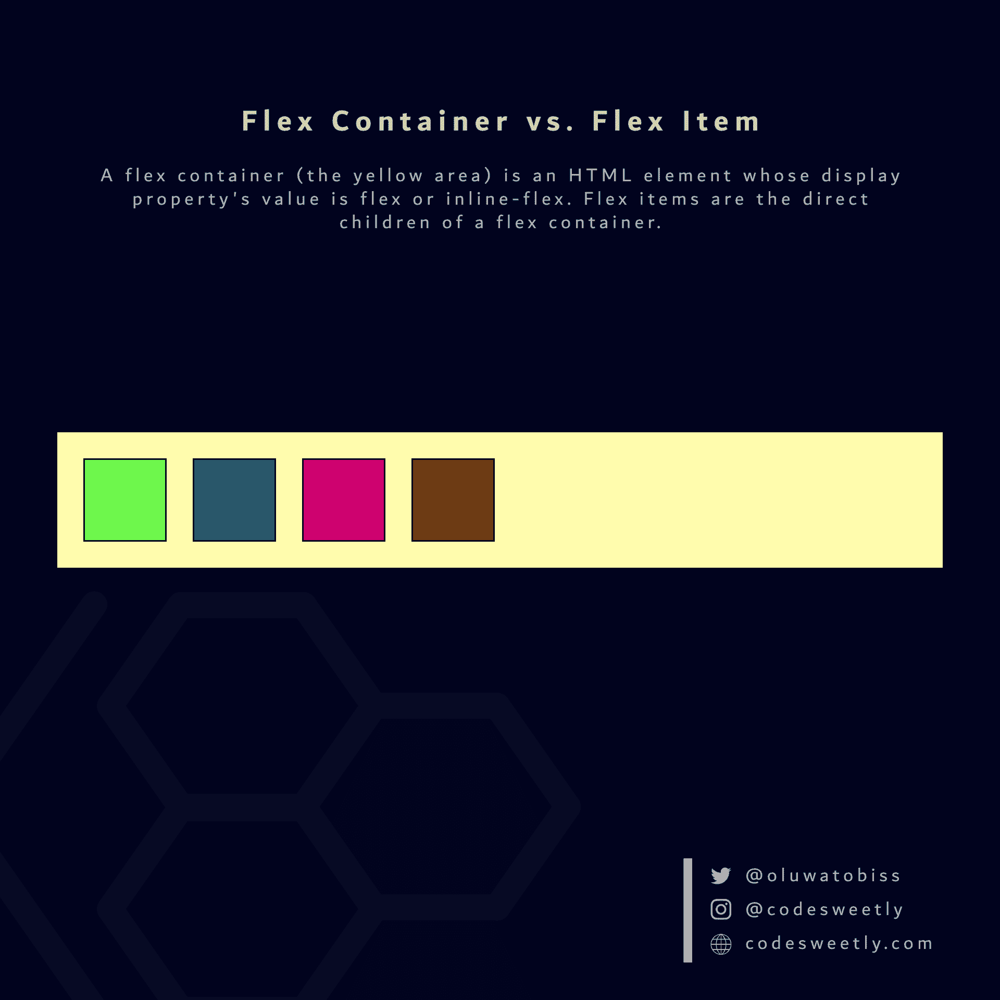

A flex container (the large yellow area in the image) is an HTML element whose display property's value is flex or inline-flex. Flex items (the smaller boxes within the yellow container) are the direct children of a flex container.

## CSS 中的一个`flex`值是什么？

告诉浏览器将选中的 HTML 元素显示为块级灵活框模型。

换句话说，将元素的`display`属性值设置为`flex`会将盒子模型变成一个[块级](https://developer.mozilla.org/en-US/docs/Web/HTML/Block-level_elements) flexbox。

**这里有一个例子:**

```
section {
  display: flex;
  background-color: orange;
  margin: 10px;
  padding: 7px;
}
```

[**在 StackBlitz** 上试一下](https://stackblitz.com/edit/js-gctvuc?file=style.css)

上面的代码片段使用了`flex`值将 HTML 文档的`<section>`元素从常规的`<section>`节点转换为块级灵活框模型。

**注:**

*   将 HTML 节点转换为灵活的框模型会使元素的直接子元素成为灵活的项目。
*   `display: flex`指令只影响盒子模型及其直接子模型。它不影响孙节点。

现在我们来讨论一下`inline-flex`。

## CSS 中的一个`inline-flex`值是什么？

告诉浏览器将选中的 HTML 元素显示为内嵌级灵活框模型。

换句话说，将元素的`display`属性值设置为`inline-flex`会将盒子模型变成一个[内嵌级](https://developer.mozilla.org/en-US/docs/Web/HTML/Inline_elements) flexbox。

**这里有一个例子:**

```
section {
  display: inline-flex;
  background-color: orange;
  margin: 10px;
  padding: 7px;
}
```

[**在 StackBlitz** 上试一下](https://stackblitz.com/edit/js-ksagv8?file=style.css)

上面的代码片段使用了`inline-flex`值来将 HTML 文档的`<section>`元素从常规的`<section>`节点转换为内嵌级别的灵活框模型。

**注:**

*   将 HTML 节点转换为灵活的框模型会使元素的直接子元素成为灵活的项目。
*   `display: inline-flex`指令只影响盒子模型及其直接子模型。它不影响孙节点。

## 用于指定 Flexbox 布局的属性

在将常规 HTML 元素转换为`flex`(或`inline-flex`)框模型时，Flexbox 提供了两类属性来定位灵活框及其直接子元素:

*   柔性容器属性
*   灵活项目属性

## 柔性容器的属性是什么？

灵活容器的属性指定浏览器应该如何在灵活框模型中布局项目。

**注意:**我们在 flex 容器上定义一个灵活容器的属性，而不是它的项目。

六(6)种类型的 flex 容器属性是:

*   `flex-direction`
*   `flex-wrap`
*   `flex-flow`
*   `justify-content`
*   `align-items`
*   `align-content`

现在来讨论一下六种类型。

## Flexbox 的`flex-direction`属性是什么？

**flex-direction** 告诉浏览器他们应该布局一个灵活容器的直接子容器的特定方向(行或列)。

换句话说，`flex-direction`定义了 flexbox 的[主轴](https://codesweetly.com/css-flex-direction-property#main-axis-vs-cross-axis-whats-the-difference)。

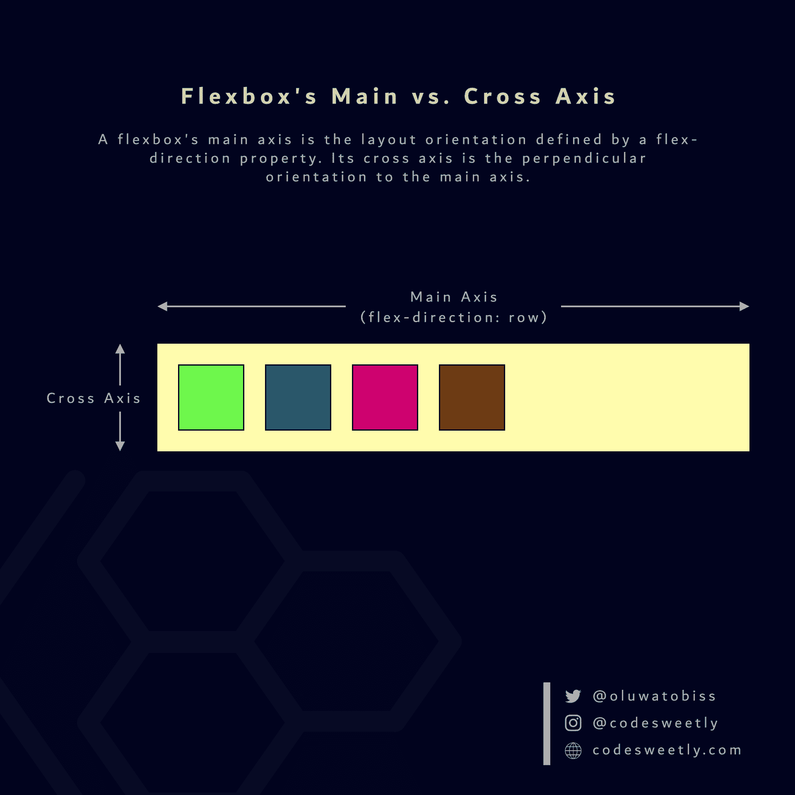

A Flexbox's main axis is the layout orientation defined by a flex-direction property. Its cross axis is the perpendicular orientation to the main axis.

**这里有一个例子:**

```
section {
  display: flex;
  flex-direction: column;
  background-color: orange;
  margin: 10px;
  padding: 7px;
}
```

[**在 StackBlitz** 上试一下](https://stackblitz.com/edit/js-jtpqir?file=style.css)

上面的代码片段按照浏览器默认语言的列方向组织了灵活的`<section>`容器项目。

**提示:**使用`flex-direction: column-reverse`(或`flex-direction: row-reverse`)反转浏览器的布局方向。

## Flexbox 的`flex-wrap`属性是什么？

**flex-wrap** 指定浏览器是否应该将溢出的灵活项目换行到多行上。

`flex-wrap`属性接受以下值:

*   `nowrap`
*   `wrap`
*   `wrap-reverse`

我们来讨论一下这三种价值观。

### CSS flexbox 中的`flex-wrap: nowrap`是什么？

`nowrap`是`flex-wrap`的默认值。它将一个灵活容器中的所有项目强制放在一行中(即，按行或按列的方向)。

换句话说，`nowrap`告诉浏览器*而不是*包装柔性容器的项目。

**注意:**假设柔性容器中所有物品的总宽度(或高度)大于柔性盒的宽度(或高度)。在这种情况下，`nowrap`将导致元素溢出容器。

**这里有一个例子:**

```
section {
  width: 130px;
  display: flex;
  flex-wrap: nowrap;
  background-color: orange;
  margin: 10px;
  padding: 7px;
}
```

[**在 StackBlitz** 上试一下](https://stackblitz.com/edit/js-yn6yw8?file=style.css)

上面的代码片段使用了`nowrap`来强制浏览器将灵活容器的项目放在一行中。

### CSS flexbox 中的`flex-wrap: wrap`是什么？

`wrap`将柔性容器中的所有溢出项目移动到下一行。

换句话说，`wrap`告诉浏览器包装一个灵活容器的溢出项。

**这里有一个例子:**

```
section {
  width: 130px;
  display: flex;
  flex-wrap: wrap;
  background-color: orange;
  margin: 10px;
  padding: 7px;
}
```

[**在 StackBlitz** 上试一下](https://stackblitz.com/edit/js-78ez1m?file=style.css)

我们使用`wrap`将灵活容器的溢出项包装到下一行。

### CSS flexbox 中的`flex-wrap: wrap-reverse`是什么？

`wrap-reverse`将柔性容器中的所有溢出项目以相反的顺序移动到下一行。

**注意:** `wrap-reverse`和`wrap`做同样的事情——但是顺序相反。

**这里有一个例子:**

```
section {
  width: 130px;
  display: flex;
  flex-wrap: wrap-reverse;
  background-color: orange;
  margin: 10px;
  padding: 7px;
}
```

[**在 StackBlitz** 上试一下](https://stackblitz.com/edit/js-eyqxtf?file=style.css)

我们使用`wrap-reverse`将柔性容器的溢出项以相反的顺序包装到下一行。

## Flexbox 的`flex-flow`属性是什么？

**flex-flow** 是`flex-direction`和`flex-wrap`属性的简称。

换句话说，不是写:

```
section {
  display: flex;
  flex-direction: column;
  flex-wrap: wrap;
}
```

您也可以使用`flex-flow`属性来缩短您的代码，如下所示:

```
section {
  display: flex;
  flex-flow: column wrap;
}
```

## Flexbox 的`justify-content`属性是什么？

**justify-content** 指定浏览器应该如何沿着 flexbox 的[主轴](https://codesweetly.com/css-flex-direction-property#main-axis-vs-cross-axis-whats-the-difference)定位柔性容器的项目。

`justify-content`属性接受以下值:

*   `flex-start`
*   `center`
*   `flex-end`
*   `space-between`
*   `space-around`
*   `space-evenly`

我们来讨论一下这六个价值观。

### CSS Flexbox 中的`justify-content: flex-start`是什么？

`flex-start`是`justify-content`的默认值。它将柔性容器的项目与 flexbox 主轴的主起始边对齐。

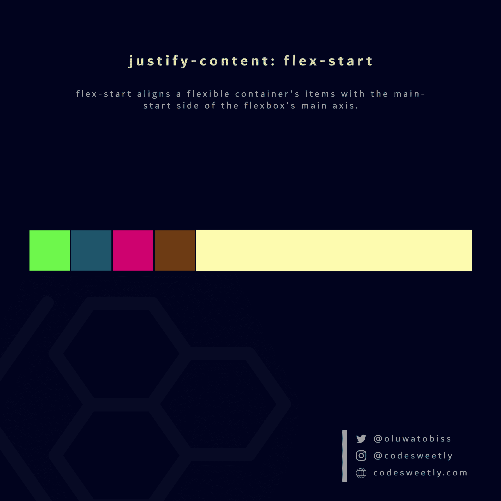

flex-start aligns a flexible container's items with the main-start side of the flexbox's main axis.

**这里有一个例子:**

```
section {
  display: flex;
  justify-content: flex-start;
  background-color: orange;
  margin: 10px;
}
```

[**在 StackBlitz** 上试一下](https://stackblitz.com/edit/js-ma7svj?file=style.css)

上面的代码片段使用了`flex-start`值来将灵活容器的项目与 flexbox 的主开始边缘对齐。

### CSS Flexbox 中的`justify-content: center`是什么？

`center`将柔性容器的项目与柔性盒主轴的中心对齐。

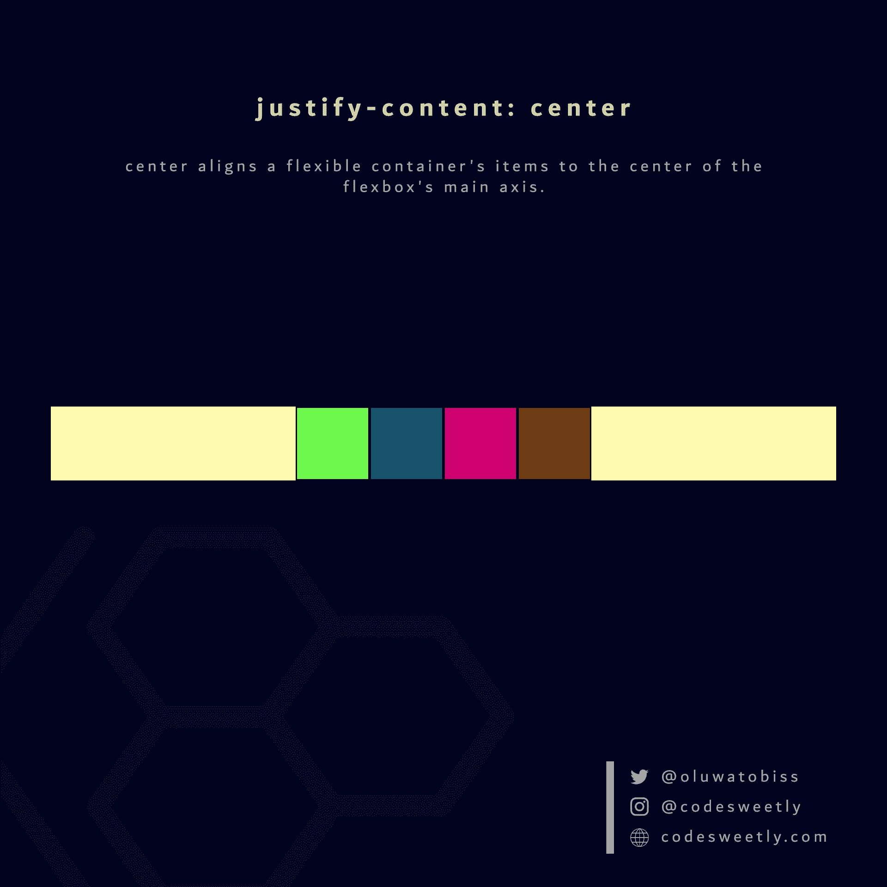

center aligns a flexible container's items to the center of the flexbox's main axis.

**这里有一个例子:**

```
section {
  display: flex;
  justify-content: center;
  background-color: orange;
  margin: 10px;
}
```

[**在 StackBlitz** 上试一下](https://stackblitz.com/edit/js-jfzcwc?file=style.css)

我们使用`center`值将灵活容器的项目与 flexbox 的中心对齐。

### CSS Flexbox 中的`justify-content: flex-end`是什么？

`flex-end`将柔性容器的物品与柔性盒主轴的主端侧对齐。

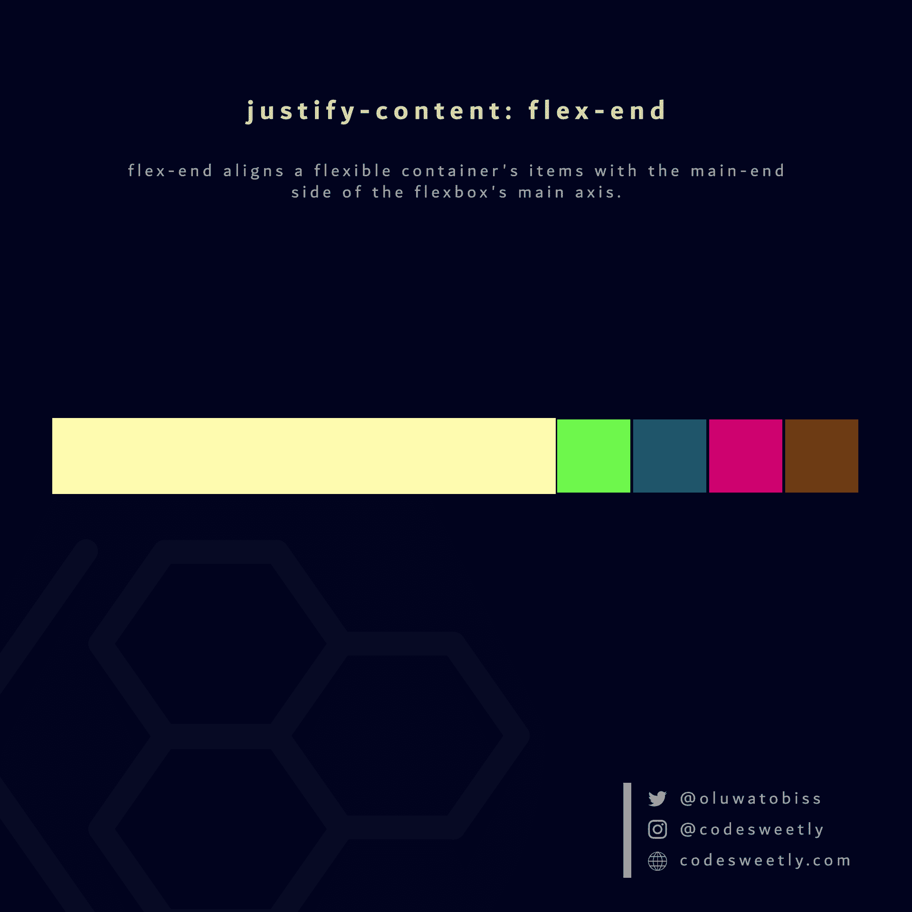

flex-end aligns a flexible container's items with the main-end side of the flexbox's main axis.

**这里有一个例子:**

```
section {
  display: flex;
  justify-content: flex-end;
  background-color: orange;
  margin: 10px;
}
```

[**在 StackBlitz** 上试一下](https://stackblitz.com/edit/js-iyhlbr?file=style.css)

我们使用`flex-end`值将灵活容器的项目与 flexbox 的主端对齐。

### CSS Flexbox 中的`justify-content: space-between`是什么？

`space-between`执行以下操作:

*   它将柔性容器的第一个项目与 flexbox 主轴的主起始边对齐。
*   它将容器的最后一个项目与 flexbox 主轴的主端边缘对齐。
*   它在第一个和最后一个项目之间的每对项目之间创建均匀的间距。

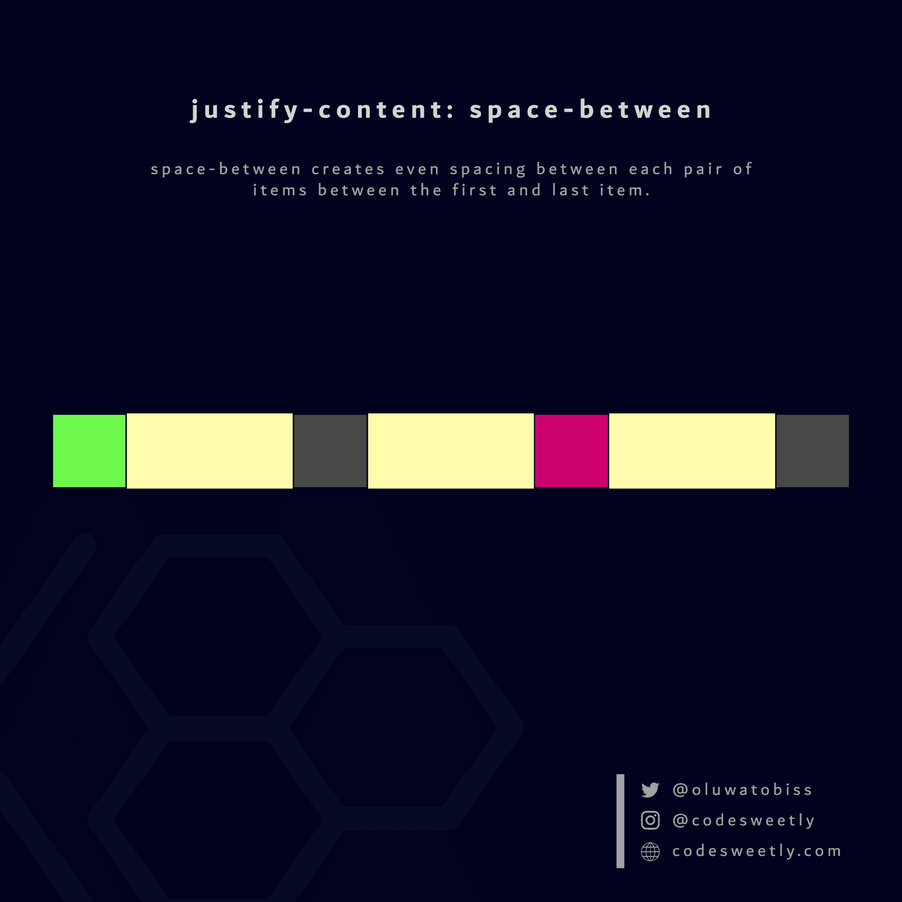

space-between creates even spacing between each pair of items between the first and last item.

**这里有一个例子:**

```
section {
  display: flex;
  justify-content: space-between;
  background-color: orange;
  margin: 10px;
}
```

[**在 StackBlitz** 上试一下](https://stackblitz.com/edit/js-dylovp?file=style.css)

上面的代码片段使用`space-between`值在第一个和最后一个 flex 项之间的每对项之间创建均匀的间距。

### CSS Flexbox 中的`justify-content: space-around`是什么？

`space-around`为柔性容器的项目的每一侧分配相等的间距。

因此，第一个项目之前和最后一个元素之后的间距是每对元素之间间距宽度的一半。

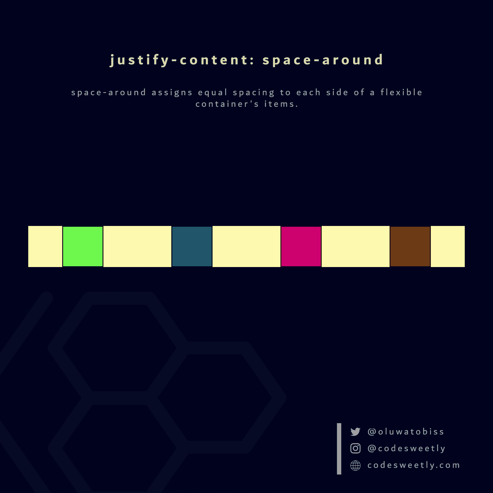

space-around assigns equal spacing to each side of a flexible container's items.

**这里有一个例子:**

```
section {
  display: flex;
  justify-content: space-around;
  background-color: orange;
  margin: 10px;
}
```

[**在 StackBlitz** 上试一下](https://stackblitz.com/edit/js-t6wpcj?file=style.css)

上面的代码片段使用了`space-around`值来为灵活容器的项目的每一侧分配相等的间距。

### CSS Flexbox 中的`justify-content: space-evenly`是什么？

`space-evenly`为柔性容器的两端及其项目之间分配均匀的间距。

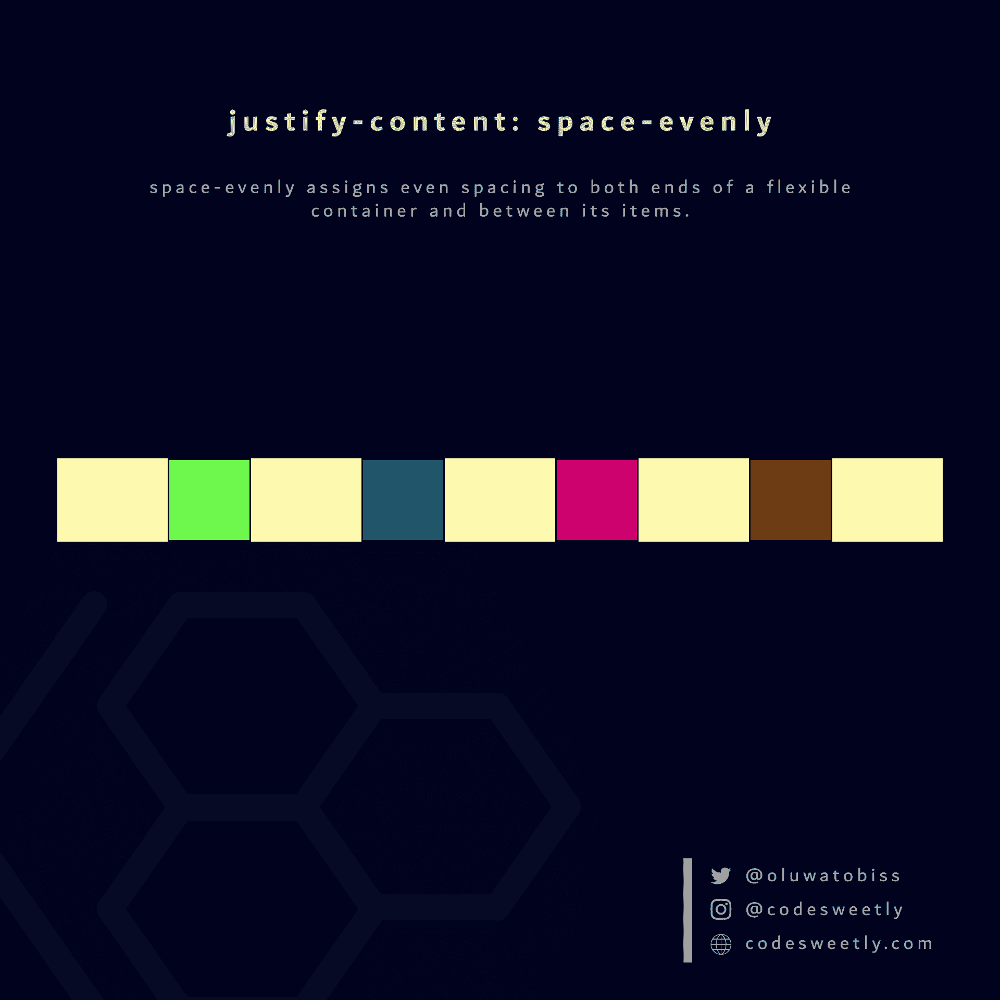

space-evenly assigns even spacing to both ends of a flexible container and between its items.

**这里有一个例子:**

```
section {
  display: flex;
  justify-content: space-evenly;
  background-color: orange;
  margin: 10px;
}
```

[**在 StackBlitz** 上试一下](https://stackblitz.com/edit/js-p67eh8?file=style.css)

我们使用`space-evenly`值为 flexbox 的两端和项目之间分配均匀的间距。

现在让我们讨论第五种类型的灵活容器属性。

## Flexbox 的`align-items`属性是什么？

**align-items** 指定浏览器应该如何沿着 flexbox 的[横轴](https://codesweetly.com/css-flex-direction-property#main-axis-vs-cross-axis-whats-the-difference)定位柔性容器的项目。

`align-items`属性接受以下值:

*   `stretch`
*   `flex-start`
*   `center`
*   `flex-end`
*   `baseline`

我们来讨论一下这五种价值观。

### CSS Flexbox 中的`align-items: stretch`是什么？

`stretch`是`align-items`的默认值。它拉伸柔性容器的项目以填充 flexbox 的横轴。

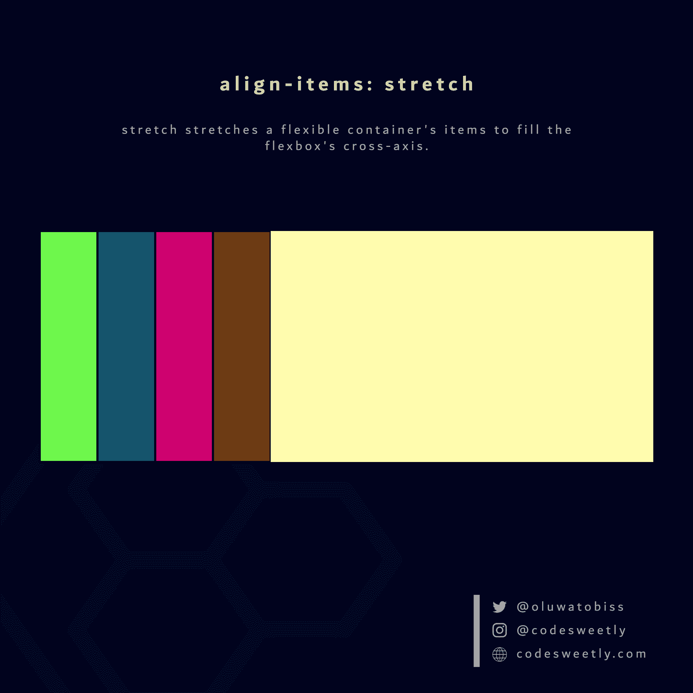

stretch stretches a flexible container's items to fill the flexbox's cross-axis.

**这里有一个例子:**

```
section {
  display: flex;
  align-items: stretch;
  background-color: orange;
  margin: 10px;
  height: 300px;
}
```

[**在 StackBlitz** 上试一下](https://stackblitz.com/edit/js-ezugee?file=style.css)

上面的代码片段使用了`stretch`值来拉伸柔性项目，以填充`<section>`的横轴。

### CSS Flexbox 中的`align-items: flex-start`是什么？

`flex-start`将柔性容器的项目与 flexbox 横轴的十字线边缘对齐。

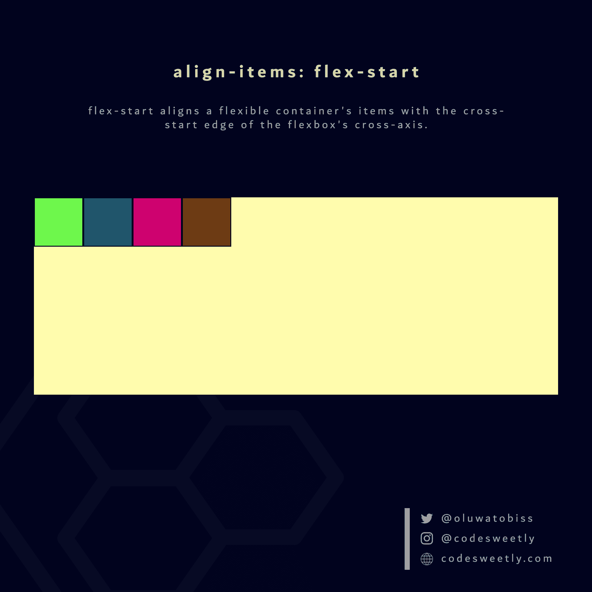

flex-start aligns a flexible container's items with the cross-start edge of the flexbox's cross-axis.

**这里有一个例子:**

```
section {
  display: flex;
  align-items: flex-start;
  background-color: orange;
  margin: 10px;
  height: 300px;
}
```

[**在 StackBlitz** 上试一下](https://stackblitz.com/edit/js-cjzhj2?file=style.css)

我们使用`flex-start`值将柔性项目与`<section>`横轴的十字线边缘对齐。

### CSS Flexbox 中的`align-items: center`是什么？

`center`将柔性容器的项目对齐到 flexbox 横轴的中心。

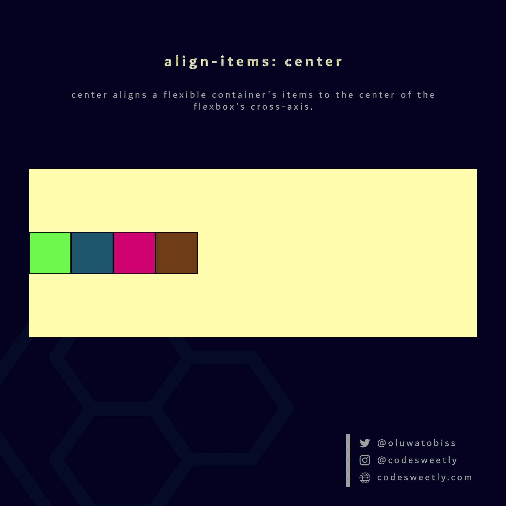

center aligns a flexible container's items to the center of the flexbox's cross-axis.

**这里有一个例子:**

```
section {
  display: flex;
  align-items: center;
  background-color: orange;
  margin: 10px;
  height: 300px;
}
```

[**在 StackBlitz** 上试一下](https://stackblitz.com/edit/js-ywexqr?file=style.css)

上面的代码片段使用了`center`值来将灵活项目对齐到`<section>`横轴的中心。

### CSS Flexbox 中的`align-items: flex-end`是什么？

`flex-end`将柔性容器的项目与柔性盒横轴的交叉端边缘对齐。

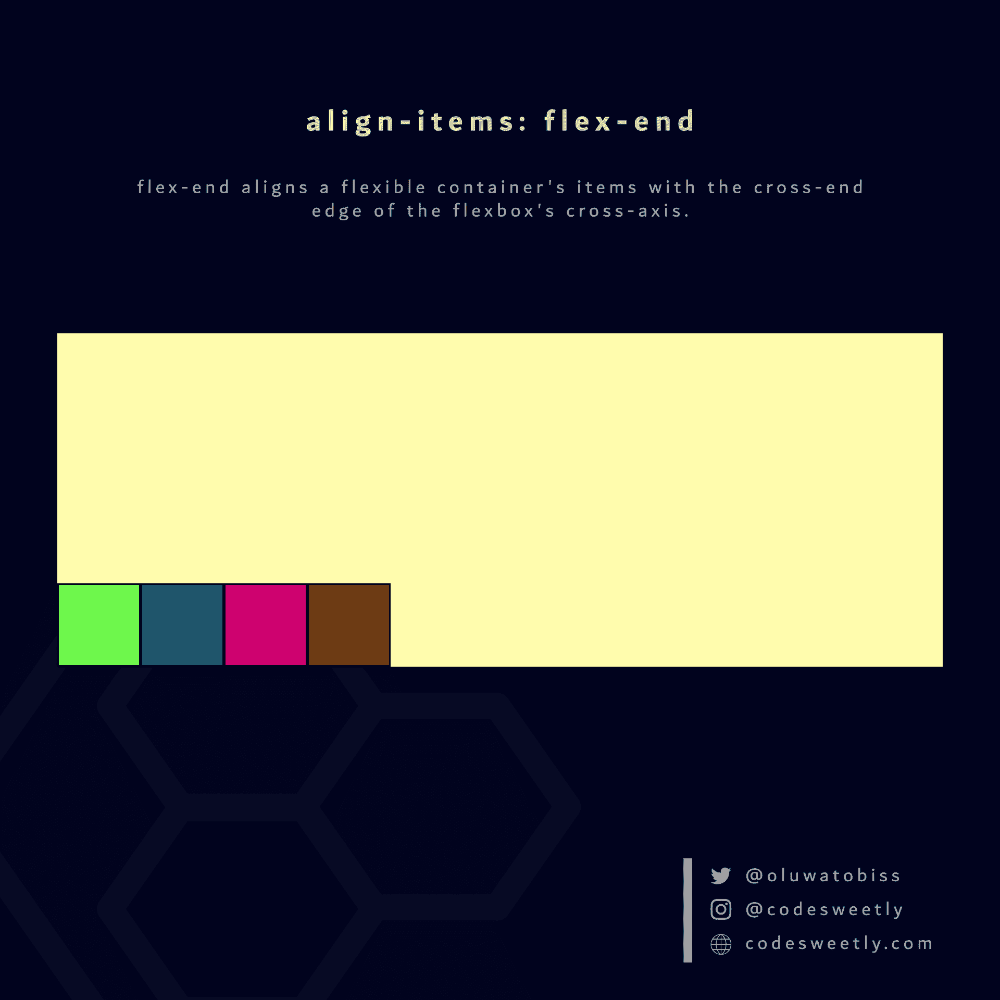

flex-end aligns a flexible container's items with the cross-end edge of the flexbox's cross-axis.

**这里有一个例子:**

```
section {
  display: flex;
  align-items: flex-end;
  background-color: orange;
  margin: 10px;
  height: 300px;
}
```

[**在 StackBlitz** 上试一下](https://stackblitz.com/edit/js-bwdeyz?file=style.css)

我们使用`flex-end`值将柔性项目与`<section>`横轴的交叉端边缘对齐。

### CSS Flexbox 中的`align-items: baseline`是什么？

`baseline`将柔性容器的物品与柔性盒横轴的[基线](https://stackoverflow.com/a/34611670/11841906)对齐。

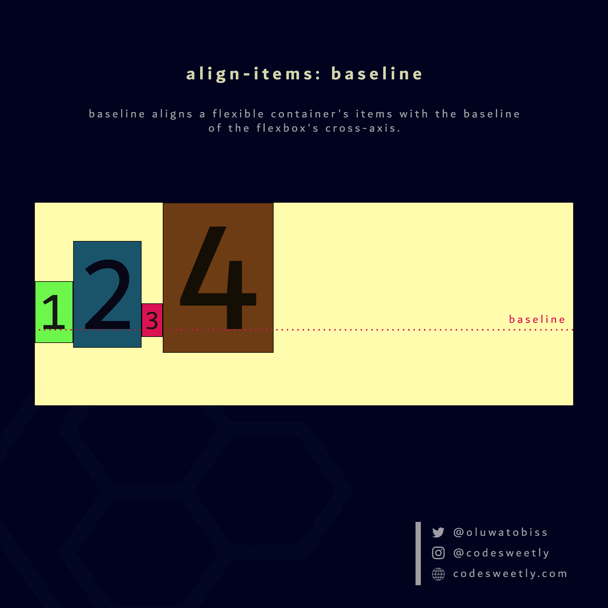

baseline aligns a flexible container's items with the baseline of the flexbox's cross-axis.

**这里有一个例子:**

```
section {
  display: flex;
  align-items: baseline;
  background-color: orange;
  margin: 10px;
}
```

[**在 StackBlitz** 上试一下](https://stackblitz.com/edit/js-xxvj57?file=style.css)

上面的代码片段使用了`baseline`值来将灵活项目与`<section>`的基线对齐。

现在，我们来谈谈第六种 CSS 灵活容器属性类型。

## Flexbox 的`align-content`属性是什么？

**align-content** 指定浏览器应该如何沿着 flexbox 的[横轴](https://codesweetly.com/css-flex-direction-property#main-axis-vs-cross-axis-whats-the-difference)定位柔性容器的线条。

**注意:**`align-content`属性不会影响只有一行的 flexbox 例如，带有`flex-wrap: nowrap`的灵活容器。换句话说，`align-content`只适用于多行的 flexboxes。

`align-content`属性接受以下值:

*   `stretch`
*   `flex-start`
*   `center`
*   `flex-end`
*   `space-between`
*   `space-around`
*   `space-evenly`

我们来讨论一下这七种价值观。

### CSS Flexbox 中的`align-content: stretch`是什么？

`stretch`是`align-content`的默认值。它拉伸柔性容器的线条以填充 flexbox 的横轴。

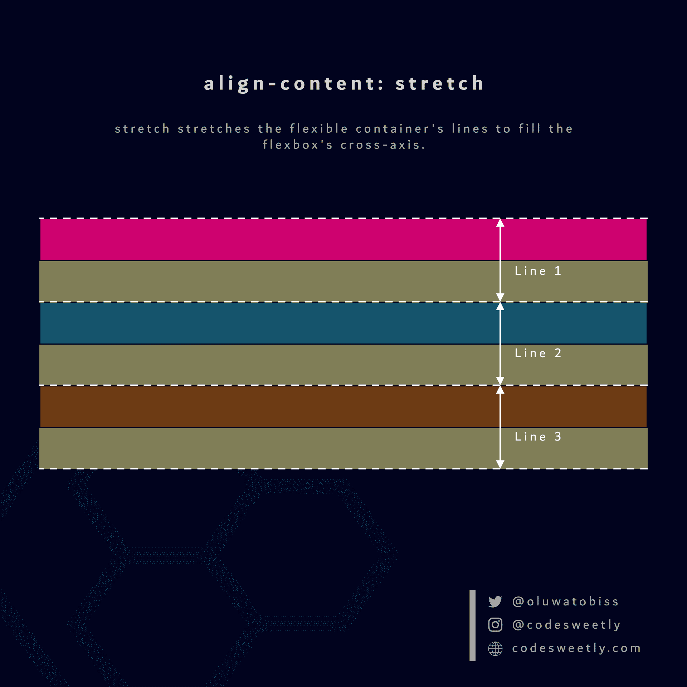

stretch stretches the flexible container's lines to fill the flexbox's cross-axis.

**这里有一个例子:**

```
section {
  display: flex;
  flex-wrap: wrap;
  align-content: stretch;
  background-color: orange;
  margin: 10px;
  width: 90px;
  height: 500px;
}
```

[**在 StackBlitz** 上试一下](https://stackblitz.com/edit/js-dway6n?file=style.css)

上面的代码片段使用了`stretch`值来拉伸 flexbox 的线条，以填充`<section>`的横轴。

### CSS Flexbox 中的`align-content: flex-start`是什么？

`flex-start`将柔性容器的线条与 flexbox 横轴的十字线边缘对齐。

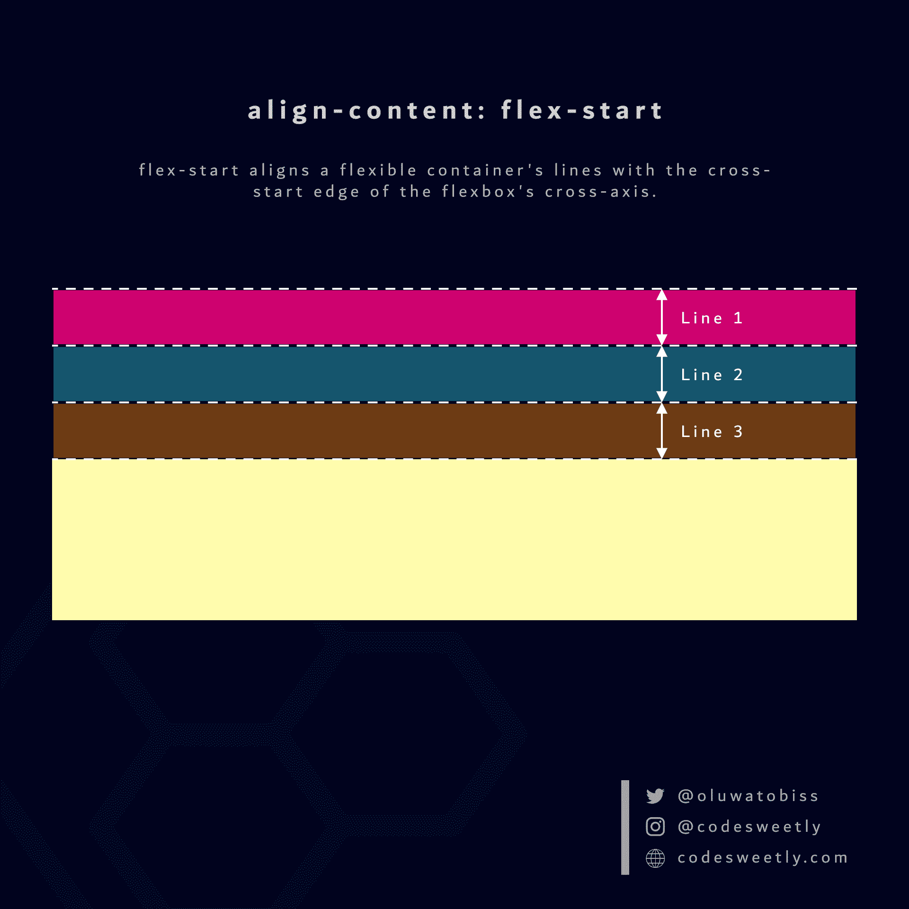

flex-start aligns a flexible container's lines with the cross-start edge of the flexbox's cross-axis.

**这里有一个例子:**

```
section {
  display: flex;
  flex-wrap: wrap;
  align-content: flex-start;
  background-color: orange;
  margin: 10px;
  width: 90px;
  height: 500px;
}
```

[**在 StackBlitz** 上试一下](https://stackblitz.com/edit/js-c9pzbc?file=style.css)

上面的代码片段使用了`flex-start`值来将 flexbox 的线条对齐到`<section>`横轴的十字线开始边缘。

### CSS Flexbox 中的`align-content: center`是什么？

`center`将柔性容器的线条对准柔性盒横轴的中心。

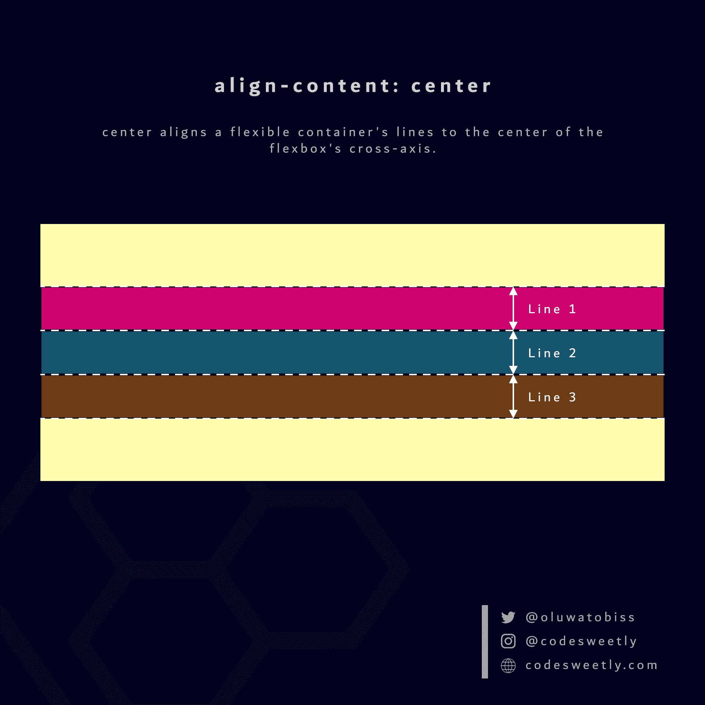

center aligns a flexible container's lines to the center of the flexbox's cross-axis.

**这里有一个例子:**

```
section {
  display: flex;
  flex-wrap: wrap;
  align-content: center;
  background-color: orange;
  margin: 10px;
  width: 90px;
  height: 500px;
}
```

[**在 StackBlitz** 上试一下](https://stackblitz.com/edit/js-j3poyu?file=style.css)

我们使用`center`值将 flexbox 的线对齐到`<section>`横轴的中心。

### CSS Flexbox 中的`align-content: flex-end`是什么？

`flex-end`将柔性容器的线条与柔性盒横轴的交叉端边缘对齐。

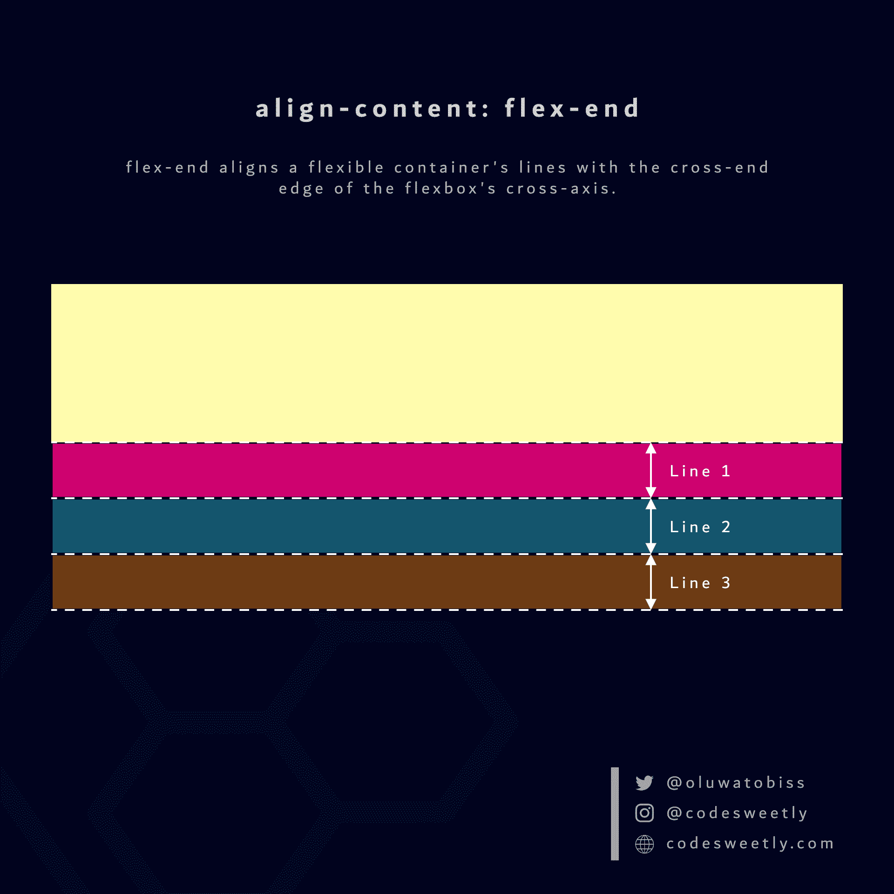

flex-end aligns a flexible container's lines with the cross-end edge of the flexbox's cross-axis.

**这里有一个例子:**

```
section {
  display: flex;
  flex-wrap: wrap;
  align-content: flex-end;
  background-color: orange;
  margin: 10px;
  width: 90px;
  height: 500px;
}
```

[**在 StackBlitz** 上试一下](https://stackblitz.com/edit/js-cmaz6z?file=style.css)

我们使用`flex-end`值将 flexbox 的线与`<section>`横轴的交叉端边缘对齐。

### CSS Flexbox 中的`align-content: space-between`是什么？

`space-between`执行以下操作:

*   它将 flexbox 的第一条线与柔性容器主轴的主起始边对齐。
*   它将 flexbox 的最后一条线与柔性容器主轴的主端侧对齐。
*   它在第一行和最后一行之间的每对行之间创建相等的间距。

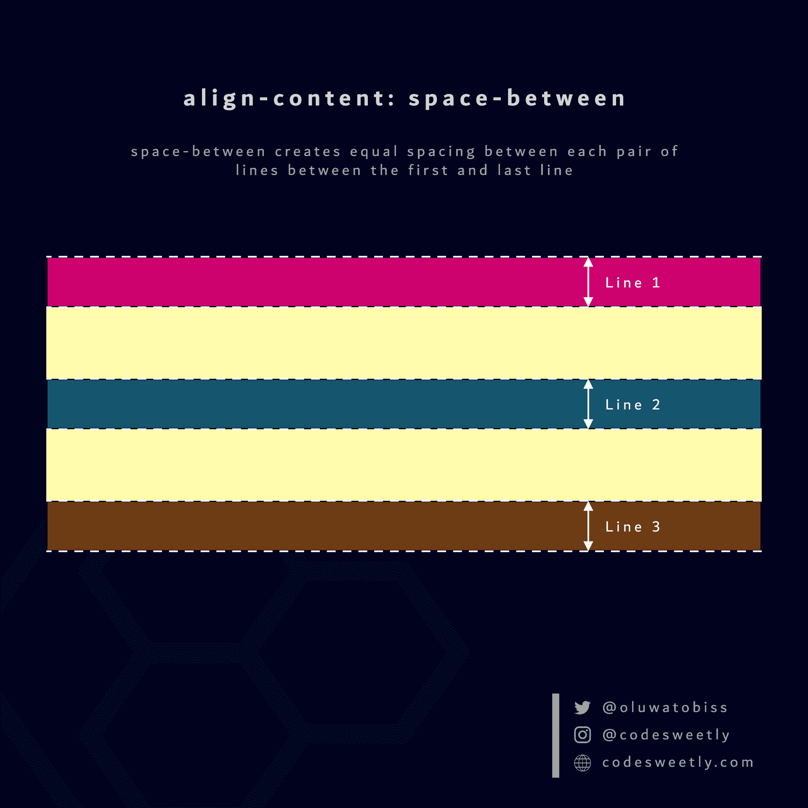

space-between creates equal spacing between each pair of lines between the first and last line

**这里有一个例子:**

```
section {
  display: flex;
  flex-wrap: wrap;
  align-content: space-between;
  background-color: orange;
  margin: 10px;
  width: 90px;
  height: 500px;
}
```

[**在 StackBlitz** 上试一下](https://stackblitz.com/edit/js-kltdwx?file=style.css)

上面的代码片段使用了`space-between`值在第一行和最后一行之间的每一对行之间创建相等的间距。

### CSS Flexbox 中的`align-content: space-around`是什么？

`space-around`为柔性容器线条的每一侧分配相等的间距。

因此，第一行之前和最后一行之后的间距是每对行之间间距宽度的一半。

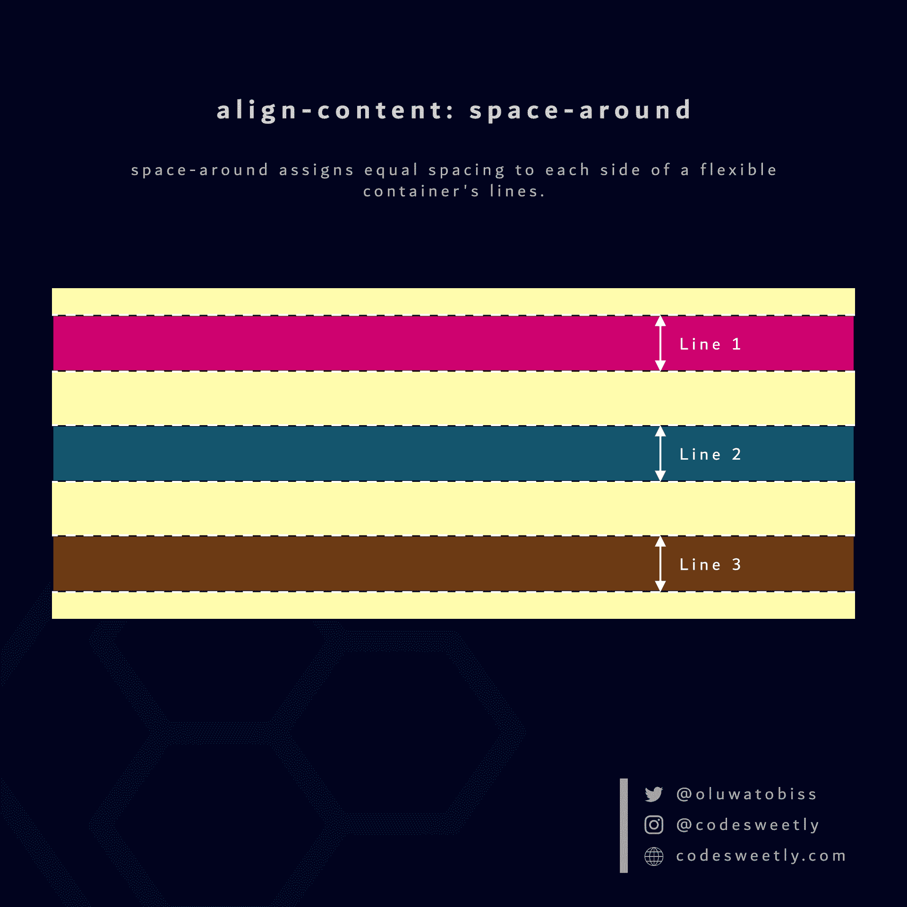

space-around assigns equal spacing to each side of a flexible container's lines.

**这里有一个例子:**

```
section {
  display: flex;
  flex-wrap: wrap;
  align-content: space-around;
  background-color: orange;
  margin: 10px;
  width: 90px;
  height: 500px;
}
```

[**在 StackBlitz** 上试一下](https://stackblitz.com/edit/js-kx9gdy?file=style.css)

上面的代码片段使用了`space-around`值为灵活容器线条的每一侧分配相等的间距。

### CSS Flexbox 中的`align-content: space-evenly`是什么？

`space-evenly`为柔性容器的两端和各行之间分配均匀的间距。

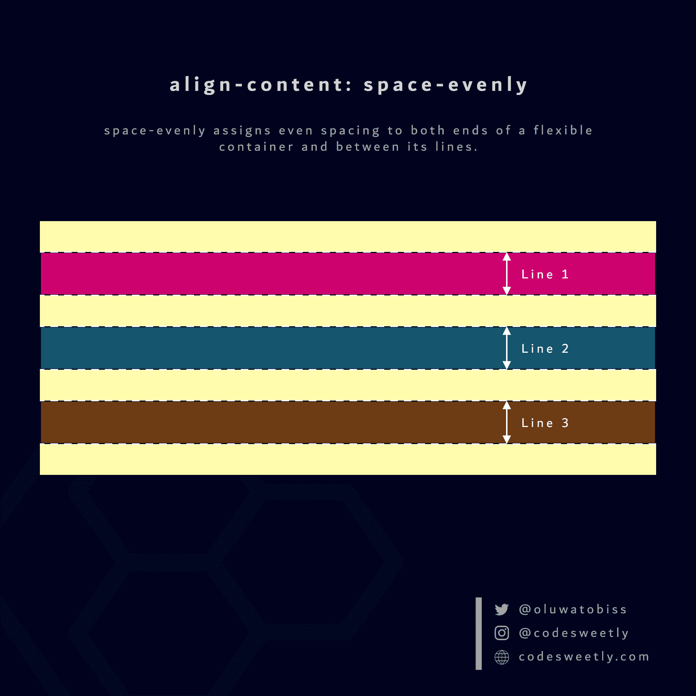

space-evenly assigns even spacing to both ends of a flexible container and between its lines.

**这里有一个例子:**

```
section {
  display: flex;
  flex-wrap: wrap;
  align-content: space-evenly;
  background-color: orange;
  margin: 10px;
  width: 90px;
  height: 500px;
}
```

[**在 StackBlitz** 上试一下](https://stackblitz.com/edit/js-eevqoj?file=style.css)

我们使用`space-evenly`值为 flexbox 的两端和线之间分配均匀的间距。

因此，现在我们知道了 CSS 灵活容器属性的类型，我们可以讨论 flex 项目属性了。

## 弹性项目的属性是什么？

灵活项的属性指定浏览器应该如何在灵活框模型中布局指定的项。

**注意:**我们在 flex 项目上定义了一个灵活项目的属性，而不是它的容器。

六(6)种弹性项目属性是:

*   `align-self`
*   `order`
*   `flex-grow`
*   `flex-shrink`
*   `flex-basis`
*   `flex`

现在来讨论一下六种类型。

## Flexbox 的`align-self`属性是什么？

**align-self** 指定浏览器应该如何沿着 flexbox 的[横轴](https://codesweetly.com/css-flex-direction-property#main-axis-vs-cross-axis-whats-the-difference)定位选定的柔性项目。

**注:**

*   `align-self`仅影响选定的 flex 项目，而不是 flexbox 的所有项目。
*   `align-self`覆盖`align-items`属性。

`align-self`属性接受以下值:

*   `stretch`
*   `flex-start`
*   `center`
*   `flex-end`
*   `baseline`

我们来讨论一下这五种价值观。

### CSS Flexbox 中的`align-self: stretch`是什么？

`stretch`拉伸选定的柔性项目以填充 flexbox 的横轴。

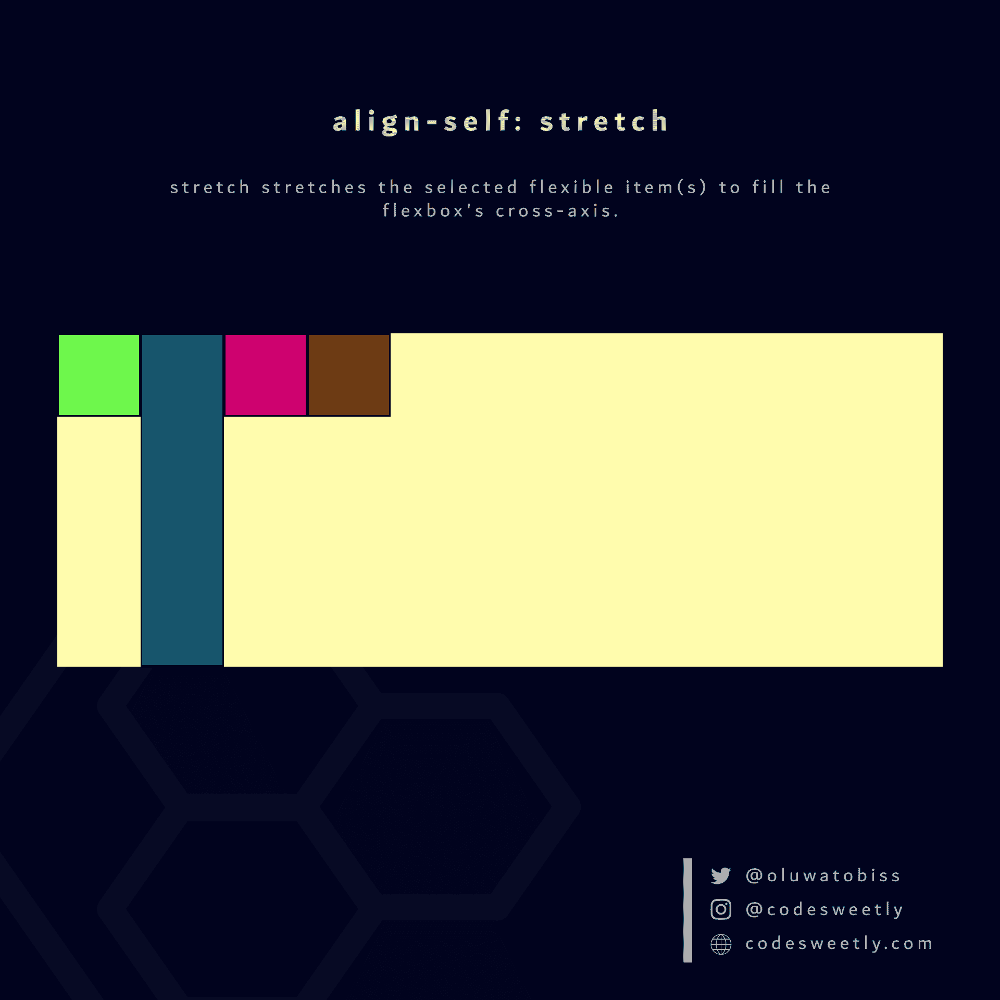

stretch stretches the selected flexible item(s) to fill the flexbox's cross-axis.

**这里有一个例子:**

```
.flex-item2 {
  align-self: stretch;
}
```

[**在 StackBlitz** 上试一下](https://stackblitz.com/edit/js-o5qr62?file=style.css)

我们使用`stretch`值来拉伸`flex-item2`以填充其容器的横轴。

### CSS Flexbox 中的`align-self: flex-start`是什么？

`flex-start`将所选柔性项目与 flexbox 横轴的十字线边缘对齐。

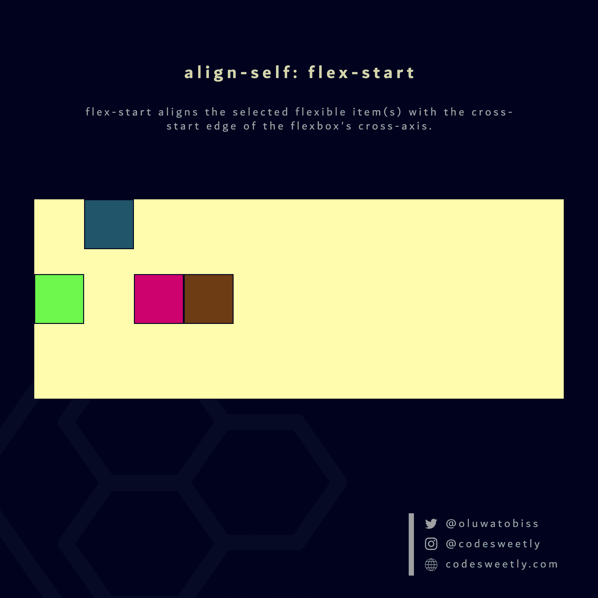

flex-start aligns the selected flexible item(s) with the cross-start edge of the flexbox's cross-axis.

**这里有一个例子:**

```
.flex-item2 {
  align-self: flex-start;
}
```

[**在 StackBlitz** 上试一下](https://stackblitz.com/edit/js-6uianm?file=style.css)

上面的代码片段使用了`flex-start`值来将`flex-item2`对齐到其容器横轴的十字起始边缘。

### CSS Flexbox 中的`align-self: center`是什么？

`center`将所选柔性项目对准 flexbox 横轴的中心。

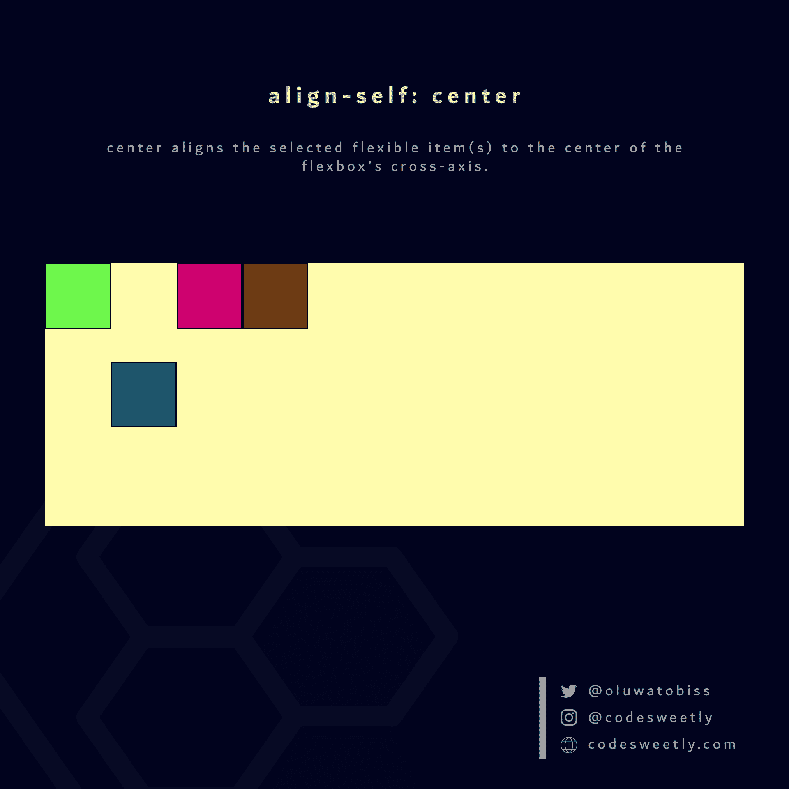

center aligns the selected flexible item(s) to the center of the flexbox's cross-axis.

**这里有一个例子:**

```
.flex-item2 {
  align-self: center;
}
```

[**在 StackBlitz** 上试一下](https://stackblitz.com/edit/js-tazf2p?file=style.css)

上面的代码片段使用了`center`值将`flex-item2`与其容器的横轴中心对齐。

### CSS Flexbox 中的`align-self: flex-end`是什么？

`flex-end`将所选柔性项目与柔性盒横轴的交叉端边缘对齐。

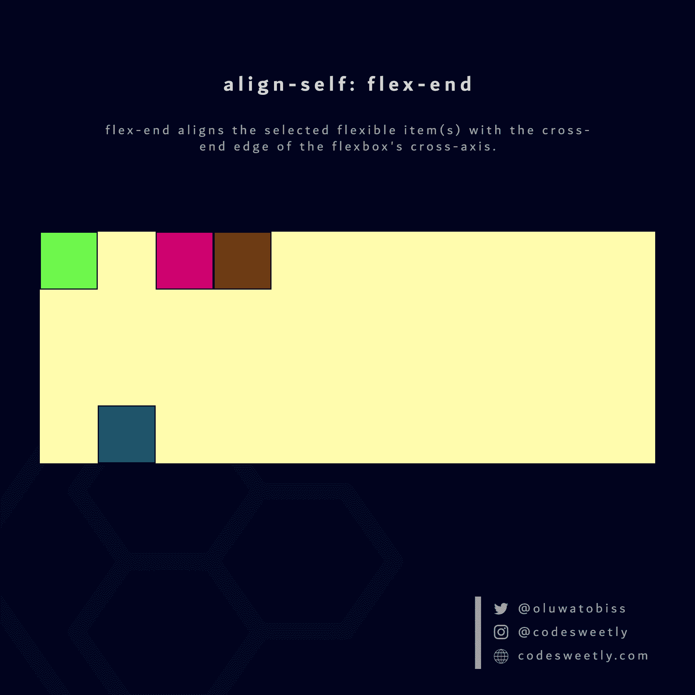

flex-end aligns the selected flexible item(s) with the cross-end edge of the flexbox's cross-axis.

**这里有一个例子:**

```
.flex-item2 {
  align-self: flex-end;
}
```

[**在 StackBlitz** 上试一下](https://stackblitz.com/edit/js-7bec4q?file=style.css)

上面的代码片段使用了`flex-end`值来将`flex-item2`与其容器横轴的交叉端边缘对齐。

### CSS Flexbox 中的`align-self: baseline`是什么？

`baseline`将选择的柔性项目与柔性盒横轴的[基线](https://stackoverflow.com/a/34611670/11841906)对齐。

**这里有一个例子:**

```
.flex-item2 {
  font-size: 3rem;
  align-self: baseline;
}
```

[**在 StackBlitz** 上试一下](https://stackblitz.com/edit/js-wmawek?file=style.css)

我们使用`baseline`值将`flex-item2`与其容器的基线对齐。

现在让我们讨论第二种类型的灵活项目属性。

## Flexbox 的`order`属性是什么？

**顺序**改变柔性项目的默认顺序(排列)。

换句话说，`order`允许您在不改变 HTML 代码布局的情况下重新定位 flexbox 的项目。

**这里有一个例子:**

```
<ul style="display: flex; flex-direction: column">
  <li style="order: 6">1</li>
  <li style="order: 4">2</li>
  <li style="order: 1">3</li>
  <li style="order: 7">4</li>
  <li style="order: 2">5</li>
  <li style="order: 5">6</li>
  <li style="order: 3">7</li>
</ul>
```

[**在 StackBlitz** 上试一下](https://stackblitz.com/edit/js-hmz9my?file=index.html)

上面的 HTML 代码片段使用了`order`属性来改变无序列表的排列。

所以，代替下面的顺序:

*   one
*   Two
*   three
*   four
*   five
*   six
*   seven

浏览器将显示以下内容:

*   three
*   five
*   seven
*   Two
*   six
*   one
*   four

小心使用`order`属性，因为它会阻止屏幕阅读器访问 HTML 文档的正确阅读顺序。只有在使用 CSS 改变 HTML 代码的布局非常重要的情况下才使用它。

但大多数情况下，最好是直接重新排列 HTML 代码，而不是使用 CSS。

**注意:**在上面的 HTML 代码片段中，`style="value"`语法是用于样式化 HTML 元素的[内联 CSS](https://codesweetly.com/inline-vs-internal-vs-external-css#what-is-an-inline-css) 技术。

## Flexbox 的`flex-grow`属性是什么？

**flex-grow** 告诉浏览器他们应该添加多少 flexbox 的剩余空间到所选灵活项目的大小中。

**注:**剩余空间是指浏览器从 flexbox 的大小中扣除所有柔性项目大小之和后剩余的空间。

**这里有一个例子:**

```
.flex-item3 {
  flex-grow: 0.5;
}
```

```
<section>
  <div class="flex-item1">1</div>
  <div class="flex-item2">2</div>
  <div class="flex-item3">3</div>
  <div class="flex-item4">4</div>
</section>
```

[**在 StackBlitz** 上试一下](https://stackblitz.com/edit/js-grtdo1?file=style.css)

我们使用了`flex-grow`属性让浏览器将`<section>`剩余空间的一半添加到`flex-item3`的大小中。

**注:** `flex-grow`的默认值为`0`。

## Flexbox 的`flex-shrink`属性是什么？

**flex-shrink** 告诉浏览器当所有项目的大小之和超过 flexbox 的大小时，指定的灵活项目应该收缩多少。

换句话说，假设 flexbox 的大小不足以容纳灵活的项目。在这种情况下，浏览器将缩小项目以适应容器。

因此，`flex-shrink`允许您指定弹性项目的收缩系数。

**这里有一个例子:**

```
.flex-item3 {
  flex-shrink: 0;
}
```

[**在 StackBlitz** 上试一下](https://stackblitz.com/edit/js-h2numw?file=style.css)

我们使用了`flex-shrink`属性来防止浏览器收缩`flex-item3`。

**注:**

*   浏览器不会收缩`flex-shrink`值为`0`的灵活项目。
*   `flex-shrink`的默认值为`1`。

## Flexbox 的`flex-basis`属性是什么？

**弹性基础**设置弹性项目的初始长度。

**这里有一个例子:**

```
.flex-item3 {
  flex-basis: 100px;
}
```

[**在 StackBlitz** 上试一下](https://stackblitz.com/edit/js-kwcche?file=style.css)

我们使用`flex-basis`属性将`flex-item3`的初始长度设置为`100px`。

**注意以下事项:**

*   `auto`是`flex-basis`的默认值。
*   一个`flex-basis`值(非`auto`)比`width`(或`height`)具有更高的特异性。因此，假设您为弹性物料定义了两者。在这种情况下，浏览器将使用`flex-basis`。
*   `flex-basis`属性设置[内容框](https://codesweetly.com/css-box-model#what-is-a-content-box)的初始宽度。但是你可以使用[框尺寸](https://developer.mozilla.org/en-US/docs/Web/CSS/box-sizing)属性来设置[边框](https://codesweetly.com/css-box-model#what-is-a-border-box)的宽度。

## Flexbox 的`flex`属性是什么？

**flex** 是`flex-grow`、`flex-shrink`和`flex-basis`属性的简写。

换句话说，不是写:

```
.flex-item3 {
  flex-grow: 0.5;
  flex-shrink: 0;
  flex-basis: 100px;
}
```

您也可以使用`flex`属性来缩短您的代码，如下所示:

```
.flex-item3 {
  flex: 0.5 0 100px;
}
```

**注意以下事项:**

*   `flex: auto`相当于`flex: 1 1 auto`。
*   `flex: none`相当于`flex: 0 0 auto`。
*   `flex: initial`将`flex`属性设置为默认值。它相当于`flex: 0 1 auto`。
*   `flex: inherit`继承其父元素的`flex`属性的值。

因此，现在我们知道了开发人员用来布局 flexbox 及其直接子对象的 flexbox 属性，我们可以讨论如何使用 flexbox 将元素居中。

## 如何使用 Flexbox 水平居中元素

您可以通过以下方式将任何元素在其容器内水平居中:

*   将其容器的`display`属性设置为`flex`
*   将灵活容器的`justify-content`属性设置为`center`

**这里有一个例子:**

```
section {
  display: flex;
  justify-content: center;
  background-color: orange;
  width: 100%;
  height: 400px;
}
```

[**在 StackBlitz** 上试一下](https://stackblitz.com/edit/js-trl46e?file=style.css)

## 如何使用 Flexbox 垂直居中元素

您可以通过以下方式将任何元素在其容器内垂直居中:

*   将其容器的`display`属性设置为`flex`
*   将灵活容器的`align-items`属性设置为`center`

**这里有一个例子:**

```
section {
  display: flex;
  align-items: center;
  background-color: orange;
  width: 100%;
  height: 400px;
}
```

[**在 StackBlitz** 上试一下](https://stackblitz.com/edit/js-tm1don?file=style.css)

## 如何使用 Flexbox 水平和垂直居中元素

您可以通过以下方式使任何 HTML 元素在其容器内水平和垂直居中:

*   将其容器的`display`属性设置为`flex`
*   将柔性容器的`justify-content`和`align-items`属性设置为`center`

**这里有一个例子:**

```
section {
  display: flex;
  justify-content: center;
  align-items: center;
  background-color: orange;
  width: 100%;
  height: 400px;
}
```

[**在 StackBlitz** 上试一下](https://stackblitz.com/edit/js-ryzwmq?file=style.css)

## 概观

在本文中，我们讨论了以灵活和响应迅速的方式创建基本和高级网站布局所需的所有 Flexbox 工具。

### 感谢阅读！

如果你喜欢我在本教程中使用的图片，你可以在这本小册子中找到它们。

### 这里有一个有用的资源:

我写了一本关于 React 的书！

*   这是初学者友好的✔
*   它有✔的现场代码片段
*   它包含可扩展的项目✔
*   ✔有很多容易理解的例子

[React 解释清楚](https://www.amazon.com/dp/B09KYGDQYW)的书就是你理解 ReactJS 所需要的全部。

[](https://www.amazon.com/dp/B09KYGDQYW)