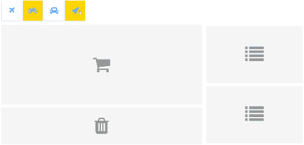

# 如何使用异步生成器分离业务逻辑

> 原文：<https://www.freecodecamp.org/news/decoupling-business-logic/>

异步生成器是 JavaScript 中的新功能。它们是一个显著的扩展。它们提供了一个简单但非常强大的工具，可以将程序分割成更小的部分，使源代码更容易编写、阅读、维护和测试。

本文通过一个例子展示了这一点。它实现了一个典型的前端组件，即拖放操作。同样的技术不仅限于前端，很难找到它不能应用的地方。我在两个大的编译器项目中使用了相同的方法，我非常兴奋它简化了很多。

最终的结果是一个玩具，但是其中的大部分代码在现实世界的应用程序中是可用的。本文的唯一目标是展示如何使用异步生成器函数将程序分割成更小的独立部分。这不是一篇关于如何实现拖放的文章。

这是一天结束时我们将得到的 [transpiled demo](https://effectful.js.org/demo/decoupling/) 。

您可以从顶部的调色板中拖动框，并将其放入任何灰色区域。每个拖放区都有其特定的操作。可以选择几个项目。黄色的有惯性运动。

所有的特征在那里都是独立的。对于每个功能，它们被分成几个阶段。它们易于单独启用、禁用、开发、测试和调试。一些开发人员或团队可以高效地并行工作。

我假设有一些非常基础的异步生成器知识(或者至少是异步函数和异步生成器的知识)和一些 HTML DOM 的基础知识(至少知道它是什么)。不依赖于第三方 JavaScript 库或框架，但是相同的技术可以用于它们中的任何一个。

对于演示，让我们假设我们不知道全部的需求集，并且只有在我们完成一些事情并且它起作用之后才添加新的特性。在中间阶段玩已经工作的软件通常会激发创造力。它是敏捷软件开发核心的主要组成部分之一——最好先写一些设计不完美但能工作的东西。然后我们总是可以用重构来改进它。异步发电机会有所帮助。

在任何项目的开始，我都不想花时间去选择合适的框架、库甚至架构。我不想过度设计。在异步迭代器的帮助下，我可以将艰难的决定推迟到有足够知识做出选择的时候。我越早做出选择，出错的可能性就越大。也许我什么都不会需要。

我将只描述几个步骤。其他步骤很小，可以毫不费力地直接从代码中读取。他们只是和多姆一起工作的问题。

#### 异步发电机

所有样本共享纳米框架来源。它是一次开发，在开始和复制粘贴没有任何变化。在真实的项目中，这些是独立的模块，如果需要，可以导入到其他模块中。这个框架只做一件事。它将 DOM 事件转换成异步迭代器元素。

异步迭代器具有与 ECMAScript 普通迭代器相同的`next`方法，但是它们返回一个解析到具有`value`、`done`字段的对象的承诺。

异步生成器结合了异步函数和生成器的功能。在这样的函数体中，我们可以将`await`和`yield`表达式一起使用，它们分别做这些表达式在异步函数和生成器中做的事情。也就是说，它们暂停执行控制，直到`await`参数中的承诺被解决，对于`yield`输出值并暂停，直到调用者请求下一个值。

下面是纳米框架的实现，以及业务逻辑的第一个版本(目前是单片的):