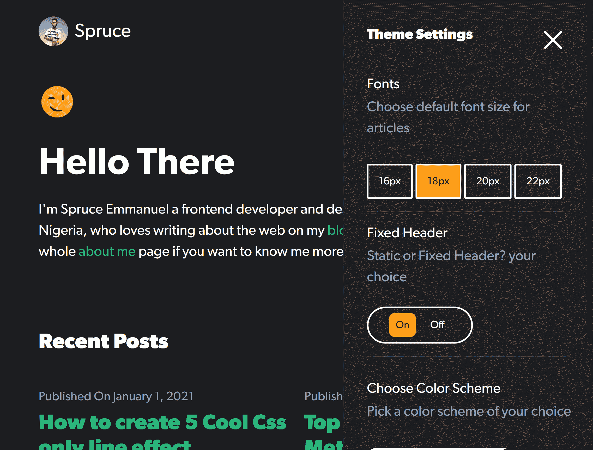

# 如何创建一个主题化的静态网站

> 原文：<https://www.freecodecamp.org/news/design-a-themeable-static-website/>

不久前，我想为我的个人网站创建一个黑色主题。所以我做了一些点击，找出最合适的和**干净**的方式来做这件事。

我读了 Max Bock 关于创建自定义主题的文章，他非常清楚地解释了这个过程。他也真的变得超级专业(有十种不同的配色方案)。

但对我来说，我想要更多。我希望用户能够改变配色方案，以提供不同的选项。

我还希望他们能够改变字体大小。这是因为我在我的网站上有一个固定的标题，这很好，但在小型移动设备上，它占据了很大的空间——对 UX 设计来说不是很好，对吗？所以我也给了用户关闭固定标题的能力。



Spruce.com.ng Theme-able static site

你可以在我的个人网站[spruce.com.ng](https://spruce.com.ng)上找到现场预览。你也可以把源代码[复制到这里](#copy-code)来节省你一些阅读时间。

## 我想做的是

1.  询问用户他们喜欢的配色方案、字体大小和标题类型(固定或静态)
2.  收集用户选择
3.  将它们保存在本地存储中
4.  如果用户切换标签并返回，如果他们关闭浏览器并在一周或一个月后返回，则从本地存储中获取它们，并在页面重新加载时立即向用户显示它们，直到他们清空浏览器存储

## 我是如何创造主题的

在 11ty(我使用的静态站点生成器)中，你可以在`_data`文件夹中创建一个 JSON 文件。您可以在模板中全局访问数据(Jekyll 也是这样做的)。很可能你首选的静态站点生成器(SSG)也能做到这一点。

```
_data/themes.json file

[
    {
        "id": "default",
        "colors": {
            "text": "#222126",
            "text-dark": "#777;",
            "border": "rgba(0,0,0,.1)",
            "primary": "#665df5",
            "secondary": "#6ad1e0",
            "primary-dark": "#382cf1",
            "bg": "#ffffff",
            "bg-alt": "#f8f8f8",
            "overlay": "rgba(255, 255, 255, .4)"
        }
                }, 
    ... other color schemes
] 
```

## 如何生成 CSS

要使用这个数据文件，创建一个名为 **`theme.css.liquid`** 的文件，并给它一个永久链接，你希望 CSS 文件输出到这里。

```
css/theme.css.liquid file
---
permalink: /css/theme.css
---
// when no theme is selected
// use default theme
:root {
    --text: {{ themes[0].colors.text }};
    --text-dark: {{ themes[0].colors.text-dark }};
    --border: {{ themes[0].colors.border }};
    --primary: {{ themes[0].colors.primary }};
    --secondary: {{ themes[0].colors.secondary }};
    --primary-dark: {{ themes[0].colors.primary-dark }};
    --bg: {{ themes[0].colors.bg }};
    --bg-alt: {{ themes[0].colors.bg-alt }};
}  
// if user preferred color scheme is dark
// use the dark theme

@media(prefers-color-scheme: dark) {
    :root {
    --text: {{ themes[1].colors.text }};
    --text-dark: {{ themes[1].colors.text-dark }};
    --border: {{ themes[1].colors.border }};
    --primary: {{ themes[1].colors.primary }};
    --secondary: {{ themes[1].colors.secondary }};
    --primary-dark: {{ themes[1].colors.primary-dark }};
    --bg: {{ themes[1].colors.bg }};
    --bg-alt: {{ themes[1].colors.bg-alt }};
    }
}
// generate the theme css from the data file
// here we use a for loop
// to iterate over all the themes in our _data/themes.json
// and output them as plain css


 [data-theme="{{ theme.id }}"] {
    --text: {{ theme.colors.text }};
    --text-dark: {{ theme.colors.text-dark }};
    --border: {{ theme.colors.border }};
    --primary: {{ theme.colors.primary }};
    --secondary: {{ theme.colors.secondary }};
    --primary-dark: {{ theme.colors.primary-dark }};
    --bg: {{ theme.colors.bg }};
    --bg-alt: {{ theme.colors.bg-alt }};
 }
 
```

请注意，我使用了 **themes[0].colors.text** ，因为我的默认主题是列表中的第一个。它的指数为 0，所以我的黑暗主题的指数为 1。

在 **Jekyll** 中，你可以在 CSS 中输出液体，只需在文件顶部添加空的前端物质。

```
css/theme.css file
---
---

// your liquid in css goes here 
```

我确信你最喜欢的静态站点生成器提供了一种类似的方式来输出 CSS 文件中的液体。如果你只是写普通的 HTML 和 CSS 而没有 SSG，你也可以手工编码所有这些。

## 如何在你的网站中使用 CSS

如果您正在阅读这篇文章，那么我假设您已经知道如何使用 CSS 自定义属性。所以我不会在这里深入探讨。

```
// css custom properties are declared using the keyword **var**
// color: var(--text);
body {
    background: var(--bg);
    color: var(--text);
}
h1,h2 {
    color: var(--text-dark)
}
// i also had default font-size and margin-top properties set
// i added this to the :root in css
:root {
    --font-size: 18px;
    --position: fixed;
    --top-margin: 96px;
} 
```

你只需要把你网站上的每一点颜色都改成你生成的自定义属性。

## 如何生成 HTML

现在让我们提供一个 UI，允许用户更改我们站点的字体大小、标题类型和配色方案。我的有点简单，但你可以更进一步。我在这里只是解释一下概念。

```
theme.html file
// create the font buttons
// I gave each button a value
// I want to get the value and save it in local storage 

<section class="theme-section">
    <div class="theme-btn-wrapper">
        <button class="btn btn--small btn--border js-font-btn" value="16">16px</button>
        <button class="btn btn--small btn--border js-font-btn" value="18">18px</button>
        <button class="btn btn--small btn--border js-font-btn" value="20">20px</button>
        <button class="btn btn--small btn--border js-font-btn" value="22">22px</button>
    </div>
</section>

// Create the toggle button
// To turn On & Off
// The fixed header
// The **sr-only** is used to hide the text visually 
// while keeping accessibilty in mind
// note the **role="switch"** nd aria-checked
// they are what turns the button to a On and Off switch
<div class="check-wrapper">
    <span id="btn-label" class="sr-only">Fixed or static header</span>
   <button role="switch" type="button" aria-checked="true" aria-labelledby="btn-label" class="js-theme-toggle btn btn--border btn--rounded btn--toggle">
       <span>On</span>
       <span>Off</span>
   </button>
</div> 
```

这差不多就是我的用例的 HTML。同样，如果您愿意的话，您可以做更多的事情，并且还涉及到一些 CSS 样式(在我们的例子中会被忽略)。

## 有趣的部分:如何创建 JavaScript

```
/assets/js/theme.js file
class CustomTheme {
    constructor() {
        // part A: check if localStorage works
        this.islocalStorage = function() {
            try {
                localStorage.setItem("test", "testing");
                localStorage.removeItem("test");
                return true;
            } catch (error) {
                return false
            }

        };
        // part B: Get the value from the buttons
        this.schemeBtns = document.querySelectorAll('.js-theme-color');
        this.schemeBtns.forEach((btn) => {
            const btnVal = btn.value;
            btn.addEventListener('click', () => this.themeScheme(btnVal))
        });

        this.fontBtns = document.querySelectorAll('.js-font-btn');
        this.fontBtns.forEach((btn) => {
            const btnVal = btn.value;
            const btnTag = btn;
            btn.addEventListener('click', () => this.themeFont(btnVal, btnTag))
        });

        // part C: get the html button element
        this.switchBtn = document.querySelector('.js-theme-toggle');
        const clicked = this.switchBtn;
        this.switchBtn.addEventListener('click', () => this.themePosition(clicked))
    }

    // part D: Save the data in localStorage
    themeScheme(btnVal) {
        document.documentElement.setAttribute('data-theme', btnVal);
        if (this.islocalStorage) {
            localStorage.setItem('theme-name', btnVal);
        }
    };

    themeFont(btnVal,btnTag) {
        document.documentElement.style.setProperty('--font-size', `${btnVal}px`);
        if (this.islocalStorage) {
            localStorage.setItem('font-size', btnVal);
        }
        ;
        if (btnVal == localStorage.getItem('font-size')) {
            removeActive();
            btnTag.classList.add('active');
    }
};

    themePosition(clicked) {
    if (clicked.getAttribute('aria-checked') == 'true') {
        clicked.setAttribute('aria-checked', 'false');
        document.documentElement.style.setProperty('--position', 'static');
        document.documentElement.style.setProperty('--top-margin', '0px');
        if (this.islocalStorage) {
            localStorage.setItem('position', 'static');
        }

    } else {
        clicked.setAttribute('aria-checked', 'true');
        document.documentElement.style.setProperty('--position', 'fixed');
        document.documentElement.style.setProperty('--top-margin', '96px');
        if (this.islocalStorage) {
            localStorage.setItem('position', 'fixed');
        }
    }

    }
}

function removeActive() {
    const btns = document.querySelectorAll('.js-font-btn');
    btns.forEach((btn) => {
        btn.classList.remove('active');
    })
}

// part E: Only use our class if css custom properties are supported
if (window.CSS && CSS.supports('color', 'var(--i-support')) {
    new CustomTheme()
};

// part E: Add an active class to selected font size button

window.addEventListener('load', () => {
    const fontBtns = document.querySelectorAll('.js-font-btn');
    fontBtns.forEach((btn) => {
        const btnVal = btn.value;
        const btnTag = btn;
        if (btnVal == localStorage.getItem('font-size')) {
            btnTag.classList.add('active');
    }
    });   
}) 
```

我知道这是一大块 JavaScript 代码，但它基本上只做几件事:

*   它收集并检查是否支持本地存储
*   然后，它将数据保存在本地存储中

还要注意，我使用了 **Javascript 类**，但是您也可以使用函数。

### 正在检查本地存储

现在很多浏览器都支持 localStorage，但是为什么我们还需要检查呢？

一些用户可能正在以**匿名模式(私人浏览模式)**浏览您的网站。有时 localStorage 在默认情况下是关闭的，所以它不会在用户设备上保存任何内容。

因此，我们可以检查浏览器是否支持它，而不是直接保存它，有时会在不支持它的浏览器上出错。如果是的话，很好——如果不是的话，我们也很酷。

现在，如果你注意到，一切似乎工作得很好。但是，如果你改变了主题或字体大小，并重新加载你的浏览器，一切都会恢复到默认状态。这是因为我们还没有使用存储在 **localStorage** 中的数据

因此，继续将这段代码添加到任何 CSS 文件之前的头文件顶部。我们这样做是为了消除你重新加载浏览器时出现的闪光。

```
<script>
    const scheme = localStorage.getItem('theme-name');
      document.documentElement.setAttribute('data-theme', scheme);

      const fontSize = localStorage.getItem('font-size');
    document.documentElement.style.setProperty('--font-size',  `${fontSize}px`);

    const position = localStorage.getItem('position');
    if (position == 'fixed') {
        document.documentElement.style.setProperty('--position', 'fixed');
        document.documentElement.style.setProperty('--top-margin', '96px');

    } else {
        document.documentElement.style.setProperty('--position', 'static');
        document.documentElement.style.setProperty('--top-margin', '0px');

    }    

  </script> 
```

## 包扎

就是这样！您现在有了一个简单的、可定制的静态站点。

本指南的主要目的是向您展示创建用户可定制网站的无限可能性。所以，继续玩吧——你可以做很多事情，比如:

1.  根据用户的选择向他们显示特定的内容
2.  基于用户的访问显示通知消息
3.  通过根据用户选择向用户显示广告，以最不烦人的方式显示广告

你可以做这些事情，还有更多我们的 SSG。想象一下无限的可能性。

不太喜欢辅导？这里可以复制完整的源代码[。](https://spruce.com.ng/blog/on-designing-a-themeable-static-website)