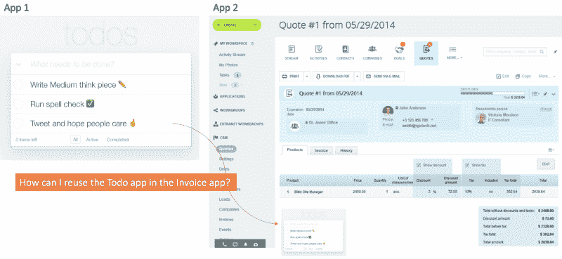

# 设计可重用的 React 组件

> 原文：<https://www.freecodecamp.org/news/designing-reusable-react-components-1cbeb897b048/>

#### 关于 React 应用程序中的重用，乐高可以教给我们什么

React 是一个组件库。因此 React 可以很容易地将用户界面分解成可组合的部分。问题是，[这些片段应该有多细](http://sethgodin.typepad.com/seths_blog/2017/12/granularity.html)？

让我们考虑一个我在[的前一篇文章](https://medium.freecodecamp.org/reusable-web-application-strategies-d51517ea68c8)中探索的具体例子。

假设您的团队刚刚部署了一个内置在 React 中的 ToDo 应用程序。一个月后，贵公司的另一个团队希望在他们的 invoice 应用程序中运行您的 ToDo 应用程序，该应用程序也内置在 React 中。

所以现在你需要在两个地方运行你的 ToDo 应用程序:

1.  单独地
2.  嵌入发票应用程序

最好的处理方式是什么？？



要在多个地点运行 React 应用程序，您有三种选择:

1.  **iframe** —通过< iframe >将 todo 应用嵌入发票应用。
2.  **可重复使用的应用组件** —通过 npm 共享整个 todo 应用。
3.  **可重用 UI 组件** —通过 npm 共享 todo 应用的标记。

让我们讨论一下每种方法的优点。

### 方法 1: iFrame

最简单和最明显的方法是使用一个 [iframe](https://developer.mozilla.org/en-US/docs/Web/HTML/Element/iframe) 将 ToDo 应用程序框架化到 invoice 应用程序中。

但是会导致多种问题:

1.  如果这两个应用程序显示相同的数据，您可能会面临它们不同步的风险。
2.  如果这两个应用程序使用相同的数据，您最终会进行多余的 API 调用来获取相同的数据。
3.  您不能自定 iframed 应用程序的行为。
4.  如果不同的团队拥有 framed in 应用程序，当他们推向生产时，你会立即受到影响。

底线:步行。避免 iframes。


Nope.

### 方法 2:可重用的应用程序组件

通过 npm 而不是 iframe 共享你的应用避免了上面的问题#4，但是其他问题仍然存在。API、auth 和 behavior 都是内置的。所以我也不建议通过 npm 分享完整应用。粒度级别太高，因此用户体验受到影响。


Like Lego blocks, reusable React components should be granular and composable.

### 方法 3:可重用的 UI 组件

我推荐使用两个灵活的构建块的更细粒度的方法:

1.  “哑”的 React 组件(只是 UI。内部没有 API 调用。)
2.  API 包装

“哑”React 组件是可配置的、非终结的和可组合的。它们是可重用的用户界面。当使用这样的“哑”组件时，您可以自由地提供相关数据或指定应用程序应该进行的 API 调用。

然而，如果您要构建“哑”组件，您需要为多个应用程序连接相同的 API 调用。这就是 API 包装器派上用场的地方。什么是 API 包装器？这是一个 JavaScript 文件，其中包含了很多对 API 进行 HTTP 调用的函数。我的团队创建 API 包装器。我们在幕后使用 [Axios](https://github.com/axios/axios) 进行 HTTP 调用。

假设您有一个用户 API。下面是创建用户 API 包装器的方法:

1.  用 getUserById、saveUser 等公共函数创建一个 JS 文件。每个函数都接受相关参数，并使用 Axios/Fetch 对您的 API 进行 HTTP 调用。
2.  将包装器作为名为 userApi 的 npm 包共享。

这里有一个例子。

```
/* This API wrapper is useful because it:
   1\. Centralizes our Axios default configuration.
   2\. Abstracts away the logic for determining the baseURL.
   3\. Provides a clear, easily consumable list of JavaScript functions
      for interacting with the API. This keeps API calls short and consistent. 
*/
import axios from 'axios';

let api = null;

function getInitializedApi() {
  if (api) return api; // return initialized api if already initialized.
  return (api = axios.create({
    baseURL: getBaseUrl(),
    responseType: 'json',
    withCredentials: true
  }));
}

// Helper functions
function getBaseUrl() {
  // Insert logic here to get the baseURL by either:
  // 1\. Sniffing the URL to determine the environment we're running in.
  // 2\. Looking for an environment variable as part of the build process.
}

function get(url) {
  return getInitializedApi().get(url);
}

function post(url, data) {
  return getInitializedApi().post(url, data);
}

// Public functions
// Note how short these are due to the centralized config and helpers above. ?
export function getUserById(id) {
  return get(`user/${id}`);
}

export function saveUser(user) {
  return post(`user/${user.id}`, {user: user});
}
```

在我的团队中，我们在 npm 上将 React 组件和 API 包装器作为[私有包共享，但是](https://www.npmjs.com/pricing) [Artifactory](https://jfrog.com/artifactory/) 是一个不错的选择。

这些乐高积木为我们用可重复使用的积木快速构建新的解决方案奠定了基础。

> 高度可组合的系统提供了可以以各种组合来选择和组装的组件，以满足特定的用户需求。— [维基百科](https://en.wikipedia.org/wiki/Composability)

所以理想情况下，你的“哑”可重用 UI 组件由其他可重用组件组成，也在 npm 上共享！

有了发布到 npm 的可重用 React 组件和 API 包装器，构建一些令人敬畏的东西就变得轻而易举了。

就像把乐高积木拼在一起一样。？

[https://www.youtube.com/embed/Ki2C05my2K4?feature=oembed](https://www.youtube.com/embed/Ki2C05my2K4?feature=oembed)

我在这里更详细地探讨了上述方法的优点和缺点。我最近发表了一个关于[在 Pluralsight](http://bit.ly/legoreactps) 上创建可重用的 React 组件库的综合课程。？

有你喜欢的不同方法吗？通过评论插话。

### 想了解 React 的更多信息吗？⚛️

我已经在 Pluralsight 上创作了[多个 React 和 JavaScript 课程](http://bit.ly/psauthorpageimmutablepost)([免费试用](http://bit.ly/pstrialimmutablepost))。


[Cory House](https://twitter.com/housecor) 是关于 JavaScript、React、clean code、[多门课程的作者。NET，以及 Pluralsight](http://pluralsight.com/author/cory-house) 上的更多内容。他是 reactjsconsulting.com[的首席顾问，软件架构师，微软 MVP，在前端开发实践方面培训国际软件开发人员。Cory 在 Twitter 上以](http://www.reactjsconsulting.com) [@housecor](http://www.twitter.com/housecor) 的身份发关于 JavaScript 和前端开发的推文。