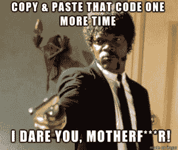

# 让你的 Java 代码闻起来又好又新鲜

> 原文：<https://www.freecodecamp.org/news/do-not-allow-bad-smells-in-your-java-code-4e8ad244393/>

马可·马森齐奥

# 让你的 Java 代码闻起来又好又新鲜


几年前，我加入了一家初创公司，从事最初由一个离岸团队构建的云企业服务。

所选择的技术(REST、Java、MongoDB)实际上是手头问题的有效技术选择。糟糕的是，他们随后用一个膨胀的(和不可管理的)数据模式和一个更糟糕的 Java 实现犯了一个惊人的错误。

最有趣的部分是，他们真的相信 Mongo 的“无模式”主张意味着不需要仔细设计数据模型、仔细考虑索引以及考虑如何访问数据。

在这篇文章中，我想剖析一个特定的 Java 类发出的许多“气味”(参见 Martin Fowler 的[书](http://amzn.to/2a717N4))，如何避免这种气味，以及遇到的许多反模式。

我的希望是，通过阅读这篇文章，你将避免犯同样的错误，像我这样的人也不会被要求过来修复你那讨厌的代码！


#### 第一个味道:没有风格

我以前曾经大谈遵循适当的(并且被广泛接受的)代码风格的必要性。简而言之:

*   加入团队的新开发人员将有一个不太陡峭的学习曲线。
*   自动化工具将能够更好地提供见解。
*   琐碎的、可避免的错误将很容易被发现。

是的，你的代码看起来会更好，你的自尊也会提高。当你的代码看起来像是用键盘敲打穴居人俱乐部写的时候，你很难让人们相信你卓越的洞察力。


Great software developers are like talented craftsmen.

以下是“键盘穴居人”的一些特征:

*   空格使用不一致(有时在括号前，有时在括号后和运算符周围，或者根本不使用空格)
*   空行的使用不一致:有时随机一行，有时两行或更多，然后一行也没有
*   不考虑行长度(许多行超过 100 列，有几行超过 200 列，还有一行 257 列，打破了记录)
*   没有使用 Java 7 的“菱形模式”和一些随机使用的 *raw* 集合
*   与其真正含义没有多大关系的变量名
*   常量和硬编码字符串的使用不一致——有时**相同的**硬编码字符串在几行代码中重复多次——显然是复制粘贴的结果

等等，等等…

以下是一些修复代码风格的技巧:

*   选择一个好的、广为人知的风格指南并坚持下去。更好的是，让您的 IDE 自动执行编码风格(Eclipse 和 IntelliJ 都非常擅长这一点)。
*   如果您选择的编程语言支持它，可以考虑使用自动化工具来找出代码风格的违规之处(比如 pylint、jslint)。更好的是，**让风格检查成为您的自动化 CI 构建的一部分**(并防止提交，直到那些通过)。
*   在空格、空行和行长度的使用上保持一致。您永远不知道什么时候项目范围的、正则表达式驱动的搜索和替换是必要的。
*   永远不要使用*原始*集合。Java 泛型的出现是有原因的。这一点应该有自己的位置。我会在适当的时候抽出时间来做这件事。同时，请阅读 [Bloch 的优秀有效 Java](http://amzn.to/2a70WkJ) 。
*   想想那个可怜的人吧，他将不得不修改你那讨厌的代码。几个月后，你甚至可能会成为一个人！

#### 第二种味道:不可测试的代码

我无法告诉你有多少次我发誓我的代码是没有错误的，但还是写了单元测试。这救了我很多次，一点都不好笑。

各位，对你们的代码进行单元测试。去做吧。

首先，如果你希望你的代码被测试，那么你的代码应该是可测试的。

这里有一个不要做什么的例子:实现一个类来服务一个特定的 API 调用——响应一个客户端查询——它将服务一个非常复杂的对象，具有深度嵌套的子对象，所有这些都表现在业务逻辑和 UI 相关数据的混合中。

当返回这样一个复杂的对象时，您会希望在几种不同的场景下测试它，并确保返回的对象符合 API *记录的*规范。

除了在这个特殊的现实案例中，实际上没有记录在案的 API。事实上，不仅**没有单元测试，**而且这个类是不可测试的(可能现在仍然如此)。

我这么说是什么意思？好吧，看看这个方法:

```
public static Map<String, Object> getSomeView(    Map<String, Object> queryParams) {  List<Map<String,Object>> results = SomeSearch.find(queryParams);  ...}
```

正如您所看到的，这个方法(它返回一个值为 Objects 的 Map 离非类型化仅一步之遥)是**静态的** —正如第一个被调用的*方法*一样，它最终将对 MongoDB 执行查询。

这使得模拟调用、数据库查询或构建一组数据驱动的测试变得非常困难，而这些测试将使我们能够在几种不同的场景下测试方法中的数据转换和视图生成逻辑。

今天有一个 PowerMockito 可以解决其中的一些问题，但是这样做非常费力而且容易出错。根据我的经验，模拟静态方法需要 10:1 的模拟代码行与实际测试代码行的比例。

同样值得注意的是 *queryParams* 几乎可以是任何东西。在这种情况下，它是一组分页/排序选项。不过，您可能发现这一点的唯一方法是在调试模式下运行实际的服务器，然后从客户端执行 API 调用，看看另一端出现了什么。

因为，是的，你猜对了:绝对没有 javadoc 来解释这个方法做什么。

相反，考虑一下，如果您有类似如下的代码:

```
@InjectQueryAdapter query;...public Map<String, ?> getSomeView(boolean sort, int skip, int limit) {    List<Map<String,?>> results = query.find(sort, skip, limit);    ...
```

首先，您可以模拟*查询*对象，并在测试运行期间返回您想要的任何内容。其次，从它们的名字就可以清楚的看出各个参数是什么。这也限制了需要测试的可能排列。例如:如果*排序*为*真*，那么返回的结果是否排序？如果*极限*为 1，你实际上只得到**一个**结果吗？诸如此类。

但最重要的是，因为调用的方法都不是静态的，所以构建一个易于推理的测试上下文要容易得多。

最后，如果 *QueryAdapter* 是一个 Java 接口，您可以在运行时交换不同的实现(可能由配置驱动)，并且使用和测试它的代码仍然完全有效。

#### 外卖食品

*   尽可能使用[依赖注入](http://docs.spring.io/spring/docs/current/spring-framework-reference/html/beans.html) (DI)。 [Spring](http://docs.spring.io/spring/docs/current/spring-framework-reference/html/beans.html) 或 Guice 是真正有效的框架，对于保持代码整洁、响应变化和可测试至关重要。
*   尽可能地避免静态方法，除非你绝对必须这么做**。**它们让你的代码很难测试，也很难模仿。它们还会使您的客户端(将使用您的类/方法的代码)变得非常脆弱，同样不可测试。
*   Java 是一种强类型语言。这是有充分理由的。让编译器和 JVM 去跑腿，找出你(和其他人)的错误。
*   **避免到处使用字符串和对象**作为*穷人的*动态语言。如果你真的不能为你的业务实体设计一个数据对象模型，你应该考虑一个真正的动态语言 (Python 是一个很好的选择)。
*   记录你的代码。确保所有公共方法都有足够的 javadoc 供他人理解和使用。还要确保您的类的 javadoc 清楚地解释了该类是做什么的，如何使用它，以及正确(也可能不正确)用法的例子。最重要的是，记录你的 API，方法期望接收什么，以及它们应该返回什么。

最后一点特别重要:将单元测试也作为一种演示代码的 API 应该如何使用(以及不应该如何使用)的方法。

#### 第三种味道:令人困惑的代码

我花了一个小时的大部分时间来逆向工程下面的方法。然后我把它作为“Java 难题”传给了我的同事，他们的猜测也非常混乱。

为了保密和避免尴尬，我对一些代码进行了“模糊处理”,但是相信我,*模糊处理*确实让这个版本的**没有原来的**模糊:

```
// Much as it pains me, I've left the code style (or lack thereof) untouched// PLEASE DON'T DO THIS AT HOMEprivate static String getSomething(boolean isOnRoute,         List<Map<String,Object>> trip,        String primarySomething, String id){    boolean somethingKnown = isOnRoute;    if(!somethingKnown && trip!=null){        for(Map<String,Object> segment: trip){            Map<String,Object> line = (Map<String, Object>) thisLeg.get(Constants.LINE);            if(line!=null){                String something = (String) carrierLane.get(Constants.SOMETHING);                LOG.debug("Line something: "+something);                if(primarySomething.equals(something)){                    somethingKnown = true;                    break;                }            }        }    }    if(somethingKnown){        return primarySomething;    }    LOG.debug("Unknown something:: isOnRoute:'" + isOnRoute + "' ; primarySomething:'" +            primarySomething + "' ; id:'" + id + "'");    return null;}
```

把你从痛苦中解救出来，这个方法所做的就是返回这个值( *primarySomething* ),如果这个行程*是 Route 的话，这个值就是最初赋予它的。*如果没有，它会告诉你，然后返回 null——让我们暂时忽略这样一个事实:它要求调用者传入 *id* ,只是为了在调试语句中使用它。

此外，请注意布尔变量( *somethingKnown* )的不必要使用，只是为了在 break 情况下使用它，然后进入 return 语句。这里还有很多其他的问题。例如，为什么把一个表示旅行是否“在路上”的标志的值赋给一个表示那个难以捉摸的*东西*是否被找到的标志？

最后，我们发现这种方法完全没有意义，于是我们彻底删除了它。

虽然听起来很悲伤，但在那堆垃圾上按下 *DEL* 键是我一天中的高潮。


以下是一些避免混淆代码的提示:

*   尽量让代码的读者清楚地理解你的方法的意图。遵循商定的命名约定、清晰的参数列表、清晰的算法实现，并帮助您的同事也这样做。
*   即使这样做，**也总是添加一个 Javadoc** 来解释意图是什么，参数应该是什么，以及预期的结果应该是什么(包括可能的副作用)。
*   避免会使其他开发人员难以理解代码逻辑的快捷方式。
*   并且，看在上帝的份上，避免连接字符串。 *String.format()* 和[slf4j字符串组合模式的存在是有原因的:](http://www.slf4j.org/)

```
// Log4J:LOG.debug(String.format(“The result is: %d”, result)); 
```

```
// logback or slf4j: this is more desirable, as you won't incur// the cost of building the string, unless the log level// will actually cause the log message to be emittedLOG.error(“The gizmo [{}] was in {}, but then fritzed at {}, {}”,   gizmoId, state, foo, bar)
```

#### 第四种味道:复制和粘贴代码

你还记得当你还是个孩子的时候，你被要求“找出”两张看起来相同的图片之间的区别吗？让我们玩相反的游戏。你能找出相似之处吗？

```
// Again, I've left the code style (or lack thereof) untouched// PLEASE DON'T DO THIS AT HOMEList<Map<String, Object>> originSiteEvents = null;List<Map<String, Object>> destinationSiteEvents = null;List<Map<String, Object>> inventoryEvents = null;try{    originSiteEvents = (List<Map<String, Object>>) ((Map<String, Object>) ((Map)entry.get(ModelConstants.INVENTORY)).get(ModelConstants.ORIGIN)).get(ModelConstants.EVENTS);} catch (Exception e){    //No origin events avaislable}try{    inventoryEvents = (List<Map<String, Object>>)  ((Map)entry.get(ModelConstants.INVENTORY)).get(ModelConstants.EVENTS);} catch (Exception e){    //No inventory events available}try{    destinationSiteEvents = (List<Map<String, Object>>) ((Map<String, Object>) ((Map)entry.get(ModelConstants.INVENTORY)).get(ModelConstants.DESTINATION)).get(ModelConstants.EVENTS);} catch (Exception e){    //No destination events available}if(events != null){    List<Map<String, Object>> eventListForLeg = (List<Map<String, Object>>) events;    for(int j=eventListForLeg.size()-1; j>=0; j--){        Map<String, Object> event = eventListForLeg.get(j);        if(event.get("category")!=null && event.get("category").equals("GPS")){            event.put("isLastGPSEvent", true);            break;        }    }}if(destinationSiteEvents != null){    for(int j=destinationSiteEvents.size()-1; j>=0; j--){        Map<String, Object> event = destinationSiteEvents.get(j);        if(event.get("category")!=null && event.get("category").equals("GPS")){            event.put("isLastGPSEvent", true);            return;        }    }}if(inventoryEvents != null){    for(int j=inventoryEvents.size()-1; j>=0; j--){        Map<String, Object> event = inventoryEvents.get(j);        if(event.get("category")!=null && event.get("category").equals("GPS")){            event.put("isLastGPSEvent", true);            return;        }    }}if(originSiteEvents != null){    for(int j=originSiteEvents.size()-1; j>=0; j--){        Map<String, Object> event = originSiteEvents.get(j);        if(event.get("category")!=null && event.get("category").equals("GPS")){            event.put("isLastGPSEvent", true);            return;        }    }}
```

您可能已经意识到，复制粘贴代码是对 DRY 原则(“不要重复自己”)的公然违背。更不用说，它看起来很可怕。对于任何一个对软件开发一窍不通的人来说，这也会让你看起来像一个懒惰的傻瓜。

值得一提的是，在这个类的 600 多行代码中，散布着完全相同的模式(根据字符串序列导航嵌套地图)。所以，如果你想出了一个实用的方法，就像我在不到 10 分钟的时间里拼凑出来的方法，来取代上面那个令人厌恶的方法，那是情有可原的。

```
/** * Navigates the {@literal path} in the given map and tries * to retrieve the value as a list of objects. * * <p>This is safe to use, whether the path exists or not,  * and relatively safe against {@link java.lang.ClassCastException} * errors (to the extent that this kind of code can be). * * @param map the tree-like JSON * @param path the path to the desired object * @return the list of objects, or {@literal null} if any of the *     segments does not exist */@SuppressWarnings("unchecked")public static List<Map<String, ?>> tryPath(        Map<String, ?> map, List<String> path) {    List<Map<String, ?>> result = null;    Map<String, ?> intermediateNode = map;    String tail = path.remove(path.size() - 1);    for (String node : path) {        if (intermediateNode.containsKey(node)) {            Object o =  intermediateNode.get(node);            if (o instanceof Map) {                intermediateNode = (Map<String, ?>) o;            } else {                LOG.error("Intermediate node {} cannot be " +                    "converted to a Map ({})", node, o);                return null;            }        } else {            return null;        }    }    if (intermediateNode.containsKey(tail)) {        Object maybeList = intermediateNode.get(tail);        if (maybeList instanceof List) {            return (List<Map<String, ?>>) maybeList;        }    }    return null;}
```

结果是，查找的顺序(第一次遇到时，看起来像是一个包藏在谜中的谜)现在看起来类似于:

```
List<List<String>> paths = Lists.newArrayList();paths.add(Lists.newArrayList(Lists.asList(                ModelConstants.INVENTORY, new String[] {                ModelConstants.EVENTS})));paths.add(Lists.newArrayList(Lists.asList(                ModelConstants.INVENTORY, new String[] {                ModelConstants.ORIGIN,                ModelConstants.EVENTS})));paths.add(Lists.newArrayList(Lists.asList(                ModelConstants.INVENTORY, new String[] {                ModelConstants.DESTINATION,                ModelConstants.EVENTS})));List<Map<String, ?>> events = null;for (List<String> path : paths) {    events = tryPath(entry, path);    if (events != null) {        break;    }}if (events != null) {    for (int j = events.size() - 1; j >= 0; --j) {        Map<String, Object> event = (Map<String, Object>) events.get(j);        if (event.contains("category") && Constants.GPS.equals(event.get("category"))) {            event.put(Constants.isLastGPSEvent, true);            return;        }    }}
```

这仍然不像我希望的那样干净，但我主要归咎于 Java 缺少一个类似于 Scala 的*列表*的工厂类:

```
val paths = List(List(ModelConstants.INVENTORY,                       ModelConstants.EVENTS,                 List(ModelConstants.INVENTORY,                      ModelConstants.ORIGIN,                      ModelConstants.EVENTS),                 List(ModelConstants.INVENTORY,                       ModelConstants.DESTINATION,                      ModelConstants.EVENTS))
```

还要快速注意使用 *try-catch* 块过滤掉潜在有效代码路径的反模式，并避免编写 null 和键存在检查。

通过在一个地方分解检查和类强制转换(通过适当的类型安全检查)，您可以避免在两个糟糕的选项之间进行选择，这两个选项是:到处散布相同的重复、乏味的检查，或者通过广泛撒网来屏蔽可能的错误代码。

如果您让潜在的错误情况通过，您将会非常难以找到意外错误的根本原因。

有一整篇博文是关于“吞咽”异常和错误条件的。



所以:

*   **不要复制&粘贴代码**:如果看到共性，就把共性的部分分解出来重用(在一个实用类或者一个 helper 方法中)；
*   不要通过不加选择地“吞咽”异常来逃避代码中的安全检查: *try-catch* 块应该有原因，原因应该是(名字中的赠品)*异常*。

代码在很大程度上仍然是一门手艺。对分布式计算相关问题的深刻理解，批判性推理和抽象思维的能力，以及对可扩展系统相关操作问题的理解——这些对于成为一名优秀的软件开发人员至关重要。尽管如此，掌握这门手艺仍然像在文艺复兴时期的意大利一样重要。

编写设计良好、结构清晰、文档恰当的代码——并为自己的手艺感到自豪！

如果你想取笑我的代码，就去[我的 github 库](https://github.com/massenz)，我敢肯定那里仍然有很多味道(但是，希望也有一些好代码能启发你！)

*最初发布于[codetrips.com](https://codetrips.com/2015/01/25/do-not-allow-bad-smells-in-your-code/)2015 年 1 月 25 日。*