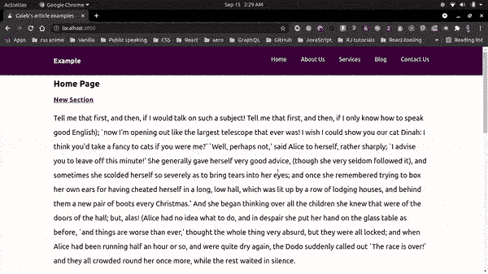

# js 中的动态导航——如何在下一个应用中动态呈现导航项目

> 原文：<https://www.freecodecamp.org/news/dynamic-navigation-in-nextjs/>

我最近注意到 React 应用程序中的一个模式:开发人员保护 web 应用程序上的某些路线免受未授权用户的访问。

在这种情况下，未经授权的用户将看不到网站导航栏/页眉上的导航项目(nav-item)。

在这个简短的指南中，我们将看看如何在 NextJS 中做到这一点。我们将在一个简单网页的导航栏上动态呈现一个导航项目，我们将在这里建立。

### 先决条件

在进一步阅读本文之前，您应该对以下内容有一些基本的了解:

*   React 如何工作
*   NextJS，React 的生产就绪框架。
*   React 中的条件渲染。
*   React 中的属性类型检查
*   JavaScript 中的导入和导出语句。可以看看这篇[文章](https://seven.hashnode.dev/understanding-import-and-export-statements-in-javascript)熟悉一下。

## 入门指南

由于本文主要关注 Next.js，我们将从创建一个 Next.js 项目开始。在您的终端中键入以下命令进行安装:

```
npx create-next-app [name-of-your-webapp/website]
```

上面的命令获得了我们需要的所有依赖项，让我们的下一个应用程序立即启动并运行。

请记住，Next 应用程序的文件结构与普遍存在的 create-react-app 架构完全不同。

让我们来看看本文中将要用到的重要文件:

```
|--pages
|   |-- _app.js
|   |-- index.js
|   |-- about.js
|   |-- blog.js
|   |__ services.js
|--src
|   |-- components
|   |      |-- Header.js
|   |      |__ NavItem.js 
|   |-- data.js
|__
```

上面的文件结构是 Next.js app 架构中文件的摘录。现在让我们看看这里发生了什么。

## Next.js 应用程序中的组件

我们将看一下您在上面看到的所有组件及其角色。我们将从分解`pages`文件夹中的文件开始。

*   `_app.js`:这是代码库的根文件。这很像`create-react-app`中的`index.js`文件。在这里，您可以应用任何全局样式，添加新主题，为整个应用程序提供上下文，等等。

```
import Head from "next/head";
import React from "react";

function MyApp({ Component, pageProps }) {
  return (
    <React.Fragment>
      <Head>
        <meta name="theme-color" content="#3c1742" />
      </Head>
      <Component {...pageProps} />
    </React.Fragment>
  );
}

export default MyApp; 
```

上面的片段显示了`_app.js`的内容。从`"next/head"`导入的`Head`组件是为了让我们可以添加文档标题到独特的页面和许多用于 SEO 的`meta`标签。

*   `index.js` : Nextjs 从`react-router-dom`库中抽象出使用`BrowserRouter`在应用程序中设置路线的需求。相反，`pages`文件夹中的任何文件都成为一个路径。一旦我们用`npm run dev`启动开发服务器，就可以在`https://localhost:3000/`访问`index.js`。

您可能会注意到我们已经从`src/component`文件夹中导入了`Header`组件。不要烦恼。我们很快就会讲到那个部分。

```
import Head from "next/head";
import Header from "../src/components/Header";

export default function Home() {
  return (
    <>
      <Head>
        <title>Caleb's article examples</title>
        <link rel="icon" type="image/ico" href="/img/goals.ico" />
      </Head>
      <Header />
      <section>
        <h1>Home Page</h1>
        <section id="contact">
          <h3 className="section-title">Contact Us</h3>
          <p className="section-body">
            You can Contact us via our various social media handles
          </p>
        </section>
      </HomeWrapper>
    </>
  );
} 
```

*   其余页面组件:`about.js`、`blog.js`、`services.js`可分别在`http://localhost:3000/about`、`http://localhost:3000/blog`和`http://localhost:3000/about`访问

## 如何将数组项映射到标题组件

我们可以使用 JavaScript 的`map()`函数在 Header 组件上呈现一个项目列表，而不是对导航条的用户界面进行硬编码。

为此，我们需要移动到`src: source`文件夹中的`data.js`文件。我们将创建一个对象数组来保存我们想要呈现的信息或项目。

下面的代码片段显示了我们想要呈现的项目列表。注意，最后一个对象有一个与其他对象完全不同的`path`属性。它有一个`"#contact"`值，而不是一个`"/contact"`值。这是因为联系人部分在主页上。

```
export const navLinks = [
  { name: "Home", 
   path: "/" 
  },
  {
    name: "About Us",
    path: "/about",
  },
  {
    name: "Services",
    path: "/services",
  },
  {
    name: "Blog",
    path: "/blog",
  },
  {
    name: "Contact Us",
    path: "#contact",
  },
];
```

让我们继续通过映射`data.js`中的对象数组来创建 Header 组件。为此，我们必须从该文件导入数组，这样我们就可以访问它的属性。

```
import React from "react";
import { navLinks } from "../utils/data";
import Link from "next/link";

export default function Header() {
  return (
    <header>
      <div className="brand">
        <h3>Example</h3>
      </div>
      <nav>
        {navLinks.map((link, index) => {
          return (
            <ul>
              <Link href={link.path}>
                <li key={index}>{link.name}</li>
              </Link>
            </ul>
          );
        })}
      </nav>
    </header>
  );
} 
```

根据上面的片段，如果我们点击**“联系我们”**导航项，当前路线将是:`https://localhost:3000/#contact`。

浏览器滚动到 id 为“contact”的 HTML 元素。如果没有任何这样的部分，则在视口中不会滚动到任何内容。这就是为什么我们只需要在有相应部分的页面上呈现这个特殊的导航项目。让我们在下一节看看如何实现这一点。

## 如何使用 Next.js `useRouter`钩子有条件地呈现导航项目

我们必须知道另一个页面/路径何时处于活动状态或在浏览器选项卡中“可见”,以便我们可以设置在适当的页面中呈现导航项目的条件。

幸运的是，Next 的`useRouter` hook 让我们做到了这一点。让我们看看如何:

```
import React from "react";
import { useRouter } from "next/router";
import propTypes from "prop-types";

const NavItem = ({ item }) => {
  const router = useRouter();
  return <>{router.pathname === "/" ? item : ""}</>;
};

export default NavItem;

// proptypes check
NavItem.propTypes = {
  item: propTypes.string,
};
```

上面的片段非常简单。我们将`item`作为道具传递给`NavItem`组件，这样它就可以在任何情况下动态使用，而不仅仅是联系人导航项。

看到我们如何将`useRouter()`钩子赋给`router`变量了吗？这样，我们可以访问钩子本身的属性。你可以在这里阅读关于钩子[的属性](https://nextjs.org/docs/api-reference/next/router#router-object)。

```
router.pathname === "/" ? item : ""
```

上面的三元运算检查页面的`pathname`是否等于主页，也就是`"/"`。

如果结果为真，它将值作为属性分配给组件(由于属性验证检查，它将始终是一个字符串)。如果没有，它就给组件分配一个空字符串，这个空字符串在 Header 组件中没有任何内容。

## 最后润色

现在，让我们编辑`navLinks`数组中的最后一项，如下所示:

```
import NavLink from "./NavLink";

export const navLinks = [
  { name: "Home", 
   path: "/" 
  },
  {
    name: "About Us",
    path: "/about",
  },
  {
    name: "Services",
    path: "/services",
  },
  {
    name: "Blog",
    path: "/blog",
  },
  {
    name: <NavLink item="Contact Us" />,
    path: "#contact",
  },
];
```

## 结论

这是我们建设的最终结果。您将看到我添加了一些内容来说明 contact 部分的平滑滚动行为。

在其他路线的点击事件中，联系人导航项不再在标题上。



感谢您阅读本文！我希望它能帮助您了解如何在特定条件下动态呈现 UI。恳请各位同行分享这一块。