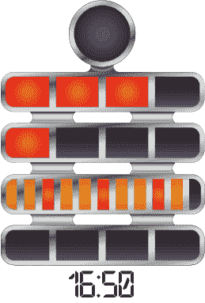

# 如何(以及为什么)在代码中嵌入领域概念

> 原文：<https://www.freecodecamp.org/news/embedding-domain-concepts-in-code/>

代码应该清楚地反映它所解决的问题，从而公开暴露问题的领域。在代码中嵌入领域概念需要思考和技巧，并且不会自动脱离 TDD。然而，这是编写易于理解的代码的必经之路。

最近，我参加了一个软件工匠聚会，我们两人一组解决一个简化的柏林时钟形。柏林钟使用一排排闪烁的灯来显示时间，你可以在下面看到(虽然在形中我们只是输出一个文本表示，一排灯都是相同的颜色)。



## 初始测试驱动的解决方案

大多数对使用 inside out TDD，有很多解决方案看起来像这样(GitHub 上有完整的[代码)。](https://github.com/ceddlyburge/berlin-clock-initial-tdd-solution/blob/master/BerlinClock.py)

```
def berlin_clock_time(julian_time):
    hours, minutes, seconds = list(map(int, julian_time.split(":")))

	return [
		seconds_row_lights(seconds % 2)
		, five_hours_row_lights(hours)
		, single_hours_row_lights(hours % 5)
		, five_minutes_row_lights(minutes)
		, single_minutes_row_lights(minutes % 5)
	]

def five_hours_row_lights(hours):
    lights_on = hours // 5
    lights_in_row = 4
    return lights_for_row("R", lights_on, lights_in_row)

# ... 
```

这种类型的解决方案很自然地脱离了从内向外应用 TDD 来解决问题。您为秒行编写一些测试，然后为五小时行编写一些测试，以此类推，然后您将它们放在一起并进行一些重构。这个解决方案确实揭示了一些领域概念:

*   有 5 行
*   有一个第二行、2 个小时行和 2 个分钟行

经过一点挖掘，更多的概念是可用的，但不是立即显而易见的。这些行由可以打开(或者可能关闭)的灯组成，并且打开的灯的数量是时间的指示。

然而，还有一些大的问题没有暴露出来。由于我还没有解释它，你可能还不知道柏林钟是如何工作的。

## 提升概念

为了改善这一点，我们可以将隐藏在帮助函数中的一些细节(比如`get_five_hours`)放在文件的顶部。这会给你带来类似下面的东西(GitHub 上有完整的[代码)，尽管缺点是它破坏了几乎所有的测试。像这样的解决方案在 GitHub 上很少见，但确实存在。](https://github.com/ceddlyburge/berlin-clock-elevated-concepts/blob/master/BerlinClock.py)

```
def berlin_clock_time(julian_time):
    hours, minutes, seconds = list(map(int, julian_time.split(":")))

	single_seconds = seconds_row_lights(seconds % 2)
    five_hours = row_lights(
		light_colour="R",
		lights_on=hours // 5,
		lights_in_row=4)
    single_hours = row_lights(
		light_colour="R",
		lights_on=hours % 5,
		lights_in_row=4)
    five_minutes = row_lights(
		light_colour="Y",
		lights_on=minutes // 5,
		lights_in_row=11)
    single_minutes = row_lights(
		light_colour="Y",
		lights_on=minutes % 5,
		lights_in_row=4)

	return [
		single_seconds,
		five_hours,
		single_hours,
		five_minutes,
		single_minutes
	]

# ... 
```

这改进了现在一目了然的概念:

*   有 5 排
*   第二行是一个特例
*   有 2 小时行和 2 分钟行
*   各行使用不同颜色的灯
*   各行有不同数量的灯

这很好，已经比大多数解决方案都要好了。然而，这些行是如何相互关联的仍然有点神秘(有 2 行显示小时和分钟，所以推测它们是关联的)。每盏灯代表的时间也不明显。

## 命名隐含的概念

目前，一些概念(如每盏灯代表的时间)隐含在代码中。使这些显式化，并给它们命名，迫使我们去理解它们并将这种理解嵌入到代码中。

为了使每盏灯所代表的时间更明确，向`row_lights`传递一个`time_per_light`值似乎是明智的。这意味着我们必须将`lights_on`的计算下推到`row_lights`。

这又使得有两种类型的行变得明显:一种与时间值的商(`\\`)相关，另一种与余数/模数(`%`)相关。如果我们看一下商的情况，我们会看到操作的第二个参数是`time_per_light`，在两种情况下都是 5(一种情况下 5 小时，另一种情况下 5 分钟)。

这允许我们像这样写这些行:

```
five_hour_row = row_lights(
	time_per_light=5,
	value=hours, 
	light_colour="R",
	lights_in_row=4) 
```

如果我们现在将注意力转向余数的情况，我们会意识到`time_per_light`总是单数(一小时或一分钟)，因为它填补了商的空白。

例如，五小时行可以表示 0、5、10、15 或 20 小时，但不表示两者之间的时间。为了表示任何一个小时，必须有另一行来表示+1、+2、+3 和+4。这意味着这一行必须正好有 4 盏灯，每盏灯必须代表 1 小时。

这意味着余数情况依赖于商的情况，大多数人将其描述为父/子关系。

有了这些知识，我们现在可以为子剩余行创建一个函数，解决方案现在看起来像这样(GitHub 上完整的[代码):](https://github.com/ceddlyburge/berlin-clock)

```
def berlin_clock_time(julian_time):
    hours, minutes, seconds = list(map(int, julian_time.split(":")))

	return [
		seconds_row_lights(
			seconds % 2),
		parent_row_lights(
			time_per_light=5,
			value=hours, 
			light_colour="R",
			lights_in_row=4),
		child_remainder_row_lights(
			parent_time_per_light=5,
			value=hours,
			light_colour="R"),
		parent_row_lights(
			time_per_light=5,
			value=minutes, 
			light_colour="Y",
			lights_in_row=11),
		child_remainder_row_lights(
			parent_time_per_light=5,
			light_colour="Y",
			value=minutes)
	]

# ... 
```

快速浏览一下这段代码就可以发现几乎所有的领域概念

*   第一行代表秒，是一个特例
*   在第二行，每个“R”灯代表 5 个小时
*   第三行显示第二行的余数
*   在第四行，每个“Y”灯代表 5 个小时
*   第五行显示第四行的余数

这需要思考，这将花费我们一些时间/金钱。但是我们在做的时候增加了对问题的理解，最重要的是我们将这些知识嵌入到了代码中。这意味着下一个阅读代码的人将不必这样做，这将节省一些时间/金钱。由于我们读代码的时间比写代码的时间多 10 倍，这可能是一项值得的努力。

嵌入这种理解也使得未来的程序员更难犯错误。例如，父/子行的概念在早期的例子中并不存在，很容易使它们不匹配。现在，这个概念是显而易见的，并且这些值大部分都是为您制定的。重构以支持新的时钟变量也更容易，例如，第一个小时行中的灯代表 6 小时。

## 你应该走多远？

我们可以做些事情来进一步发展。例如，子行的`parent_time_per_light`必须与其父行的`time_per_light`相匹配，但并没有强制这样做。对于父行，在`time_per_light`和`lights_in_row`之间也有一个关系，这也不是强制的。

然而，目前我们只需要支持一种时钟变体，所以这些可能不值得做。当代码需要更改时，我们应该进行重构，使更改变得容易(这可能很难)，然后进行简单的更改。

## 结论

在代码中嵌入领域概念需要思考和技巧，TDD 不一定能帮你做到。这比简单的解决方案花费的时间更长，但是使代码更容易理解，并且在中期内很可能节省时间。时间就是金钱，对于一个专业程序员来说，找到现在花费时间和以后节省时间的正确平衡也是一项重要的技能。