# 如何在 10 分钟内用 React setState()成为专业人士

> 原文：<https://www.freecodecamp.org/news/get-pro-with-react-setstate-in-10-minutes-d38251d1c781/>

这篇文章是针对那些已经有了第一种反应方式的人，以及作为初学者，对`setState`如何工作以及如何正确使用它有疑问的人。它还应该帮助中高级开发人员使用更干净、更抽象的方式设置状态，并让高阶函数处理和抽象状态。

只管看书，玩得开心！

所以，喝杯咖啡，继续读书吧！？

### setState()的基本概念

React 组件允许您将用户界面(UI)分割成独立的、可重用的部分，因此您可以孤立地考虑每个部分。

从概念上讲，组件就像 JavaScript 函数。它们接受任意输入(称为“props”)并返回描述屏幕上应该显示什么的 React 元素。

如果你需要给用户机会输入一些东西或者以某种方式改变组件作为道具接收的变量，你将需要`setState`。

无论您将组件声明为函数还是类，它都不能修改自己的属性。

所有的 React 组件必须像纯函数一样作用于它们的道具。这意味着函数从不试图改变它们的输入，并且总是为相同的输入返回相同的结果。

当然，应用程序用户界面是动态的，会随着时间而变化。这就是`state`被创造出来的原因。

`State`允许 React 组件随着时间的推移改变它们的输出，以响应用户动作、网络响应和其他任何事情，而不违反这条规则。

定义为类的组件有一些额外的特性。本地状态是只有类组件才有的特性。

是库提供的 API 方法，以便用户能够定义和操作状态。

### **使用 setState()时的三条经验法则**

#### **不要直接修改状态**

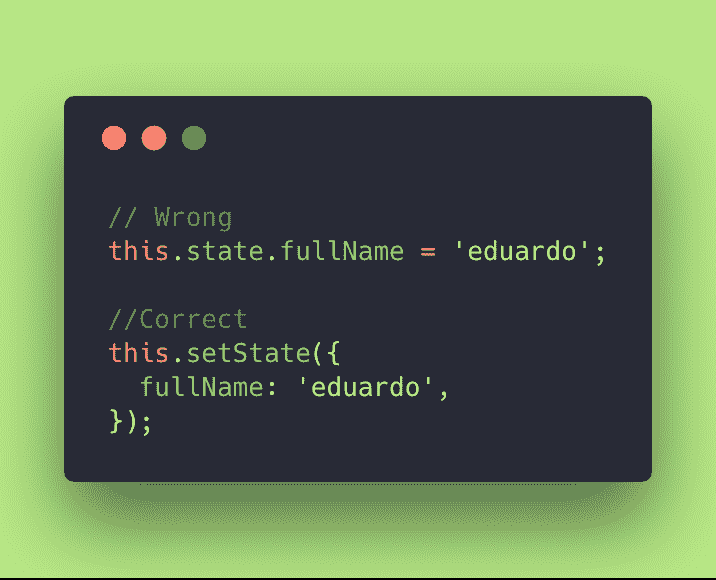

wrong and right ways of setting state

#### **状态更新可能是异步的**

React 可能会将多个`setState()`调用批处理到单个更新中以提高性能。

因为`**this.props**` 和`this.state`可能会异步更新，所以您不应该依赖它们的值来计算下一个状态。

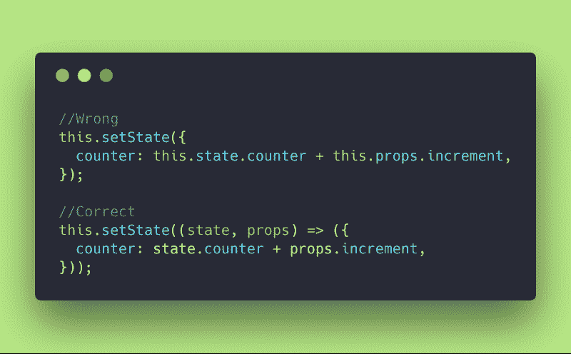

manipulate state with a functional approach

你应该总是用函数方法来做这种操作，提供`state`和`props`，并基于前者返回新的`state`。

#### **状态更新被合并**

当您调用`setState()`时，React 会将您提供的对象合并到当前的`state`中。

在下面的例子中，我们独立于其他`state`变量更新变量`dogNeedsVaccination`。

合并是浅层的，所以`this.setState({ dogNeedsVaccination: true })` 保持其他变量不变，只替换`dogNeedsVaccination`的值。

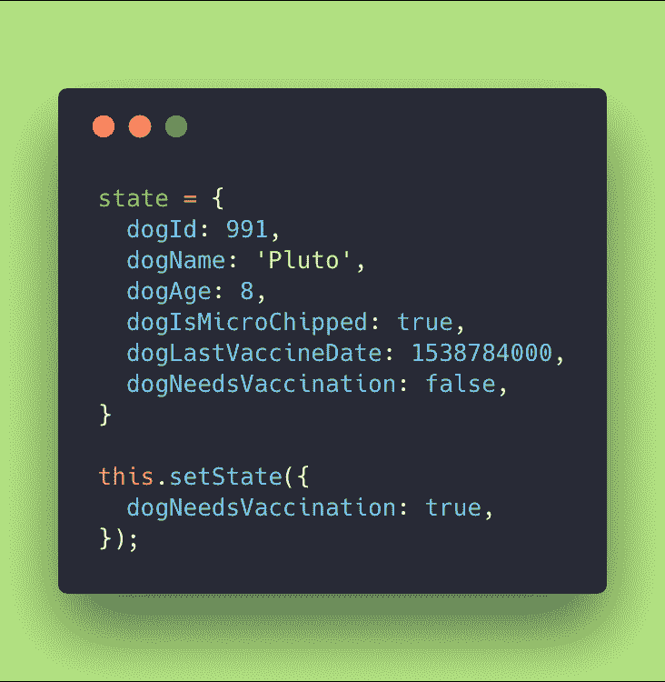

### **尊重数据流，避免陈述最大值**

**数据往下流！**父组件和子组件都无法知道某个组件是有状态的还是无状态的，他们也不应该关心它是被定义为函数还是类。

这就是为什么`state`经常被称为本地的或者封装的。除了拥有和设置它的组件之外，任何组件都不能访问它。

当你在你的组件中使用一个道具时，你破坏了渲染道具的流程。如果由于某种原因，传入你的组件的道具在父组件中发生了变化，子组件不会自动重新渲染？！

让我们看一个例子:

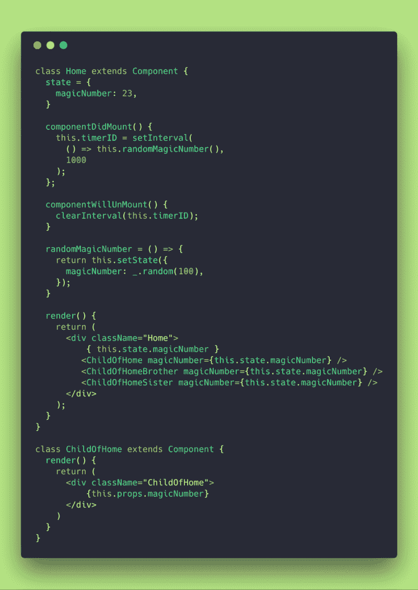

这里有一个`Home`组件，它每 1000 毫秒生成一个幻数，并将其设置到自己的`state`中。

之后，它呈现数字并调用三个`Child`组件(兄弟),这些组件将接收幻数，目的是使用三种不同的方法显示它:

#### 第一种方法

组件`ChildOfHome`尊重 React 道具级联流，考虑到目标只是显示幻数，它直接渲染接收到的`props`。

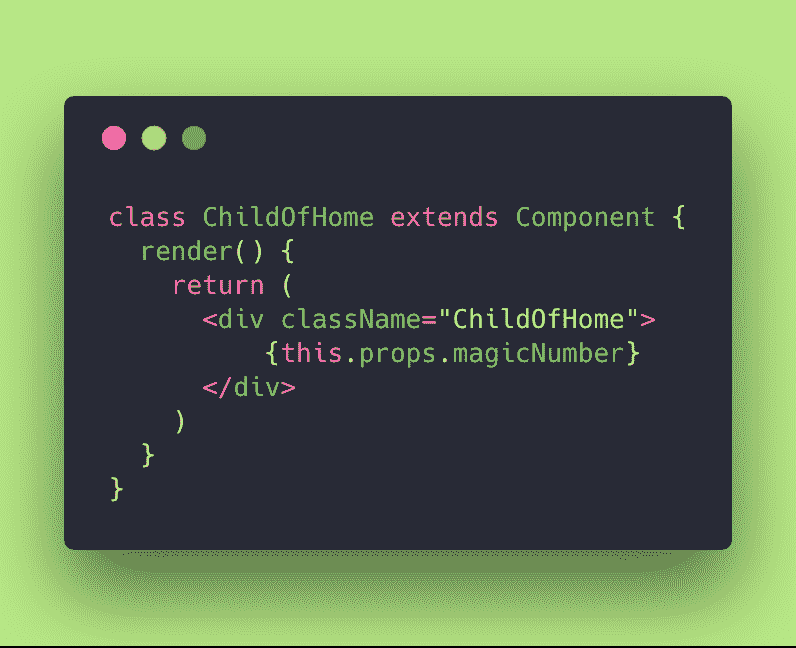

#### 第二种方法

组件`ChildOfHomeBrother`从其父组件接收`props`，并调用`componentDidMount`，将幻数设置为`state`。然后就渲染出了`state.magicNumber`。

这个例子不起作用，因为`render()`不知道`prop` 已经改变，所以它不触发组件的重新呈现。由于组件不再被重新渲染，所以`componentDidMount`不会被调用，显示也不会更新。

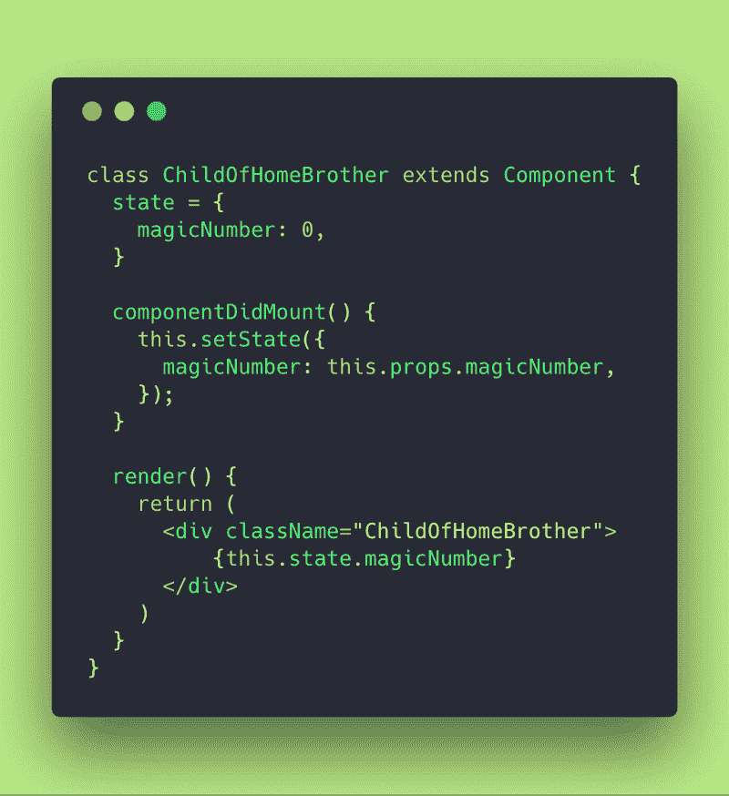

#### 第三种方法

通常当我们试图用第二种方法使它工作时，我们会认为缺少了什么。我们没有后退一步，而是继续向代码中添加东西，让它工作！

所以在第三种方法中，我们添加了`componentDidUpdate`来检查`props`中是否有变化来触发组件的重新呈现。这是不必要的，会导致不干净的代码。它还带来了性能成本，这将是我们在一个大应用程序中这样做的次数的数倍，在这个大应用程序中，我们有许多连锁组件和副作用。

这是错误的，除非你需要允许用户改变收到的属性值。

如果您不需要更改 prop 值，请始终尝试根据 React 流保持工作(第一种方法)。

你可以用我在 [Glitch](https://freezing-transport.glitch.me/) 中为你准备的这个例子来检查一个工作的网页。看一看，乐一乐？

也可以查看一下关于这篇文章的[我的报告](https://github.com/evedes/set-state-in-10-min)中的`**Home.js**`和`**HomeCodeCleaned.js**`中的代码(没有 HTML 的内容)。

### 如何设置状态

所以在这一点上，我认为是时候让我们的手脏起来了！

让我们玩一会儿`setState`并改进它！跟着我去再拿一杯咖啡吧！

让我们创建一个小表单来更新用户数据:

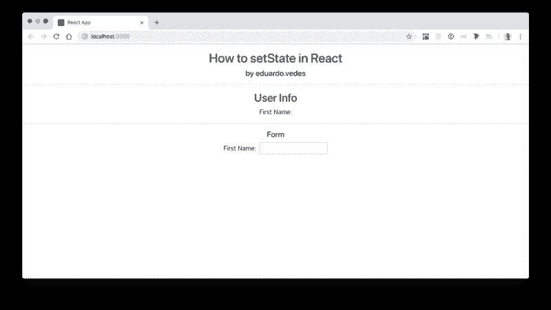

Small exercise on setState()

以上示例的代码如下:

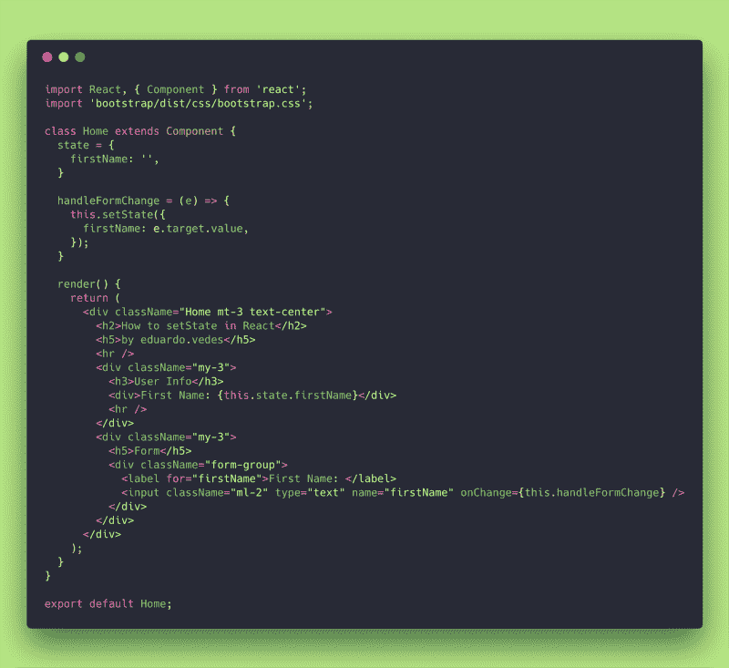

Initial Home Component

我们将`state`设置为一个对象，这没有问题，因为我们的当前状态不依赖于我们的上一个状态。

如果我们再创建一个表单字段来介绍和显示姓氏会怎么样？

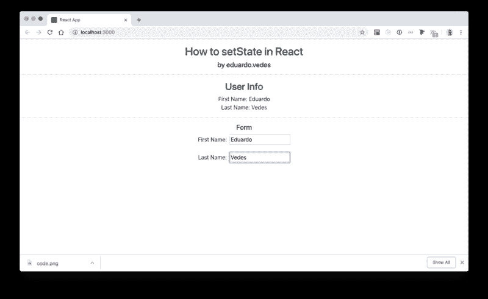

Last Name feature

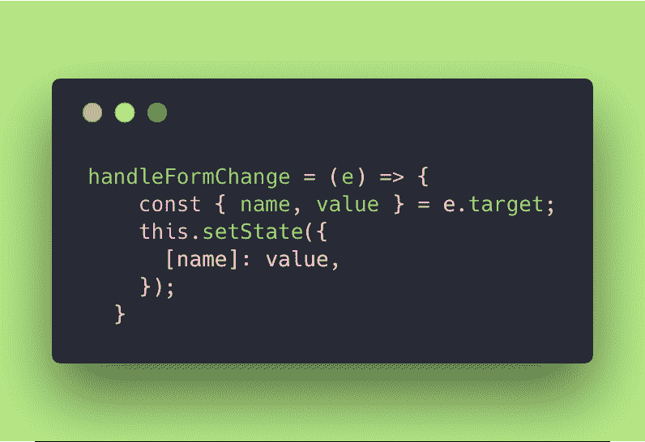

abstracted handleFormChange

不错！我们抽象了`handleFormChange`方法，以便能够处理所有的输入字段和`setState`。

如果我们添加一个切换按钮来标记数据是有效的还是无效的，并添加一个计数器来知道我们对状态做了多少更改，会怎么样？

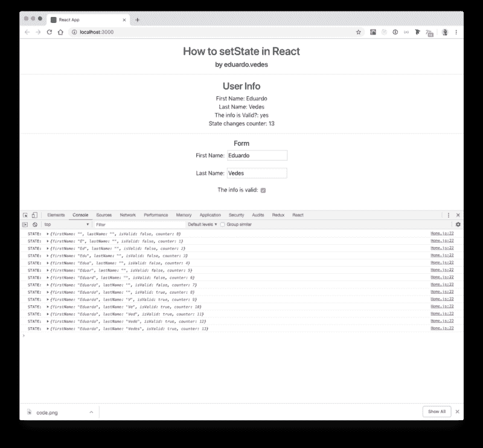

Screenshot showing the console.log of the component state

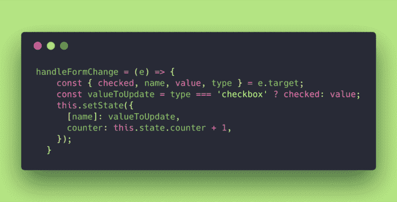

handleFormChange updated with checkbox and counter handlers

耶！我们在摇摆！我们已经抽象了很多东西！

嗯……假设我不想要一个控制`isValid`变量的复选框，而是一个简单的切换按钮。

让我们也把计数器处理程序从这个方法中分离出来。它工作得很好，但是在 React 需要批处理/分组更改的更复杂的情况下，依靠`this.state.counter`变量再增加一个并不是一个好的策略。这个值可以在你不知道的情况下改变。

我们在调用操作的瞬间使用它的一个浅层副本，在那个特定的时间点，你不知道它的值是否是你所期望的！

让我们来点功能性的吧！

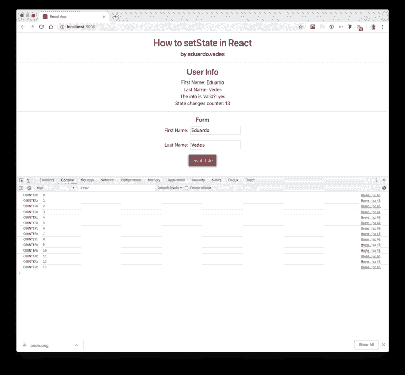

Screenshot showing the Valid/Invalid Toggle and the console.log of the state.counter variable

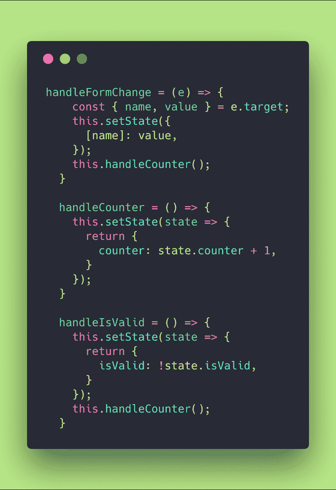

separation of the control handlers

好吧——我们已经失去了抽象，因为我们已经分离了处理程序，但这是有充分理由的！

所以此时我们保持`handleFormChange`向`setState` API 方法传递一个对象。但是`handleCounter`和`handleIsValid`方法现在起作用了，它们从获取当前状态开始，然后根据那个状态，将它改变到下一个状态。

这是改变依赖于先前状态的变量的`state`的正确方法。

如果我们想在每次发生变化的时候让`firstName`和`lastName`输入表单的`console.log()`状态发生变化，该怎么办呢？让我们试一试！

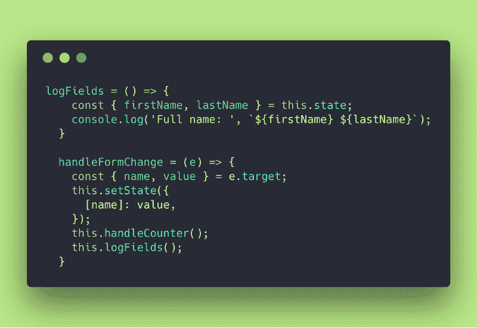

logFields() method

不错！每次`handleFormChange`发生时(这意味着发生了新的按键),就会调用`logFields()`方法，并将当前状态记录到控制台中！

让我们检查一下浏览器控制台:

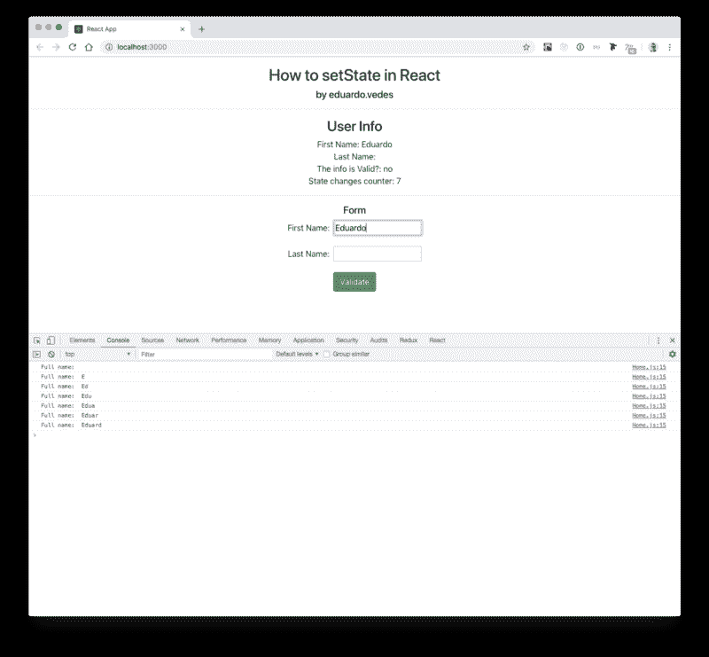

screenshot of the console.log of firstName and lastName state

等等！这里发生了什么事？控制台日志是当前表单输入之前的一个更改！为什么会这样？

#### **setState 为异步！！**

我们已经知道这一点，但现在我们用我们的眼睛看到它！那里发生了什么事？我们来看看上面的`handleFormChange`和`logFields`方法。

因此，`handleFormChange`方法接收事件名称和值，然后对该数据执行`setState`。然后它调用`handleCounter`来更新计数器信息，最后调用`logFields`方法。`logFields`方法抓取`currentState`并返回‘爱德华’而不是‘爱德华多’。

事情是:`setState`是异步的，不在当下行动。React 正在做它的工作，首先执行`logFields`方法，把`setState`留给下一个事件循环。

但是怎么才能避免这种情况呢？

嗯，`setState` API 有一个`callback`来避免这种情况:

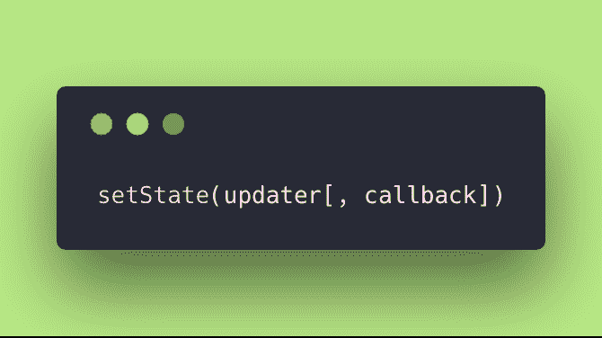

setState API method

如果我们想让`logFields()`考虑我们最近对状态所做的更改，我们需要在回调中调用它，就像这样:

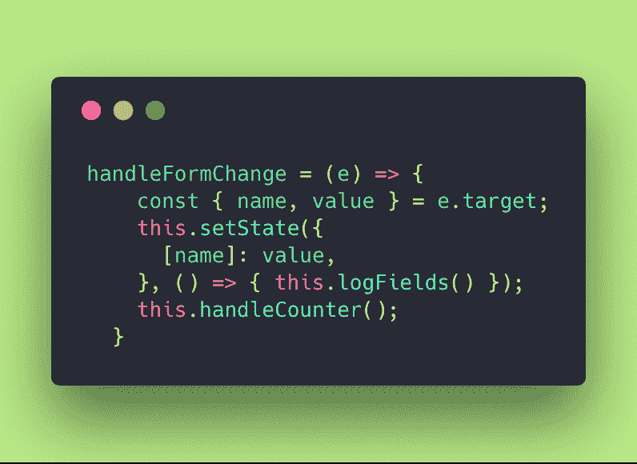

using the setState() API method callback handler

好了，现在成功了！

我们告诉 React:“嘿，React！注意，当你调用`logFields`方法时，我希望你已经更新了`state`？我信任你！”

React 说:“好的江户！我将使用`setState`来处理我通常在后院做的所有这些事情，只有当我完成这些事情时，我才会调用`logFields()`！酷男！放松点！”

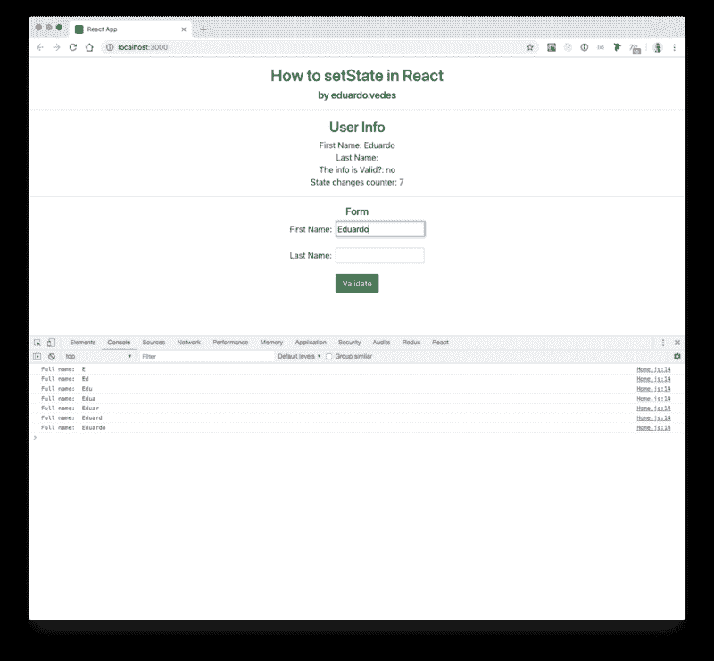

screenshot of the console.log() of fullName

事实上——成功了！

好了各位。到目前为止，我们已经处理了`setState`的主要陷阱。

你有勇气越过长城吗？喝杯咖啡，让我们尽情狂欢吧…

### 使用 setState()变得有趣

现在我们有了`handleCounter`和`handleIsValid`方法，以及用函数表示的`setState()`，我们可以用其他函数来编写状态更新了！**我李克兹作文！让我们找点乐子吧！**

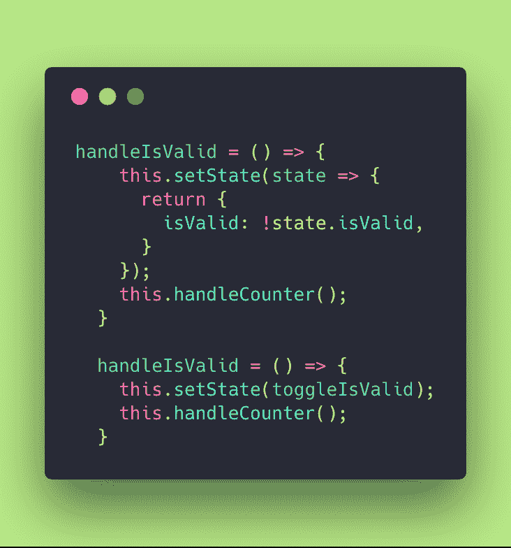

abstracting handleIsValid

我们可以将`setState`内部的逻辑带到类组件外部的函数中。姑且称之为`toggleIsValid`。☝️

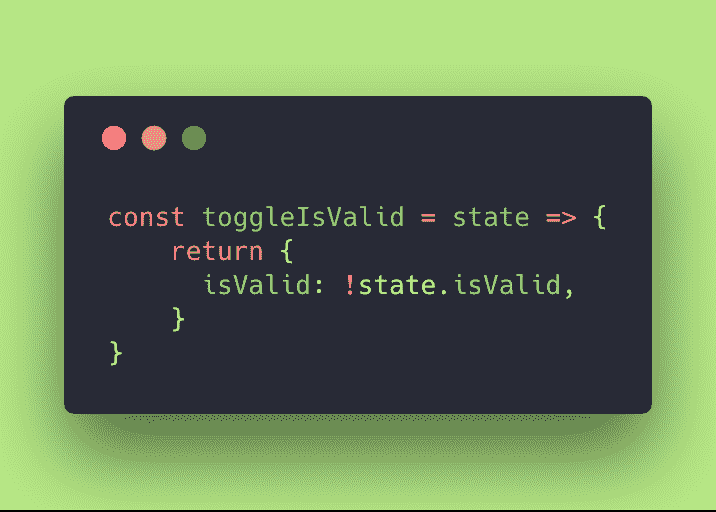

toggleIsValid Function

现在这个函数可以存在于类组件之外，在你的应用程序中的任何地方。

如果我们使用高阶函数呢？

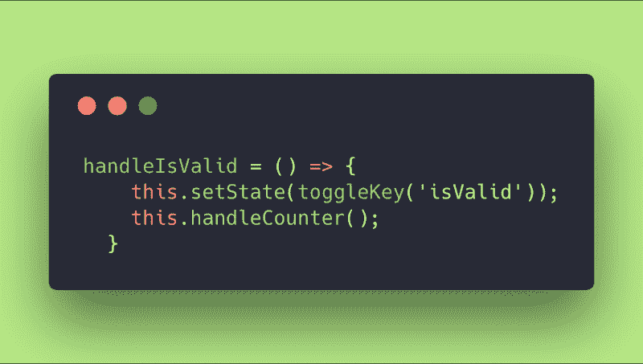

changing toggleIsValid by an higher order function

哇！现在我们不再调用`toggleIsValid`函数。我们正在调用一个名为`toggleKey`的抽象高阶函数，并向它传递一个键(在本例中是字符串)。

我们现在需要如何改变`toggleIsValid`函数？

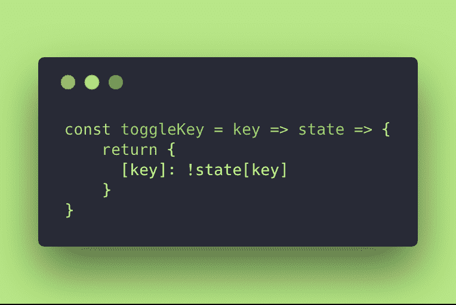

toggleKey higher order function

什么？！现在我们有一个名为`toggleKey`的函数，它接收一个`key`并返回一个新函数，该函数根据提供的键改变状态。

这个`toggleKey`可以在一个库中，也可以在一个帮助文件中。它可以在许多不同的上下文中被调用，以将任何你想要的状态改变为相反的状态。

太好了！

让我们对增量计数器处理程序做同样的事情:

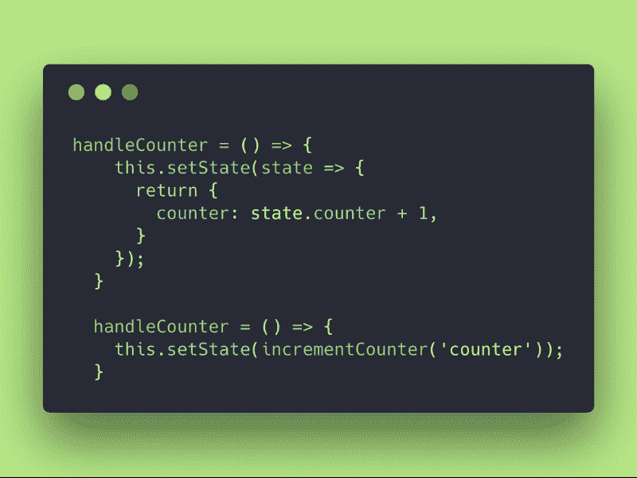

handleCounter abstraction to invoke an higher-order-function

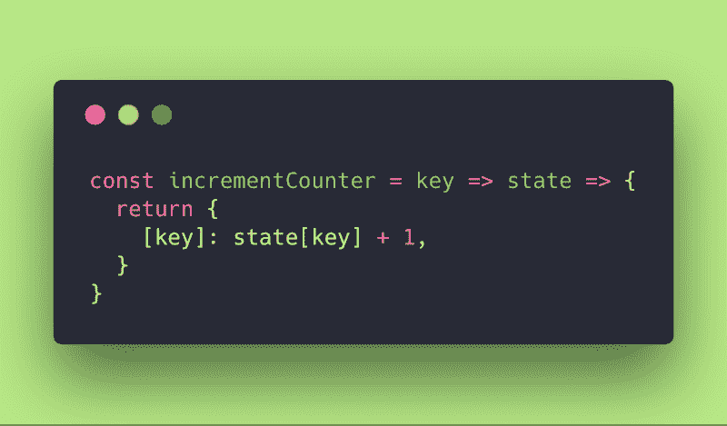

incrementCounter higher-order-function

耶！有用！太好了。现在让我们疯狂吧…

### 射月归来

如果我们创建一个通用的`makeUpdater`函数，它接收您想要应用的转换函数，获取键，并返回管理带有转换函数和键的状态的状态函数，会怎么样？有点困惑？我们走吧！

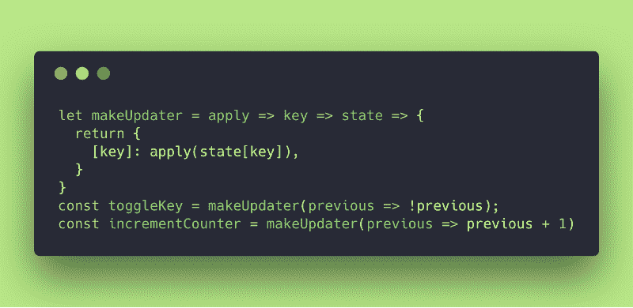

makeUpdater higher-order-function

好了，够了…我们到此为止。？

你可以检查我们在这个 [GitHub repo](https://github.com/evedes/variations-in-set-state) 中完成的所有代码。

### 最后但并不是最不重要的

不要忘记避免最大使用状态和尊重反应渲染道具级联。

别忘了`setState`是异步的。

不要忘记`setState`可以带一个对象或一个函数

不要忘记，当你的下一个状态依赖于你的前一个状态时，你应该传入一个函数。

### **参考书目**

1.  React 文档
2.  Ryan Florence 的 Reach Tech Courses，我真心推荐。

非常感谢！